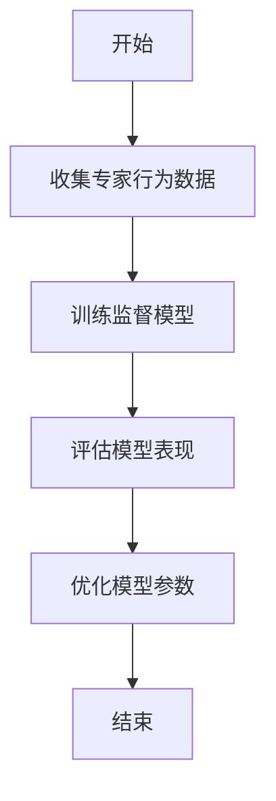
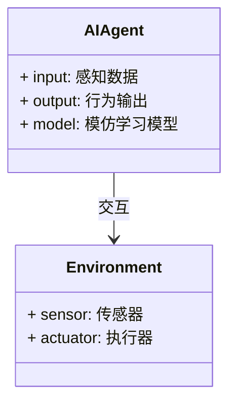
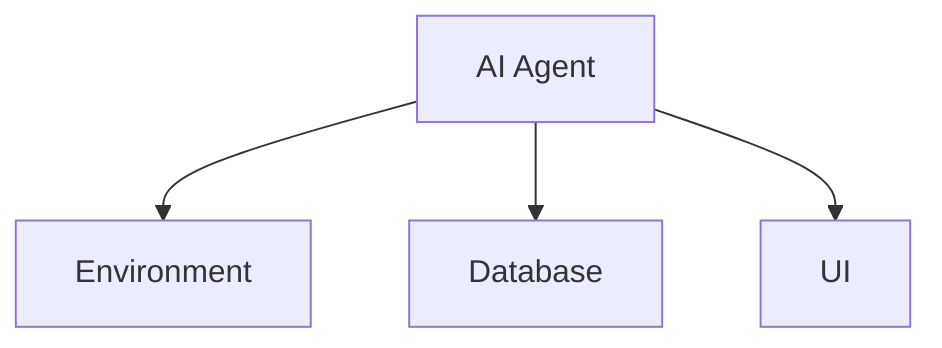
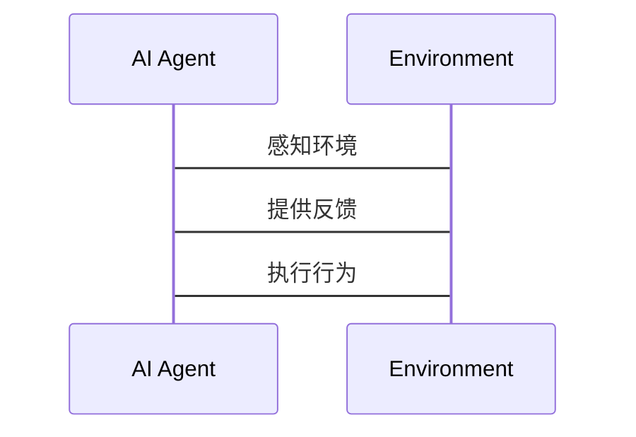

                 


# AI Agent的社交学习与模仿能力

## 关键词：AI Agent、社交学习、模仿能力、社交行为模型、Dagger算法、系统架构设计、项目实战

## 摘要

本文深入探讨了AI Agent在社交学习与模仿能力方面的理论、算法和系统设计。通过分析社交学习和模仿学习的核心概念，结合Dagger算法的原理与实现，详细介绍了AI Agent如何在复杂社交环境中进行学习与模仿。此外，本文还提供了系统架构设计和项目实战，展示了如何将理论应用于实际场景，帮助读者全面理解AI Agent在社交互动中的潜力与挑战。

---

## 第1章: AI Agent的社交学习与模仿能力背景

### 1.1 什么是AI Agent

AI Agent（人工智能代理）是指能够感知环境、自主决策并执行任务的智能实体。它可以是一个软件程序、机器人或虚拟助手，通过传感器和执行器与环境交互。AI Agent的核心目标是通过学习和推理来优化其行为，以实现特定目标。

#### 1.1.1 AI Agent的定义
- AI Agent是具有感知、决策和执行能力的智能系统。
- 它能够通过数据输入（如图像、文本、语音）感知环境，并根据目标生成输出（如动作、决策）。
- AI Agent可以分为简单反射型、基于模型的反应型、目标驱动型和效用驱动型。

#### 1.1.2 社交学习与模仿能力的核心概念
- 社交学习：AI Agent通过观察和互动学习社交规则和行为模式的过程。
- 模仿能力：AI Agent通过模仿人类或其他智能体的行为来提升自身技能的能力。
- 这些能力使AI Agent能够在社交环境中更好地与人类或其他智能体协作。

#### 1.1.3 AI Agent在社交场景中的重要性
- 在社交场景中，AI Agent需要理解人类情感、意图和文化背景，才能有效互动。
- 例如，在客服机器人、虚拟助手和社交机器人等领域，AI Agent的社交能力至关重要。

### 1.2 社交学习与模仿能力的背景

#### 1.2.1 社交学习的定义与特征
- 社交学习是指AI Agent通过观察他人行为、互动和反馈来学习社交规则的过程。
- 其特征包括观察性、互动性、情境性和适应性。

#### 1.2.2 模仿学习的定义与特征
- 模仿学习是指AI Agent通过观察并模仿他人行为来掌握新技能的过程。
- 其特征包括目标导向性、反馈依赖性和情境适应性。

#### 1.2.3 AI Agent在社交学习中的应用领域
- 在教育领域，AI Agent可以辅助学生学习社交礼仪。
- 在医疗领域，AI Agent可以模仿医生的诊断过程。
- 在服务领域，AI Agent可以模仿客服人员的沟通技巧。

### 1.3 问题背景与目标

#### 1.3.1 社交学习与模仿能力的挑战
- 社交环境复杂，涉及情感、意图和文化差异。
- 模仿学习需要处理大量非结构化数据，算法复杂性高。

#### 1.3.2 问题解决的必要性
- 提高AI Agent在社交环境中的适应性和互动能力。
- 通过模仿学习，使AI Agent能够快速掌握新技能。

#### 1.3.3 边界与外延
- AI Agent的社交学习与模仿能力主要用于提升其社交互动能力。
- 其外延包括情感计算、社交网络分析和人机交互等领域。

---

## 第2章: AI Agent的社交学习与模仿能力的核心概念

### 2.1 社交学习与模仿能力的理论基础

#### 2.1.1 社会学习理论
- 社会学习理论认为，人类通过观察和模仿他人行为来学习。
- 在AI Agent中，社会学习理论为模仿学习提供了理论基础。

#### 2.1.2 模仿学习的原理
- 模仿学习的核心是通过观察和模仿他人行为来改进自身行为。
- 在AI Agent中，模仿学习通常基于监督学习或强化学习。

#### 2.1.3 AI Agent的社交行为模型
- 社交行为模型描述了AI Agent在社交互动中的行为模式。
- 模型通常包括情感计算、意图识别和行为生成模块。

### 2.2 核心概念与联系

#### 2.2.1 核心概念的属性特征对比
| 概念         | 属性特征                       |
|--------------|--------------------------------|
| 社交学习     | 观察性、互动性、情境性         |
| 模仿学习     | 目标导向性、反馈依赖性         |

#### 2.2.2 ER实体关系图架构
```mermaid
er
actor(AI Agent) -[观察]-> environment
actor -[模仿]-> target
environment --> target
```

---

## 第3章: AI Agent的社交学习与模仿能力的算法原理

### 3.1 模仿学习算法概述

#### 3.1.1 模仿学习的基本原理
- 模仿学习通过观察专家行为，学习其策略或行为模式。
- 在AI Agent中，模仿学习通常用于技能学习和行为优化。

#### 3.1.2 基于监督学习的模仿学习
- 监督学习通过标记数据训练模型，使AI Agent模仿专家行为。
- 例如，使用标记的输入-输出对训练分类器。

#### 3.1.3 基于强化学习的模仿学习
- 强化学习通过奖励机制训练模型，使AI Agent模仿专家行为。
- 例如，使用策略梯度方法优化行为策略。

### 3.2 Dagger算法

#### 3.2.1 算法原理
- Dagger算法通过在特定任务中收集专家行为数据，训练AI Agent的策略。
- 算法分为两个阶段：监督学习阶段和强化学习阶段。

#### 3.2.2 算法流程


#### 3.2.3 算法的数学模型
- 损失函数：$$ L = \sum_{i=1}^{n} (y_i - \hat{y}_i)^2 $$
- 优化目标：$$ \min_{\theta} L $$

### 3.3 算法实现

#### 3.3.1 Python源代码实现
```python
import torch
import torch.nn as nn

# 定义模型
class PolicyNetwork(nn.Module):
    def __init__(self, input_dim, output_dim):
        super(PolicyNetwork, self).__init__()
        self.fc1 = nn.Linear(input_dim, 64)
        self.fc2 = nn.Linear(64, output_dim)
    
    def forward(self, x):
        x = torch.relu(self.fc1(x))
        x = torch.sigmoid(self.fc2(x))
        return x

# 初始化模型和优化器
model = PolicyNetwork(input_dim, output_dim)
optimizer = torch.optim.Adam(model.parameters(), lr=0.001)

# 训练循环
for epoch in range(num_epochs):
    for batch in batches:
        inputs, labels = batch
        outputs = model(inputs)
        loss = torch.mean((outputs - labels)**2)
        optimizer.zero_grad()
        loss.backward()
        optimizer.step()
```

#### 3.3.2 代码应用解读与分析
- 该代码实现了Dagger算法的监督学习阶段，通过训练模型模仿专家行为。
- 使用Adam优化器和均方误差损失函数，确保模型能够逼近专家策略。

---

## 第4章: AI Agent的社交学习与模仿能力的系统分析与架构设计

### 4.1 问题场景介绍

#### 4.1.1 社交学习与模仿能力的应用场景
- 在教育领域，AI Agent可以辅助学生学习社交礼仪。
- 在医疗领域，AI Agent可以模仿医生的诊断过程。
- 在服务领域，AI Agent可以模仿客服人员的沟通技巧。

#### 4.1.2 系统功能需求
- 感知环境：通过传感器感知环境信息。
- 模仿学习：通过观察专家行为，学习社交规则。
- 行为生成：根据学习结果生成相应行为。

#### 4.1.3 系统性能需求
- 实时性：快速响应用户输入。
- 精确性：准确识别用户情感和意图。
- 可扩展性：支持多种社交场景。

### 4.2 系统架构设计

#### 4.2.1 领域模型设计


#### 4.2.2 系统架构设计


#### 4.2.3 系统接口设计
- 输入接口：接收环境数据和用户输入。
- 输出接口：生成行为输出和反馈。

#### 4.2.4 系统交互设计


---

## 第5章: AI Agent的社交学习与模仿能力的项目实战

### 5.1 项目环境安装

#### 5.1.1 环境配置
- 安装Python 3.8及以上版本。
- 安装必要的库：numpy、torch、matplotlib。

#### 5.1.2 依赖库安装
```bash
pip install numpy torch matplotlib
```

### 5.2 系统核心实现源代码

#### 5.2.1 模仿学习模块实现
```python
import torch
import torch.nn as nn

class PolicyNetwork(nn.Module):
    def __init__(self, input_dim, output_dim):
        super(PolicyNetwork, self).__init__()
        self.fc1 = nn.Linear(input_dim, 64)
        self.fc2 = nn.Linear(64, output_dim)
    
    def forward(self, x):
        x = torch.relu(self.fc1(x))
        x = torch.sigmoid(self.fc2(x))
        return x

model = PolicyNetwork(input_dim, output_dim)
optimizer = torch.optim.Adam(model.parameters(), lr=0.001)
```

#### 5.2.2 训练模块实现
```python
for epoch in range(num_epochs):
    for batch in batches:
        inputs, labels = batch
        outputs = model(inputs)
        loss = torch.mean((outputs - labels)**2)
        optimizer.zero_grad()
        loss.backward()
        optimizer.step()
```

### 5.3 代码应用解读与分析

#### 5.3.1 模仿学习模块解读
- 该模块通过神经网络模型模仿专家行为。
- 使用交叉熵损失函数和Adam优化器进行训练。

#### 5.3.2 训练模块解读
- 训练模块通过迭代优化模型参数，使模型能够逼近专家策略。
- 每个epoch包括多个batch的训练，逐步降低损失。

### 5.4 案例分析与详细讲解

#### 5.4.1 案例分析
- 在客服机器人场景中，AI Agent通过模仿优秀客服人员的对话模式，提升自身的沟通能力。

#### 5.4.2 详细讲解
- AI Agent首先收集专家行为数据，包括对话内容和情感反馈。
- 然后，通过Dagger算法训练模型，生成类似专家的行为。
- 最后，AI Agent在实际场景中应用所学知识，与用户进行互动。

### 5.5 项目总结

#### 5.5.1 项目小结
- 通过Dagger算法，AI Agent能够有效模仿专家行为。
- 系统架构设计确保了项目的可扩展性和可维护性。

#### 5.5.2 注意事项
- 数据质量对模型性能影响较大，需确保数据多样性和代表性。
- 在实际应用中，需考虑伦理和隐私问题。

#### 5.5.3 拓展阅读
- 《深度强化学习入门》
- 《人机交互中的情感计算》

---

## 总结

本文系统地探讨了AI Agent在社交学习与模仿能力方面的理论、算法和系统设计。通过Dagger算法的实现，展示了如何将模仿学习应用于实际场景。同时，系统架构设计和项目实战部分提供了实用的指导，帮助读者将理论应用于实践。希望本文能为AI Agent的研究和应用提供有价值的参考。

