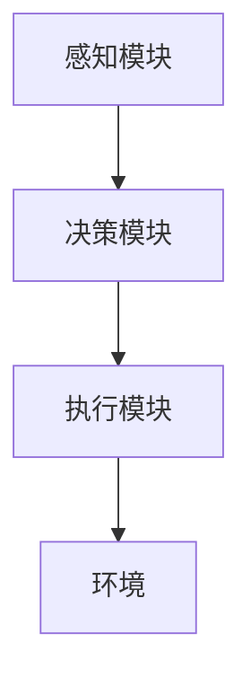

                 

# AI Agent的系统架构设计与实现

## 关键词：AI Agent，系统架构，算法原理，项目实战，系统设计

## 摘要：  
本文系统地介绍了AI Agent的系统架构设计与实现，从基本概念到算法原理，再到实际应用，全面剖析了AI Agent的核心技术和实现方法。通过理论与实践相结合的方式，详细讲解了AI Agent的设计原则、算法实现、系统架构、项目案例及未来趋势，为读者提供了一套完整的AI Agent开发指南。

---

# 目录

## 第一部分：AI Agent概述

### 第1章：AI Agent的基本概念

#### 1.1 AI Agent的定义与特征
- 1.1.1 AI Agent的定义  
- 1.1.2 AI Agent的特征：智能性、自主性、反应性、目标导向  
- 1.1.3 AI Agent的类型：简单反射型、基于模型的反射型、目标驱动型、效用驱动型  

#### 1.2 AI Agent的应用场景
- 智能助手（如Siri、Alexa）  
- 自动驾驶系统  
- 智能客服  
- 游戏AI  

---

### 第2章：AI Agent的核心概念

#### 2.1 AI Agent的核心原理
- 智能体的感知与行动  
- 状态空间与动作空间  
- 目标函数与奖励机制  

#### 2.2 AI Agent的核心概念对比
- 比较表格：智能体与传统程序的区别  
- 智能体的智能性与自主性  

#### 2.3 AI Agent的数学模型
- 状态空间：$S$  
- 动作空间：$A$  
- 环境模型：$P(s', r | s, a)$  

---

## 第二部分：AI Agent的算法原理

### 第3章：AI Agent的感知与决策算法

#### 3.1 感知算法
- 基于模型的感知算法：如马尔可夫决策过程（MDP）  
- 基于无模型的感知算法：如Q-learning  

#### 3.2 决策算法
- 策略搜索：深度优先搜索、广度优先搜索  
- 强化学习：Q-learning、DQN（Deep Q-Network）  

#### 3.3 算法实现的数学模型
- Q-learning算法：  
$$ Q(s, a) = Q(s, a) + \alpha (r + \gamma \max Q(s', a') - Q(s, a)) $$  
- DQN网络结构：输入层（状态）→ 隐藏层 → 输出层（动作值）  

---

### 第4章：AI Agent的规划与推理算法

#### 4.1 规划算法
- 最短路径规划：A*算法  
- 遗传算法：用于复杂环境下的路径优化  

#### 4.2 推理算法
- 逻辑推理：基于一阶逻辑的推理系统  
- 概率推理：贝叶斯网络  

#### 4.3 算法实现的数学模型
- 贝叶斯网络：  
$$ P(A|B) = \frac{P(B|A)P(A)}{P(B)} $$  

---

## 第三部分：AI Agent的系统架构设计

### 第5章：AI Agent的系统架构

#### 5.1 系统架构设计原则
- 模块化设计：感知模块、决策模块、执行模块  
- 分层设计：感知层、决策层、执行层  

#### 5.2 系统架构的Mermaid图

---

### 第6章：AI Agent的系统架构实现

#### 6.1 系统功能设计
- 系统输入：环境数据、用户指令  
- 系统输出：决策结果、执行动作  

#### 6.2 系统架构的实现步骤
1. 感知模块：接收环境数据并进行预处理  
2. 决策模块：基于感知数据生成决策  
3. 执行模块：根据决策执行动作  

---

## 第四部分：AI Agent的项目实战

### 第7章：AI Agent的项目案例

#### 7.1 项目背景
- 智能客服AI Agent的设计与实现  

#### 7.2 项目需求分析
- 用户咨询处理  
- 系统响应时间  
- 系统可扩展性  

#### 7.3 系统设计与实现
- 需求分析：用户咨询分类、知识库构建  
- 系统设计：知识库模块、对话模块、推理模块  

#### 7.4 项目代码实现
- 知识库构建：使用Python的jieba库进行分词  
- 对话模块：基于规则的对话生成  

---

### 第8章：项目经验总结与优化

#### 8.1 项目实现经验总结
- 模块化设计的优势  
- 系统性能优化的关键点  

#### 8.2 系统优缺点分析
- 优点：高效性、准确性  
- 缺点：知识库构建成本高  

#### 8.3 系统优化建议
- 知识库动态更新  
- 对话模块的优化  

---

## 第五部分：AI Agent的前沿技术与未来趋势

### 第9章：AI Agent的前沿技术

#### 9.1 多智能体系统
- 多智能体协作：COP（Cooperative Q-learning）算法  
- 多智能体通信：基于强化学习的通信协议  

#### 9.2 边缘计算与AI Agent
- 边缘计算的优势：低延迟、高实时性  
- 边缘计算与AI Agent的结合：边缘端智能体  

#### 9.3 AI Agent的应用前景
- 智慧城市、智能交通、智能医疗  

---

### 第10章：附录

#### 10.1 术语表
- AI Agent：智能体  
- 状态空间：所有可能的状态集合  

#### 10.2 参考文献
- Russell, S., & Norvig, P. (2010). Artificial Intelligence: A Modern Approach.  
- Sutton, R. S., & Barto, A. G. (2018). Reinforcement Learning: Theory and Algorithms.  

---

## 总结
本文全面系统地介绍了AI Agent的系统架构设计与实现，从基本概念到算法原理，再到实际应用，为读者提供了一套完整的开发指南。通过理论与实践相结合的方式，帮助读者掌握AI Agent的核心技术和实现方法。

