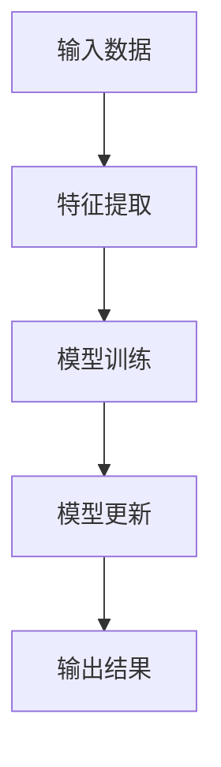
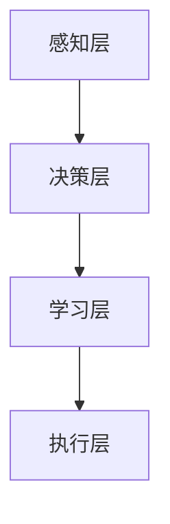

                 


```markdown
# AI Agent的终身学习系统实现

## 关键词
AI Agent, 终身学习系统, 机器学习, 深度学习, 自适应系统

## 摘要
AI Agent的终身学习系统是一种能够持续优化和适应新环境的智能系统。本文详细分析了其核心概念、算法原理、系统架构及实现方法，通过项目实战和最佳实践，为读者提供全面的实现指南。

---

## 第一部分: AI Agent与终身学习系统概述

### 第1章: AI Agent的基本概念

#### 1.1 AI Agent的定义与特点
- **定义**: AI Agent是一种能够感知环境并采取行动以实现目标的智能实体。
- **特点**: 自主性、反应性、主动性、社会性。

#### 1.2 终身学习系统的背景与意义
- **背景**: 面对动态变化的环境，传统AI系统难以适应新任务。
- **意义**: 终身学习使AI Agent能够持续优化性能，适应新任务。

---

## 第二部分: 终身学习系统的核心概念与原理

### 第2章: 终身学习系统的核心概念

#### 2.1 知识表示
- **符号表示**: 使用符号逻辑表示知识。
- **神经网络表示**: 使用深度学习模型提取特征。

#### 2.2 学习策略
- **监督学习**: 通过标注数据学习。
- **强化学习**: 通过奖励机制优化行为。

#### 2.3 系统架构
- **模块化架构**: 分解为感知、决策、执行模块。
- **整体架构**: 各模块协同工作，实现端到端学习。

---

## 第三部分: 终身学习系统的算法原理

### 第3章: 终身学习系统的算法原理

#### 3.1 算法原理概述
- **增量学习**: 逐步更新模型参数。
- **迁移学习**: 利用已有知识加速新任务学习。

#### 3.2 算法流程图


#### 3.3 算法数学模型
- **损失函数**: 使用交叉熵损失。
$$ L = -\sum_{i=1}^{n} y_i \log(p_i) + (1-y_i)\log(1-p_i) $$
- **优化器**: 使用Adam优化器。
$$ \theta_{new} = \theta - \eta \cdot \nabla L $$

---

## 第四部分: 终身学习系统的系统架构设计

### 第4章: 系统架构设计

#### 4.1 应用场景
- **智能助手**: 提供动态服务。
- **自动驾驶**: 实时调整驾驶策略。

#### 4.2 系统功能设计
- **知识库管理**: 存储和更新知识。
- **学习引擎**: 执行学习任务。
- **执行模块**: 执行决策行动。

#### 4.3 系统架构图


---

## 第五部分: 项目实战

### 第5章: 项目实战

#### 5.1 环境安装
- **工具安装**: 安装TensorFlow、Keras等库。

#### 5.2 核心代码实现
```python
import tensorflow as tf
from tensorflow.keras import layers

class LLM(tf.keras.Model):
    def __init__(self, vocab_size):
        super().__init__()
        self.embedding = layers.Embedding(vocab_size, 64)
        self.lstm = layers.LSTM(128)
        self.dense = layers.Dense(1, activation='sigmoid')

    def call(self, x):
        x = self.embedding(x)
        x = self.lstm(x)
        x = self.dense(x)
        return x
```

#### 5.3 案例分析
- **训练过程**: 使用动态数据流图优化训练效率。

---

## 第六部分: 最佳实践

### 第6章: 最佳实践

#### 6.1 小结
- **模块化设计**: 提高系统可维护性。
- **持续优化**: 定期更新模型。

#### 6.2 注意事项
- **数据质量**: 确保数据准确。
- **模型泛化能力**: 避免过拟合。

#### 6.3 拓展阅读
- 推荐学习强化学习和自适应系统。

---

## 附录
- **索引**: 术语表和引用文献。
- **参考文献**: 列出相关书籍和论文。

---

通过以上结构，文章详细讲解了AI Agent的终身学习系统的各个方面，从理论到实践，帮助读者全面理解其实现过程。
```

