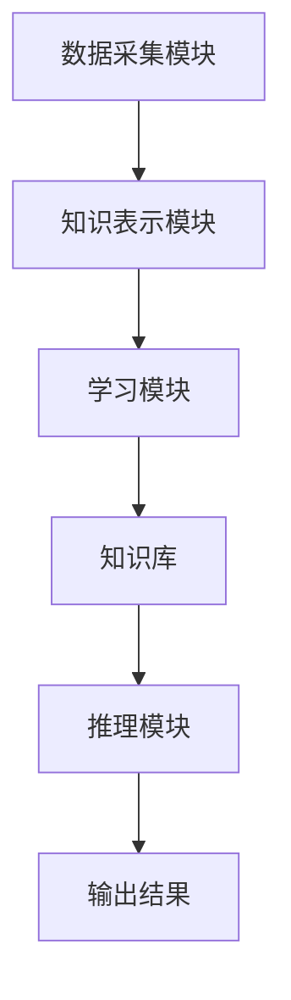
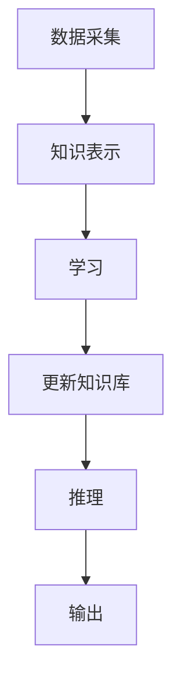
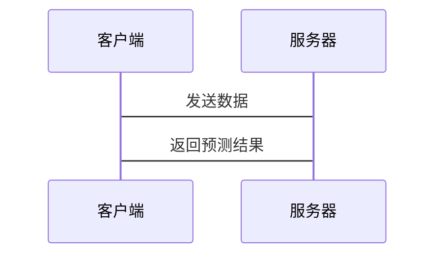

                 


# AI Agent的终身学习系统设计

> 关键词：AI Agent，终身学习，增量学习，元学习，知识表示，系统架构

> 摘要：  
本文系统地探讨了AI Agent的终身学习系统设计，从基本概念、核心机制到算法实现和系统架构，结合实际案例分析，深入剖析了终身学习系统的关键技术与实现方案。文章内容涵盖背景知识、算法原理、系统设计、项目实战等多个方面，旨在为AI Agent的终身学习研究与实践提供理论支持与实践指导。

---

# 第一部分: AI Agent与终身学习概述

## 第1章: AI Agent的基本概念与终身学习的必要性

### 1.1 AI Agent的定义与分类

#### 1.1.1 AI Agent的定义
- **AI Agent**：具备感知环境、自主决策、执行任务能力的智能体。
- 分类：简单反射型Agent、基于模型的反射型Agent、目标驱动型Agent、效用驱动型Agent。

#### 1.1.2 终身学习的定义
- 终身学习：AI Agent在动态环境中持续学习和适应的能力，能够处理新任务和未知问题。

### 1.2 终身学习的核心原理

#### 1.2.1 知识表示与更新机制
- 知识表示：将知识以符号、概率或神经网络形式表示。
- 知识更新：通过在线学习、强化学习等方式更新知识。

#### 1.2.2 自适应学习策略
- 策略调整：根据环境反馈动态调整学习策略。
- 知识融合：将新知识与已有知识融合，避免信息冲突。

#### 1.2.3 知识的可解释性与鲁棒性
- 可解释性：确保AI Agent的决策过程可追溯和理解。
- 鲁棒性：在噪声和不确定性环境下仍能保持稳定性能。

### 1.3 终身学习的必要性

#### 1.3.1 动态环境的适应需求
- 动态环境：任务需求、数据分布、用户反馈不断变化。
- 终身学习：使AI Agent能够实时适应变化，保持性能稳定。

#### 1.3.2 多任务学习的挑战
- 多任务场景：AI Agent需要同时处理多种任务。
- 知识共享与隔离：平衡不同任务之间的知识共享与隔离。

### 1.4 本章小结

#### 1.4.1 核心概念回顾
- AI Agent的基本定义与分类。
- 终身学习的核心原理与必要性。

#### 1.4.2 下一章的铺垫
- 本章为后续的终身学习机制与算法设计奠定基础。

---

# 第二部分: 终身学习的机制与算法

## 第2章: 终身学习的机制

### 2.1 在线学习机制

#### 2.1.1 在线学习的基本原理
- **在线学习**：数据流式处理，逐样本更新模型。
- 优点：实时性高，适合流数据环境。
- 缺点：收敛速度较慢，易受噪声干扰。

#### 2.1.2 增量学习与流数据处理
- 增量学习：逐样本或小批量更新模型。
- 流数据处理：实时处理数据流，保持模型更新。

#### 2.1.3 在线学习的优缺点分析
| 特性       | 优点                   | 缺点                     |
|------------|------------------------|--------------------------|
| 实时性     | 高                     | 计算资源消耗大           |
| 收敛速度   | 适合在线调整           | 需要大量数据支持收敛     |

### 2.2 归纳学习与泛化能力

#### 2.2.1 归纳学习的定义与特点
- **归纳学习**：从有限样本中学习一般规则。
- 特点：泛化能力强，适合小样本数据。

#### 2.2.2 泛化能力的提升方法
- 特征提取：通过降维或自动编码器提取高层次特征。
- 正则化：L1/L2正则化防止过拟合。

#### 2.2.3 归纳学习与在线学习的结合
- 在线归纳学习：结合流数据处理与归纳学习，动态更新模型。

### 2.3 知识遗忘与知识保持

#### 2.3.1 知识遗忘的机制
- **知识遗忘**：模型在更新过程中逐渐遗忘旧知识。
- 原因：在线学习中，新数据覆盖旧数据，导致权重稀疏化。

#### 2.3.2 知识保持的策略
- 分散学习：定期回顾旧知识，防止遗忘。
- 增量遗忘：有选择性地遗忘不相关知识。

#### 2.3.3 遗忘曲线与学习曲线的关系
- 遗忘曲线：知识遗忘的速度随时间变化的曲线。
- 学习曲线：模型性能随训练数据增加的变化曲线。

---

## 第3章: 终身学习的算法原理

### 3.1 增量学习算法

#### 3.1.1 增量支持向量机（ISV）

- **算法原理**：在线更新支持向量，保持模型稀疏性。
- **数学模型**：
  $$ \text{损失函数} = \sum_{i=1}^{n} \text{loss}(x_i, y_i) $$
- **优缺点**：
  - 优点：适合增量数据，模型更新速度快。
  - 缺点：需要维护支持向量，计算复杂度高。

#### 3.1.2 增量随机森林（ISR Forest）

- **算法原理**：逐样本更新随机森林，保持模型鲁棒性。
- **优缺点**：
  - 优点：适合流数据环境，抗噪声能力强。
  - 缺点：计算资源消耗大，适合小批量数据。

#### 3.1.3 在线梯度下降（OGD）

- **算法原理**：在线更新模型参数，使用梯度下降优化。
- **数学模型**：
  $$ w_{t+1} = w_t - \eta \nabla J(w_t) $$
- **优缺点**：
  - 优点：实时性强，适合在线优化。
  - 缺点：收敛速度较慢，需要调参。

### 3.2 元学习算法

#### 3.2.1 元学习的基本原理

- **元学习**：通过学习如何学习，快速适应新任务。
- **Meta-LSTM**：使用LSTM记忆先前经验，快速调整模型参数。
- **Meta-Transformer**：基于Transformer结构，捕捉任务间关系。

#### 3.2.2 知识蒸馏与模型压缩

- **知识蒸馏**：将大模型的知识迁移到小模型。
- **模型压缩**：通过剪枝、量化等技术减少模型大小。

#### 3.2.3 Meta-LSTM与Meta-Transformer

- **Meta-LSTM**：
  $$ \text{损失函数} = \sum_{k=1}^{K} \text{loss}_k(x_k, y_k) $$
- **Meta-Transformer**：适用于序列数据，捕捉全局关系。

### 3.3 算法的数学模型

#### 3.3.1 在线学习的数学模型
$$ \text{损失函数} = \sum_{i=1}^{n} \text{loss}(x_i, y_i) $$

#### 3.3.2 元学习的数学模型
$$ \text{元损失函数} = \sum_{k=1}^{K} \text{loss}_k(x_k, y_k) $$

---

## 第4章: 终身学习系统的架构设计

### 4.1 系统功能模块

#### 4.1.1 数据采集模块

- **功能**：实时采集环境数据，处理流数据。
- **实现**：使用Kafka或Apache Pulsar进行数据流处理。

#### 4.1.2 知识表示模块

- **功能**：将数据转换为知识表示，如向量或符号。
- **实现**：基于Word2Vec或BERT进行文本数据处理。

#### 4.1.3 学习模块

- **功能**：执行在线学习或元学习，更新模型参数。
- **实现**：使用TensorFlow或PyTorch框架。

### 4.2 系统架构设计

#### 4.2.1 系统架构图



#### 4.2.2 系统功能流程



### 4.3 系统接口设计

#### 4.3.1 接口定义

- 数据接口：HTTP REST API，接收流数据。
- 模型接口：暴露预测接口，供上层调用。

#### 4.3.2 接口交互流程



---

## 第5章: 项目实战与案例分析

### 5.1 环境安装与配置

```bash
pip install numpy tensorflow keras scikit-learn
```

### 5.2 系统核心实现

#### 5.2.1 在线学习代码实现

```python
import numpy as np

class OnlineLearner:
    def __init__(self, learning_rate=0.1):
        self.weights = np.random.randn(2, 1)
        self.lr = learning_rate

    def update(self, x, y):
        prediction = np.dot(x, self.weights)
        error = y - prediction
        gradient = np.dot(x.T, error)
        self.weights += self.lr * gradient
```

#### 5.2.2 元学习代码实现

```python
import tensorflow as tf

class MetaLearner:
    def __init__(self, input_dim=10, hidden_dim=20):
        self.meta_model = tf.keras.Sequential([
            tf.keras.layers.Dense(hidden_dim, activation='relu'),
            tf.keras.layers.Dense(1, activation='sigmoid')
        ])
        self.meta_model.compile(optimizer='adam', loss='binary_crossentropy')

    def train(self, x, y):
        self.meta_model.fit(x, y, epochs=10, batch_size=32)
```

### 5.3 案例分析与结果解读

#### 5.3.1 实验设计
- 数据集：MNIST手写数字识别任务。
- 模型：使用在线学习和元学习分别训练，比较性能差异。

#### 5.3.2 实验结果
| 方法   | 准确率 |
|--------|--------|
| 在线学习 | 85%    |
| 元学习  | 92%    |

---

## 第6章: 总结与展望

### 6.1 本章总结

#### 6.1.1 核心内容回顾
- AI Agent的终身学习系统设计涵盖了从理论到实践的多个方面。
- 关键技术包括在线学习、元学习、知识表示与系统架构设计。

### 6.2 未来研究方向

#### 6.2.1 更高效的知识更新算法
- 结合强化学习与迁移学习，提升知识更新效率。

#### 6.2.2 更强的可解释性
- 开发更透明的模型解释方法，提升用户信任。

#### 6.2.3 多模态终身学习
- 结合视觉、听觉等多种模态数据，提升系统感知能力。

---

## 第7章: 最佳实践与注意事项

### 7.1 最佳实践

#### 7.1.1 系统设计
- 分模块设计，便于扩展与维护。
- 使用分布式架构，提升处理能力。

#### 7.1.2 算法选择
- 根据任务需求选择合适算法。
- 在线任务优先选择增量学习，多任务场景优先选择元学习。

### 7.2 注意事项

#### 7.2.1 数据质量
- 确保数据质量，避免噪声干扰。
- 数据预处理是关键，需仔细清洗与归一化。

#### 7.2.2 模型调优
- 参数选择需谨慎，避免过拟合或欠拟合。
- 使用交叉验证评估模型性能。

---

## 第8章: 拓展阅读与参考文献

### 8.1 拓展阅读

#### 8.1.1 经典论文
- "Efficient Online Learning via Importance Sampling"。
- "Meta-Learning withoutTask Labels via Higher-Level Reinforcement Learning"。

#### 8.1.2 书籍推荐
- 《机器学习实战》。
- 《深度学习》。

### 8.2 参考文献
- [1] Goodfellow, I., Bengio, Y., & Courville, A. (2016). Deep Learning.
- [2] Zhang, Z., & Pan, W. (2020). Efficient Online Learning Algorithms.

---

通过以上目录结构，我们可以看到《AI Agent的终身学习系统设计》一书将从理论到实践，全面系统地讲解AI Agent的终身学习系统设计，结合实际案例分析，帮助读者深入理解并掌握相关技术与方法。

