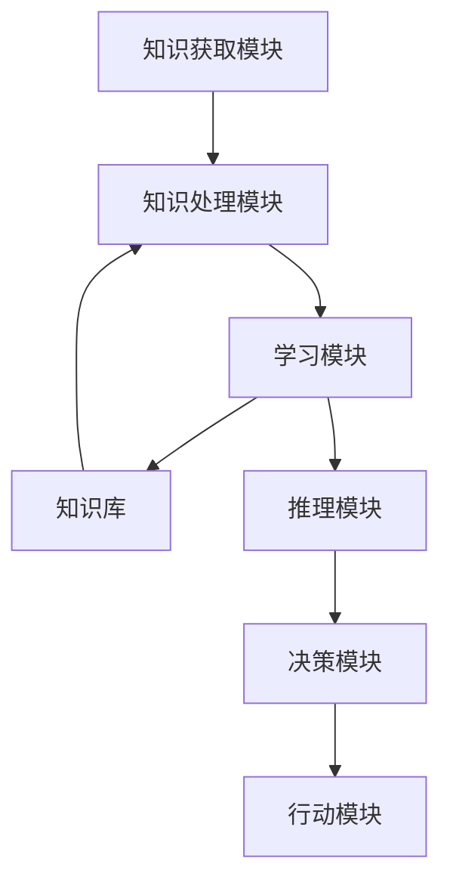
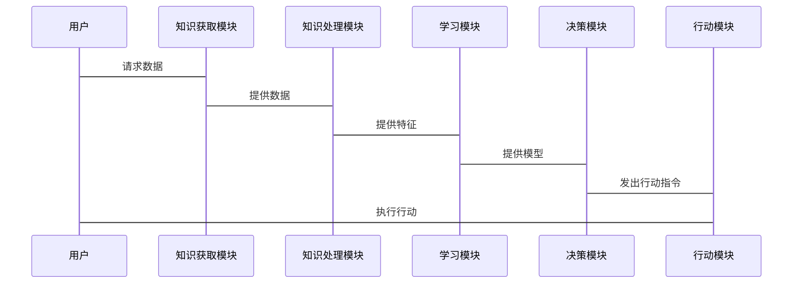

                 


# AI Agent的终身学习：持续适应新知识

## 关键词：AI Agent, 终身学习, 机器学习, 强化学习, 系统架构, 项目实战

## 摘要：本文深入探讨了AI Agent的终身学习机制，分析其在持续适应新知识中的重要作用。通过结合监督学习和强化学习，详细讲解了AI Agent的学习算法，并通过系统架构和项目实战展示了其在实际应用中的实现与优化。

---

## 第一部分: 引言

### 第1章: AI Agent与终身学习概述

#### 1.1 AI Agent的基本概念

##### 1.1.1 什么是AI Agent

AI Agent（人工智能代理）是一种能够感知环境、自主决策并采取行动的智能实体。它可以是一个软件程序、机器人或其他智能系统，旨在帮助用户完成特定任务或提供服务。AI Agent的核心在于其自主性和智能性，能够根据环境信息做出适应性反应。

##### 1.1.2 AI Agent的类型

AI Agent可以根据功能和智能水平分为多种类型：

1. **简单反射型AI Agent**：基于固定的规则集做出反应，适用于简单任务。
2. **基于模型的规划型AI Agent**：维护环境模型，能够进行复杂决策。
3. **目标驱动型AI Agent**：根据预设目标采取行动。
4. **实用驱动型AI Agent**：追求效用最大化，适用于复杂环境。

##### 1.1.3 终身学习的定义与特点

终身学习是指AI Agent在运行过程中持续获取新知识、更新知识库并适应新任务的能力。其特点包括：

1. **持续性**：学习过程不局限于初始训练，而是贯穿整个生命周期。
2. **适应性**：能够根据新数据调整模型，适应环境变化。
3. **自主性**：无需外部干预，自主触发学习过程。

#### 1.2 终身学习的重要性

##### 1.2.1 知识更新的必要性

技术进步和数据变化要求AI Agent不断更新知识，以保持其性能和准确性。例如，在自然语言处理领域，模型需要不断吸收新的语言数据和用例，以提高理解和生成能力。

##### 1.2.2 技术进步对AI Agent的挑战

随着应用场景的扩展和复杂性增加，AI Agent需要应对更多样化和动态变化的任务。传统的静态模型难以满足需求，终身学习成为必要。

##### 1.2.3 终身学习在AI Agent中的应用

终身学习使AI Agent能够应对动态环境，提高适应性和灵活性。例如，在智能客服系统中，模型需要不断更新对话策略，以应对用户需求的变化。

#### 1.3 本章小结

本章介绍了AI Agent的基本概念和类型，重点强调了终身学习的重要性。终身学习是AI Agent在复杂环境中持续进化和适应的核心能力。

---

## 第二部分: AI Agent的核心概念与终身学习的关系

### 第2章: AI Agent的核心概念

#### 2.1 AI Agent的定义与属性

##### 2.1.1 AI Agent的定义

AI Agent通过感知环境、推理和行动来实现目标。它具备自主性、反应性、目标导向和学习能力。

##### 2.1.2 AI Agent的核心属性

| 属性 | 描述 |
|------|------|
| 自主性 | 能够自主决策和行动，无需外部干预 |
| 反应性 | 根据环境反馈调整行为 |
| 目标导向 | 以预设目标为导向，采取行动 |
| 学习能力 | 能够通过经验或新数据优化自身性能 |

##### 2.1.3 AI Agent与传统AI的区别

| 方面 | 传统AI | AI Agent |
|------|--------|----------|
| 智能水平 | 基于规则或模式识别 | 具备自主决策和学习能力 |
| 适应性 | 固定功能，难以扩展 | 具备动态适应能力 |
| 应用场景 | 专用任务 | 多场景、复杂任务 |

#### 2.2 终身学习的机制

##### 2.2.1 知识表示与更新

知识表示是AI Agent学习的基础。常用的表示方法包括符号逻辑、概率图模型和神经网络。终身学习通过增量学习或在线学习不断更新知识库。

##### 2.2.2 学习策略与方法

学习策略包括监督学习、无监督学习和强化学习。监督学习适用于有标签数据，无监督学习适用于无标签数据，强化学习适用于基于奖励的学习环境。

##### 2.2.3 知识库的构建与维护

知识库是AI Agent存储和管理知识的系统。终身学习通过不断摄入新数据和更新模型，保持知识库的准确性和完整性。

#### 2.3 AI Agent与终身学习的关系

##### 2.3.1 AI Agent需要终身学习的原因

1. **环境动态变化**：现实环境复杂多变，AI Agent需要不断更新知识以应对新挑战。
2. **任务多样性**：AI Agent需要处理多种任务，终身学习有助于提升跨任务能力。
3. **数据更新**：新数据的出现要求模型不断优化，终身学习是必要手段。

##### 2.3.2 终身学习如何提升AI Agent的能力

1. **提高泛化能力**：通过持续学习，AI Agent能够更好地处理未见数据。
2. **增强适应性**：能够快速适应新环境和新任务。
3. **提升决策能力**：通过不断优化决策模型，提升决策的准确性和效率。

##### 2.3.3 两者的结合与应用

AI Agent与终身学习的结合使得智能系统具备持续进化的能力，适用于自动驾驶、智能助手、医疗诊断等领域。

#### 2.4 本章小结

本章分析了AI Agent的核心概念，并探讨了其与终身学习的关系。终身学习是AI Agent在复杂环境中持续进化和适应的核心机制。

---

## 第三部分: 终身学习的算法与数学模型

### 第3章: 监督学习与强化学习

#### 3.1 监督学习的基本原理

##### 3.1.1 监督学习的定义

监督学习是一种机器学习方法，通过标注数据训练模型，使其能够对新数据做出预测。

##### 3.1.2 监督学习的数学模型

$$y = f(x)$$

其中，$x$是输入特征，$y$是目标输出，$f$是模型函数。

##### 3.1.3 例子：线性回归

线性回归是一种简单的监督学习算法，用于预测连续型目标变量。其数学模型为：

$$y = \theta_0 + \theta_1 x_1 + \theta_2 x_2 + \dots + \theta_n x_n$$

目标是最小化预测值与真实值之间的平方误差。

#### 3.2 强化学习的基本原理

##### 3.2.1 强化学习的定义

强化学习是一种通过试错机制学习策略的方法。智能体通过与环境交互，获得奖励或惩罚，逐步优化决策策略。

##### 3.2.2 强化学习的数学模型

$$Q(s, a) = r + \gamma \max Q(s', a')$$

其中，$Q(s, a)$是状态-动作对的期望奖励，$r$是即时奖励，$\gamma$是折扣因子，$s'$是下一个状态，$a'$是下一个动作。

##### 3.2.3 例子：马尔可夫决策过程

马尔可夫决策过程（MDP）是强化学习的基础模型，描述智能体与环境的交互过程。智能体根据当前状态和策略选择动作，获得奖励并转移到新状态。

#### 3.3 终身学习中的算法选择

##### 3.3.1 算法选择的原则

1. **任务类型**：根据任务类型选择合适的学习算法，如监督学习适用于有标签数据，强化学习适用于需要策略优化的任务。
2. **数据特性**：考虑数据的分布、噪声和稀疏性，选择鲁棒的算法。
3. **计算资源**：考虑计算成本和模型复杂度，选择高效且可扩展的算法。

##### 3.3.2 算法的优缺点对比

| 算法 | 优点 | 缺点 |
|------|------|------|
| 监督学习 | 数据标注简单，易于实现 | 适用于静态环境，难以处理动态变化 |
| 强化学习 | 能够处理动态环境，学习策略 | 需要大量交互，计算成本高 |
| 半监督学习 | 利用未标注数据，减少标注成本 | 性能依赖于标注数据的质量 |

##### 3.3.3 算法选择的策略

1. **混合学习**：结合监督和强化学习，适用于复杂任务。
2. **在线学习**：实时更新模型，适用于动态环境。
3. **迁移学习**：利用已有知识快速适应新任务。

#### 3.4 本章小结

本章介绍了监督学习和强化学习的基本原理，并探讨了其在终身学习中的应用。选择合适的算法对于AI Agent的性能至关重要。

---

## 第四部分: AI Agent的系统架构与设计

### 第4章: AI Agent的系统架构

#### 4.1 系统功能模块

##### 4.1.1 知识获取模块

知识获取模块负责从多种数据源采集新数据，包括文本、图像、语音等。数据预处理是关键步骤，包括清洗、标注和转换。

##### 4.1.2 知识处理模块

知识处理模块负责数据的分析和处理，包括特征提取、数据建模和知识表示。该模块需要将数据转换为模型可理解的形式。

##### 4.1.3 学习模块

学习模块是AI Agent的核心，负责模型的训练和优化。它包括算法选择、模型训练和性能评估。

#### 4.2 系统架构设计

##### 4.2.1 系统架构图



该架构图展示了AI Agent的各个模块及其交互关系。知识获取模块提供数据，知识处理模块进行分析，学习模块负责训练模型，推理模块用于推理，决策模块做出决策，行动模块执行行动。

##### 4.2.2 接口设计

系统需要定义清晰的接口，确保各模块之间的通信和协作。例如，知识处理模块需要与知识获取模块和学习模块进行数据交互。

##### 4.2.3 交互流程



该流程图展示了AI Agent从数据获取到行动执行的完整流程。

#### 4.3 本章小结

本章详细设计了AI Agent的系统架构，包括功能模块、架构图和交互流程。系统设计需要考虑模块化和可扩展性，以支持终身学习的需求。

---

## 第五部分: 项目实战

### 第5章: 项目实战：实现一个简单的AI Agent

#### 5.1 环境安装

1. 安装Python和必要的库，如NumPy、TensorFlow、Keras。
2. 安装Jupyter Notebook用于开发和测试。

#### 5.2 系统核心实现源代码

##### 5.2.1 知识获取模块

```python
class KnowledgeAcquisition:
    def __init__(self):
        self.data = []
    
    def collect_data(self, source):
        # 从数据源收集数据
        pass
    
    def preprocess_data(self):
        # 数据预处理
        pass
```

##### 5.2.2 知识处理模块

```python
class KnowledgeProcessing:
    def __init__(self):
        self.features = []
    
    def extract_features(self, data):
        # 提取特征
        pass
    
    def build_model(self):
        # 构建模型
        pass
```

##### 5.2.3 学习模块

```python
class LearningModule:
    def __init__(self):
        self.model = None
    
    def train_model(self, features, labels):
        # 训练模型
        pass
    
    def update_model(self, new_features, new_labels):
        # 更新模型
        pass
```

##### 5.2.4 推理模块

```python
class InferenceModule:
    def __init__(self):
        self.model = None
    
    def predict(self, input):
        # 预测
        pass
```

##### 5.2.5 决策模块

```python
class DecisionModule:
    def __init__(self):
        self.rules = []
    
    def make_decision(self, input):
        # 做出决策
        pass
```

##### 5.2.6 行动模块

```python
class ActionModule:
    def __init__(self):
        self.actions = []
    
    def execute_action(self, decision):
        # 执行行动
        pass
```

#### 5.3 代码应用解读与分析

以上代码展示了AI Agent的基本模块结构。知识获取模块负责数据收集和预处理，知识处理模块提取特征并构建模型，学习模块负责训练和更新模型，推理模块进行预测，决策模块做出决策，行动模块执行行动。

#### 5.4 实际案例分析

以智能客服为例，AI Agent需要通过自然语言处理技术理解用户需求，结合上下文信息进行推理，做出准确的回复。终身学习使其能够不断优化对话策略，提高用户体验。

#### 5.5 项目小结

本项目通过实现一个简单的AI Agent，展示了终身学习在实际应用中的实现过程。代码实现可以帮助读者理解各模块的功能和交互关系。

---

## 第六部分: 总结与展望

### 第6章: 总结与展望

#### 6.1 本章总结

AI Agent的终身学习是一种重要的技术趋势，能够使智能系统具备持续进化和适应的能力。通过结合监督学习和强化学习，AI Agent可以在复杂环境中实现高效决策和行动。

#### 6.2 未来展望

未来，随着人工智能技术的进步，终身学习将在更多领域得到应用。研究重点将放在如何提高学习效率、优化模型泛化能力以及降低计算成本等方面。

#### 6.3 最佳实践 tips

1. **数据质量**：确保数据的多样性和代表性，提高模型的泛化能力。
2. **算法选择**：根据任务需求选择合适的算法，避免盲目使用流行算法。
3. **系统设计**：注重模块化和可扩展性，方便后续优化和维护。
4. **持续监控**：定期监控模型性能，及时发现和解决问题。

#### 6.4 小结

AI Agent的终身学习是一个复杂而重要的课题，需要结合算法、系统设计和实际应用进行深入研究。

---

## 结语

AI Agent的终身学习是人工智能领域的重要研究方向，能够使智能系统具备持续适应和进化的能力。通过本文的深入分析，读者可以全面了解AI Agent的核心概念、学习算法和系统设计。未来，随着技术的进步，AI Agent的终身学习将在更多领域得到应用，推动人工智能的发展。

---

**扩展阅读**

1.《Hands-On Machine Learning with Scikit-Learn, Keras, and TensorFlow》  
2.《Reinforcement Learning: Theory and Algorithms》  
3.《Neural Networks and Deep Learning》  

---

通过以上结构和内容，文章系统地探讨了AI Agent的终身学习机制，从理论到实践，为读者提供了全面而深入的解读。

