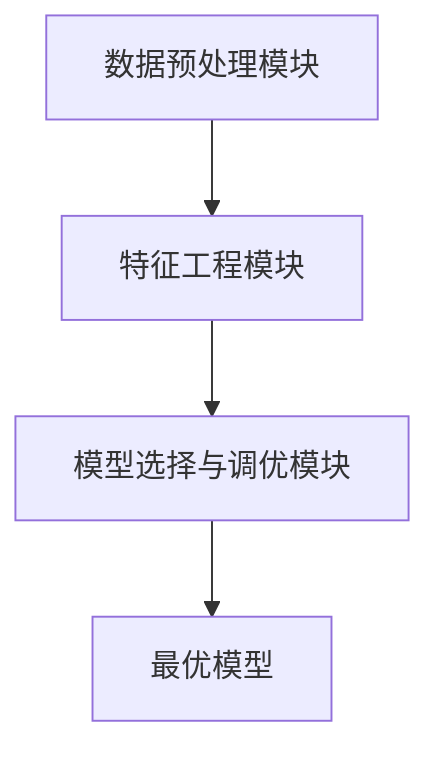

                 


# AI Agent的自动机器学习(AutoML)应用

---

## 关键词
- AI Agent
- AutoML
- 自动机器学习
- 算法原理
- 系统架构
- 实际应用

---

## 摘要
AI Agent与AutoML的结合为机器学习的自动化提供了新的可能性。AutoML通过自动化数据预处理、特征工程、模型选择和调优，显著提升了AI Agent的效率和效果。本文深入探讨AutoML的核心原理、算法实现、系统架构，并通过实际案例展示其在AI Agent中的应用，帮助读者全面理解AutoML在现代机器学习中的重要性。

---

## 目录

### 第一部分：AutoML背景与核心概念

### 第二部分：AutoML的核心原理与技术

### 第三部分：AutoML的数学模型与公式

### 第四部分：AutoML的系统架构与设计

### 第五部分：AutoML的实际应用与案例分析

---

## 正文

### 第一部分：AutoML背景与核心概念

#### 第1章：AutoML的背景与现状

##### 1.1 AutoML的定义与问题背景
- **1.1.1 AutoML的定义**
  AutoML（Automated Machine Learning）是指通过自动化技术实现机器学习模型的设计、优化和部署，旨在降低机器学习的门槛，使非专家也能高效构建高质量的机器学习模型。

- **1.1.2 AutoML的应用场景**
  AutoML广泛应用于数据科学家效率提升、企业自动化决策、智能系统自适应优化等领域，特别是在处理大量数据和复杂任务时，AutoML表现出显著优势。

- **1.1.3 AutoML的必要性与优势**
  AutoML通过自动化处理数据预处理、特征工程、模型选择和调优，大幅提高了机器学习模型的构建效率，减少了人工干预，降低了成本。

- **1.1.4 AutoML与传统机器学习的区别**
  传统机器学习依赖人工特征工程和模型调优，而AutoML通过自动化技术实现了从数据到模型的全自动化流程，显著提高了效率和模型性能。

---

### 第二部分：AutoML的核心原理与技术

#### 第2章：AutoML的核心原理

##### 2.1 AutoML的核心流程
- **2.1.1 数据预处理**
  数据预处理是AutoML的第一步，包括数据清洗、特征提取和数据转换等步骤，确保数据质量。

- **2.1.2 特征工程**
  特征工程是AutoML的关键步骤，通过自动化选择和构造特征，提升模型的性能。

- **2.1.3 模型选择与调优**
  AutoML通过自动化选择模型类型和优化超参数，找到最优模型配置，提升模型性能。

##### 2.2 AutoML的关键技术
- **2.2.1 超参数优化**
  超参数优化是AutoML的重要技术，通过贝叶斯优化、网格搜索等方法，找到最优超参数组合。

- **2.2.2 网络搜索与随机搜索**
  这些方法用于探索模型空间，随机搜索在低维空间表现良好，而网格搜索适用于高维空间。

- **2.2.3 贝叶斯优化**
  贝叶斯优化是一种基于概率的优化方法，通过构建概率模型，指导搜索过程，提高优化效率。

---

#### 第3章：AutoML的算法原理

##### 3.1 基于遗传算法的模型搜索
- **3.1.1 遗传算法的基本原理**
  遗传算法模拟自然选择，通过变异、交叉和选择操作，优化模型结构。

- **3.1.2 在AutoML中的应用**
  使用遗传算法搜索模型空间，生成候选模型，并评估其性能，选择最优模型。

- **3.1.3 示例代码实现**
  ```python
  import numpy as np
  from sklearn import datasets
  from sklearn.tree import DecisionTreeClassifier

  def genetic_algorithm(X, y):
      # 初始化种群
      population = [DecisionTreeClassifier(random_state=i) for i in range(10)]
      # 计算适应度
      fitness = [model.fit(X, y).score(X, y) for model in population]
      # 选择最优个体
      best_model = population[np.argmax(fitness)]
      return best_model
  ```

##### 3.2 基于强化学习的模型优化
- **3.2.1 强化学习的基本原理**
  强化学习通过智能体与环境的交互，学习最优策略，应用于模型优化。

- **3.2.2 在AutoML中的应用**
  强化学习用于超参数调优，通过与模型性能的反馈，优化搜索策略。

- **3.2.3 示例代码实现**
  ```python
  import gym
  import numpy as np

  class AutoMLEnvironment(gym.Env):
      def __init__(self):
          super().__init__()
          self.action_space = gym.spaces.Box(low=-1, high=1, shape=(2,))
          self.observation_space = gym.spaces.Box(low=0, high=1, shape=(10,))

      def step(self, action):
          reward = np.random.randn()
          return self.observation_space.sample(), reward, False, {}

      def reset(self):
          return self.observation_space.sample()
  ```

---

### 第三部分：AutoML的数学模型与公式

#### 第4章：AutoML的数学模型

##### 4.1 超参数优化的数学模型
- **4.1.1 贝叶斯优化的数学公式**
  $$ p(\theta | D) \propto p(D|\theta) p(\theta) $$

- **4.1.2 网格搜索的数学公式**
  $$ \theta_i = \arg\max_{\theta_j} \text{score}(\theta_j) $$

- **4.1.3 随机搜索的数学公式**
  $$ \theta_i = \text{random}(\theta_j) $$

##### 4.2 AutoML中的特征选择模型
- **4.2.1 Lasso回归的数学公式**
  $$ L(\theta) = \frac{1}{2n}\sum_{i=1}^{n}(y_i - \theta^T x_i)^2 + \lambda \|\theta\|_1 $$

- **4.2.2 Ridge回归的数学公式**
  $$ L(\theta) = \frac{1}{2n}\sum_{i=1}^{n}(y_i - \theta^T x_i)^2 + \lambda \|\theta\|_2^2 $$

- **4.2.3 XGBoost的特征重要性计算**
  $$ \text{特征重要性} = \sum_{i=1}^{n} \text{gain}_i $$

---

### 第四部分：AutoML的系统架构与设计

#### 第5章：AutoML系统的架构设计

##### 5.1 系统功能模块设计
- **5.1.1 数据预处理模块**
  负责数据清洗、特征提取和数据转换。

- **5.1.2 特征工程模块**
  自动化选择和构造特征，提升模型性能。

- **5.1.3 模型选择与调优模块**
  自动选择模型类型和优化超参数，找到最优模型配置。

##### 5.2 系统架构图


##### 5.3 系统接口设计
- API接口定义
  ```python
  def process_data(data):
      # 数据预处理
      pass
  ```

- 接口交互
  ```mermaid
  sequenceDiagram
      User -> API: 提供数据
      API -> 数据预处理模块: 处理数据
      数据预处理模块 -> 特征工程模块: 生成特征
      特征工程模块 -> 模型选择与调优模块: 选择模型
      模型选择与调优模块 -> API: 返回最优模型
  ```

---

### 第五部分：AutoML的实际应用与案例分析

#### 第6章：AutoML的实际应用案例

##### 6.1 环境安装与配置
  ```bash
  pip install auto-sklearn scikit-learn
  ```

##### 6.2 核心代码实现
  ```python
  import auto_sklearn
  from sklearn.datasets import load_iris

  X, y = load_iris(return_X_y=True)
  automl = auto_sklearn.AutoSklearnClassifier()
  automl.fit(X, y)
  print(automl.score(X, y))
  ```

##### 6.3 实际案例分析
  通过使用AutoML进行分类任务，展示其在特征工程、模型选择和调优方面的优势。

##### 6.4 项目小结
  AutoML显著提高了AI Agent的效率和效果，通过自动化处理，降低了机器学习的门槛，使非专家也能高效构建高质量的机器学习模型。

---

### 第六部分：总结与展望

#### 7.1 最佳实践 tips
  - 选择合适的AutoML工具，根据具体任务需求进行调整。
  - 结合领域知识，优化模型性能。
  - 定期监控和更新模型，确保其适应数据变化。

#### 7.2 小结
  AutoML通过自动化技术，显著提升了机器学习的效率和效果，为AI Agent的应用提供了强大的支持。

#### 7.3 注意事项
  - AutoML并非万能，需根据具体任务选择合适的工具和方法。
  - 注意数据隐私和模型可解释性问题。

#### 7.4 拓展阅读
  - 阅读《Hands-On Machine Learning with Scikit-Learn, Keras, and TensorFlow》。
  - 关注AutoML领域的最新研究和工具发展。

---

通过以上结构，本文详细介绍了AutoML的核心概念、算法原理、系统架构和实际应用，帮助读者全面理解AutoML在AI Agent中的重要性和应用价值。

