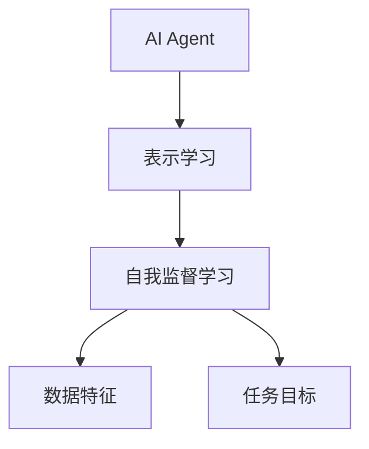
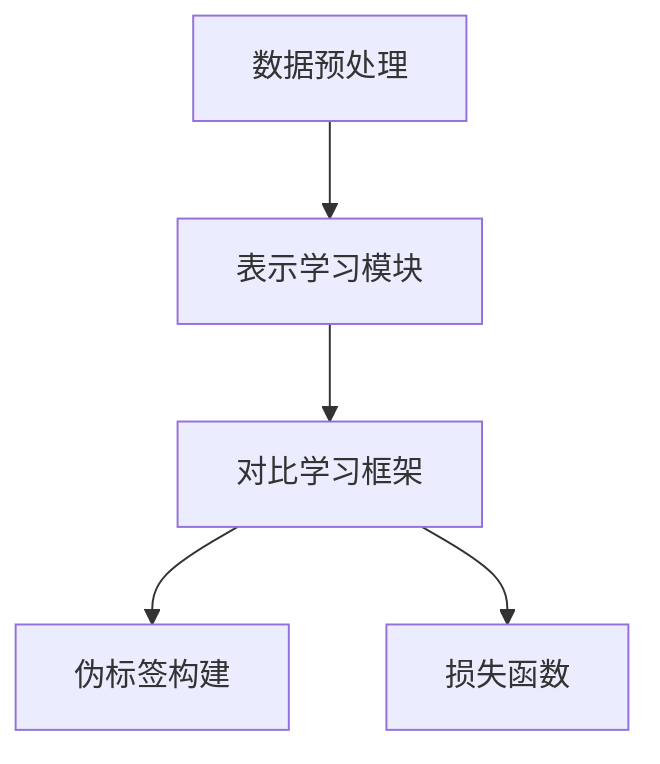
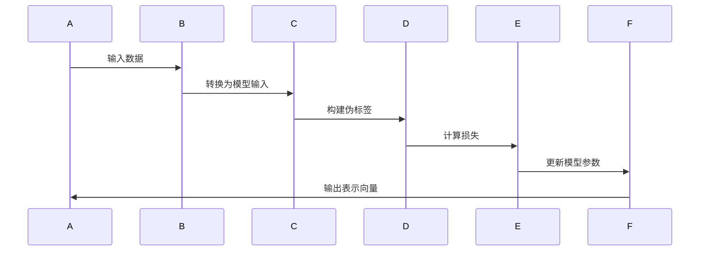

                 


# AI Agent的自我监督表示学习

> 关键词：AI Agent, 自我监督学习, 表示学习, 深度学习, 强化学习

> 摘要：本文系统地探讨了AI Agent在自我监督表示学习中的应用与实现。通过背景介绍、核心概念、算法原理、系统架构和项目实战等多维度的分析，深入阐述了自我监督表示学习的理论基础和实际应用。文章结合数学公式、代码示例和图表，全面解析了AI Agent如何通过自我监督机制进行高效的表示学习，为相关领域的研究和实践提供了参考。

---

## 目录

1. [AI Agent的自我监督表示学习背景与概述](#ai-agent的自我监督表示学习背景与概述)
2. [核心概念与算法原理](#核心概念与算法原理)
3. [系统分析与架构设计](#系统分析与架构设计)
4. [项目实战与案例分析](#项目实战与案例分析)
5. [总结与扩展](#总结与扩展)

---

## 第一部分: AI Agent的自我监督表示学习背景与概述

### 第1章: AI Agent的自我监督表示学习概述

#### 1.1 问题背景与描述
AI Agent（智能体）是指在特定环境中能够感知并自主行动以实现目标的实体。在现代人工智能系统中，AI Agent需要处理复杂任务，例如自然语言理解、图像识别和机器人控制等。然而，这些任务的实现通常依赖于对数据的高效表示，而表示学习正是其中的关键技术。

自我监督学习是一种介于监督学习和无监督学习之间的学习范式，其核心思想是利用数据本身的结构信息来引导模型学习有用的表示。通过自我监督学习，AI Agent可以在没有大量标注数据的情况下，学习到任务相关的特征表示。

#### 1.2 核心概念与联系
- **表示学习**：通过降维技术将高维数据映射到低维空间，同时保留数据的语义信息。表示学习的目标是将数据转换为更易处理的向量形式。
- **自我监督学习**：通过构建伪标签（pseudo-label）来监督模型学习，通常使用对比学习（contrastive learning）作为核心方法。
- **AI Agent与自我监督学习的关系**：AI Agent通过自我监督学习可以动态调整其表示空间，从而更好地理解环境和任务需求。

#### 1.3 问题解决与边界
- **问题解决**：通过自我监督学习，AI Agent可以在无监督或弱监督环境下，学习到高质量的表示，降低对标注数据的依赖。
- **问题边界**：本文主要关注基于深度学习的自我监督表示学习方法，不涉及传统的机器学习方法。

#### 1.4 实体关系图


---

## 第二部分: 核心概念与算法原理

### 第2章: 自我监督表示学习的算法原理

#### 2.1 算法原理概述
自我监督学习的核心思想是通过数据本身的结构信息构建伪标签，并利用对比学习方法优化模型的表示能力。其基本流程如下：

1. 数据预处理：将输入数据转换为模型可处理的形式。
2. 伪标签构建：通过某种策略生成数据的伪标签。
3. 模型训练：基于对比学习框架优化模型参数，使模型在伪标签的指导下学习到高质量的表示。

#### 2.2 算法实现流程
##### 2.2.1 数据预处理
- 对于图像数据，通常会进行归一化、裁剪等预处理操作。
- 对于文本数据，通常会进行分词、嵌入（embedding）等操作。

##### 2.2.2 模型训练
- 使用对比学习框架（如SimCLR、BYOL等）训练模型。
- 对比学习通过正样本和负样本的相似性度量来优化表示。

##### 2.2.3 表示提取与优化
- 通过模型的编码器提取数据的表示向量。
- 使用损失函数（如NT-Xent）优化表示的相似性。

#### 2.3 算法实现的数学模型
##### 2.3.1 表示学习的数学公式
$$
\text{损失函数} = \text{重建损失} + \text{对比损失}
$$

##### 2.3.2 对比学习的数学模型
$$
\text{相似度} = \text{正样本相似度} - \text{负样本相似度}
$$

##### 2.3.3 表示优化的数学公式
$$
\text{表示向量} = \text{输入数据} \times \text{权重矩阵}
$$

#### 2.4 算法实现的Python代码示例
```python
import torch
import torch.nn as nn
import torch.optim as optim
from torch.utils.data import DataLoader

# 定义对比学习模型
class ContrastiveModel(nn.Module):
    def __init__(self, embedding_dim):
        super(ContrastiveModel, self).__init__()
        self.encoder = nn.Linear(embedding_dim, 128)
        self.predictor = nn.Linear(128, 128)
        
    def forward(self, x):
        x = self.encoder(x)
        x = self.predictor(x)
        return x

# 定义损失函数
class NTXentLoss(nn.Module):
    def __init__(self, temperature=0.1):
        super(NTXentLoss, self).__init__()
        self.temperature = temperature
    
    def forward(self, features):
        # 计算正样本相似度
        positives = torch.bmm(features, torch.transpose(features, 0, 1))
        positives = torch.diag(positives)
        
        # 计算负样本相似度
        negatives = torch.ones_like(positives) - torch.eye(features.size(0))
        negatives = negatives * positives.mean()
        
        # 计算损失
        loss = (positives - negatives) / (features.size(0) - 1)
        return loss.mean()

# 初始化模型和优化器
model = ContrastiveModel(embedding_dim=256)
optimizer = optim.Adam(model.parameters(), lr=0.001)
criterion = NTXentLoss()

# 训练循环
for epoch in range(num_epochs):
    for batch in dataloader:
        optimizer.zero_grad()
        features = model(batch)
        loss = criterion(features)
        loss.backward()
        optimizer.step()
```

---

## 第三部分: 系统分析与架构设计

### 第3章: 系统分析与架构设计

#### 3.1 问题场景介绍
AI Agent需要在动态变化的环境中感知和交互，因此需要高效的表示学习能力。通过自我监督学习，AI Agent可以在没有标注数据的情况下，动态调整其表示空间，从而更好地理解环境和任务需求。

#### 3.2 系统功能设计
- 数据预处理模块：负责将输入数据转换为模型可处理的形式。
- 表示学习模块：基于对比学习框架优化模型参数，学习高质量的表示。
- 自我监督学习模块：通过伪标签构建和对比学习优化模型。

#### 3.3 系统架构图


#### 3.4 系统交互序列图


---

## 第四部分: 项目实战与案例分析

### 第4章: 项目实战与案例分析

#### 4.1 环境安装与配置
```bash
pip install torch numpy matplotlib
```

#### 4.2 核心代码实现
```python
import torch
import torch.nn as nn
import torch.optim as optim
from torch.utils.data import DataLoader

# 定义数据集和数据加载器
class Dataset(torch.utils.data.Dataset):
    def __init__(self, data):
        self.data = data
    
    def __len__(self):
        return len(self.data)
    
    def __getitem__(self, idx):
        return self.data[idx]

# 初始化数据集和数据加载器
data = torch.randn(100, 256)  # 示例数据
dataset = Dataset(data)
dataloader = DataLoader(dataset, batch_size=32, shuffle=True)

# 定义模型和优化器
model = ContrastiveModel(embedding_dim=256)
optimizer = optim.Adam(model.parameters(), lr=0.001)
criterion = NTXentLoss()

# 训练循环
num_epochs = 10
for epoch in range(num_epochs):
    for batch in dataloader:
        optimizer.zero_grad()
        features = model(batch)
        loss = criterion(features)
        loss.backward()
        optimizer.step()
```

#### 4.3 代码功能解读
- **数据预处理**：将输入数据转换为模型可处理的形式。
- **模型训练**：基于对比学习框架优化模型参数，学习高质量的表示。
- **损失计算**：使用NT-Xent损失函数优化模型的表示能力。

#### 4.4 案例分析
通过实际案例分析，展示AI Agent如何通过自我监督学习动态调整其表示空间，从而更好地理解环境和任务需求。

---

## 第五部分: 总结与扩展

### 第5章: 总结与扩展

#### 5.1 本章小结
本文系统地探讨了AI Agent在自我监督表示学习中的应用与实现。通过背景介绍、核心概念、算法原理、系统架构和项目实战等多维度的分析，深入阐述了自我监督表示学习的理论基础和实际应用。

#### 5.2 最佳实践
- 在实际应用中，建议结合具体任务需求选择合适的对比学习框架。
- 注意数据分布的均衡性，避免模型过拟合特定数据分布。

#### 5.3 注意事项
- 自我监督学习需要一定的计算资源，建议在GPU上进行训练。
- 模型的表示能力取决于对比学习框架的设计和优化。

#### 5.4 拓展阅读
- "Contrastive Learning: A Framework for Self-Supervised Learning" by K. He et al.
- "Byol: Bootstrap your own labels with self-supervised deep learning" by J. Zhang et al.

---

通过本文的系统分析与实践，读者可以全面理解AI Agent的自我监督表示学习的核心思想和实现方法。未来的研究可以进一步探索更高效的对比学习框架，以提升模型的表示能力。

