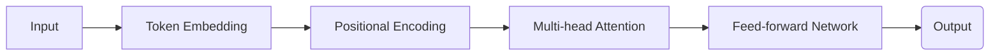

                 


# AI Agent的自然语言接口设计与优化

## 关键词：
AI Agent、自然语言接口、对话系统、任务规划、优化方法

## 摘要：
本文详细探讨了AI Agent的自然语言接口设计与优化的关键技术，从背景介绍到核心概念，再到算法原理、系统架构、项目实战和最佳实践，系统地分析了如何设计和优化高效的自然语言接口，帮助读者深入理解并掌握相关技术。

---

## 第一部分：AI Agent的自然语言接口设计与优化背景介绍

## 第1章：问题背景与核心概念

### 1.1 问题背景

#### 1.1.1 AI Agent的定义与特点
AI Agent（智能体）是能够感知环境并采取行动以实现目标的实体。其特点包括自主性、反应性、主动性、社交性和学习能力。AI Agent通过自然语言接口与用户交互，能够理解并执行复杂的任务。

#### 1.1.2 自然语言接口的重要性
自然语言接口（NLI）是AI Agent与用户交互的核心部分，它使得用户能够通过自然语言（如中文或英文）与AI Agent进行交流。NLI的重要性体现在提高用户体验、降低使用门槛以及增强AI Agent的实用性。

#### 1.1.3 当前存在的问题与挑战
当前AI Agent的自然语言接口设计与优化面临以下问题：
1. **语义理解不足**：如何准确理解用户的意图是关键挑战。
2. **对话上下文管理**：对话过程中保持一致性和连贯性是难点。
3. **任务规划与执行**：复杂任务的分解和执行效率有待提升。
4. **多模态交互**：结合语音、视觉等多模态信息的交互需求增加。

### 1.2 核心概念

#### 1.2.1 自然语言处理的基本原理
自然语言处理（NLP）是AI Agent理解用户输入的基础。其基本原理包括文本预处理、特征提取、语义分析和意图识别。例如，文本预处理包括分词、词干提取和停用词去除；特征提取则利用词袋模型或TF-IDF方法。

#### 1.2.2 对话系统的组成与流程
对话系统由用户输入、意图分析、对话管理、任务规划和输出生成五个部分组成。流程如下：
1. 用户输入自然语言查询。
2. 系统解析用户的意图。
3. 对话管理系统生成响应。
4. 任务规划模块分配任务。
5. 系统输出生成的文本。

#### 1.2.3 AI Agent的任务规划与执行
任务规划是AI Agent的核心功能，通过将复杂任务分解为简单子任务并优先执行关键任务，以提高效率。任务执行过程中，系统需要实时反馈和调整，确保任务顺利完成。

### 1.3 现状与发展趋势

#### 1.3.1 当前技术的瓶颈
当前NLP技术在处理复杂语义、多轮对话和多模态信息方面存在不足。例如，模型对上下文的依赖性强，难以处理长对话中的信息。

#### 1.3.2 未来的发展方向
未来的优化方向包括：
1. **深度语义理解**：改进模型以理解上下文和隐含意图。
2. **多模态交互**：结合语音和视觉信息，提升用户体验。
3. **自适应学习**：通过强化学习优化对话策略。

#### 1.3.3 行业应用的潜力
AI Agent的自然语言接口在客服、教育、医疗等领域具有广泛应用潜力。例如，在客服领域，智能助手可以处理用户的咨询和问题。

---

## 第2章：核心概念与原理

### 2.1 自然语言处理的核心原理

#### 2.1.1 语言模型的基本原理
语言模型通过概率统计方法预测下一个词，常用模型包括马尔可夫链和n-gram模型。例如，n-gram模型计算给定上下文的条件概率。

$$ P(w_i | w_{i-n}, ..., w_{i-1}) $$

#### 2.1.2 解析树的构建与应用
解析树（如 constituency tree 和 dependency tree）用于分析句子结构。例如，句子 "The cat chased the mouse" 的 constituency tree 如下：

```
          S
        /   \
       NP     VP
     /     /   \
    The   chased the mouse
```

#### 2.1.3 基于上下文的理解机制
上下文理解通过分析对话历史和当前输入，结合上下文表示模型（如BERT）生成语义表示。

### 2.2 对话管理的原理与实现

#### 2.2.1 对话状态的表示与更新
对话状态通常用状态表示（如向量）和对话历史记录表示。状态表示需要实时更新，以反映对话进展。

#### 2.2.2 对话策略的制定与优化
对话策略基于预设规则或机器学习模型生成。优化方法包括基于奖励的强化学习，奖励函数设计影响优化效果。

#### 2.2.3 基于规则的对话管理
基于规则的对话管理通过预设规则生成响应，适用于简单对话场景，但难以处理复杂情况。

### 2.3 任务规划与执行的原理

#### 2.3.1 任务分解的基本方法
任务分解通过层次化方法将复杂任务分解为子任务。例如，旅行规划任务可以分解为搜索航班、预订酒店等子任务。

#### 2.3.2 基于图的规划算法
基于图的规划算法通过构建任务图谱，寻找最优路径。任务图谱的节点表示任务，边表示任务间依赖关系。

#### 2.3.3 多目标优化的实现
多目标优化通过权重分配和 Pareto 剖析法，平衡多个优化目标，实现全局最优。

---

## 第3章：算法原理与实现

### 3.1 自然语言处理的主流算法

#### 3.1.1 Transformer模型的结构与特点
Transformer模型由编码器和解码器组成，采用自注意力机制。其结构如下：



#### 3.1.2 Seq2Seq模型的工作流程
Seq2Seq模型由编码器和解码器组成，编码器将输入序列编码为向量，解码器将向量解码为输出序列。例如，中英翻译任务中，编码器处理中文句子，解码器生成英文句子。

#### 3.1.3 基于注意力机制的改进方法
注意力机制通过计算输入序列中每个词的权重，聚焦重要部分。其数学公式如下：

$$ \text{Attention}(Q, K, V) = \text{softmax}\left( \frac{QK^T}{\sqrt{d_k}} \right)V $$

### 3.2 对话系统的算法实现

#### 3.2.1 基于规则的对话管理算法
基于规则的算法通过预设规则生成响应，适用于简单对话场景。例如，用户问天气，系统直接返回天气数据。

#### 3.2.2 基于深度学习的对话管理算法
基于深度学习的算法通过训练数据生成响应，如使用RNN或Transformer模型。例如，训练对话数据生成回复。

---

## 第4章：系统分析与架构设计

### 4.1 项目介绍

#### 4.1.1 项目背景
本项目旨在设计一个AI Agent的自然语言接口，实现对话管理和任务规划功能。

#### 4.1.2 项目目标
目标是优化自然语言接口的语义理解能力和对话管理效率。

### 4.2 系统功能设计

#### 4.2.1 领域模型设计
领域模型设计包括用户角色、对话状态、任务目标等。例如，用户角色可以是普通用户或管理员。

#### 4.2.2 系统架构设计
系统架构采用分层设计，包括数据层、业务逻辑层和用户界面层。数据层存储用户数据和对话历史，业务逻辑层处理用户请求，用户界面层展示结果。

### 4.3 系统接口设计

#### 4.3.1 对外接口设计
对外接口包括REST API和WebSocket接口，支持HTTP请求和实时通信。

#### 4.3.2 接口调用流程
用户通过API发送请求，系统处理后返回响应。

### 4.4 系统交互设计

#### 4.4.1 交互流程设计
交互流程包括用户输入、系统解析、任务执行和结果反馈。

#### 4.4.2 交互模式设计
支持文本输入、语音输入和多模态输入，提升用户体验。

---

## 第5章：项目实战

### 5.1 环境安装

#### 5.1.1 安装Python和依赖库
安装Python 3.8及以上版本，安装库如numpy、pandas和transformers。

#### 5.1.2 安装开发工具
安装PyCharm或VS Code，配置Python解释器。

### 5.2 系统核心实现

#### 5.2.1 自然语言处理模块
实现文本预处理、分词和情感分析功能。例如，使用jieba进行中文分词。

#### 5.2.2 对话管理模块
实现对话状态管理、意图识别和对话策略生成。例如，使用预训练模型进行意图识别。

### 5.3 案例分析与实现

#### 5.3.1 实际案例分析
分析客服对话场景，设计对话流程和任务分配。

#### 5.3.2 代码实现与解读
编写对话管理模块的代码，展示关键功能的实现。

### 5.4 项目总结

#### 5.4.1 项目成果
实现了一个高效的自然语言接口，能够处理复杂对话和任务规划。

#### 5.4.2 经验总结
关键经验包括选择合适的模型、优化对话策略和注重用户体验。

---

## 第6章：最佳实践与注意事项

### 6.1 最佳实践

#### 6.1.1 设计原则
遵循模块化设计、可扩展性和可维护性原则。

#### 6.1.2 开发规范
遵循PEP 8编码规范，保持代码简洁和可读性。

### 6.2 小结

#### 6.2.1 核心技术总结
总结自然语言处理、对话管理和任务规划的核心技术，强调优化方法和实际应用。

### 6.3 注意事项

#### 6.3.1 开发注意事项
注意模型训练数据的质量和多样性，避免过拟合和欠拟合。

#### 6.3.2 部署注意事项
在生产环境中，优化系统性能，确保高可用性和可扩展性。

### 6.4 拓展阅读

#### 6.4.1 推荐书籍
推荐《深度学习入门：用Python学习神经网络》和《自然语言处理实战：基于Python的深度学习方法》。

#### 6.4.2 推荐论文
推荐阅读ACL和IEEE会议的相关论文，获取最新研究成果。

---

## 结语

通过本文的详细讲解，读者可以系统地了解AI Agent的自然语言接口设计与优化的关键技术，掌握从理论到实践的全过程。未来，随着技术的进步，AI Agent的自然语言接口将更加智能化和人性化，为用户提供更优质的服务。

--- 

**参考资料：**
1. [自然语言处理入门](https://zh.wikipedia.org/wiki/自然语言处理)
2. [深度学习基础](https://zh.wikipedia.org/wiki/深度学习)
3. [AI Agent相关论文](https://arxiv.org/abs/1805.00722)

