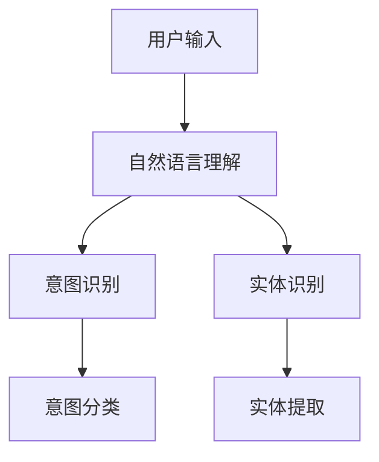
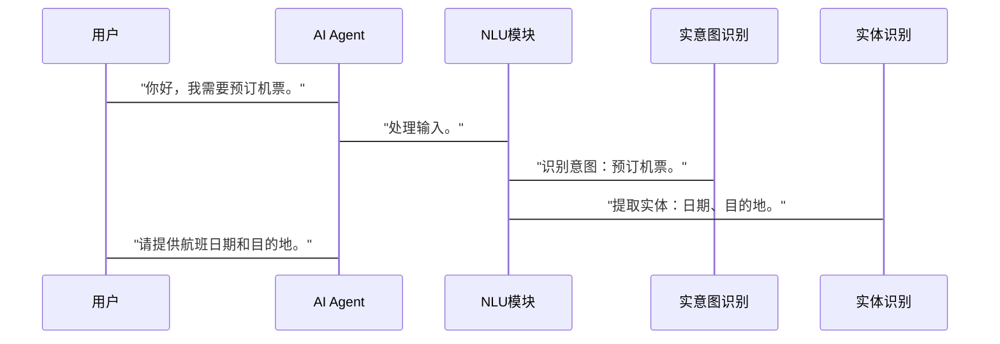

                 


# AI Agent的自然语言理解能力：NLU技术深度解析

**关键词**：AI Agent，自然语言理解，NLU技术，深度学习，意图识别，实体识别，情感分析

**摘要**：  
本文深入解析AI Agent中的自然语言理解（NLU）技术，探讨其核心概念、算法原理、系统设计与实际应用。通过详细分析NLU的关键技术，包括意图识别、实体识别、语义理解等，结合深度学习算法和实际案例，揭示NLU在AI Agent中的重要作用及其未来发展。

---

# 第一部分: AI Agent与自然语言理解概述

## 第1章: AI Agent与自然语言理解概述

### 1.1 AI Agent的基本概念

#### 1.1.1 什么是AI Agent
AI Agent（人工智能代理）是指能够感知环境、执行任务并做出决策的智能实体。它可以是一个软件程序、机器人或其他智能系统，旨在模拟人类或其他智能体的行为。

#### 1.1.2 AI Agent的核心特征
- **自主性**：能够在没有外部干预的情况下自主决策。
- **反应性**：能够实时感知环境并做出响应。
- **社交能力**：能够与人类或其他系统进行交互。
- **学习能力**：能够通过数据和经验不断优化自身行为。

#### 1.1.3 AI Agent的应用场景
- 智能助手（如Siri、Alexa）。
- 智能客服系统。
- 智能聊天机器人。
- 智能推荐系统。

### 1.2 自然语言理解（NLU）的基本概念

#### 1.2.1 什么是自然语言理解
NLU（Natural Language Understanding）是计算机科学中的一个分支，旨在让计算机能够理解人类的自然语言输入（如文本或语音），并将其转化为可计算的形式。

#### 1.2.2 NLU的核心目标
- **意图识别**：识别用户输入的主要意图。
- **实体识别**：从文本中提取关键实体信息。
- **语义理解**：理解文本的深层含义。

#### 1.2.3 NLU与NLP的关系
NLP（Natural Language Processing）是计算机处理自然语言的总称，而NLU是NLP的一个子领域，专注于理解文本的语义和意图。

### 1.3 AI Agent中的NLU技术

#### 1.3.1 NLU在AI Agent中的作用
NLU技术是AI Agent与用户交互的核心，它帮助AI Agent理解用户的输入，从而做出正确的响应。

#### 1.3.2 NLU技术对AI Agent的影响
- 提高交互的准确性。
- 提升用户体验。
- 扩展AI Agent的应用场景。

#### 1.3.3 NLU技术的未来发展趋势
- 基于深度学习的NLU模型将更加普及。
- 多语言支持将成为主流。
- NLU技术将更加注重实时性和准确性。

### 1.4 本章小结
本章介绍了AI Agent和NLU的基本概念，并分析了NLU技术在AI Agent中的作用及其发展趋势。

---

## 第2章: 自然语言理解技术的核心概念与联系

### 2.1 NLU技术的核心原理

#### 2.1.1 语言理解的基本过程
NLU的核心过程包括文本预处理、意图识别、实体识别和语义理解。

#### 2.1.2 NLU的主要任务与模块
- **文本预处理**：分词、词性标注、句法分析。
- **意图识别**：识别用户的主要意图。
- **实体识别**：提取文本中的关键实体。
- **语义理解**：理解文本的深层含义。

#### 2.1.3 NLU技术的关键挑战
- **歧义性**：同一个输入可能有多种含义。
- **数据稀疏性**：某些语言现象在训练数据中可能不足。
- **语境理解**：需要理解上下文关系。

### 2.2 NLU核心概念的属性特征对比

#### 2.2.1 实体识别与意图识别的对比
| 属性 | 实体识别 | 意图识别 |
|------|---------|----------|
| 目标 | 提取文本中的关键实体 | 确定用户的主要意图 |
| 方法 | 基于规则或统计模型 | 基于机器学习或深度学习 |

#### 2.2.2 词性标注与句法分析的对比
| 属性 | 词性标注 | 句法分析 |
|------|---------|----------|
| 目标 | 标注每个词的词性 | 分析句子的语法结构 |
| 方法 | 基于统计模型或规则 | 基于上下文和语法规则 |

#### 2.2.3 语义理解与情感分析的对比
| 属性 | 语义理解 | 情感分析 |
|------|---------|----------|
| 目标 | 理解文本的深层含义 | 判断文本的情感倾向 |
| 方法 | 基于深度学习模型 | 基于情感词典或机器学习模型 |

### 2.3 NLU技术的ER实体关系图


### 2.4 本章小结
本章详细介绍了NLU技术的核心原理，并通过对比分析和实体关系图，揭示了NLU技术中的关键概念及其联系。

---

## 第3章: 自然语言理解技术的算法原理

### 3.1 NLU技术的主要算法

#### 3.1.1 基于规则的NLU算法
基于规则的NLU算法通过预定义的规则来解析文本。例如，使用正则表达式提取实体信息。

#### 3.1.2 统计学习的NLU算法
统计学习算法通过分析大量的训练数据，利用统计模型（如最大熵模型、SVM）进行分类。

#### 3.1.3 深度学习的NLU算法
深度学习算法利用神经网络模型（如LSTM、Transformer）进行文本理解和意图识别。

### 3.2 基于深度学习的NLU算法原理

#### 3.2.1 神经网络的基本结构
神经网络包括输入层、隐藏层和输出层。通过多层神经网络，模型可以提取文本的深层特征。

#### 3.2.2 Transformer模型在NLU中的应用
Transformer模型通过自注意力机制，能够捕捉文本中的长距离依赖关系，广泛应用于机器翻译和文本生成。

#### 3.2.3 BERT模型的原理与优势
BERT模型通过预训练和微调，能够处理多种NLU任务，如意图识别和实体识别。

### 3.3 NLU算法的数学模型与公式

#### 3.3.1 概率论基础
$$P(A|B) = \frac{P(B|A)P(A)}{P(B)}$$

#### 3.3.2 深度学习中的损失函数
$$L = -\frac{1}{m}\sum_{i=1}^{m} \sum_{j=1}^{n} y_{i,j} \log(p_{i,j}) + (1 - y_{i,j}) \log(1 - p_{i,j}))$$

### 3.4 本章小结
本章详细介绍了NLU技术的主要算法，并通过数学公式和模型结构，揭示了深度学习在NLU中的重要作用。

---

## 第4章: 自然语言理解系统的分析与设计

### 4.1 系统功能设计
系统功能包括：
- 用户输入接收
- 文本预处理
- 意图识别
- 实体识别
- 语义理解

### 4.2 系统架构设计


### 4.3 系统接口设计
系统接口包括：
- 输入接口：接收用户输入的文本或语音。
- 输出接口：返回解析后的意图和实体信息。

### 4.4 系统交互流程


### 4.5 本章小结
本章通过系统功能设计、架构设计和交互流程图，详细分析了NLU技术在AI Agent中的系统实现。

---

## 第5章: 项目实战——基于NLU的智能客服系统

### 5.1 项目背景与目标
智能客服系统旨在通过NLU技术，自动理解用户的咨询内容，并提供准确的响应。

### 5.2 项目环境与工具
- Python 3.8+
- TensorFlow 2.0+
- NLTK库
- spaCy库

### 5.3 项目核心代码实现

#### 5.3.1 意图识别代码
```python
import tensorflow as tf
from tensorflow.keras import layers

model = tf.keras.Sequential([
    layers.Embedding(input_dim=10000, output_dim=16),
    layers.LSTM(64, return_sequences=True),
    layers.Dense(2, activation='softmax')
])

model.compile(loss='sparse_categorical_crossentropy', optimizer='adam', metrics=['accuracy'])
model.fit(x_train, y_train, epochs=10, batch_size=32)
```

#### 5.3.2 实体识别代码
```python
import spacy

nlp = spacy.load("en_core_web_sm")
doc = nlp("I need to book a flight to Paris on October 10th.")
for ent in doc.ents:
    print(ent.text, ent.label_)
```

### 5.4 代码解读与分析
- 意图识别代码使用了LSTM模型，通过训练数据对用户的输入进行分类。
- 实体识别代码利用spaCy库，从文本中提取关键实体信息。

### 5.5 实际案例分析
以用户咨询“我需要预订一张从北京到上海的机票”为例，系统能够识别出意图“预订机票”和实体“北京”、“上海”。

### 5.6 本章小结
本章通过实际案例，详细展示了NLU技术在智能客服系统中的应用。

---

## 第6章: 总结与最佳实践

### 6.1 本章小结
本文深入解析了AI Agent中的NLU技术，探讨了其核心概念、算法原理和系统设计，并通过实际案例展示了NLU技术的应用。

### 6.2 NLU技术的最佳实践
- **数据质量**：确保训练数据的多样性和代表性。
- **模型优化**：通过数据增强和超参数调优提升模型性能。
- **实时性优化**：通过优化算法和减少计算复杂度提升实时性。

### 6.3 注意事项
- 在实际应用中，需要考虑用户的语言习惯和文化差异。
- 避免过度依赖单一模型，建议采用多模型融合的方法。

### 6.4 拓展阅读
推荐阅读《深度学习入门：基于Python的理论与实现》和《自然语言处理实战：基于Python的文本处理技术》。

---

# 结语
NLU技术是AI Agent实现智能交互的核心技术，随着深度学习的不断发展，NLU技术将更加精准和高效。未来，NLU技术将在更多领域得到广泛应用，为人类带来更智能、更便捷的交互体验。

