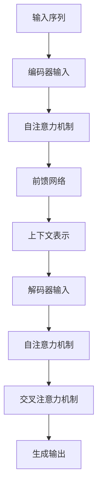
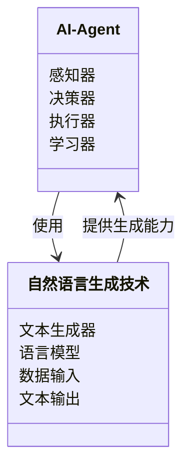
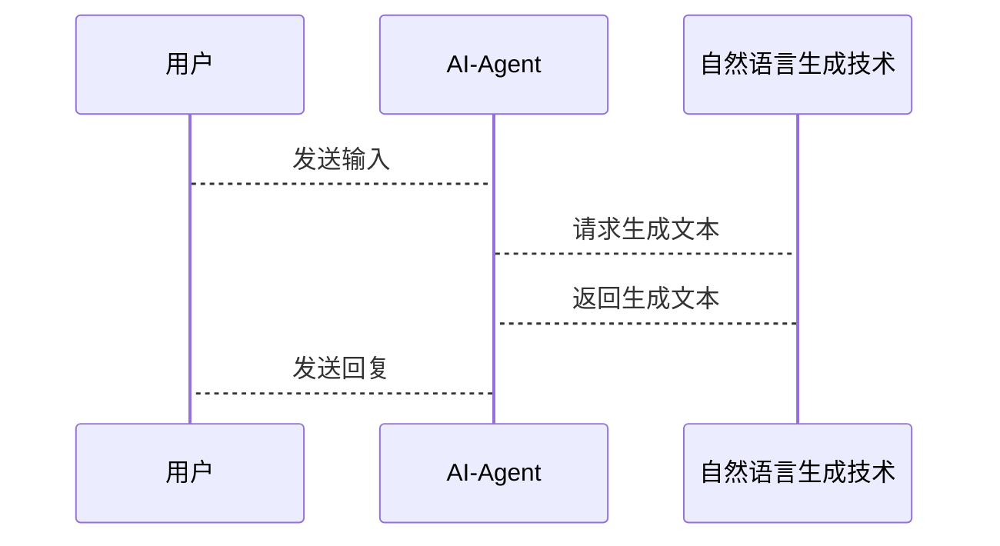

                 


# AI Agent的自然语言生成技术

## 关键词：
- AI Agent
- 自然语言生成
- 转换器模型
- 对话系统
- 生成式AI

## 摘要：
AI Agent的自然语言生成技术是人工智能领域的重要研究方向，旨在实现AI代理能够生成符合人类语言习惯的自然文本。本文从背景介绍、核心概念、算法原理、系统架构、项目实战和最佳实践等多角度，详细阐述AI Agent自然语言生成技术的关键点。通过对比分析、算法推导和实际案例，帮助读者全面理解并掌握这一技术。

---

## 第一部分：AI Agent与自然语言生成技术的背景介绍

### 第1章：AI Agent的基本概念与自然语言生成技术的背景

#### 1.1 AI Agent的基本概念
- **定义与特点**：AI Agent（智能体）是能够感知环境并采取行动以实现目标的实体。其特点包括自主性、反应性、目标导向和社会能力。
- **核心要素与组成结构**：AI Agent通常由感知器、决策器、执行器和学习器组成。
- **应用领域与发展趋势**：AI Agent广泛应用于自动驾驶、智能助手、机器人等领域，发展趋势包括智能化、个性化和协作化。

#### 1.2 自然语言生成技术的背景
- **定义与特点**：自然语言生成（NLG）是将结构化数据转化为自然语言文本的技术。其特点包括生成性、可定制性和高效性。
- **核心问题与挑战**：NLG的核心问题包括内容生成、语言表达和语境理解。主要挑战在于生成自然流畅且符合语境的文本。
- **典型应用场景**：NLG广泛应用于智能对话系统、内容生成、情感分析等领域。

---

## 第二部分：AI Agent与自然语言生成技术的核心概念与联系

### 第2章：AI Agent与自然语言生成技术的核心概念与联系

#### 2.1 AI Agent与自然语言生成技术的核心概念
- **AI Agent的智能对话能力**：AI Agent通过自然语言处理技术实现与用户的智能对话，生成符合语境的回复。
- **自然语言生成技术的实现原理**：基于预训练模型和生成算法，将结构化数据转化为自然语言文本。
- **AI Agent与自然语言生成技术的结合方式**：AI Agent通过集成NLG技术，提升其对话能力和用户体验。

#### 2.2 AI Agent与自然语言生成技术的核心要素对比
- **对比表格：AI Agent与自然语言生成技术的核心要素对比**
| 核心要素       | AI Agent                          | 自然语言生成技术                     |
|----------------|-----------------------------------|---------------------------------------|
| 核心功能       | 感知与行动                        | 生成自然语言文本                    |
| 技术基础       | 机器学习、自然语言处理            | 生成式模型、转换器模型               |
| 应用场景       | 自动驾驶、智能助手                | 智能对话系统、内容生成               |

- **对比表格：AI Agent与传统对话系统的核心要素对比**
| 核心要素       | AI Agent                          | 传统对话系统                        |
|----------------|-----------------------------------|---------------------------------------|
| 智能性         | 高                                 | 低                                   |
| 学习能力       | 强                                 | 弱                                   |
| 生成能力       | 强                                 | 弱                                   |

#### 2.3 AI Agent与自然语言生成技术的ER实体关系图
- **ER图：AI Agent与自然语言生成技术的实体关系**
```mermaid
er
  %% AI Agent与自然语言生成技术的实体关系图
  rectangle AI Agent {
    感知器
    决策器
    执行器
    学习器
  }
  rectangle 自然语言生成技术 {
    文本生成器
    语言模型
    数据输入
    文本输出
  }
  AI Agent --> 自然语言生成技术: 使用
  自然语言生成技术 --> AI Agent: 提供生成能力
```

- **ER图：AI Agent与用户交互的实体关系**
```mermaid
er
  %% AI Agent与用户交互的实体关系图
  rectangle AI Agent {
    感知器
    决策器
    执行器
    学习器
  }
  rectangle 用户 {
    用户输入
    用户输出
  }
  AI Agent --> 用户: 交互
  用户 --> AI Agent: 交互
```

---

## 第三部分：AI Agent自然语言生成技术的算法原理讲解

### 第3章：AI Agent自然语言生成技术的算法原理

#### 3.1 转换器模型的算法原理
- **模型结构**：转换器模型（Transformer）由编码器和解码器组成，编码器负责将输入序列转化为表示，解码器负责生成输出序列。
- **工作原理**：
  - 编码器：通过自注意力机制和前馈网络处理输入序列，生成上下文表示。
  - 解码器：通过自注意力机制和交叉注意力机制，基于上下文生成输出序列。
- **算法流程图**：


- **Python代码实现**：
```python
import torch
import torch.nn as nn

class Transformer(nn.Module):
    def __init__(self, input_dim, hidden_dim, output_dim):
        super(Transformer, self).__init__()
        self.encoder = nn.Sequential(
            nn.Linear(input_dim, hidden_dim),
            nn.ReLU(),
            nn.Linear(hidden_dim, hidden_dim),
            nn.ReLU()
        )
        self.decoder = nn.Sequential(
            nn.Linear(hidden_dim, output_dim),
            nn.Softmax(dim=-1)
        )

    def forward(self, x):
        encoded = self.encoder(x)
        output = self.decoder(encoded)
        return output

# 示例输入
input_dim = 10
hidden_dim = 20
output_dim = 5
model = Transformer(input_dim, hidden_dim, output_dim)
input_data = torch.randn(1, input_dim)
output_data = model(input_data)
print(output_data)
```

- **数学模型与公式**：
  - 自注意力机制：
  $$\text{Attention}(Q, K, V) = \text{softmax}\left(\frac{QK^T}{\sqrt{d_k}}\right)V$$
  - 前馈网络：
  $$f(x) = \text{ReLU}(Wx + b)$$

---

### 第3章：AI Agent自然语言生成技术的算法原理（续）

#### 3.2 基于转换器模型的数学模型与公式推导
- **编码器部分**：
  $$\text{Encoder}(x) = \text{LayerNorm}(\text{FFN}(\text{Attention}(x, x, x)))$$
- **解码器部分**：
  $$\text{Decoder}(y, \text{Encoder}(x)) = \text{LayerNorm}(\text{FFN}(\text{Attention}(y, y, y) + \text{Attention}(y, \text{Encoder}(x), \text{Encoder}(x))))$$
- **交叉注意力机制**：
  $$\text{CrossAttention}(y, x) = \text{softmax}\left(\frac{yK_x^T}{\sqrt{d_k}}\right)V_x$$

---

## 第四部分：AI Agent自然语言生成技术的系统分析与架构设计方案

### 第4章：AI Agent自然语言生成技术的系统分析与架构设计方案

#### 4.1 问题场景介绍
- **问题描述**：设计一个基于AI Agent的智能对话系统，能够通过自然语言生成技术与用户进行有效对话。
- **边界与外延**：系统需处理多轮对话，支持上下文理解，并具备自适应学习能力。

#### 4.2 系统功能设计
- **功能模块**：
  - 用户输入模块：接收用户输入的文本或语音。
  - 自然语言理解模块：解析用户输入，提取意图和实体。
  - 自然语言生成模块：基于解析结果生成回复文本。
  - 对话历史管理模块：维护对话上下文，确保连贯性。

#### 4.3 系统架构设计
- **领域模型**：


- **系统架构图**：
```mermaid
container 系统架构 {
    rectangle 网络层 {
        API网关
        数据库
    }
    rectangle 应用层 {
        对话系统
        NLG模块
    }
    rectangle 表现层 {
        用户界面
        交互界面
    }
    网络层 --> 应用层: 提供数据支持
    应用层 --> 表现层: 提供服务
}
```

#### 4.4 系统接口与交互设计
- **系统接口**：
  - 用户输入接口：接收用户输入的文本或语音。
  - 系统输出接口：输出生成的自然语言文本。
- **交互流程图**：


---

## 第五部分：AI Agent自然语言生成技术的项目实战

### 第5章：AI Agent自然语言生成技术的项目实战

#### 5.1 项目介绍与环境配置
- **项目介绍**：实现一个基于AI Agent的智能客服对话系统，利用自然语言生成技术为用户提供智能问答服务。
- **环境配置**：
  - Python 3.8+
  - PyTorch 1.9+
  - CUDA 11+

#### 5.2 核心代码实现
- **文本生成器代码**：
```python
class TextGenerator:
    def __init__(self, model, tokenizer):
        self.model = model
        self.tokenizer = tokenizer
        self.max_length = 50

    def generate(self, input_text):
        inputs = self.tokenizer.encode(input_text, return_tensors='pt')
        with torch.no_grad():
            outputs = self.model.generate(inputs.input_ids, max_length=self.max_length)
        return self.tokenizer.decode(outputs[0], skip_special_tokens=True)
```

- **对话系统实现**：
```python
class ChatSystem:
    def __init__(self, generator):
        self.generator = generator

    def start_chat(self):
        while True:
            user_input = input("请输入您的问题：")
            if user_input.lower() == 'exit':
                break
            response = self.generator.generate(user_input)
            print("AI回复：", response)
```

#### 5.3 功能实现与测试优化
- **功能实现**：实现用户输入处理、文本生成、对话历史管理等功能。
- **测试优化**：通过自动化测试验证系统性能，优化模型参数以提升生成文本的质量。

---

## 第六部分：AI Agent自然语言生成技术的最佳实践与小结

### 第6章：AI Agent自然语言生成技术的最佳实践

#### 6.1 最佳实践
- **模型调优**：选择合适的预训练模型，并根据具体任务进行微调。
- **数据处理**：确保训练数据的多样性和代表性，避免数据偏差。
- **系统优化**：优化系统架构，提升响应速度和生成效率。

#### 6.2 小结
AI Agent的自然语言生成技术通过将AI Agent与生成式AI结合，显著提升了人机交互的智能化水平。通过合理设计系统架构、优化算法模型和精心处理数据，可以实现高效、准确且自然的对话生成。

---

## 参考文献与扩展阅读
- [1] Vaswani, A., et al. "Attention Is All You Need." arXiv preprint arXiv:1706.03798, 2017.
- [2] Radford, A., et al. "Language models are few-shot learners." arXiv preprint arXiv:1909.08692, 2019.
- [3] 廖明辉. 《深度学习入门：基于Python和Keras的实践》. 人民邮电出版社, 2020.

---

通过以上内容，您可以全面了解AI Agent的自然语言生成技术，从基础概念到实际应用，逐步深入掌握这一领域的核心技术与实践方法。

