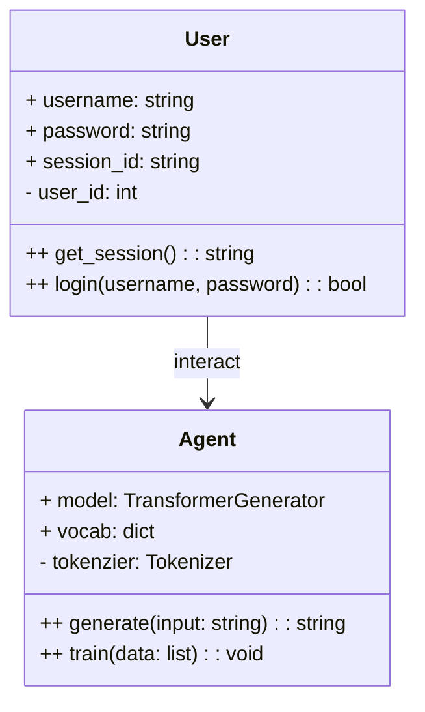
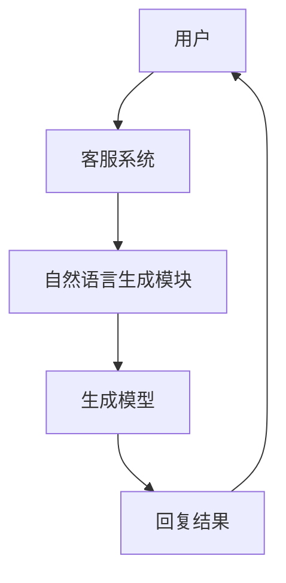

                 


# AI Agent的自然语言生成能力开发

> 关键词：AI Agent, 自然语言生成, 深度学习, Transformer, GPT, 生成模型

> 摘要：本文将详细探讨AI Agent的自然语言生成能力的开发过程，从基础概念到高级算法，从系统设计到实际应用，全面解析如何构建具备强大自然语言生成能力的AI Agent。通过本文，读者将深入了解自然语言生成的核心技术、模型实现、系统架构设计以及实际项目开发的要点。

---

## 第1章: AI Agent与自然语言生成概述

### 1.1 AI Agent的基本概念
AI Agent（人工智能代理）是指能够感知环境、执行任务并做出决策的智能实体。它可以是一个软件程序，也可以是硬件设备，其目标是通过与环境交互，完成特定的目标。AI Agent的核心能力包括感知、推理、规划和执行。

#### 1.1.1 AI Agent的定义与特点
- **定义**：AI Agent是一种能够自主决策和行动的智能系统，能够根据环境输入做出响应。
- **特点**：
  - **自主性**：能够在没有外部干预的情况下运行。
  - **反应性**：能够实时感知环境并做出反应。
  - **目标导向**：所有行为都围绕实现特定目标展开。
  - **学习能力**：通过数据和经验不断优化自身性能。

#### 1.1.2 自然语言生成的定义与目标
- **定义**：自然语言生成（Natural Language Generation, NLG）是将结构化数据转换为自然语言文本的过程。
- **目标**：
  - 生成符合语法规则的自然语言文本。
  - 确保生成内容与上下文相关且有意义。
  - 提供多样化且自然流畅的表达方式。

#### 1.1.3 AI Agent与自然语言生成的结合
AI Agent通过自然语言生成能力，可以与人类用户进行更自然的交互，提高用户体验。例如，在智能客服系统中，AI Agent可以通过自然语言生成技术，为用户提供个性化的回复。

---

### 1.2 自然语言生成的背景与应用
自然语言生成技术近年来发展迅速，其应用领域广泛，涵盖文本摘要、机器翻译、对话系统、内容生成等多个方面。

#### 1.2.1 自然语言生成的发展历程
- **早期阶段**：基于规则的生成方法，如基于语法树的文本生成。
- **统计学习阶段**：利用统计模型（如n-gram模型）进行概率生成。
- **深度学习阶段**：引入神经网络模型（如RNN、Transformer）进行端到端生成。

#### 1.2.2 自然语言生成的主要应用领域
- **文本摘要**：将长文本压缩成短文本，保留关键信息。
- **机器翻译**：将一种语言翻译成另一种语言。
- **对话系统**：实现人与AI之间的自然对话。
- **内容生成**：自动生成新闻、文章等文本内容。

#### 1.2.3 AI Agent在自然语言生成中的角色
AI Agent通过自然语言生成技术，可以实现以下功能：
- **信息检索**：将查询结果生成自然语言回复。
- **决策支持**：根据分析结果生成建议文本。
- **用户交互**：通过自然语言与用户进行实时对话。

---

### 1.3 本章小结
本章主要介绍了AI Agent和自然语言生成的基本概念，分析了AI Agent在自然语言生成中的角色，并探讨了自然语言生成技术的发展历程及其应用领域。

---

## 第2章: 自然语言生成的核心技术基础

### 2.1 自然语言生成的主要方法
自然语言生成技术可以根据实现方法的不同分为多种类型。

#### 2.1.1 基于规则的生成方法
- **原理**：通过预定义的语法规则生成文本。
- **优点**：生成结果可控，适合特定领域应用。
- **缺点**：缺乏灵活性，难以处理复杂场景。

#### 2.1.2 统计机器学习方法
- **原理**：基于统计模型（如n-gram模型）生成文本。
- **优点**：可以利用大量数据进行训练，生成结果更加自然。
- **缺点**：对数据依赖性强，生成结果可能缺乏多样性。

#### 2.1.3 基于深度学习的生成方法
- **原理**：利用神经网络模型（如RNN、Transformer）进行端到端生成。
- **优点**：生成结果多样化，语言更自然流畅。
- **缺点**：模型复杂，训练成本较高。

---

### 2.2 自然语言生成的关键技术
自然语言生成的核心技术包括语言模型、解码算法和模型训练优化。

#### 2.2.1 语言模型
- **定义**：语言模型用于计算一串字符的概率，衡量其在语言中的合理性。
- **常用模型**：
  - n-gram模型：基于滑动窗口的简单模型。
  - RNN语言模型：通过循环神经网络处理序列数据。
  - Transformer语言模型：基于自注意力机制的模型。

#### 2.2.2 解码算法
- **定义**：解码算法用于将结构化输入转换为自然语言文本。
- **常用算法**：
  - 最大熵解码：基于概率模型的解码方法。
  - 最小错误概率解码：基于纠错编码理论的解码方法。
  - 基于神经网络的解码：如beam search、贪心搜索等。

#### 2.2.3 模型训练与优化
- **数据预处理**：包括分词、去停用词、数据增强等。
- **模型训练**：使用大规模语料库进行监督学习。
- **模型优化**：通过调整超参数、使用早停技术等方法优化模型性能。

---

### 2.3 自然语言生成的挑战与解决方案
自然语言生成技术面临诸多挑战，如生成内容的多样性和准确性问题。

#### 2.3.1 多样性问题
- **挑战**：生成结果缺乏多样性，容易出现重复内容。
- **解决方案**：
  - 引入温度参数（temperature）调节生成过程。
  - 使用top-k采样或核化采样方法增加多样性。

#### 2.3.2 生成内容的准确性与可解释性
- **挑战**：生成内容可能不符合实际情况或逻辑。
- **解决方案**：
  - 结合领域知识进行约束生成。
  - 使用可解释性模型（如可解释的Transformer）提高生成内容的可解释性。

#### 2.3.3 长文本生成的挑战
- **挑战**：长文本生成容易出现内容跑题或语法错误。
- **解决方案**：
  - 使用分段生成方法，逐步生成长文本。
  - 采用记忆机制（如记忆网络）处理长文本生成。

---

### 2.4 本章小结
本章主要介绍了自然语言生成的主要方法，分析了语言模型、解码算法和模型训练优化的核心技术，并探讨了自然语言生成面临的挑战及解决方案。

---

## 第3章: AI Agent中的自然语言生成能力开发

### 3.1 AI Agent的自然语言生成需求分析
在开发AI Agent的自然语言生成能力时，需要进行充分的需求分析。

#### 3.1.1 生成任务的分类
- **文本摘要**：将长文本压缩成短文本。
- **机器翻译**：将一种语言翻译成另一种语言。
- **对话生成**：生成自然的对话回复。
- **内容生成**：自动生成新闻、文章等文本内容。

#### 3.1.2 不同场景下的生成需求
- **客服系统**：需要生成符合用户需求的回复。
- **智能音箱**：需要生成简洁明了的指令或提醒。
- **聊天机器人**：需要生成自然流畅的对话回复。

#### 3.1.3 生成结果的质量评估
- **指标**：包括BLEU、ROUGE、METEOR等。
- **方法**：通过人工评估和自动评估相结合的方式进行质量评估。

---

### 3.2 AI Agent中的自然语言生成实现流程
自然语言生成在AI Agent中的实现流程包括数据准备、模型训练、生成优化等步骤。

#### 3.2.1 数据准备与预处理
- **数据收集**：收集与任务相关的语料库。
- **数据清洗**：去除噪声数据，如停用词、特殊符号等。
- **数据增强**：通过数据增强技术增加数据多样性。

#### 3.2.2 模型选择与训练
- **模型选择**：根据任务需求选择合适的生成模型，如RNN、Transformer等。
- **模型训练**：使用大规模数据进行监督学习，优化模型参数。

#### 3.2.3 生成结果的优化与调整
- **生成多样性**：通过引入温度参数或top-k采样方法增加生成多样性。
- **生成准确性**：通过约束生成或引入领域知识提高生成准确性。

---

### 3.3 本章小结
本章主要介绍了AI Agent中自然语言生成能力开发的需求分析和实现流程，强调了数据准备、模型选择和生成优化的重要性。

---

## 第4章: 基于深度学习的自然语言生成模型

### 4.1 基于RNN的自然语言生成模型
RNN（循环神经网络）是早期常用的自然语言生成模型。

#### 4.1.1 RNN的基本原理
- **原理**：通过循环结构处理序列数据，维护一个隐藏状态表示当前上下文。
- **优缺点**：
  - **优点**：适合处理序列数据，能够捕捉时序信息。
  - **缺点**：存在梯度消失问题，难以处理长序列。

#### 4.1.2 LSTM与GRU在生成任务中的应用
- **LSTM**：通过门控机制解决RNN的梯度消失问题，适合处理长序列。
- **GRU**：简化版的LSTM，通过单个门控机制实现长短期信息的融合。

---

### 4.2 基于Transformer的自然语言生成模型
Transformer模型近年来在自然语言生成领域取得了显著成果。

#### 4.2.1 Transformer模型的基本结构
- **编码器**：通过多头自注意力机制捕捉输入序列中的全局信息。
- **解码器**：通过自注意力和交叉注意力机制生成目标序列。

#### 4.2.2 注意力机制在生成任务中的作用
- **自注意力机制**：捕捉输入序列内部的关联性。
- **交叉注意力机制**：捕捉输入序列与输出序列之间的关联性。

---

### 4.3 基于预训练语言模型的生成方法
预训练语言模型（如GPT、BERT）在自然语言生成任务中表现出色。

#### 4.3.1 预训练语言模型的概述
- **GPT**：基于Transformer的生成模型，通过自回归方式生成文本。
- **BERT**：基于Transformer的编码模型，通过双向训练提高生成能力。

#### 4.3.2 基于GPT的生成方法
- **原理**：通过自回归方式生成文本，每次生成一个词并将其作为下一个词的条件。
- **实现**：可以通过开源库（如Hugging Face）快速部署和使用。

#### 4.3.3 基于BERT的生成方法
- **原理**：通过微调预训练模型，使其适应特定生成任务。
- **实现**：可以通过引入生成头（如MLP层）进行生成任务。

---

### 4.4 本章小结
本章主要介绍了基于RNN、Transformer和预训练语言模型的自然语言生成方法，分析了各自的优缺点及应用场景。

---

## 第5章: 自然语言生成的算法实现与优化

### 5.1 基于Transformer的生成模型实现
以下是基于Transformer的生成模型的实现代码示例：

```python
import torch
import torch.nn as nn
import torch.nn.functional as F

class TransformerGenerator(nn.Module):
    def __init__(self, embed_dim, num_heads, feedforward_dim):
        super(TransformerGenerator, self).__init__()
        self.embedding = nn.Embedding(input_dim, embed_dim)
        self.transformer = nn.Transformer(embed_dim, num_heads, feedforward_dim)
        self.output_layer = nn.Linear(embed_dim, output_dim)
        
    def forward(self, input_sequence):
        embedded = self.embedding(input_sequence)
        transformed = self.transformer(embedded)
        output = self.output_layer(transformed)
        return output
```

#### 5.1.1 Transformer生成模型的代码实现
- **代码解释**：
  - `embedding`：将输入序列映射到嵌入空间。
  - `transformer`：通过Transformer层处理序列数据。
  - `output_layer`：将Transformer输出映射到目标空间。

#### 5.1.2 模型训练与调参
- **训练流程**：
  1. 数据准备与预处理。
  2. 模型初始化。
  3. 模型训练：使用交叉熵损失函数和Adam优化器进行训练。
  4. 模型调参：通过调整学习率、批量大小等参数优化模型性能。

#### 5.1.3 模型的优缺点
- **优点**：生成文本质量高，语言自然流畅。
- **缺点**：模型复杂度高，训练成本较高。

---

### 5.2 基于预训练模型的生成优化
预训练模型（如GPT）可以通过微调优化生成能力。

#### 5.2.1 预训练模型的微调
- **步骤**：
  1. 数据准备：收集与任务相关的语料库。
  2. 模型加载：加载预训练模型。
  3. 微调训练：在特定任务上进行微调训练，优化模型参数。

#### 5.2.2 生成结果的优化
- **方法**：
  - **温度采样**：通过调整温度参数控制生成的多样性和确定性。
  - **top-k采样**：只选择top-k个概率最高的候选词进行生成。

---

### 5.3 本章小结
本章主要介绍了基于Transformer和预训练模型的自然语言生成算法实现与优化方法，分析了模型的优缺点及优化策略。

---

## 第6章: 自然语言生成的系统架构设计

### 6.1 问题场景介绍
以智能客服系统为例，介绍自然语言生成的系统架构设计。

#### 6.1.1 问题场景描述
- **用户输入**：用户输入问题，如“如何重置密码？”。
- **系统处理**：系统通过自然语言生成技术生成回复。

#### 6.1.2 问题解决
- **需求分析**：生成符合用户需求的回复。
- **技术选型**：选择合适的生成模型。

---

### 6.2 系统功能设计
系统功能设计包括领域模型和系统架构设计。

#### 6.2.1 领域模型设计
- **领域模型**：通过Mermaid类图展示系统功能模块之间的关系。



#### 6.2.2 系统架构设计
- **系统架构图**：通过Mermaid架构图展示系统整体架构。



---

### 6.3 系统接口设计
系统接口设计包括输入接口和输出接口。

#### 6.3.1 输入接口设计
- **输入接口**：用户输入问题或指令。
- **接口描述**：接口支持多种输入格式，如文本、语音等。

#### 6.3.2 输出接口设计
- **输出接口**：生成自然语言文本。
- **接口描述**：输出格式包括文本、语音等。

---

### 6.4 系统交互设计
系统交互设计包括交互流程和交互协议。

#### 6.4.1 交互流程
- **用户输入**：用户输入问题或指令。
- **系统处理**：系统调用自然语言生成模块生成回复。
- **用户反馈**：用户对生成结果进行反馈，系统根据反馈优化生成策略。

#### 6.4.2 交互协议
- **协议选择**：使用HTTP协议进行交互。
- **数据格式**：使用JSON格式传递数据。

---

### 6.5 本章小结
本章主要介绍了自然语言生成系统的架构设计，包括领域模型设计、系统架构设计、接口设计和交互设计。

---

## 第7章: 项目实战——基于AI Agent的智能客服系统

### 7.1 项目介绍
本项目旨在开发一个基于AI Agent的智能客服系统，实现自然语言生成功能。

#### 7.1.1 项目目标
- 实现自然语言生成功能，生成符合用户需求的回复。
- 提供友好的用户交互界面。

---

### 7.2 项目环境安装
以下是项目开发环境的安装步骤：

#### 7.2.1 安装Python
- 安装Python 3.8或更高版本。

#### 7.2.2 安装依赖库
- 使用以下命令安装依赖库：
  ```bash
  pip install torch transformers
  ```

---

### 7.3 系统核心实现
以下是系统核心实现的代码示例：

#### 7.3.1 生成模型实现
```python
from transformers import AutoTokenizer, AutoModelForCausalLM

class AI_Agent:
    def __init__(self, model_name):
        self.tokenizer = AutoTokenizer.from_pretrained(model_name)
        self.model = AutoModelForCausalLM.from_pretrained(model_name)
        
    def generate_response(self, input_text, max_length=50):
        inputs = self.tokenizer(input_text, return_tensors="pt")
        outputs = self.model.generate(
            inputs.input_ids,
            max_length=max_length,
            do_sample=True,
            temperature=0.7
        )
        response = self.tokenizer.decode(outputs[0], skip_special_tokens=True)
        return response
```

#### 7.3.2 系统交互实现
```python
class AgentSystem:
    def __init__(self, agent):
        self.agent = agent
        
    def interact(self):
        while True:
            user_input = input("用户：")
            if user_input == "退出":
                break
            response = self.agent.generate_response(user_input)
            print("AI Agent:", response)
```

---

### 7.4 项目小结
本章通过一个实际项目——基于AI Agent的智能客服系统，展示了自然语言生成技术的实现过程，包括项目环境安装、系统核心实现和项目小结。

---

## 第8章: 总结与展望

### 8.1 本章总结
本文详细探讨了AI Agent的自然语言生成能力的开发过程，从基础概念到高级算法，从系统设计到实际应用，全面解析了如何构建具备强大自然语言生成能力的AI Agent。

### 8.2 未来展望
未来，随着深度学习技术的不断发展，自然语言生成技术将更加智能化和多样化。AI Agent的自然语言生成能力也将更加贴近人类的自然交流方式，为人类带来更加智能化的服务体验。

---

## 参考文献
（此处列出参考文献）

---

通过本文的详细讲解，读者可以系统地掌握AI Agent的自然语言生成能力开发的核心技术，并能够将其应用到实际项目中，开发出具备强大自然语言生成能力的AI Agent。

