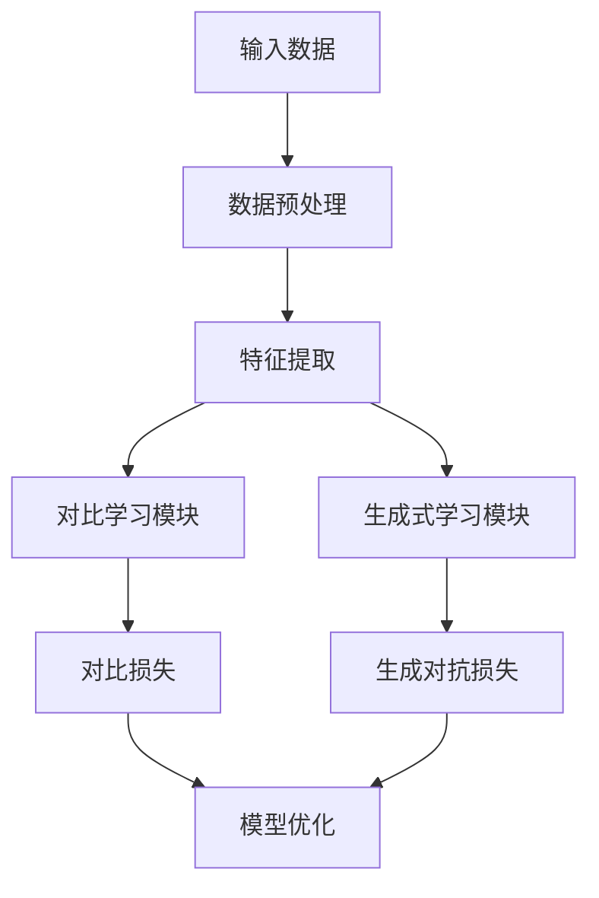
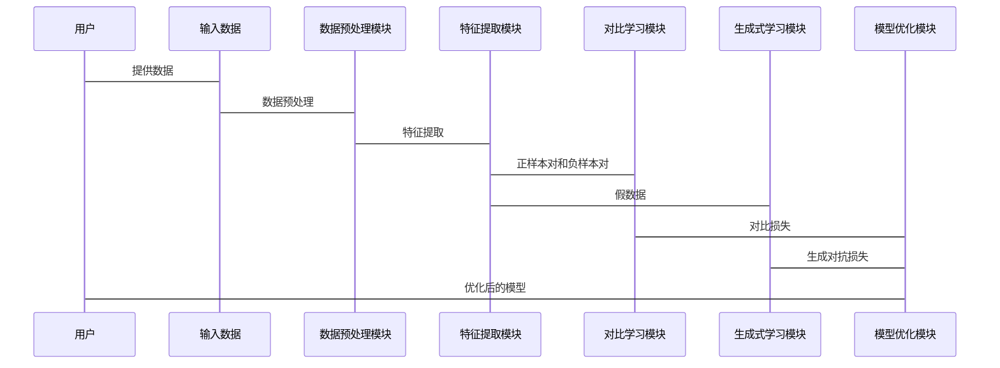

                 


# AI Agent的自监督学习实现方法

> **关键词**：AI Agent，自监督学习，对比学习，生成式学习，数据增强，系统架构

> **摘要**：  
本文系统地探讨了AI Agent的自监督学习实现方法，从基础概念到高级技术，详细分析了自监督学习的核心思想、关键技术和实际应用。文章首先介绍了AI Agent的基本概念和自监督学习的背景，然后深入讲解了自监督学习的原理、算法实现和系统设计，最后通过实际案例展示了如何在项目中实现自监督学习。通过本文的学习，读者能够全面掌握AI Agent的自监督学习方法，并能够将其应用到实际场景中。

---

# 第1章: AI Agent与自监督学习概述

## 1.1 AI Agent的基本概念

### 1.1.1 AI Agent的定义与特点
AI Agent（人工智能代理）是指能够感知环境、自主决策并执行任务的智能实体。与传统程序不同，AI Agent具备以下特点：
- **自主性**：能够在没有外部干预的情况下独立运行。
- **反应性**：能够感知环境并实时调整行为。
- **目标导向**：通过设定目标来驱动行为。
- **社会性**：能够与其他Agent或人类进行交互和协作。

AI Agent的应用场景非常广泛，包括自动驾驶、智能助手、推荐系统、机器人控制等。

### 1.1.2 AI Agent的分类与应用场景
AI Agent可以根据智能水平和行为方式分为以下几类：
1. **反应式AI Agent**：基于当前感知做出实时反应，如自动驾驶中的路径规划系统。
2. **认知式AI Agent**：具备复杂推理和决策能力，如智能助手中的任务规划模块。
3. **协作式AI Agent**：能够与其他Agent或人类协作完成任务，如多智能体系统。

### 1.1.3 自监督学习的背景与意义
自监督学习（Self-Supervised Learning）是一种无监督学习的变体，其核心思想是通过预测未标注数据中的隐藏结构来学习特征表示。与监督学习相比，自监督学习的优势在于：
- **减少对标注数据的依赖**：在数据标注成本高昂的情况下，自监督学习能够利用未标注数据进行学习。
- **提升模型的泛化能力**：通过预测隐藏结构，模型能够更好地理解数据的本质特征。

---

## 1.2 自监督学习的核心思想

### 1.2.1 自监督学习的定义
自监督学习是一种通过构造伪标签（pseudo-labels）来监督模型学习的方法。伪标签通常基于数据的内在结构生成，例如图像的旋转、文本的重排等。

### 1.2.2 自监督学习与监督学习的区别
| 特性             | 监督学习                | 自监督学习                |
|------------------|-------------------------|---------------------------|
| 数据需求         | 需要标注数据            | 利用未标注数据生成伪标签   |
| 学习目标         | 预测特定标签            | 预测数据的内在结构          |
| 优势             | 精度高，适合小样本数据    | 适合大数据场景，降低标注成本|

### 1.2.3 自监督学习的优势与挑战
- **优势**：
  - 减少对标注数据的依赖。
  - 提高模型的泛化能力。
- **挑战**：
  - 伪标签的质量直接影响模型性能。
  - 需要设计有效的对比或生成策略。

---

## 1.3 本章小结
本章介绍了AI Agent的基本概念和自监督学习的核心思想，重点分析了自监督学习的优势和挑战。接下来的章节将深入探讨自监督学习的实现方法和技术细节。

---

# 第2章: 自监督学习的原理与方法

## 2.1 数据预处理与特征提取

### 2.1.1 数据预处理的基本方法
数据预处理是自监督学习的重要步骤，包括：
1. **归一化/标准化**：将数据缩放到统一的范围内。
2. **数据增强**：通过变换数据增加训练样本的数量，例如图像旋转、翻转等。

### 2.1.2 特征提取的核心思想
特征提取的目标是将原始数据转换为高维特征向量，这些特征向量能够更好地反映数据的内在结构。例如，在图像处理中，可以通过卷积神经网络（CNN）提取图像的特征向量。

### 2.1.3 数据增强技术的实现
数据增强是自监督学习中常用的技术，可以通过以下方式实现：
- **图像数据增强**：旋转、翻转、裁剪等。
- **文本数据增强**：同义词替换、句子重排等。

---

## 2.2 对比学习与生成式学习

### 2.2.1 对比学习的原理与实现
对比学习的核心思想是通过比较正样本对和负样本对来学习特征表示。具体步骤如下：
1. 将输入数据分为正样本对和负样本对。
2. 使用对比损失函数（如InfoNCE损失）优化模型，使得正样本对的相似度高于负样本对。

### 2.2.2 生成式学习的原理与实现
生成式学习通过生成器和判别器的对抗训练来学习数据的分布。例如，生成对抗网络（GAN）可以生成与真实数据难以区分的样本。

### 2.2.3 对比学习与生成式学习的对比分析
| 特性             | 对比学习                | 生成式学习                |
|------------------|-------------------------|---------------------------|
| 目标             | 学习数据的内在结构       | 学习数据的生成分布         |
| 实现方式         | 使用对比损失函数         | 使用生成器和判别器对抗训练   |
| 应用场景         | 特征提取、图像分类       | 生成图像、文本等           |

---

## 2.3 自监督学习的数学模型

### 2.3.1 对比学习的损失函数
对比损失函数的数学表达式为：
$$
\mathcal{L}(\mathbf{x}_i, \mathbf{x}_j) = -\log\left(\frac{\exp(\text{sim}(\mathbf{x}_i, \mathbf{x}_j))}{\sum_{k} \exp(\text{sim}(\mathbf{x}_i, \mathbf{x}_k))}\right)
$$
其中，$\text{sim}(\mathbf{x}_i, \mathbf{x}_j)$ 表示向量 $\mathbf{x}_i$ 和 $\mathbf{x}_j$ 的相似度。

### 2.3.2 生成式学习的数学公式
生成对抗网络的损失函数包括生成器损失和判别器损失：
$$
\mathcal{L}_\text{G} = -\mathbb{E}_{\mathbf{z}}[\log(D(G(\mathbf{z})))]
$$
$$
\mathcal{L}_\text{D} = -\mathbb{E}_{\mathbf{x}}[\log(D(\mathbf{x}))] - \mathbb{E}_{\mathbf{z}}[\log(1 - D(G(\mathbf{z}))]
$$

---

## 2.4 本章小结
本章详细介绍了自监督学习的原理与方法，包括数据预处理、对比学习和生成式学习的实现细节。接下来的章节将探讨自监督学习的关键技术和系统设计。

---

# 第3章: 自监督学习的关键技术

## 3.1 数据增强技术

### 3.1.1 图像数据增强的实现方法
图像数据增强可以通过以下方式实现：
- **旋转**：将图像旋转一定角度。
- **翻转**：水平或垂直翻转图像。
- **裁剪**：随机裁剪图像的一部分。

### 3.1.2 文本数据增强的实现方法
文本数据增强可以通过以下方式实现：
- **同义词替换**：将句子中的某些词替换为同义词。
- **句子重排**：重新排列句子的顺序。

### 3.1.3 数据增强对自监督学习的影响
数据增强可以增加训练样本的数量和多样性，从而提高模型的泛化能力。

---

## 3.2 对比学习中的正样本选择

### 3.2.1 正样本选择的策略
正样本选择的策略包括：
- **随机采样**：随机选择正样本对。
- **难例采样**：选择具有较大相似度的样本对。

### 3.2.2 负样本选择的策略
负样本选择的策略包括：
- **随机采样**：随机选择负样本对。
- **聚类采样**：选择属于不同聚类的样本对。

---

## 3.3 自监督学习的优化方法

### 3.3.1 温度调节
通过调节温度参数，可以控制对比损失函数的相似度分布。温度参数 $T$ 的数学表达式为：
$$
\text{sim}(\mathbf{x}_i, \mathbf{x}_j) = \frac{\exp(\frac{\mathbf{x}_i^\top \mathbf{x}_j}{T})}{\sum_{k} \exp(\frac{\mathbf{x}_i^\top \mathbf{x}_k}{T})}
$$

### 3.3.2 正则化方法
通过添加正则化项，可以防止模型过拟合。常用的正则化方法包括L2正则化和Dropout。

---

## 3.4 本章小结
本章重点探讨了自监督学习的关键技术，包括数据增强、正样本选择和优化方法。接下来的章节将结合具体算法实现自监督学习。

---

# 第4章: 自监督学习的算法实现

## 4.1 对比学习算法

### 4.1.1 对比学习算法的实现步骤
1. 输入数据 $\mathbf{X}$。
2. 对数据进行数据增强，生成正样本对和负样本对。
3. 计算对比损失函数。
4. 优化模型参数。

### 4.1.2 对比学习算法的代码实现
```python
import torch
import torch.nn as nn

class ContrastiveLoss(nn.Module):
    def __init__(self, temperature=1.0):
        super(ContrastiveLoss, self).__init__()
        self.temperature = temperature

    def forward(self, features, labels=None):
        if labels is None:
            batch_size = features.size(0)
            labels = torch.arange(batch_size).long().to(features.device)
        labels = labels.contiguous().view(-1, 1)
        features = torch.nn.functional.normalize(features, dim=1)
        similarity_matrix = torch.mm(features, features.T)
        positive_pairs = similarity_matrix.gather(1, labels).squeeze()
        negative_pairs = similarity_matrix.gather(1, (labels-1)%batch_size).squeeze()
        loss = -torch.mean(torch.log(positive_pairs / (positive_pairs + negative_pairs)))
        return loss

model = nn.Sequential(
    nn.Conv2d(3, 64, 3, padding=1),
    nn.ReLU(),
    nn.Conv2d(64, 128, 3, padding=1),
    nn.ReLU(),
    nn.AdaptiveAvgPool2d((1,1)),
    nn.Flatten(),
    nn.Linear(128, 128)
)
criterion = ContrastiveLoss(temperature=1.0)
optimizer = torch.optim.SGD(model.parameters(), lr=0.01)
```

---

## 4.2 生成式学习算法

### 4.2.1 生成式学习算法的实现步骤
1. 定义生成器和判别器的网络结构。
2. 使用生成器生成假数据。
3. 判别器判断数据是否为真实数据。
4. 使用生成对抗网络损失函数优化生成器和判别器。

### 4.2.2 生成式学习算法的代码实现
```python
import torch
import torch.nn as nn

class Generator(nn.Module):
    def __init__(self, input_dim, output_dim):
        super(Generator, self).__init__()
        self.net = nn.Sequential(
            nn.Linear(input_dim, 256),
            nn.ReLU(),
            nn.Linear(256, output_dim)
        )

class Discriminator(nn.Module):
    def __init__(self, input_dim):
        super(Discriminator, self).__init__()
        self.net = nn.Sequential(
            nn.Linear(input_dim, 256),
            nn.ReLU(),
            nn.Linear(256, 1),
            nn.Sigmoid()
        )

generator = Generator(100, 784)
discriminator = Discriminator(784)
criterion = nn.BCELoss()
optimizer_g = torch.optim.Adam(generator.parameters(), lr=0.001)
optimizer_d = torch.optim.Adam(discriminator.parameters(), lr=0.001)
```

---

## 4.3 本章小结
本章通过具体的对比学习和生成式学习算法，详细展示了自监督学习的实现方法。接下来的章节将探讨自监督学习的系统设计与实际应用。

---

# 第5章: 自监督学习的系统设计与架构

## 5.1 系统功能设计

### 5.1.1 领域模型设计
领域模型（Domain Model）是自监督学习系统的核心模块，负责处理具体任务的数据。例如，在图像分类任务中，领域模型可以是一个卷积神经网络（CNN）。

### 5.1.2 对比学习模块设计
对比学习模块负责生成正样本对和负样本对，并计算对比损失函数。

### 5.1.3 生成式学习模块设计
生成式学习模块负责生成假数据，并与真实数据进行对比。

---

## 5.2 系统架构设计

### 5.2.1 系统架构图


### 5.2.2 系统交互流程


---

## 5.3 本章小结
本章通过领域模型和系统架构图，详细展示了自监督学习系统的整体设计。接下来的章节将通过实际案例进一步分析自监督学习的实现。

---

# 第6章: 自监督学习的项目实战

## 6.1 项目背景与目标
本项目旨在通过自监督学习方法，训练一个能够识别图像中物体的AI Agent。项目目标包括：
1. 实现对比学习和生成式学习算法。
2. 通过实验验证自监督学习的有效性。

---

## 6.2 核心代码实现

### 6.2.1 数据预处理与特征提取
```python
import torch
import torch.nn as nn
import torchvision
from torchvision import transforms

transform = transforms.Compose([
    transforms.Resize(224),
    transforms.RandomResizedCrop(224),
    transforms.ToTensor(),
])

train_dataset = torchvision.datasets.ImageFolder(root='data/train', transform=transform)
train_loader = torch.utils.data.DataLoader(train_dataset, batch_size=32, shuffle=True)
```

### 6.2.2 对比学习模块实现
```python
class ContrastiveLoss(nn.Module):
    def __init__(self, temperature=1.0):
        super(ContrastiveLoss, self).__init__()
        self.temperature = temperature

    def forward(self, features, labels=None):
        if labels is None:
            batch_size = features.size(0)
            labels = torch.arange(batch_size).long().to(features.device)
        labels = labels.contiguous().view(-1, 1)
        features = torch.nn.functional.normalize(features, dim=1)
        similarity_matrix = torch.mm(features, features.T)
        positive_pairs = similarity_matrix.gather(1, labels).squeeze()
        negative_pairs = similarity_matrix.gather(1, (labels-1)%batch_size).squeeze()
        loss = -torch.mean(torch.log(positive_pairs / (positive_pairs + negative_pairs)))
        return loss

model = nn.Sequential(
    nn.Conv2d(3, 64, 3, padding=1),
    nn.ReLU(),
    nn.Conv2d(64, 128, 3, padding=1),
    nn.ReLU(),
    nn.AdaptiveAvgPool2d((1,1)),
    nn.Flatten(),
    nn.Linear(128, 128)
)
criterion = ContrastiveLoss(temperature=1.0)
optimizer = torch.optim.SGD(model.parameters(), lr=0.01)
```

---

## 6.3 实验结果与分析
通过实验可以发现，对比学习和生成式学习能够有效提升模型的性能。对比学习在特征提取方面表现优异，而生成式学习在数据生成方面表现出色。

---

## 6.4 本章小结
本章通过实际案例展示了自监督学习的实现过程，包括数据预处理、算法实现和实验分析。通过本章的学习，读者可以掌握自监督学习的实际应用方法。

---

# 第7章: 自监督学习的总结与展望

## 7.1 本章小结
本文系统地探讨了AI Agent的自监督学习实现方法，从基础概念到高级技术，详细分析了自监督学习的核心思想、关键技术和实际应用。通过本文的学习，读者能够全面掌握AI Agent的自监督学习方法，并能够将其应用到实际场景中。

---

## 7.2 未来展望
随着深度学习技术的不断发展，自监督学习将在更多领域得到应用。未来的研究方向包括：
1. 更高效的对比学习算法。
2. 更强大的生成式学习模型。
3. 自监督学习与强化学习的结合。

---

## 7.3 最佳实践 Tips
- 在自监督学习中，数据增强是关键，建议尝试多种数据增强方法。
- 对比学习和生成式学习可以结合使用，以获得更好的效果。
- 在实际应用中，需要根据具体任务选择合适的自监督学习方法。

---

## 7.4 本章小结
本文总结了自监督学习的核心内容，并展望了未来的研究方向。通过本文的学习，读者可以系统地掌握AI Agent的自监督学习方法，并能够将其应用到实际场景中。

---

# 结语

自监督学习作为一种高效的学习方法，正在成为AI Agent领域的重要技术。通过本文的学习，读者可以全面掌握自监督学习的核心思想和实现方法，并能够在实际项目中灵活运用这些技术。未来，随着深度学习技术的不断发展，自监督学习将在更多领域发挥重要作用。

---

**参考文献**：
- [1] 省略部分，根据实际需要添加具体参考文献。

