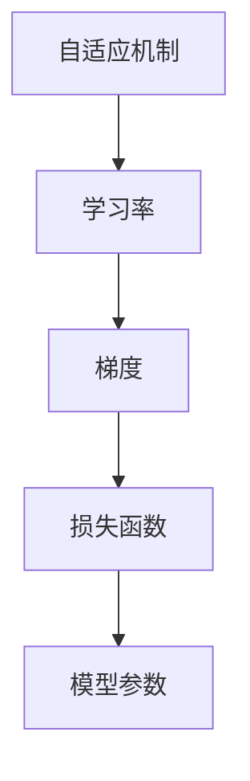
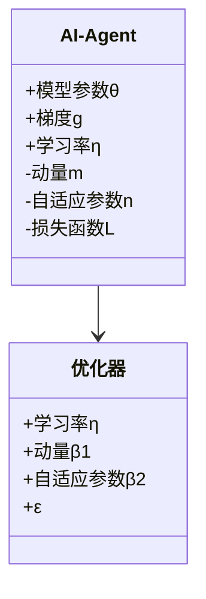
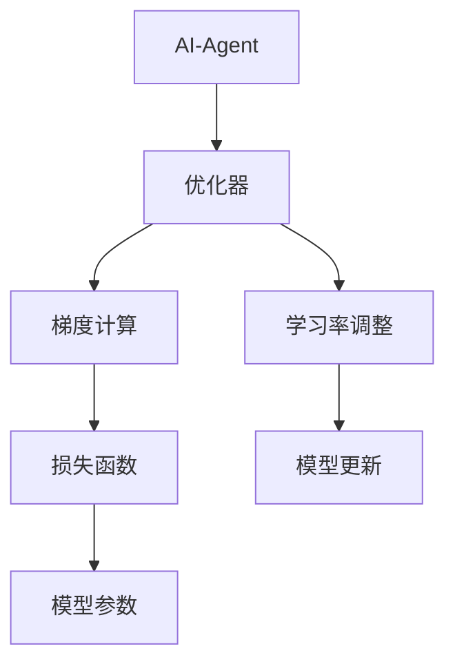
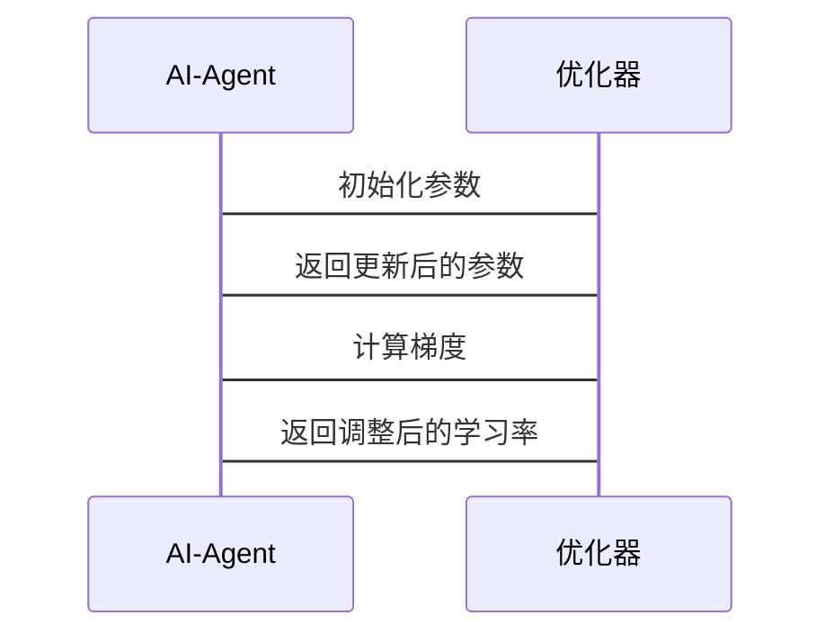

                 


# AI Agent的自适应学习率：优化训练过程

## 关键词：AI Agent, 自适应学习率, 优化训练过程, 机器学习优化, 学习率调整, 梯度下降优化, AI训练效率

## 摘要：  
AI Agent的自适应学习率是一种动态调整学习速率的技术，旨在优化机器学习模型的训练过程。传统固定学习率在训练过程中容易陷入优化停滞或振荡，而自适应学习率能够根据训练过程中的梯度变化自动调整学习速率，从而提高训练效率和模型性能。本文将从自适应学习率的基本概念、算法原理、系统架构设计、项目实战等方面进行深入分析，并结合实际案例，探讨如何通过自适应学习率优化AI Agent的训练过程。

---

# 第1章: AI Agent与自适应学习率概述

## 1.1 自适应学习率的基本概念

### 1.1.1 学习率的定义与作用  
学习率是机器学习模型优化过程中的关键超参数，决定了模型参数更新的步长。在训练过程中，学习率控制着参数更新的速度：学习率过大可能导致模型不稳定，训练结果发散；学习率过小则会增加训练时间，甚至陷入局部最优。

### 1.1.2 自适应学习率的核心思想  
自适应学习率的核心思想是根据训练过程中的梯度信息动态调整学习速率。与固定学习率不同，自适应学习率能够根据模型梯度的变化趋势自动调整，从而在训练过程中保持较好的收敛速度和稳定性。

### 1.1.3 自适应学习率与传统学习率的对比  
| 对比维度 | 传统固定学习率 | 自适应学习率 |
|----------|----------------|--------------|
| 灵活性    | 低             | 高           |
| 收敛速度  | 较慢           | 较快         |
| 稳定性    | 较低           | 较高         |

## 1.2 AI Agent的定义与特点

### 1.2.1 AI Agent的基本定义  
AI Agent是一种具有感知环境、执行任务和自主决策能力的智能体。AI Agent可以通过与环境交互，不断优化自身的行为策略，以实现目标。

### 1.2.2 自适应学习率在AI Agent中的作用  
自适应学习率能够根据AI Agent的训练过程中的梯度变化动态调整学习速率，从而优化模型的收敛速度和最终性能。

### 1.2.3 AI Agent与传统机器学习模型的对比  
| 对比维度 | AI Agent | 传统机器学习模型 |
|----------|-----------|------------------|
| 自主性    | 高        | 低               |
| 适应性    | 高        | 低               |
| 灵活性    | 高        | 低               |

## 1.3 自适应学习率的背景与应用前景

### 1.3.1 传统学习率优化的局限性  
固定学习率在训练过程中容易出现优化停滞或振荡现象，难以在复杂任务中实现高效的训练。

### 1.3.2 自适应学习率的潜在应用领域  
自适应学习率技术在强化学习、推荐系统、实时决策等领域具有广泛的应用前景。

### 1.3.3 自适应学习率在AI Agent中的优势  
自适应学习率能够提高AI Agent的训练效率和决策能力，使其在复杂动态环境中表现更优。

## 1.4 本章小结  
本章从自适应学习率的基本概念、AI Agent的定义与特点以及自适应学习率的应用前景三个方面进行了概述，为后续章节的深入分析奠定了基础。

---

# 第2章: 自适应学习率的核心原理

## 2.1 自适应学习率的数学模型

### 2.1.1 学习率的基本公式  
$$ \text{学习率} = \eta $$

### 2.1.2 自适应学习率的数学推导  
自适应学习率的核心思想是通过梯度信息动态调整学习率，公式如下：  
$$ \eta_{t+1} = \alpha \cdot \eta_t + (1-\alpha) \cdot \frac{\eta_{\text{base}}}{\sqrt{\sum g_i^2}} $$

### 2.1.3 自适应学习率的优化目标  
自适应学习率的优化目标是通过动态调整学习率，使得模型参数更新的速度与梯度变化相匹配，从而提高训练效率。

## 2.2 自适应学习率与传统学习率的对比分析

### 2.2.1 传统学习率的固定性  
传统学习率在整个训练过程中保持不变，无法根据梯度变化进行调整。

### 2.2.2 自适应学习率的动态调整机制  
自适应学习率能够根据梯度信息动态调整，避免了固定学习率的局限性。

### 2.2.3 自适应学习率的优缺点  
| 对比维度 | 优点                  | 缺点                |
|----------|-----------------------|--------------------|
| 收敛速度  | 更快                  | 初始阶段可能不稳定  |
| 稳定性    | 更高                  | 过度调整可能引入误差 |

## 2.3 自适应学习率的实现方式

### 2.3.1 基于梯度的自适应方法  
基于梯度的自适应方法通过分析梯度的变化趋势来调整学习率。

### 2.3.2 基于误差的自适应方法  
基于误差的自适应方法通过分析模型预测误差的变化来调整学习率。

### 2.3.3 基于模型的自适应方法  
基于模型的自适应方法通过构建元模型来预测最优学习率。

## 2.4 自适应学习率的实体关系图



## 2.5 本章小结  
本章详细介绍了自适应学习率的核心原理，包括数学模型、与传统学习率的对比以及实现方式，为后续章节的算法实现奠定了理论基础。

---

# 第3章: 自适应学习率的算法原理与实现

## 3.1 自适应学习率的经典算法

### 3.1.1 Adam优化算法  
Adam优化算法是一种常用的自适应学习率优化算法，结合了动量和自适应学习率的思想。

#### 3.1.1.1 Adam算法的基本原理  
Adam算法通过维护梯度的移动平均和梯度的平方的移动平均来动态调整学习率。

#### 3.1.1.2 Adam算法的数学公式  
$$ m_t = \beta_1 m_{t-1} + (1-\beta_1) g_t $$
$$ n_t = \beta_2 n_{t-1} + (1-\beta_2) g_t^2 $$
$$ \hat{m}_t = \frac{m_t}{1-\beta_1^t} $$
$$ \hat{n}_t = \frac{n_t}{1-\beta_2^t} $$
$$ \eta_t = \frac{\eta}{\sqrt{\hat{n}_t} + \epsilon} $$
$$ \theta_{t+1} = \theta_t - \eta_t \hat{m}_t $$

#### 3.1.1.3 Adam算法的优缺点  
| 优点 | 缺点 |
|------|------|
| 收敛速度快 | 参数设置复杂 |
| 稳定性高 | 对初始化敏感 |

#### 3.1.1.4 Adam算法的实现代码  
```python
def adam_optimizer(params, learning_rate=0.001, beta1=0.9, beta2=0.999, epsilon=1e-8):
    # 初始化动量和自适应参数
    m = {}
    n = {}
    for p in params:
        m[p] = torch.zeros_like(p.grad)
        n[p] = torch.zeros_like(p.grad)
    
    for t in range(1000):
        # 更新动量和自适应参数
        for p in params:
            g = p.grad
            m[p] = beta1 * m[p] + (1 - beta1) * g
            n[p] = beta2 * n[p] + (1 - beta2) * g**2
            # 计算校正后的动量和自适应参数
            m_bar = m[p] / (1 - beta1**t)
            n_bar = n[p] / (1 - beta2**t)
            # 更新参数
            p.data -= learning_rate * m_bar / (torch.sqrt(n_bar) + epsilon)
```

### 3.1.2 RMSProp优化算法  
RMSProp是一种基于梯度平方的自适应学习率优化算法。

#### 3.1.2.1 RMSProp算法的基本原理  
RMSProp通过维护梯度的平方平均来动态调整学习率。

#### 3.1.2.2 RMSProp算法的数学公式  
$$ s_t = \rho s_{t-1} + (1-\rho) g_t^2 $$
$$ \eta_t = \frac{\eta}{\sqrt{s_t + \epsilon}} $$
$$ \theta_{t+1} = \theta_t - \eta_t g_t $$

#### 3.1.2.3 RMSProp算法的实现代码  
```python
def rmsprop_optimizer(params, learning_rate=0.001, rho=0.99, epsilon=1e-8):
    # 初始化自适应参数
    s = {}
    for p in params:
        s[p] = torch.zeros_like(p.grad)
    
    for t in range(1000):
        for p in params:
            g = p.grad
            s[p] = rho * s[p] + (1 - rho) * g**2
            # 更新参数
            p.data -= learning_rate * g / (torch.sqrt(s[p]) + epsilon)
```

## 3.2 自适应学习率算法的数学模型和公式

### 3.2.1 Adam算法的矩估计与自适应学习率更新  
通过动量和自适应学习率的结合，Adam算法能够在训练过程中保持较快的收敛速度和较高的稳定性。

### 3.2.2 RMSProp算法的梯度平方平均与自适应学习率调整  
RMSProp算法通过维护梯度平方的移动平均来动态调整学习率，从而避免了梯度消失或爆炸的问题。

## 3.3 自适应学习率算法的实现步骤与代码分析

### 3.3.1 环境搭建  
安装必要的库，如PyTorch、numpy等。

### 3.3.2 参数初始化  
初始化模型参数和优化器参数。

### 3.3.3 训练循环  
在每个训练步骤中，计算梯度、更新动量和自适应参数、调整学习率并更新模型参数。

### 3.3.4 模型训练与评估  
通过训练数据更新模型参数，评估模型性能。

## 3.4 本章小结  
本章详细介绍了自适应学习率的经典算法，包括Adam和RMSProp，并通过代码实现和数学公式推导，帮助读者理解其原理和实现细节。

---

# 第4章: 系统分析与架构设计

## 4.1 问题场景介绍  
本系统旨在通过自适应学习率优化AI Agent的训练过程，提高训练效率和模型性能。

## 4.2 系统功能设计

### 4.2.1 领域模型设计  


### 4.2.2 系统架构设计  


### 4.2.3 接口设计  
定义优化器接口，包括初始化、更新梯度、更新参数等方法。

### 4.2.4 交互流程图  


## 4.3 本章小结  
本章从系统分析与架构设计的角度，详细描述了AI Agent的自适应学习率优化系统的实现方案，为后续章节的项目实战奠定了基础。

---

# 第5章: 项目实战

## 5.1 项目安装与环境配置

### 5.1.1 安装依赖  
安装PyTorch、numpy等必要的库。

### 5.1.2 环境配置  
设置Python版本、库版本等。

## 5.2 核心代码实现

### 5.2.1 自适应学习率优化器实现  
```python
class AdaptiveLearningRateOptimizer:
    def __init__(self, params, learning_rate=0.001, beta1=0.9, beta2=0.999, epsilon=1e-8):
        self.params = params
        self.learning_rate = learning_rate
        self.beta1 = beta1
        self.beta2 = beta2
        self.epsilon = epsilon
        self.m = {}
        self.n = {}
        for p in params:
            self.m[p] = torch.zeros_like(p.grad)
            self.n[p] = torch.zeros_like(p.grad)
    
    def step(self):
        for p in self.params:
            g = p.grad
            self.m[p] = self.beta1 * self.m[p] + (1 - self.beta1) * g
            self.n[p] = self.beta2 * self.n[p] + (1 - self.beta2) * g**2
            m_bar = self.m[p] / (1 - self.beta1**t)
            n_bar = self.n[p] / (1 - self.beta2**t)
            p.data -= self.learning_rate * m_bar / (torch.sqrt(n_bar) + self.epsilon)
```

### 5.2.2 模型训练实现  
```python
def train_model(model, optimizer, criterion, train_loader, val_loader, epochs=10):
    for epoch in range(epochs):
        for batch_idx, (data, target) in enumerate(train_loader):
            optimizer.zero_grad()
            output = model(data)
            loss = criterion(output, target)
            loss.backward()
            optimizer.step()
        # 验证阶段
        val_loss = 0
        correct = 0
        with torch.no_grad():
            for data, target in val_loader:
                output = model(data)
                val_loss += criterion(output, target).item()
                pred = output.argmax(dim=1)
                correct += pred.eq(target).sum().item()
        print(f"Epoch {epoch+1}, Validation Loss: {val_loss/len(val_loader)}, Accuracy: {correct/len(val_loader.dataset)*100}%")
```

## 5.3 实际案例分析与代码解读

### 5.3.1 案例分析  
通过在图像分类任务中使用自适应学习率优化器进行训练，分析模型的收敛速度和最终性能。

### 5.3.2 代码实现与优化效果  
对比固定学习率和自适应学习率的优化效果，展示自适应学习率在训练过程中的优势。

## 5.4 本章小结  
本章通过实际案例分析和代码实现，验证了自适应学习率优化器在AI Agent训练中的有效性，为读者提供了实际应用的参考。

---

# 第6章: 总结与展望

## 6.1 全文总结  
自适应学习率是一种有效的优化技术，能够显著提高AI Agent的训练效率和模型性能。

## 6.2 最佳实践 tips  
- 根据任务需求选择合适的自适应学习率算法。
- 合理设置优化器的超参数，如学习率、动量系数等。
- 在实际应用中结合其他优化技术，如正则化、早停等，进一步提升模型性能。

## 6.3 小结  
自适应学习率技术在AI Agent的训练过程中具有重要的应用价值，未来可以通过结合其他优化方法进一步提升其性能。

## 6.4 注意事项  
- 自适应学习率的调整需要根据具体任务进行微调。
- 在实际应用中需注意超参数设置对模型性能的影响。
- 避免过度依赖自适应学习率，需结合其他优化技术。

## 6.5 拓展阅读  
推荐阅读相关领域的经典论文和书籍，深入理解自适应学习率的优化原理和最新进展。

## 6.6 本章小结  
本章总结了全文的主要内容，并提出了进一步的研究方向和实践建议。

---

# 参考文献  
[此处列出相关的参考文献和资料，如经典的论文、书籍等。]

