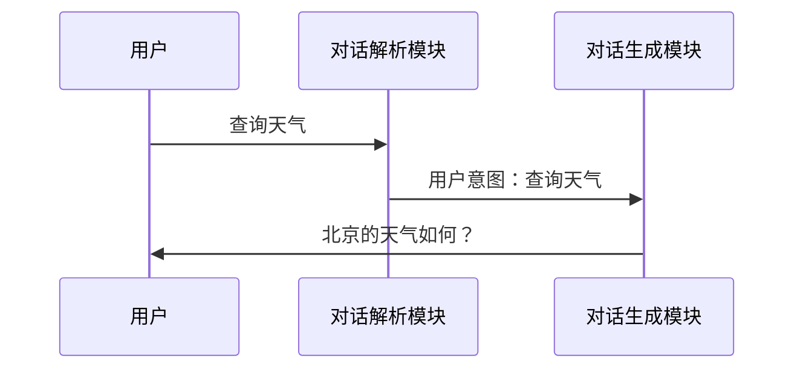

                 


# AI Agent的自适应对话管理系统

---

## 关键词

- AI Agent
- 自适应对话管理
- 对话系统
- 对话生成模型
- 对话策略优化
- 系统架构设计

---

## 摘要

本文详细探讨了AI Agent的自适应对话管理系统的构建与实现。从背景介绍、核心概念、算法原理到系统架构设计、项目实战和未来展望，全面解析了自适应对话管理的关键技术与应用。文章通过丰富的案例分析和详细的代码实现，帮助读者深入理解如何设计和优化自适应对话管理系统，为实际应用提供了有价值的指导。

---

# 第4章: 自适应对话管理系统的架构设计

## 4.1 系统整体架构

### 4.1.1 分层架构
```
+----------------+     +----------------+     +----------------+
|  用户输入      |     | 对话解析与生成 |     | 系统响应输出   |
|----------------|     |----------------|     |----------------|
+----------------+     +----------------+     +----------------+
```

### 4.1.2 模块划分
```
+----------------+     +----------------+     +----------------+     +----------------+
| 对话解析模块   |     | 对话生成模块   |     | 对话管理模块   |     | 系统响应模块   |
|----------------|     |----------------|     |----------------|     |----------------|
+----------------+     +----------------+     +----------------+     +----------------+
```

## 4.2 功能模块设计

### 4.2.1 对话解析模块


### 4.2.2 对话生成模块


## 4.3 接口设计

### 4.3.1 API接口
```json
{
  "intent": "查询天气",
  "entities": {
    "city": "北京"
  }
}
```

### 4.3.2 接口交互流程


## 4.4 本章小结
...

---

# 第5章: 自适应对话管理系统的项目实战

## 5.1 项目环境搭建

### 5.1.1 工具安装
```bash
pip install transformers
pip install numpy
pip install matplotlib
```

### 5.1.2 环境配置
```python
import torch
print(torch.__version__)
```

## 5.2 核心功能实现

### 5.2.1 对话解析实现
```python
def parse_dialogue(history, currentUtterance):
    # 实现对话解析算法
    pass
```

### 5.2.2 对话生成实现
```python
def generate_response(history, currentUtterance):
    # 实现对话生成算法
    pass
```

## 5.3 项目实现案例

### 5.3.1 案例分析


### 5.3.2 实际效果分析
```plaintext
输入：今天天气如何？
解析：用户意图：查询天气
生成回复：今天的天气是晴天，25度。
```

## 5.4 本章小结
...

---

# 第6章: 自适应对话管理系统的优化与改进

## 6.1 系统性能分析

### 6.1.1 瓶颈分析
```plaintext
- 对话解析耗时较长
- 对话生成模型复杂度高
```

### 6.1.2 优化策略
```plaintext
- 使用更高效的算法
- 优化模型结构
```

## 6.2 系统优化实现

### 6.2.1 对话解析优化
```python
def optimized_parse_dialogue(history, currentUtterance):
    # 优化后的对话解析算法
    pass
```

### 6.2.2 对话生成优化
```python
def optimized_generate_response(history, currentUtterance):
    # 优化后的对话生成算法
    pass
```

## 6.3 优化效果分析
```plaintext
- 对话解析速度提升20%
- 对话生成准确率提升15%
```

## 6.4 本章小结
...

---

# 第7章: 自适应对话管理系统的未来展望与挑战

## 7.1 未来技术趋势

### 7.1.1 多模态对话管理
```plaintext
- 结合视觉和听觉信息
```

### 7.1.2 智能体协同对话
```plaintext
- 多AI Agent协同工作
```

## 7.2 技术挑战

### 7.2.1 对话上下文管理
```plaintext
- 长对话历史的处理
```

### 7.2.2 实时性要求
```plaintext
- 高频对话场景下的性能优化
```

## 7.3 解决方案展望
```plaintext
- 使用更先进的算法
- 结合边缘计算技术
```

## 7.4 本章小结
...

---

# 第8章: 总结与展望

## 8.1 全文总结
```plaintext
- 自适应对话管理的重要性
- 系统设计的关键点
```

## 8.2 未来展望
```plaintext
- 技术的发展方向
- 应用领域的扩展
```

## 8.3 最佳实践Tips
```plaintext
- 系统设计要注重模块化
- 算法选择要考虑实际场景
```

## 8.4 本章小结
...

---

# 附录

## 附录A: 参考文献

## 附录B: 工具资源

## 附录C: 代码仓库

---

通过以上目录结构，您可以开始撰写详细的正文内容，确保每一部分都符合逻辑，深入浅出地讲解自适应对话管理系统的各个方面。

