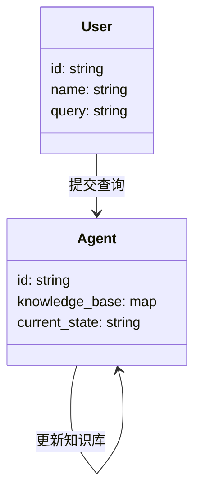
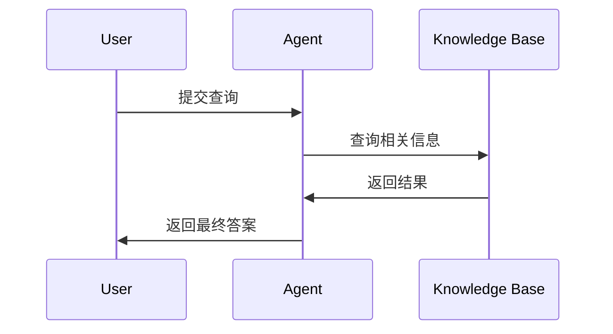

                 


# AI Agent的认知计算：模拟人类思维过程

> 关键词：AI Agent，认知计算，人工智能，思维模拟，推理机制，知识表示，深度学习

> 摘要：本文将详细探讨AI Agent的认知计算机制，从基本概念到复杂算法，再到实际应用，全面解析AI Agent如何模拟人类思维过程。通过深入分析认知模型、知识表示、推理机制等关键部分，结合实际案例和数学模型，帮助读者全面理解AI Agent的核心原理和应用。

---

# 第1章: AI Agent的基本概念与背景

## 1.1 AI Agent的定义与特点

### 1.1.1 什么是AI Agent
AI Agent（人工智能代理）是指能够感知环境、自主决策并采取行动的智能实体。与传统AI不同，AI Agent具备主动性、目标导向性和社会性，能够与人类或其他系统进行交互。

### 1.1.2 AI Agent的核心特点
- **主动性**：AI Agent能够主动采取行动，而不是被动响应。
- **目标导向性**：AI Agent的行为以实现特定目标为导向。
- **情境适应性**：能够根据环境变化调整行为。
- **交互性**：能够与人类或其他系统进行有效交互。

### 1.1.3 AI Agent与传统AI的区别
| 特性             | 传统AI                  | AI Agent              |
|------------------|------------------------|-----------------------|
| 行为方式         | 被动响应                | 主动行动               |
| 目标导向性       | 无明确目标              | 具有明确目标           |
| 环境适应性       | 有限适应性              | 高度适应性             |
| 交互能力         | 单向或简单交互          | 多维度复杂交互          |

## 1.2 认知计算的基本原理

### 1.2.1 认知计算的定义
认知计算是一种模拟人类认知过程的计算方法，旨在通过计算机实现类似人类的感知、推理、学习和决策能力。

### 1.2.2 AI Agent与认知计算的关系
AI Agent是认知计算的核心实现形式，通过模拟人类思维过程，AI Agent能够完成复杂任务。

### 1.2.3 认知计算的核心要素
- **感知**：通过多种模态（视觉、听觉、文本）获取信息。
- **推理**：基于知识库进行逻辑推理。
- **学习**：通过机器学习算法不断优化性能。
- **决策**：根据推理结果做出最优决策。

---

# 第2章: AI Agent的认知模型与知识表示

## 2.1 认知模型的构建

### 2.1.1 知识表示的基本方法
知识表示是认知模型的核心，常用的表示方法包括符号逻辑、知识图谱和语义网络。

### 2.1.2 知识图谱的构建与应用
知识图谱是一种以图结构表示知识的语义网络，广泛应用于搜索、推荐和问答系统。

### 2.1.3 语义网络的构建与分析
语义网络通过节点和边表示概念及其关系，帮助AI Agent理解语义信息。

## 2.2 推理机制的实现

### 2.2.1 基于符号逻辑的推理
符号逻辑推理通过形式化规则进行推理，适用于规则明确的任务。

### 2.2.2 基于概率的推理
概率推理考虑不确定性，适用于复杂且模糊的任务。

### 2.2.3 基于深度学习的推理
深度学习推理通过神经网络学习推理规则，适用于大规模数据任务。

---

# 第3章: AI Agent的感知与决策

## 3.1 多模态感知的实现

### 3.1.1 视觉感知的实现
通过计算机视觉技术，AI Agent能够识别图像和视频中的物体、场景。

### 3.1.2 听觉感知的实现
通过语音识别技术，AI Agent能够理解和识别语音指令。

### 3.1.3 文本理解与语义分析
通过自然语言处理技术，AI Agent能够理解文本的语义和意图。

## 3.2 决策机制的设计

### 3.2.1 基于规则的决策
通过预定义规则进行决策，适用于简单任务。

### 3.2.2 基于强化学习的决策
通过强化学习算法，AI Agent能够在复杂环境中做出最优决策。

### 3.2.3 基于模糊逻辑的决策
模糊逻辑适用于处理模糊性和不确定性较强的任务。

---

# 第4章: AI Agent的核心算法原理

## 4.1 强化学习算法

### 4.1.1 Q-learning算法
Q-learning是一种经典的强化学习算法，通过更新Q值表来学习最优策略。

### 4.1.2 Deep Q-Networks (DQN)算法
DQN算法结合深度学习和Q-learning，适用于高维状态空间的任务。

### 4.1.3 策略梯度算法
策略梯度算法通过优化策略直接进行参数更新，适用于连续动作空间的任务。

## 4.2 推理算法

### 4.2.1 基于符号逻辑的推理算法
通过符号逻辑规则进行推理，适用于规则明确的任务。

### 4.2.2 基于概率图模型的推理算法
通过概率图模型（如贝叶斯网络）进行推理，适用于不确定性较强的任务。

### 4.2.3 基于神经网络的推理算法
通过深度学习模型进行推理，适用于大规模数据任务。

---

# 第5章: 数学模型与公式解析

## 5.1 强化学习的数学模型

### 5.1.1 Q-learning的数学模型
$$ Q(s, a) = Q(s, a) + \alpha \left( r + \gamma \max_{a'} Q(s', a') - Q(s, a) \right) $$

其中：
- \( Q(s, a) \)：当前状态下动作 \( a \) 的价值
- \( \alpha \)：学习率
- \( r \)：奖励
- \( \gamma \)：折扣因子
- \( s' \)：下一状态

---

# 第6章: AI Agent的系统分析与架构设计

## 6.1 问题场景介绍
设计一个AI Agent用于智能客服系统，帮助用户解决常见问题。

## 6.2 系统功能设计

### 6.2.1 领域模型设计


### 6.2.2 系统架构设计


### 6.2.3 系统接口设计
- 用户通过API提交查询请求。
- 推理引擎调用知识库进行推理并返回结果。

### 6.2.4 系统交互流程


---

# 第7章: AI Agent的项目实战

## 7.1 环境安装
安装必要的库，如TensorFlow、Keras、NLTK。

## 7.2 核心代码实现

### 7.2.1 知识库构建
```python
from tensorflow.keras import layers

class SimpleAgent:
    def __init__(self):
        self.knowledge_base = {}

    def addKnowledge(self, key, value):
        self.knowledge_base[key] = value

    def queryKnowledge(self, key):
        return self.knowledge_base.get(key, "未知")
```

### 7.2.2 推理引擎实现
```python
import tensorflow as tf
from tensorflow.keras import layers

class DQNAgent:
    def __init__(self, state_space, action_space):
        self.model = self.build_model(state_space, action_space)

    def build_model(self, state_space, action_space):
        model = tf.keras.Sequential()
        model.add(layers.Dense(64, activation='relu', input_dim=state_space))
        model.add(layers.Dense(action_space))
        model.compile(optimizer='adam', loss='mse')
        return model
```

## 7.3 案例分析与总结
通过实际案例展示AI Agent在智能客服系统中的应用，分析其优缺点，并总结经验。

---

# 第8章: AI Agent的认知计算最佳实践

## 8.1 小结
本文全面介绍了AI Agent的认知计算机制，从基本概念到复杂算法，再到实际应用。

## 8.2 注意事项
- 数据质量和多样性直接影响性能。
- 模型复杂度与计算资源需求密切相关。
- 伦理和隐私问题需高度重视。

## 8.3 拓展阅读
推荐相关书籍和论文，供读者深入学习。

---

# 附录: 术语表

| 术语           | 解释                         |
|----------------|------------------------------|
| AI Agent       | 人工智能代理                 |
| 认知计算       | 模拟人类认知过程的计算方法     |
| 知识图谱       | 以图结构表示知识的语义网络     |
| 强化学习       | 通过奖励机制优化行为的算法     |

---

通过以上目录结构，本文将系统性地介绍AI Agent的认知计算机制，帮助读者全面理解其原理和应用。

