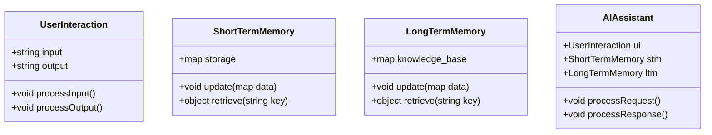
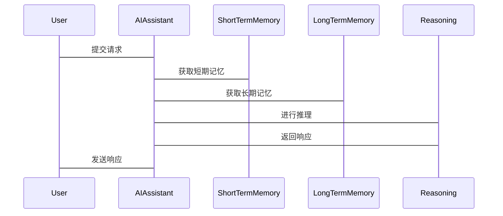

                 


# AI Agent的记忆机制：短期记忆与长期记忆的实现

> 关键词：AI Agent，记忆机制，短期记忆，长期记忆，神经网络，知识图谱

> 摘要：本文深入探讨了AI Agent的记忆机制，重点分析了短期记忆与长期记忆的实现原理及应用场景。通过结合理论与实践，详细讲解了记忆机制的核心概念、算法实现、系统架构设计以及项目实战案例，帮助读者全面理解并掌握AI Agent的记忆机制。

---

## 第1章: AI Agent的基本概念与记忆机制的必要性

### 1.1 AI Agent的定义与特点

AI Agent（智能体）是指能够感知环境、自主决策并执行任务的智能实体。它具备以下特点：

- **自主性**：能够在没有外部干预的情况下自主运行。
- **反应性**：能够实时感知环境并做出反应。
- **目标导向**：具备明确的目标，并通过行动实现这些目标。
- **学习能力**：能够通过经验改进自身的性能。

AI Agent的应用场景广泛，包括智能助手、自动驾驶、机器人等。在这些应用中，记忆机制是AI Agent实现复杂任务的核心能力之一。

### 1.2 短期记忆与长期记忆的定义与区别

#### 1.2.1 短期记忆的定义与特征

短期记忆是指AI Agent在短时间内保留和处理信息的能力。其特征包括：

- **临时性**：信息保留时间较短，通常在几秒到几分钟之间。
- **高容量**：能够同时处理大量信息，但容量有限。
- **快速访问**：信息可以快速被访问和更新。

#### 1.2.2 长期记忆的定义与特征

长期记忆是指AI Agent长期存储和检索信息的能力。其特征包括：

- **持久性**：信息可以长期保留，甚至数年。
- **低容量**：存储容量相对较低，但信息可以被压缩和结构化。
- **慢速访问**：信息检索需要较长时间，但可以通过索引优化。

#### 1.2.3 短期记忆与长期记忆的区别与联系

表1：短期记忆与长期记忆的对比

| 特性       | 短期记忆                | 长期记忆                |
|------------|-------------------------|-------------------------|
| 存储时间     | 几秒到几分钟            | 数天到数年              |
| 存储容量     | 高容量，有限            | 低容量，但结构化        |
| 访问速度     | 快速                    | 较慢，但可以通过索引优化 |
| 数据类型     | 多样，包括感知数据      | 结构化，包括知识图谱等   |

### 1.3 AI Agent记忆机制的应用场景

#### 1.3.1 短期记忆的应用场景

短期记忆主要用于处理实时任务，例如：

- **对话系统**：在与用户交互时，短期记忆用于保留当前对话的上下文信息。
- **实时监控**：在实时监控系统中，短期记忆用于存储最新的传感器数据。

#### 1.3.2 长期记忆的应用场景

长期记忆主要用于需要长期知识的任务，例如：

- **知识问答系统**：长期记忆用于存储丰富的知识库，如维基百科的内容。
- **专家系统**：长期记忆用于存储专家的知识和经验。

#### 1.3.3 综合应用的案例分析

例如，在智能客服系统中，短期记忆用于处理当前用户的对话，而长期记忆用于存储用户的历史记录和知识库。这种结合使得智能客服能够提供更智能、更个性化的服务。

### 1.4 本章小结

本章介绍了AI Agent的基本概念及其记忆机制的必要性，分析了短期记忆和长期记忆的区别与联系，并通过实际案例展示了它们的应用场景。理解这些内容是进一步分析记忆机制实现的基础。

---

## 第2章: 短期记忆的实现原理

### 2.1 短期记忆的存储机制

短期记忆的存储机制通常基于神经网络模型，例如LSTM（长短期记忆网络）。LSTM通过门控机制来控制信息的流入和流出，从而实现短期记忆的存储。

#### 2.1.1 短期记忆的存储模型

LSTM的结构包括输入门、遗忘门和输出门。输入门控制新信息的输入，遗忘门控制旧信息的遗忘，输出门控制信息的输出。这种结构使得LSTM能够在短期内有效存储和处理信息。

### 2.2 短期记忆的更新与清除机制

短期记忆的更新和清除机制通过门控机制实现。当新的信息输入时，输入门打开，允许新信息进入存储单元。当旧信息不再需要时，遗忘门打开，清除旧信息。

#### 2.2.1 短期记忆的更新规则

更新规则可以通过以下公式表示：

$$
f_t = \sigma(W_f \cdot [h_{t-1}, x_t] + b_f)
$$

$$
i_t = \sigma(W_i \cdot [h_{t-1}, x_t] + b_i)
$$

$$
o_t = \sigma(W_o \cdot [h_{t-1}, x_t] + b_o)
$$

$$
h_t = f_t \cdot h_{t-1} + i_t \cdot tanh(W_c \cdot [h_{t-1}, x_t] + b_c)
$$

其中，$f_t$是遗忘门，$i_t$是输入门，$o_t$是输出门，$h_t$是当前状态。

#### 2.2.2 短期记忆的清除条件

短期记忆的清除通常基于时间戳或任务需求。例如，在对话系统中，当对话结束时，短期记忆会被清除。

### 2.3 短期记忆的实现算法

#### 2.3.1 基于LSTM的短期记忆网络

LSTM是一种常用的短期记忆实现方法。以下是LSTM的Python代码示例：

```python
import numpy as np

class LSTMCell:
    def __init__(self, input_size, hidden_size):
        self.W_f = np.random.randn(input_size + hidden_size, hidden_size)
        self.b_f = np.zeros(hidden_size)
        self.W_i = np.random.randn(input_size + hidden_size, hidden_size)
        self.b_i = np.zeros(hidden_size)
        self.W_o = np.random.randn(input_size + hidden_size, hidden_size)
        self.b_o = np.zeros(hidden_size)
        self.W_c = np.random.randn(input_size + hidden_size, hidden_size)
        self.b_c = np.zeros(hidden_size)

    def forward(self, x, h_prev, c_prev):
        input_gate = np.dot(np.concatenate([h_prev, x], axis=1), self.W_i) + self.b_i
        input_gate = np.sigmoid(input_gate)

        forget_gate = np.dot(np.concatenate([h_prev, x], axis=1), self.W_f) + self.b_f
        forget_gate = np.sigmoid(forget_gate)

        output_gate = np.dot(np.concatenate([h_prev, x], axis=1), self.W_o) + self.b_o
        output_gate = np.sigmoid(output_gate)

        cell_state = forget_gate * c_prev + input_gate * np.tanh(np.dot(np.concatenate([h_prev, x], axis=1), self.W_c) + self.b_c)
        h_current = output_gate * np.tanh(cell_state)

        return h_current, cell_state

    def backward(self, d_h, d_c, x, h_prev, c_prev):
        # 实现反向传播，计算梯度
        pass

# 示例用法
input_size = 10
hidden_size = 5
cell = LSTMCell(input_size, hidden_size)
x = np.random.randn(1, input_size)
h_prev = np.random.randn(1, hidden_size)
c_prev = np.random.randn(1, hidden_size)
h_current, c_current = cell.forward(x, h_prev, c_prev)
```

#### 2.3.2 短期记忆的注意力机制

注意力机制是一种用于处理序列数据的方法，能够帮助模型聚焦于重要的信息。以下是注意力机制的公式表示：

$$
\alpha_i = \frac{e_i}{\sum_{j=1}^n e_j}
$$

$$
e_i = \text{score}(q, k_i)
$$

其中，$\alpha_i$是注意力权重，$e_i$是注意力评分，$q$是查询，$k_i$是键。

### 2.4 本章小结

本章详细讲解了短期记忆的实现原理，包括存储机制、更新与清除机制以及具体的算法实现。通过LSTM和注意力机制的例子，展示了如何在实际应用中实现短期记忆。

---

## 第3章: 长期记忆的实现原理

### 3.1 长期记忆的存储机制

长期记忆的存储机制通常基于知识图谱和神经网络。知识图谱是一种结构化的知识表示方式，能够有效地存储和检索长期信息。

#### 3.1.1 长期记忆的存储模型

知识图谱由节点和边组成，节点表示实体，边表示实体之间的关系。例如，知识图谱可以表示为：

$$
\text{实体}(e) \text{与} \text{实体}(e') \text{有关系}(r)
$$

#### 3.1.2 长期记忆的存储容量与时间限制

长期记忆的存储容量相对较小，但信息可以被结构化和压缩。例如，通过将知识图谱中的实体和关系进行编码，可以有效地减少存储空间。

### 3.2 长期记忆的检索与更新机制

长期记忆的检索与更新机制基于知识图谱的查询和更新。检索过程通常涉及模式匹配和推理，而更新过程则需要验证信息的准确性和一致性。

#### 3.2.1 长期记忆的检索规则

检索规则可以通过以下步骤实现：

1. **查询解析**：将用户的查询转换为知识图谱中的查询语言。
2. **模式匹配**：在知识图谱中匹配与查询相关的实体和关系。
3. **推理与验证**：通过推理验证匹配结果的准确性。

#### 3.2.2 长期记忆的更新策略

更新策略通常基于信任传播和一致性检查。例如，在更新知识图谱时，需要验证新信息是否与现有信息一致，并通过信任传播确定信息的可靠性。

### 3.3 长期记忆的实现算法

#### 3.3.1 基于知识图谱的长期记忆构建

知识图谱的构建通常包括数据抽取、实体识别和关系抽取等步骤。以下是知识图谱构建的示例代码：

```python
from kgkg import KnowledgeGraph

kg = KnowledgeGraph()
kg.add_entity("Person", "Alice", ["age", 30])
kg.add_entity("Person", "Bob", ["age", 25])
kg.add_relation("Person", "knows", "Person", "Alice", "Bob")
```

#### 3.3.2 长期记忆的神经网络模型

长期记忆的神经网络模型通常基于图神经网络。以下是图神经网络的示例代码：

```python
import tensorflow as tf
from tensorflow.keras import layers

class Graph Neural Network:
    def __init__(self, input_dim, hidden_dim):
        self.W = tf.keras.layers.Dense(hidden_dim, input_dim)
        self.U = tf.keras.layers.Dense(hidden_dim, hidden_dim)

    def call(self, inputs):
        h = tf.nn.relu(self.W(inputs))
        output = tf.nn.relu(self.U(h))
        return output

model = GraphNeuralNetwork(10, 5)
input = tf.constant([[1.0]*10])
output = model(input)
```

### 3.4 本章小结

本章详细讲解了长期记忆的实现原理，包括存储机制、检索与更新机制以及具体的算法实现。通过知识图谱和神经网络的例子，展示了如何在实际应用中实现长期记忆。

---

## 第4章: 短期记忆与长期记忆的结合与优化

### 4.1 短期记忆与长期记忆的结合方式

短期记忆和长期记忆的结合可以通过以下方式实现：

- **层次化存储**：短期记忆存储在上层，长期记忆存储在下层。
- **联合推理**：结合短期记忆和长期记忆进行推理。
- **动态调整**：根据任务需求动态调整短期记忆和长期记忆的比例。

### 4.2 短期记忆与长期记忆的优化策略

优化策略包括：

- **记忆强化**：通过强化学习优化记忆的存储和检索。
- **记忆遗忘**：通过遗忘门控制记忆的保留和遗忘。
- **记忆压缩**：通过压缩算法减少记忆的存储空间。

### 4.3 短期记忆与长期记忆的协同优化

协同优化可以通过以下步骤实现：

1. **任务需求分析**：分析任务需求，确定短期记忆和长期记忆的比例。
2. **记忆管理**：通过记忆管理模块动态调整短期记忆和长期记忆的容量。
3. **优化评估**：通过评估指标优化记忆的存储和检索效率。

### 4.4 本章小结

本章探讨了短期记忆与长期记忆的结合与优化策略，分析了如何通过层次化存储、联合推理和动态调整等方法实现记忆机制的优化。

---

## 第5章: 项目实战：基于记忆机制的智能助手开发

### 5.1 项目背景与目标

项目背景：随着AI技术的发展，智能助手的需求日益增长。为了提高智能助手的智能化水平，需要实现记忆机制。

项目目标：开发一个基于记忆机制的智能助手，实现短期记忆和长期记忆的结合与优化。

### 5.2 项目需求分析

项目需求包括：

- **用户交互**：支持多轮对话，保留对话上下文。
- **知识存储**：存储用户的历史记录和知识库。
- **推理与响应**：基于记忆进行推理并生成响应。

### 5.3 项目实现

#### 5.3.1 系统设计

##### 5.3.1.1 领域模型

领域模型是智能助手的核心模块，包括用户交互模块、短期记忆模块和长期记忆模块。以下是领域模型的Mermaid类图：



##### 5.3.1.2 系统架构

系统架构采用分层设计，包括前端、后端和数据库。以下是系统架构的Mermaid图：


##### 5.3.1.3 接口设计

接口设计包括：

- **用户输入接口**：接收用户的输入并传递给短期记忆模块。
- **知识库接口**：与长期记忆模块交互，检索知识库中的信息。
- **推理接口**：基于短期记忆和长期记忆进行推理并生成响应。

##### 5.3.1.4 交互流程

以下是交互流程的Mermaid序列图：



#### 5.3.2 代码实现

##### 5.3.2.1 短期记忆模块

短期记忆模块基于LSTM实现。以下是短期记忆模块的代码：

```python
class ShortTermMemory:
    def __init__(self):
        self.cell = LSTMCell(10, 5)

    def update(self, input):
        h_current, c_current = self.cell.forward(input, self.h_prev, self.c_prev)
        self.h_prev = h_current
        self.c_prev = c_current

    def retrieve(self, key):
        # 实现检索逻辑
        pass
```

##### 5.3.2.2 长期记忆模块

长期记忆模块基于知识图谱实现。以下是长期记忆模块的代码：

```python
class LongTermMemory:
    def __init__(self):
        self.kg = KnowledgeGraph()

    def update(self, data):
        self.kg.add_entity(data)

    def retrieve(self, key):
        return self.kg.lookup(key)
```

##### 5.3.2.3 推理模块

推理模块基于图神经网络实现。以下是推理模块的代码：

```python
class ReasoningModule:
    def __init__(self):
        self.gnn = GraphNeuralNetwork(10, 5)

    def infer(self, input):
        return self.gnn.call(input)
```

#### 5.3.3 系统实现

以下是智能助手的主程序代码：

```python
class AIAssistant:
    def __init__(self):
        self.stm = ShortTermMemory()
        self.ltm = LongTermMemory()
        self.reasoning = ReasoningModule()

    def processRequest(self, input):
        self.stm.update(input)
        self.ltm.update(input)
        response = self.reasoning.infer(input)
        return response

    def processResponse(self, response):
        # 实现响应处理逻辑
        pass
```

### 5.4 项目测试与优化

项目测试包括单元测试和集成测试。优化方向包括算法优化和性能优化。

#### 5.4.1 测试

测试步骤包括：

1. **单元测试**：测试短期记忆和长期记忆模块的功能。
2. **集成测试**：测试智能助手的整体功能。

#### 5.4.2 优化

优化方向包括：

- **算法优化**：改进LSTM和图神经网络的性能。
- **性能优化**：优化知识图谱的存储和检索效率。

### 5.5 项目总结

通过本项目，我们实现了基于记忆机制的智能助手，验证了短期记忆和长期记忆结合的有效性。同时，我们也积累了一定的经验，为后续的研究提供了参考。

---

## 第6章: 总结与展望

### 6.1 本章总结

本文深入探讨了AI Agent的记忆机制，重点分析了短期记忆和长期记忆的实现原理及应用场景。通过结合理论与实践，详细讲解了记忆机制的核心概念、算法实现、系统架构设计以及项目实战案例。

### 6.2 未来展望

未来的研究方向包括：

- **更高效的存储机制**：研究更高效的存储算法，提高记忆机制的存储效率。
- **更智能的检索算法**：研究更智能的检索算法，提高记忆机制的检索效率。
- **更人性化的记忆管理**：研究更人性化的记忆管理方法，提高用户体验。

### 6.3 注意事项

在实际应用中，需要注意以下几点：

- **数据隐私**：确保记忆机制的数据隐私和安全性。
- **数据质量**：确保记忆机制的数据质量和准确性。
- **系统稳定性**：确保记忆机制的系统稳定性和可靠性。

### 6.4 拓展阅读

推荐以下拓展阅读资料：

1. **LSTM论文**：Hochreiter, S., & Schmidhuber, J. (1997). Long short-term memory.
2. **知识图谱论文**：Bizer, F., & Auer, S. (2007). Linked data: Tensions and directions.

---

## 附录: 全部代码示例

### 附录A: LSTMCell类

```python
class LSTMCell:
    def __init__(self, input_size, hidden_size):
        self.W_f = np.random.randn(input_size + hidden_size, hidden_size)
        self.b_f = np.zeros(hidden_size)
        self.W_i = np.random.randn(input_size + hidden_size, hidden_size)
        self.b_i = np.zeros(hidden_size)
        self.W_o = np.random.randn(input_size + hidden_size, hidden_size)
        self.b_o = np.zeros(hidden_size)
        self.W_c = np.random.randn(input_size + hidden_size, hidden_size)
        self.b_c = np.zeros(hidden_size)

    def forward(self, x, h_prev, c_prev):
        input_gate = np.dot(np.concatenate([h_prev, x], axis=1), self.W_i) + self.b_i
        input_gate = np.sigmoid(input_gate)

        forget_gate = np.dot(np.concatenate([h_prev, x], axis=1), self.W_f) + self.b_f
        forget_gate = np.sigmoid(forget_gate)

        output_gate = np.dot(np.concatenate([h_prev, x], axis=1), self.W_o) + self.b_o
        output_gate = np.sigmoid(output_gate)

        cell_state = forget_gate * c_prev + input_gate * np.tanh(np.dot(np.concatenate([h_prev, x], axis=1), self.W_c) + self.b_c)
        h_current = output_gate * np.tanh(cell_state)

        return h_current, cell_state
```

### 附录B: 知识图谱构建类

```python
class KnowledgeGraph:
    def __init__(self):
        self.entities = {}
        self.relations = {}

    def add_entity(self, entity_type, entity_name, attributes):
        if entity_type not in self.entities:
            self.entities[entity_type] = {}
        self.entities[entity_type][entity_name] = attributes

    def add_relation(self, entity_type, relation, source, target):
        if entity_type not in self.relations:
            self.relations[entity_type] = {}
        self.relations[entity_type][relation] = (source, target)
```

### 附录C: 图神经网络类

```python
class GraphNeuralNetwork:
    def __init__(self, input_dim, hidden_dim):
        self.W = tf.keras.layers.Dense(hidden_dim, input_dim)
        self.U = tf.keras.layers.Dense(hidden_dim, hidden_dim)

    def call(self, inputs):
        h = tf.nn.relu(self.W(inputs))
        output = tf.nn.relu(self.U(h))
        return output
```

---

# 结语

本文通过详细分析AI Agent的记忆机制，结合短期记忆和长期记忆的实现原理和应用场景，为读者提供了全面的知识和实践指导。希望本文能够帮助读者更好地理解和掌握AI Agent的记忆机制，并在实际应用中取得更好的效果。

