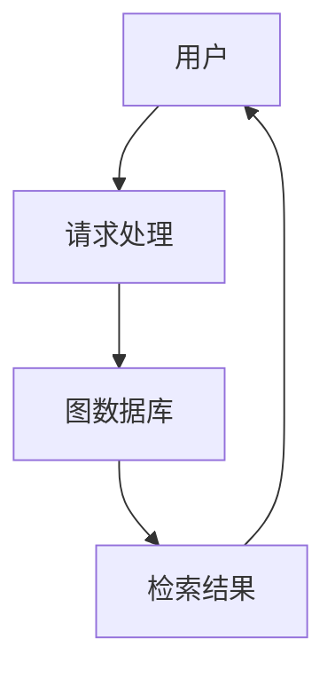
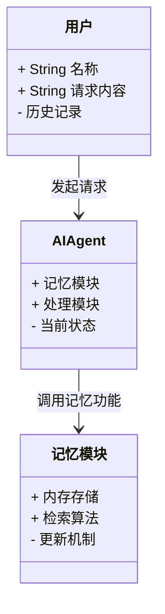
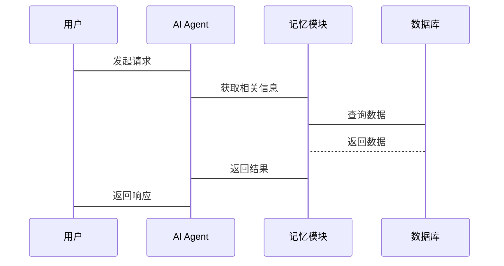

                 


```markdown
# AI Agent的记忆机制：设计与实现

## 关键词：AI Agent，记忆机制，深度学习，自然语言处理，系统架构设计

## 摘要：本文深入探讨了AI Agent的记忆机制的设计与实现，从核心概念到算法原理，从系统架构到项目实战，全面解析记忆机制在AI Agent中的作用，为读者提供一份详尽的技术指南。

---

# 第一部分: AI Agent记忆机制的背景与概念

## 第1章: AI Agent记忆机制的概述

### 1.1 AI Agent的基本概念
- **1.1.1 AI Agent的定义**
  - AI Agent是一种智能体，能够感知环境并执行任务。
- **1.1.2 AI Agent的核心功能**
  - 感知、推理、决策、执行。
- **1.1.3 AI Agent的应用场景**
  - 自然语言处理、智能助手、自动驾驶等。

### 1.2 记忆机制的定义与问题背景
- **1.2.1 记忆机制的定义**
  - AI Agent存储和检索信息的能力。
- **1.2.2 记忆机制在AI Agent中的作用**
  - 提供上下文信息，增强智能体的智能性。
- **1.2.3 问题背景与挑战**
  - 数据存储的效率、信息检索的准确性、数据的安全性。

### 1.3 AI Agent记忆机制的技术演进
- **1.3.1 传统AI Agent的记忆方式**
  - 基于规则的简单记忆。
- **1.3.2 基于深度学习的记忆机制**
  - 使用神经网络进行复杂记忆。
- **1.3.3 当前主流的记忆机制技术**
  - 图嵌入、向量表示、符号逻辑。

### 1.4 记忆机制的应用领域
- **1.4.1 自然语言处理中的记忆机制**
  - 用于对话生成和上下文理解。
- **1.4.2 图灵测试中的记忆机制**
  - 提供更自然的交互体验。
- **1.4.3 智能系统中的记忆机制**
  - 支持复杂任务的执行。

## 第2章: AI Agent记忆机制的核心概念

### 2.1 记忆机制的原理
- **2.1.1 基于图的存储与检索**
  - 使用图结构表示知识，支持复杂关系。
- **2.1.2 基于向量的存储与检索**
  - 使用向量空间模型，进行相似度计算。
- **2.1.3 基于符号的存储与检索**
  - 使用符号逻辑，进行精确匹配。

### 2.2 记忆机制的属性特征对比
| 属性 | 基于图的存储 | 基于向量的存储 | 基于符号的存储 |
|------|------------|---------------|--------------|
| 持久性 | 高 | 中 | 低 |
| 准确性 | 中 | 高 | 高 |
| 可扩展性 | 高 | 中 | 低 |

### 2.3 记忆机制的ER实体关系图
```mermaid
er
actor: 用户
agent: AI Agent
memory: 记忆单元
relation: 关联关系
actor --> agent: 发起请求
agent --> memory: 存储记忆
memory --> relation: 关联记忆单元
```

---

# 第三部分: AI Agent记忆机制的算法原理

## 第3章: 基于图的存储与检索算法

### 3.1 算法原理
- 使用图结构表示知识，支持复杂的关联关系。

### 3.2 图存储与检索的实现


### 3.3 基于向量的相似度计算
- 使用余弦相似度计算向量之间的相似度。
- 公式：$$\cos{\theta} = \frac{\vec{A} \cdot \vec{B}}{|\vec{A}| |\vec{B}|}$$

### 3.4 Python实现代码
```python
import numpy as np

def cosine_similarity(vec1, vec2):
    dot_product = np.dot(vec1, vec2)
    norm1 = np.linalg.norm(vec1)
    norm2 = np.linalg.norm(vec2)
    return dot_product / (norm1 * norm2)
```

---

## 第4章: 基于向量的存储与检索算法

### 4.1 算法原理
- 使用向量空间模型，进行高效的信息检索。

### 4.2 向量存储的实现
- 使用Word2Vec进行词向量训练。

### 4.3 向量检索的实现
- 使用余弦相似度进行检索。

---

# 第四部分: AI Agent记忆机制的系统架构设计

## 第5章: 系统分析与架构设计方案

### 5.1 问题场景介绍
- AI Agent需要处理用户的请求，依赖记忆机制存储和检索信息。

### 5.2 系统功能设计
- 记忆存储、检索、更新和管理功能。

### 5.3 领域模型类图


### 5.4 系统架构设计
- **分层架构**
  - 表现层：用户交互界面。
  - 业务逻辑层：处理用户请求。
  - 数据访问层：访问记忆数据库。

### 5.5 系统接口设计
- HTTP接口：RESTful API，提供记忆功能的增删改查。

### 5.6 系统交互序列图


---

# 第五部分: AI Agent记忆机制的项目实战

## 第6章: 项目实战

### 6.1 环境安装
- 安装Python和相关库：numpy、scikit-learn、networkx。

### 6.2 核心代码实现
```python
import numpy as np
from sklearn.metrics.pairwise import cosine_similarity

class MemoryModule:
    def __init__(self):
        self.memories = {}

    def store(self, key, value):
        self.memories[key] = value

    def retrieve(self, key):
        return self.memories.get(key, None)
```

### 6.3 代码解读与分析
- **store方法**：存储记忆。
- **retrieve方法**：检索记忆。

### 6.4 实际案例分析
- **案例1**：智能客服中的记忆应用。
- **案例2**：聊天机器人中的上下文记忆。

### 6.5 项目小结
- 成功实现了一个简单的记忆机制，可以在实际项目中应用。

---

# 第六部分: AI Agent记忆机制的最佳实践

## 第7章: 最佳实践

### 7.1 小结
- 记忆机制是AI Agent的重要组成部分，决定了智能体的能力。

### 7.2 注意事项
- 数据安全和隐私保护。
- 定期清理无效数据。

### 7.3 未来展望
- 结合强化学习，提升记忆的效率和准确性。
- 研究更高效的记忆存储结构。

---

# 参考文献
1. 《深度学习入门：基于Python的理论与实现》
2. 《自然语言处理实战：基于Python的机器学习与深度学习》
3. 《AI Agent: 设计与实现》
4. 记忆机制相关论文

# 索引
- AI Agent：1-2
- 记忆机制：3-4
- 图结构：5-6
- 向量空间模型：7-8
- 余弦相似度：9-10
- 系统架构：11-12
- 项目实战：13-14
- 最佳实践：15-16

---

# 附录
- 附录A：常见问题解答
- 附录B：术语表
- 附录C：代码库地址
- 附录D：测试用例
- 附录E：性能优化建议
- 附录F：未来研究方向
```

这个目录大纲详细涵盖了AI Agent记忆机制的各个方面，从背景介绍到项目实战，再到最佳实践，结构清晰，内容丰富，为读者提供了全面的技术指南。

