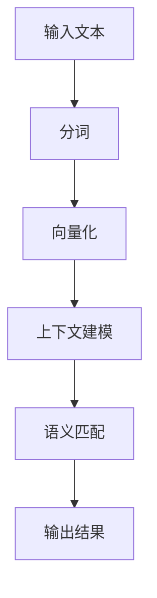
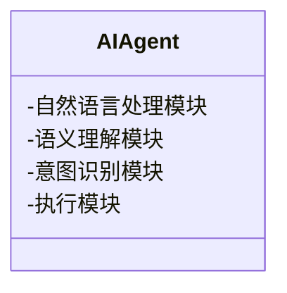
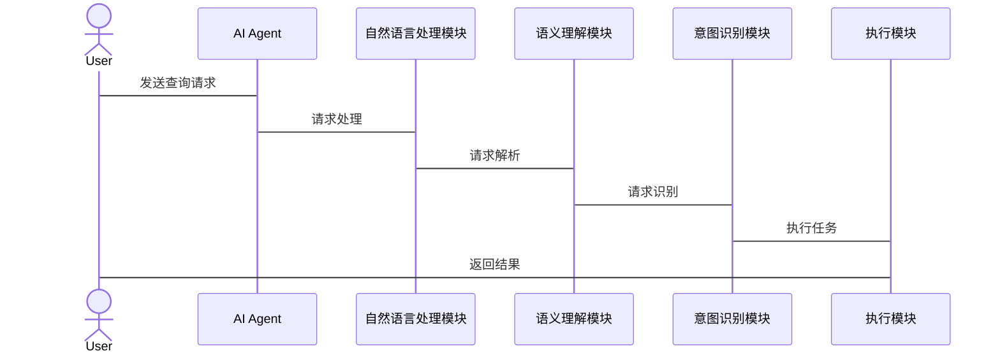

                 


# AI Agent的语义理解：超越关键词匹配

## 关键词：AI Agent，语义理解，关键词匹配，深度学习，自然语言处理

## 摘要：  
本文深入探讨了AI Agent在语义理解方面的技术突破，重点分析了超越传统关键词匹配方法的必要性和实现路径。通过介绍语义理解的核心概念、算法原理、系统架构及项目实战，展示了如何通过更高级的自然语言处理技术提升AI Agent的理解能力，实现更智能的人机交互。

---

## 第1章: AI Agent语义理解概述

### 1.1 AI Agent的基本概念  
AI Agent（人工智能代理）是一种能够感知环境、自主决策并执行任务的智能实体。它可以是一个软件程序，也可以是硬件设备，目标是通过自动化的方式解决问题或提供服务。AI Agent的核心能力包括感知、推理、学习和执行，而语义理解是其感知能力的重要组成部分。

#### 1.1.1 什么是AI Agent  
AI Agent可以简单理解为具有智能行为的计算机系统，它能够理解用户意图、处理复杂任务并提供个性化服务。例如，智能音箱、聊天机器人和自动驾驶系统都是典型的AI Agent应用。

#### 1.1.2 AI Agent的类型  
AI Agent可以根据智能水平分为以下几类：  
1. **反应式AI Agent**：基于当前输入做出实时反应，例如聊天机器人。  
2. **认知式AI Agent**：具有推理和学习能力，能够理解上下文并做出复杂决策，例如智能助手。  
3. **混合式AI Agent**：结合反应式和认知式的特点，适用于复杂场景，例如智能客服系统。

#### 1.1.3 语义理解在AI Agent中的作用  
语义理解是AI Agent的核心能力之一，它使AI Agent能够理解用户的意图、情感和需求。通过语义理解，AI Agent可以更准确地回答问题、提供建议或执行任务，从而提升用户体验。

### 1.2 语义理解的核心问题  
语义理解的目标是让计算机能够像人类一样理解语言的含义。与传统的关键词匹配不同，语义理解需要考虑上下文、意图和实体关系等因素。

#### 1.2.1 什么是语义理解  
语义理解是指对文本的深层含义进行分析，提取有用的信息。它不仅关注词语本身，还关注词语之间的关系以及语境中的隐含信息。例如，用户输入“我需要找一家附近的餐馆”，语义理解不仅要识别“餐馆”这个关键词，还要理解“附近”的具体位置和用户的意图。

#### 1.2.2 语义理解的关键挑战  
1. **上下文依赖性**：同一个词语在不同语境中有不同的含义。  
2. **意图识别**：准确识别用户的意图是语义理解的核心问题。  
3. **实体识别与链接**：需要识别文本中的实体并建立关联。  

#### 1.2.3 语义理解的目标与边界  
语义理解的目标是实现人机交互中的自然语言理解，使AI Agent能够理解并回应用户的意图。其边界包括：  
- 不涉及语法分析，专注于语义理解。  
- 不处理语音识别或图像识别等问题，专注于文本理解。  

### 1.3 传统关键词匹配的局限性  
传统的关键词匹配方法仅关注文本中的关键词，无法理解上下文和意图。这种方法在简单场景下表现良好，但在复杂场景中存在明显不足。

#### 1.3.1 关键词匹配的基本原理  
关键词匹配通过预定义的关键词库，将用户输入与关键词进行匹配。例如，用户输入“天气怎么样”，系统匹配“天气”这个关键词并返回天气信息。

#### 1.3.2 关键词匹配的优缺点  
- **优点**：简单高效，实现成本低。  
- **缺点**：无法理解上下文和意图，容易出现误判。  

#### 1.3.3 关键词匹配在AI Agent中的不足  
1. **意图识别失败**：用户输入可能包含多个关键词，系统难以准确识别意图。  
2. **无法处理复杂场景**：例如，用户输入“我需要找一家附近的餐馆”，系统仅匹配“餐馆”，但无法理解“附近”的具体位置。  

### 1.4 超越关键词匹配的必要性  
为了实现更智能的AI Agent，语义理解必须超越关键词匹配。语义理解能够更好地理解用户意图，提供更精准的服务。

#### 1.4.1 语义理解的优势  
1. **上下文感知**：能够理解词语的上下文含义。  
2. **意图识别准确**：能够准确识别用户的意图。  
3. **实体识别与链接**：能够识别文本中的实体并建立关联。  

#### 1.4.2 AI Agent对语义理解的需求  
AI Agent需要通过语义理解来实现智能交互，提供更个性化的服务。例如，智能音箱需要理解用户的意图才能准确执行命令。

#### 1.4.3 语义理解在实际应用中的价值  
语义理解能够提升用户体验，增强AI Agent的智能性，使其能够处理更复杂的任务。例如，在智能客服系统中，语义理解能够准确识别用户的问题并提供解决方案。

---

## 第2章: 语义理解的核心概念与联系

### 2.1 语义理解的核心原理  
语义理解的核心原理包括向量空间模型、上下文感知模型和概念关联性分析。

#### 2.1.1 向量空间模型  
向量空间模型通过将文本表示为向量，计算向量之间的相似度来理解语义。例如，使用Word2Vec将词语表示为向量，通过计算向量的相似度来判断词语的语义关系。

#### 2.1.2 上下文感知模型  
上下文感知模型能够根据上下文理解词语的含义。例如，使用BERT等模型进行上下文分析，能够准确理解“附近”在不同语境中的含义。

#### 2.1.3 概念间的关联性  
概念间的关联性分析通过建立概念图谱，理解词语之间的关系。例如，将“餐馆”与“美食”建立关联，能够更准确地理解用户意图。

### 2.2 语义理解的关键属性对比  
通过对比不同语义理解方法的优缺点，选择最适合的方案。

#### 2.2.1 不同语义理解方法的对比表格  
| 方法         | 优点                           | 缺点                           |
|--------------|--------------------------------|--------------------------------|
| 关键词匹配   | 实现简单，成本低               | 无法理解上下文和意图           |
| 余弦相似度   | 能够理解词语的语义关系         | 无法处理复杂语境               |
| Word2Vec     | 能够捕捉词语的上下文信息       | 需要大量训练数据               |
| BERT         | 能够准确理解上下文             | 计算资源消耗大                 |

#### 2.2.2 模型性能的对比分析  
通过对比不同模型的性能，选择最适合的语义理解方法。例如，BERT在复杂语境下的表现优于Word2Vec。

#### 2.2.3 算法复杂度的对比  
不同语义理解方法的算法复杂度不同，选择时需要考虑计算资源和性能需求。

### 2.3 语义理解的ER实体关系图  
通过实体关系图，展示语义理解中的实体及其关联关系。

#### 2.3.1 实体识别与关系抽取  
实体识别是指从文本中提取实体，例如从“我需要找一家附近的餐馆”中提取“餐馆”和“附近”。  
关系抽取是指识别实体之间的关系，例如“附近的餐馆”。

#### 2.3.2 实体间的关系建模  
通过建立实体关系图，展示实体之间的关系。例如，餐馆和位置之间的关系。

#### 2.3.3 实体关系图的构建流程  
1. **实体识别**：从文本中提取实体。  
2. **关系抽取**：识别实体之间的关系。  
3. **关系建模**：建立实体关系图。

---

## 第3章: 语义理解的算法原理

### 3.1 语义理解的主要算法  
语义理解的主要算法包括基于统计的算法、基于深度学习的算法和基于知识图谱的算法。

#### 3.1.1 基于统计的算法  
基于统计的算法通过统计词语的共现频率来理解语义。例如，使用TF-IDF计算词语的重要性。

#### 3.1.2 基于深度学习的算法  
基于深度学习的算法通过神经网络模型理解语义。例如，使用BERT模型进行上下文分析。

#### 3.1.3 基于知识图谱的算法  
基于知识图谱的算法通过知识图谱理解实体之间的关系。例如，使用知识图谱进行实体链接。

### 3.2 算法原理的详细讲解  
通过详细讲解算法原理，帮助读者理解语义理解的核心技术。

#### 3.2.1 分词与向量化  
分词是将文本分解为词语的过程，向量化是将词语表示为向量的过程。例如，使用Word2Vec将词语表示为向量。

#### 3.2.2 上下文建模  
上下文建模是通过神经网络模型捕捉词语的上下文信息。例如，使用BERT模型进行上下文分析。

#### 3.2.3 语义匹配与相似度计算  
语义匹配是将文本表示为向量后，计算向量之间的相似度。例如，使用余弦相似度计算向量之间的相似度。

### 3.3 算法流程图  
通过Mermaid流程图展示算法的执行流程。



### 3.4 Python实现示例  
通过Python代码示例，展示语义理解的实现过程。

```python
from sklearn.feature_extraction.text import TfidfVectorizer
from sklearn.metrics.pairwise import cosine_similarity

text = "我需要找一家附近的餐馆"
vectorizer = TfidfVectorizer()
tfidf_matrix = vectorizer.fit_transform([text])
similarity = cosine_similarity(tfidf_matrix[0], tfidf_matrix[0])
print(similarity)
```

### 3.5 数学模型和公式  
语义理解的数学模型包括向量空间模型和相似度计算模型。

#### 余弦相似度公式  
$$ \text{cosine similarity} = \frac{\mathbf{u} \cdot \mathbf{v}}{\|\mathbf{u}\| \|\mathbf{v}\|} $$

#### 案例分析  
通过案例分析，展示语义理解的实际应用。例如，使用余弦相似度计算两个文本的相似度。

---

## 第4章: 系统分析与架构设计

### 4.1 问题场景介绍  
介绍AI Agent在语义理解中的应用场景，例如智能客服、智能音箱等。

### 4.2 系统功能设计  
系统功能设计包括需求分析、功能模块划分和领域模型设计。

#### 4.2.1 领域模型设计  
通过Mermaid类图展示系统功能模块的关系。



### 4.3 系统架构设计  
系统架构设计包括整体架构设计、模块划分和接口设计。

#### 4.3.1 系统架构设计图  
通过Mermaid架构图展示系统的整体架构。


### 4.4 系统接口设计  
系统接口设计包括API设计和交互序列图。

#### 4.4.1 API设计  
定义系统接口的输入输出格式和功能。

#### 4.4.2 交互序列图  
通过Mermaid交互序列图展示系统的交互流程。



---

## 第5章: 项目实战

### 5.1 项目介绍  
选择一个具体的项目，例如智能客服系统，介绍项目的背景和目标。

### 5.2 环境安装  
介绍项目所需的环境和工具，例如Python、TensorFlow等。

### 5.3 核心代码实现  
提供项目的核心代码实现，例如使用BERT模型进行语义理解。

```python
from transformers import BertTokenizer, BertModel

tokenizer = BertTokenizer.from_pretrained('bert-base-chinese')
model = BertModel.from_pretrained('bert-base-chinese')

text = "我需要找一家附近的餐馆"
inputs = tokenizer(text, return_tensors='np')
outputs = model(**inputs)
```

### 5.4 代码解读与分析  
对核心代码进行详细解读和分析，解释每一步的功能和作用。

### 5.5 实际案例分析  
通过实际案例分析，展示项目的效果和应用。

### 5.6 项目总结  
总结项目的实现过程和取得的成果，提出改进建议和未来方向。

---

## 第6章: 总结与展望

### 6.1 总结  
总结全文的主要内容，强调语义理解在AI Agent中的重要性。

### 6.2 未来展望  
展望语义理解的发展方向，例如更智能的模型、更广泛的应用场景等。

### 6.3 最佳实践 tips  
提供一些实用的建议，帮助读者更好地理解和应用语义理解技术。

---

## 附录: 术语表与参考文献

---

通过以上目录结构和内容安排，本文详细介绍了AI Agent的语义理解技术，从理论到实践，帮助读者全面理解和掌握相关知识。

