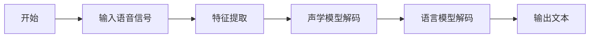
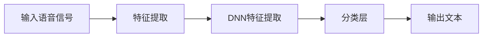
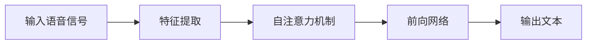
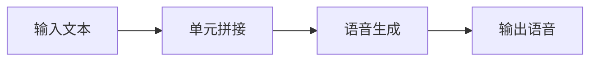
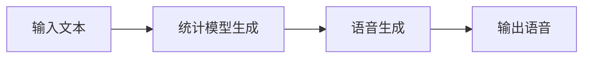
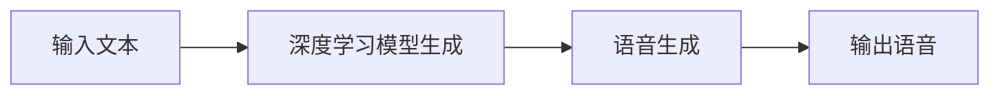
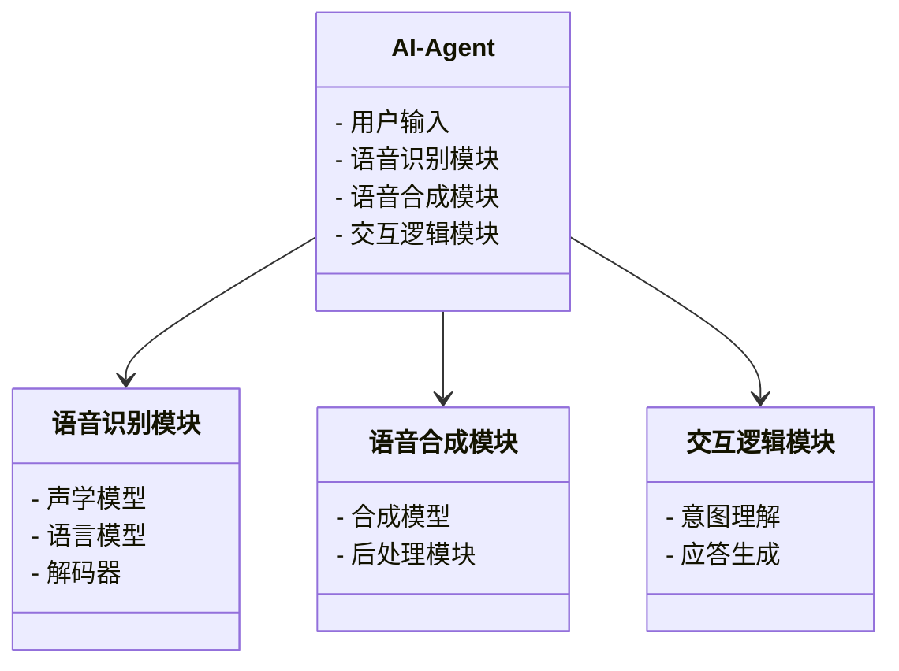
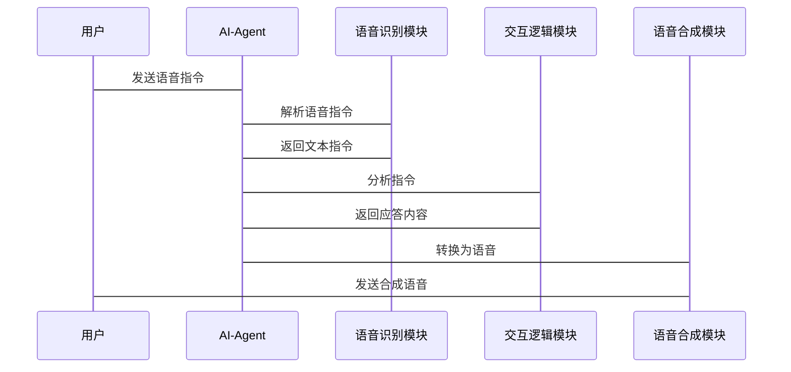

                 


# AI Agent的语音交互设计：语音识别与合成

## 关键词：AI Agent, 语音交互, 语音识别, 语音合成, 自然语言处理

## 摘要：本文详细探讨了AI Agent在语音交互中的设计与实现，重点分析了语音识别与合成的技术原理、算法优化及系统架构。通过结合实际案例，深入讲解了如何通过技术手段提升语音交互的准确性和自然度，为AI Agent的开发提供了实践指导。

---

# 第1章: 语音交互设计的背景与概念

## 1.1 语音交互的基本概念

### 1.1.1 语音交互的定义
语音交互是指通过语音信号进行信息传递和人机交互的过程。它结合了语音识别（ASR，Automatic Speech Recognition）和语音合成（TTS，Text-to-Speech）技术，使用户能够通过语音指令与AI Agent进行交互。

### 1.1.2 AI Agent与语音交互的关系
AI Agent（智能体）是一种能够感知环境并执行任务的实体。语音交互为AI Agent提供了自然的输入方式，使其能够更方便地与用户进行沟通和操作。

### 1.1.3 语音交互的核心要素
语音交互的核心要素包括：**语音信号处理**（信号采集、降噪、特征提取）、**语音识别**（将语音转换为文本）、**自然语言处理**（理解用户意图）、**语音合成**（将文本转换为语音）。

## 1.2 语音交互的发展历程

### 1.2.1 语音技术的历史演变
- **早期阶段**：基于模板匹配的语音识别技术，如DTW（Dynamic Time Warping）。
- **发展阶段**：引入统计模型，如HMM（隐马尔可夫模型）。
- **深度学习时代**：基于神经网络的语音识别技术，如CNN、RNN和Transformer架构。

### 1.2.2 AI技术对语音交互的推动
- **大数据驱动**：海量数据训练提升了语音模型的准确率。
- **端到端模型**：如DeepMind的Wavenet和Google的Fairseq，实现了端到端的语音生成。
- **多模态融合**：结合视觉、语言等多种模态信息，提升了语音交互的准确性和用户体验。

### 1.2.3 当前语音交互的主要应用场景
- **智能家居**：如智能音箱（Amazon Alexa、Google Home）。
- **移动应用**：如语音助手（Siri、小爱同学）。
- **智能客服**：通过语音交互实现自动应答和问题解决。

## 1.3 语音交互的分类与特点

### 1.3.1 语音识别的分类
| 类型 | 描述 | 优点 | 缺点 |
|------|------|------|------|
| 离线识别 | 无需网络支持，本地处理 | 响应速度快 | 依赖本地计算资源 |
| 在线识别 | 依赖网络服务，处理能力强 | 准确率高 | 响应速度依赖网络 |

### 1.3.2 语音合成的分类
| 类型 | 描述 | 优点 | 缺点 |
|------|------|------|------|
| 单元合成 | 基于预定义的语音片段拼接 | 实现简单 | 自然度低 |
| 统计合成 | 基于统计模型生成语音 | 自然度较高 | 实现复杂 |
| 端到端合成 | 基于深度学习模型直接生成语音 | 自然度高 | 训练成本高 |

### 1.3.3 语音交互的主要特点对比

| 特性 | 语音识别 | 语音合成 |
|------|----------|----------|
| 输入形式 | 音频信号 | 文本或指令 |
| 输出形式 | 文本或指令 | 音频信号 |
| 关键技术 | 声学模型、语言模型 | 合成模型、语音生成 |
| 应用场景 | 命令输入、语音搜索 | 朗读、语音反馈 |

## 1.4 本章小结
语音交互是AI Agent与用户进行自然沟通的重要方式。通过语音识别和语音合成技术，用户可以更方便地与AI Agent互动，提升用户体验。语音交互的发展经历了多个阶段，当前基于深度学习的语音识别和合成技术显著提升了交互的准确性和自然度。

---

# 第2章: 语音识别的原理与算法

## 2.1 语音识别的基本原理

### 2.1.1 声音信号的处理流程
1. **信号采集**：通过麦克风采集语音信号。
2. **预处理**：降噪、端点检测、特征提取。
3. **模型训练**：构建声学模型和语言模型。
4. **解码**：将语音信号转换为文本或指令。

### 2.1.2 声学模型的构建
声学模型负责将语音信号映射到音节或单词。常用模型包括：
- **HMM（隐马尔可夫模型）**：基于状态转移和观测概率。
- **DNN（深度神经网络）**：通过多层神经网络提取语音特征。
- **Transformer架构**：通过自注意力机制捕捉语音特征。

### 2.1.3 语言模型的作用
语言模型用于预测下一个词或句子的概率，常用模型包括：
- **N-gram模型**：基于短语的概率。
- **语言模型平滑技术**：如拉普拉斯平滑。
- **深度学习模型**：如LSTM和Transformer。

## 2.2 常见语音识别算法

### 2.2.1 隐马尔可夫模型（HMM）


HMM通过状态转移和观测概率进行语音识别，适用于小规模数据和简单任务。

### 2.2.2 深度神经网络（DNN）


DNN通过多层神经网络提取复杂的语音特征，适用于大规模数据和复杂任务。

### 2.2.3 Transformer架构


Transformer通过自注意力机制捕捉长距离依赖，提升语音识别的准确率。

## 2.3 语音识别的挑战与优化

### 2.3.1 噪声环境对语音识别的影响
- **噪声来源**：环境噪声、背景音乐、回声。
- **解决方案**：使用噪声抑制算法，如基于GMM的降噪。

### 2.3.2 多语种语音识别的难点
- **多语种数据稀疏性**：小语种数据不足，影响模型训练。
- **跨语言迁移学习**：利用多语种模型提升小语种识别性能。

### 2.3.3 端到端语音识别的优化策略
- **CTC损失函数**：直接将语音信号映射到字符。
- **连接式注意力机制**：提升模型的全局上下文理解能力。

## 2.4 本章小结
语音识别的核心在于构建准确的声学模型和语言模型。通过引入深度学习技术，特别是Transformer架构，语音识别的准确率和鲁棒性得到了显著提升。然而，噪声环境和多语种识别仍然是当前研究的难点。

---

# 第3章: 语音合成的原理与算法

## 3.1 语音合成的基本原理

### 3.1.1 语音信号的生成过程
1. **文本分析**：将输入文本分割为词、短语和句子。
2. **语音生成**：基于语音合成模型生成语音信号。
3. **语音后处理**：调整音调、语速和情感。

### 3.1.2 合成语音的质量评估标准
- **MOS（主观质量评分）**：人工评分，满分5分。
- **PESQ（ perceptual evaluation of speech quality）**：客观质量评估。
- **相似度分数**：基于深度学习模型计算生成语音与真实语音的相似度。

### 3.1.3 合成语音的自然度提升方法
- **多音色合成**：支持不同音色的语音生成。
- **情感合成**：通过调整模型参数生成不同情感的语音。
- **个性化合成**：基于用户的语音数据生成个性化的语音。

## 3.2 常见语音合成算法

### 3.2.1 基于单元的语音合成


基于单元的语音合成通过预定义的语音片段拼接生成目标语音，实现简单但自然度较低。

### 3.2.2 基于统计的语音合成


基于统计模型的语音合成通过概率模型生成语音，自然度较高但实现复杂。

### 3.2.3 基于深度学习的语音合成


基于深度学习的语音合成通过端到端模型直接生成语音，自然度高但训练成本高。

## 3.3 语音合成的挑战与优化

### 3.3.1 合成语音的自然度问题
- **语音单调调**：通过改进模型结构和训练策略提升自然度。
- **语音清晰度**：通过后处理技术优化语音质量。

### 3.3.2 多语种语音合成的难点
- **多音色管理**：支持多种音色和语言的语音合成。
- **跨语言迁移学习**：利用多语种模型提升合成效果。

### 3.3.3 合成语音的情感表达优化
- **情感标注数据**：构建标注数据集用于情感训练。
- **情感语音合成模型**：通过深度学习模型生成不同情感的语音。

## 3.4 本章小结
语音合成的核心在于构建高质量的语音生成模型。通过深度学习技术，特别是Transformer架构，语音合成的自然度和多样性得到了显著提升。然而，多语种合成和情感表达仍然是当前研究的难点。

---

# 第4章: AI Agent语音交互的系统架构

## 4.1 系统架构的整体设计

### 4.1.1 系统功能模块划分


### 4.1.2 系统输入输出流程


## 4.2 系统功能设计

### 4.2.1 语音识别模块的设计
- **输入**：音频信号
- **输出**：文本指令
- **核心算法**：基于Transformer的语音识别模型

### 4.2.2 语音合成模块的设计
- **输入**：文本指令
- **输出**：合成语音
- **核心算法**：基于Transformer的语音合成模型

### 4.2.3 交互逻辑模块的设计
- **输入**：文本指令
- **输出**：应答内容
- **核心算法**：基于深度学习的意图理解和生成模型

## 4.3 系统架构的优化

### 4.3.1 系统性能的优化策略
- **分布式计算**：通过多线程和分布式计算提升处理速度。
- **缓存机制**：缓存高频指令和语音片段，减少重复计算。

### 4.3.2 系统可扩展性的设计
- **模块化设计**：各功能模块独立开发，便于扩展和维护。
- **接口标准化**：统一接口规范，方便接入新功能模块。

### 4.3.3 系统容错能力的提升
- **错误处理机制**：通过异常捕获和日志记录提升系统稳定性。
- **冗余设计**：通过多备份和热备份提升系统可用性。

## 4.4 本章小结
AI Agent的语音交互系统通过模块化设计和分布式架构，提升了系统的可扩展性和容错能力。通过优化算法和系统架构，显著提升了语音交互的准确率和响应速度。

---

# 第5章: 系统接口与交互设计

## 5.1 系统接口的设计

### 5.1.1 API的设计规范
- **接口名称**：`POST /api/voice-interaction`
- **输入格式**：`application/json`
- **输出格式**：`application/json`

### 5.1.2 接口的调用流程


## 5.2 系统交互设计

### 5.2.1 交互逻辑的优化
- **意图理解**：通过上下文理解和多轮对话提升交互准确率。
- **应答生成**：生成自然流畅的应答内容，提升用户体验。

### 5.2.2 交互流程的优化
- **减少延迟**：通过并行处理和缓存机制提升交互响应速度。
- **增强反馈**：通过语音反馈和视觉反馈提升用户交互体验。

## 5.3 本章小结
系统接口和交互设计是AI Agent语音交互实现的关键。通过标准化接口和优化交互流程，显著提升了系统的响应速度和用户体验。

---

# 第6章: 项目实战

## 6.1 项目介绍

### 6.1.1 项目背景
本项目旨在实现一个基于AI Agent的语音交互系统，涵盖语音识别和语音合成的核心功能。

### 6.1.2 项目目标
- 实现语音识别功能
- 实现语音合成功能
- 实现人机交互功能

## 6.2 项目核心代码实现

### 6.2.1 语音识别代码实现
```python
import torch
import torch.nn as nn
import torch.optim as optim

class TransformerModel(nn.Module):
    def __init__(self):
        super(TransformerModel, self).__init__()
        self.encoder = nn.TransformerEncoder(...)
        self.decoder = nn.TransformerDecoder(...)

    def forward(self, x):
        encoded = self.encoder(x)
        decoded = self.decoder(encoded)
        return decoded

model = TransformerModel()
criterion = nn.CrossEntropyLoss()
optimizer = optim.Adam(model.parameters(), lr=0.001)

for epoch in range(num_epochs):
    for inputs, labels in dataloader:
        outputs = model(inputs)
        loss = criterion(outputs, labels)
        loss.backward()
        optimizer.step()
```

### 6.2.2 语音合成代码实现
```python
import torch
import torch.nn as nn
import torch.optim as optim

class WaveNet(nn.Module):
    def __init__(self):
        super(WaveNet, self).__init__()
        self.causal_conv = CausalConv(...)
        self.residual_layers = nn.Sequential(...)

    def forward(self, x):
        out = self.causal_conv(x)
        out = self.residual_layers(out)
        return out

model = WaveNet()
criterion = nn.MSELoss()
optimizer = optim.Adam(model.parameters(), lr=0.001)

for epoch in range(num_epochs):
    for inputs, targets in dataloader:
        outputs = model(inputs)
        loss = criterion(outputs, targets)
        loss.backward()
        optimizer.step()
```

## 6.3 代码应用解读与分析

### 6.3.1 语音识别代码解读
- **模型结构**：使用Transformer架构实现语音识别。
- **训练流程**：通过反向传播和Adam优化器优化模型参数。
- **评估指标**：通过准确率、召回率和F1分数评估模型性能。

### 6.3.2 语音合成代码解读
- **模型结构**：使用WaveNet架构实现语音合成。
- **训练流程**：通过反向传播和Adam优化器优化模型参数。
- **评估指标**：通过MOS评分和PESQ分数评估语音质量。

## 6.4 实际案例分析与详细讲解剖析

### 6.4.1 案例分析
- **案例背景**：用户通过语音指令查询天气信息。
- **交互流程**：
  1. 用户发出语音指令：“今天天气怎么样？”
  2. 语音识别模块将语音转换为文本：“今天天气怎么样？”
  3. 交互逻辑模块理解用户意图并调用天气API。
  4. 交互逻辑模块生成应答内容：“今天晴，温度在20℃至25℃之间。”
  5. 语音合成模块将应答内容转换为语音并播放给用户。

### 6.4.2 代码实现细节
- **语音识别模块**：使用预训练的Transformer模型进行语音识别。
- **语音合成模块**：使用预训练的WaveNet模型进行语音合成。
- **交互逻辑模块**：通过API调用外部服务获取实时天气数据。

## 6.5 项目小结
通过本项目，我们实现了基于AI Agent的语音交互系统，涵盖了语音识别和语音合成的核心功能。通过实际案例分析，验证了系统的可行性和实用性。

---

# 第7章: 总结与展望

## 7.1 总结
本文详细探讨了AI Agent的语音交互设计，重点分析了语音识别和语音合成的技术原理、算法优化及系统架构。通过结合实际案例，深入讲解了如何通过技术手段提升语音交互的准确性和自然度。

## 7.2 展望
未来，随着深度学习技术的不断发展，语音交互的准确率和自然度将得到进一步提升。同时，多模态交互和情感交互将成为研究的热点方向。

---

# 第8章: 最佳实践与注意事项

## 8.1 最佳实践
- **数据质量**：确保训练数据的多样性和质量。
- **模型优化**：通过模型压缩和量化技术降低计算成本。
- **用户体验**：注重语音交互的自然度和反馈的及时性。

## 8.2 注意事项
- **隐私保护**：确保用户数据的安全性和隐私性。
- **性能优化**：通过多线程和分布式计算提升系统性能。
- **兼容性设计**：确保系统在不同设备和平台上的兼容性。

---

# 第9章: 参考文献与拓展阅读

## 9.1 参考文献
1. **深度学习语音识别**：[Deep Learning for Speech Recognition](https://arxiv.org/abs/1507.02573)
2. **WaveNet论文**：[WaveNet: A Generative Model for Raw Audio](https://arxiv.org/abs/1609.09685)
3. **Transformer架构**：[Attention Is All You Need](https://arxiv.org/abs/1703.07732)

## 9.2 拓展阅读
- **语音交互的前沿技术**：探索语音交互在AR/VR、元宇宙等新兴领域的应用。
- **多模态交互设计**：研究视觉、语音和语言等多种模态的协同交互设计。

---

# 第10章: 附录

## 10.1 附录A: 项目代码
```python
# 语音识别代码示例
import torch
import torch.nn as nn
import torch.optim as optim

class TransformerModel(nn.Module):
    def __init__(self):
        super(TransformerModel, self).__init__()
        self.encoder = nn.TransformerEncoder(...)
        self.decoder = nn.TransformerDecoder(...)

    def forward(self, x):
        encoded = self.encoder(x)
        decoded = self.decoder(encoded)
        return decoded

# 语音合成代码示例
import torch
import torch.nn as nn
import torch.optim as optim

class WaveNet(nn.Module):
    def __init__(self):
        super(WaveNet, self).__init__()
        self.causal_conv = CausalConv(...)
        self.residual_layers = nn.Sequential(...)

    def forward(self, x):
        out = self.causal_conv(x)
        out = self.residual_layers(out)
        return out
```

## 10.2 附录B: 系统架构图


---

# 作者简介
* **作者姓名**：[您的姓名]
* **专业背景**：[您的专业背景]
* **研究领域**：[您的研究领域]
* **联系方式**：[您的联系方式]
* **个人简介**：[您的个人简介]

---

# 感谢
感谢您阅读本文！希望本文对您在AI Agent的语音交互设计方面有所帮助。如果您有任何问题或建议，请随时与我联系。

