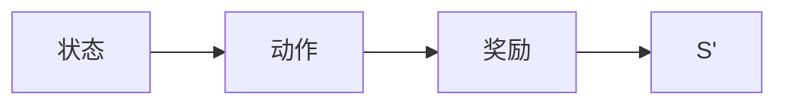
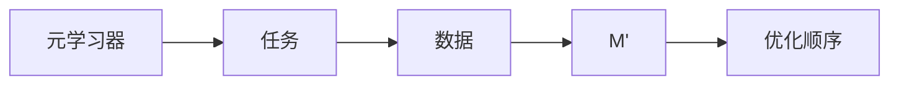
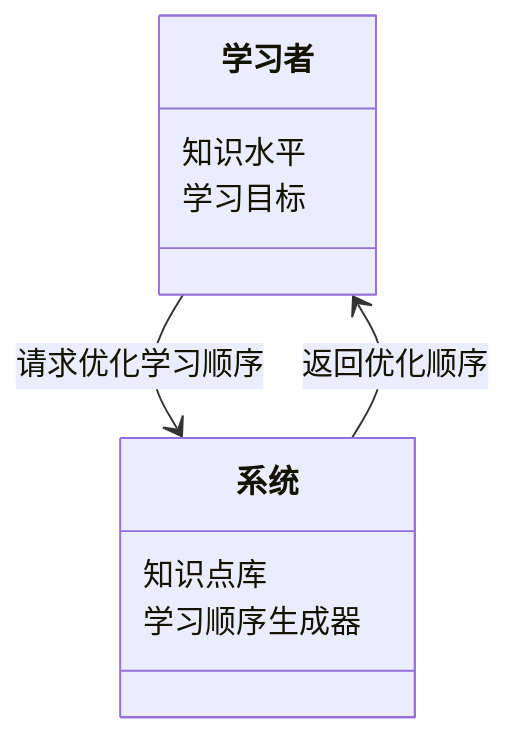
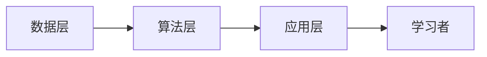

                 


# AI Agent的课程学习：优化学习顺序

## 关键词
AI Agent, 课程学习, 学习顺序, 优化算法, 系统架构设计, 强化学习

## 摘要
AI Agent的课程学习优化是人工智能领域的重要研究方向，特别是在如何优化学习顺序方面。本文系统地探讨了AI Agent在课程学习中的优化策略，从理论基础到算法实现，再到系统设计，结合实际案例分析，为读者提供全面而深入的指导。通过优化学习顺序，AI Agent能够更高效地掌握知识和技能，从而在各种应用场景中表现出色。

---

# 目录大纲

## 第一部分: AI Agent的课程学习基础

### 第1章: AI Agent的基本概念
1.1 AI Agent的定义与核心要素
1.2 课程学习的基本理论
1.3 学习顺序优化的重要性

## 第二部分: 优化学习顺序的理论基础

### 第2章: 优化学习顺序的背景与问题
2.1 AI Agent学习中的挑战
2.2 优化学习顺序的目标
2.3 学习顺序对效果的影响

## 第三部分: 优化学习顺序的算法与实现

### 第3章: 排序算法与优化策略
3.1 排序问题的数学模型
3.2 基于强化学习的排序方法
3.3 元学习在学习顺序优化中的应用

## 第四部分: 系统架构设计

### 第4章: 优化学习顺序的系统设计
4.1 问题场景与功能设计
4.2 系统架构的分层设计
4.3 接口设计与交互流程

## 第五部分: 项目实战与总结

### 第5章: 优化学习顺序的项目实现
5.1 环境搭建与数据准备
5.2 核心算法实现
5.3 实际案例分析与效果评估

## 第六章: 总结与展望
6.1 最佳实践
6.2 学习顺序优化的未来研究方向

---

## 正文部分

### 第1章: AI Agent的基本概念

#### 1.1 AI Agent的定义与核心要素
AI Agent（人工智能代理）是一种能够感知环境并采取行动以实现目标的智能实体。它具备以下核心要素：
- **自主性**：能够在没有外部干预的情况下自主决策。
- **反应性**：能够实时感知环境并做出反应。
- **目标导向**：通过目标驱动行为，优化决策过程。

AI Agent在课程学习中的应用广泛，例如教育辅助系统、智能 tutoring系统等。通过优化学习顺序，AI Agent能够更高效地帮助学习者掌握知识。

#### 1.2 课程学习的基本理论
课程学习是指通过系统化地安排学习内容和顺序，使学习者能够逐步掌握相关知识和技能。优化学习顺序的核心目标是提高学习效率和效果，减少冗余学习，同时增强知识点之间的关联性。

---

### 第2章: 优化学习顺序的背景与问题

#### 2.1 AI Agent学习中的挑战
在AI Agent的课程学习过程中，存在以下主要挑战：
1. **数据量与计算效率的矛盾**：海量数据可能导致计算成本过高，影响学习效率。
2. **知识点之间的依赖关系**：某些知识点需要先掌握其他知识点才能有效学习。
3. **学习顺序对效果的影响**：错误的学习顺序可能导致学习者理解困难或效率低下。

#### 2.2 优化学习顺序的目标
优化学习顺序的目标包括：
1. **提高学习效率**：通过合理安排学习内容，减少重复学习和无效学习。
2. **降低学习难度**：通过优化知识点的顺序，使学习过程更加自然和直观。
3. **提升学习效果**：通过科学的顺序安排，增强知识点之间的关联性，提高学习者对知识的掌握程度。

---

### 第3章: 优化学习顺序的数学基础

#### 3.1 排序问题的数学模型
排序问题可以看作是一个优化问题，目标是找到最优的排列顺序，使得目标函数最大化或最小化。数学模型如下：

$$
\text{目标函数} = \sum_{i=1}^{n} w_i \cdot x_i
$$

其中，$w_i$是知识点$i$的权重，$x_i$是知识点$i$的位置权重。

#### 3.2 基于强化学习的排序方法
强化学习是一种通过试错机制优化决策的方法。在优化学习顺序的应用中，强化学习通过定义状态、动作和奖励来优化学习顺序。

**状态定义**：当前已学习的知识点集合。
**动作定义**：选择下一个知识点进行学习。
**奖励定义**：学习效果的提升幅度。

**算法流程图**：



#### 3.3 元学习在学习顺序优化中的应用
元学习是一种通过学习如何学习的方法。在优化学习顺序中，元学习可以用来快速适应不同的学习场景和任务。

**元学习流程图**：



---

### 第4章: 优化学习顺序的系统架构设计

#### 4.1 问题场景与功能设计
在优化学习顺序的系统设计中，首先需要明确问题场景和系统功能。以下是一个典型的问题场景描述：

- **用户需求**：学习者希望以最优顺序学习一系列数学知识点，包括代数、几何、微积分等。
- **系统功能**：根据学习者的知识水平和学习目标，自动生成最优的学习顺序。

**系统功能设计图**：



#### 4.2 系统架构的分层设计
优化学习顺序的系统架构通常采用分层设计，包括数据层、算法层和应用层。

**系统架构图**：



---

### 第5章: 优化学习顺序的项目实现

#### 5.1 环境搭建与数据准备
优化学习顺序的项目实现需要以下环境和数据准备：
1. **环境搭建**：安装Python、TensorFlow、Keras等工具。
2. **数据准备**：收集和整理知识点之间的依赖关系和难度等级数据。

#### 5.2 核心算法实现
以下是基于强化学习的排序算法实现示例：

```python
import numpy as np

class ReinforcementLearning:
    def __init__(self, states):
        self.states = states
        self.learning_rate = 0.1
        self.gamma = 0.9
    
    def get_action(self, state):
        # 假设每个状态有3个可能的动作
        return np.random.choice([0, 1, 2])
    
    def update_q_value(self, state, action, reward):
        # 更新Q值表
        self.q_values[state][action] = self.q_values[state][action] + self.learning_rate * (reward + self.gamma * np.max(self.q_values[state][action]))

# 初始化Q值表
states = 5
actions = 3
rl = ReinforcementLearning(states)
rl.q_values = np.zeros((states, actions))
```

#### 5.3 实际案例分析与效果评估
通过实际案例分析，我们可以评估优化学习顺序的效果。例如，在一个数学学习系统中，优化学习顺序可以显著提高学习者的理解速度和正确率。

---

### 第6章: 总结与展望

#### 6.1 最佳实践
- 在优化学习顺序时，建议结合学习者的具体需求和知识水平，动态调整学习顺序。
- 使用强化学习和元学习等先进算法，提升优化效果。

#### 6.2 学习顺序优化的未来研究方向
- 研究更复杂的多目标优化问题。
- 探索基于生成模型的顺序优化方法。
- 结合人机交互，实现个性化的学习顺序优化。

---

通过以上结构和技术博客内容，我们可以系统地探讨AI Agent的课程学习优化问题，从理论到实践，为读者提供全面而深入的指导。

