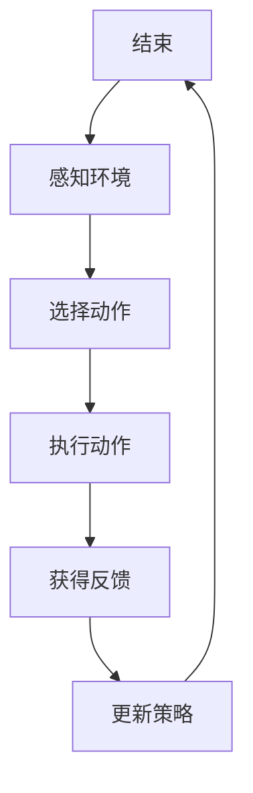

                 


# AI Agent的跨域任务泛化能力开发

> 关键词：AI Agent，跨域任务，泛化能力，算法原理，系统架构，项目实战

> 摘要：AI Agent的跨域任务泛化能力开发是当前人工智能领域的研究热点。本文从AI Agent的基本概念出发，详细探讨其在跨域任务中的泛化能力，分析其算法原理、系统架构设计，并通过项目实战展示如何实现这一能力。文章最后总结了开发中的注意事项和未来研究方向。

---

## 第一部分：AI Agent的核心概念与背景

### 第1章：AI Agent的核心概念与背景

#### 1.1 AI Agent的定义与核心概念

- **AI Agent的定义**：AI Agent（人工智能代理）是指能够感知环境、做出决策并执行动作的智能实体。它可以是一个软件程序、机器人或其他形式的智能系统，旨在通过自主或半自主的方式完成特定任务。

- **核心概念**：
  - **感知（Perception）**：AI Agent通过传感器或数据输入接口获取环境信息。
  - **决策（Decision-Making）**：基于感知信息，AI Agent通过算法选择最优动作。
  - **执行（Execution）**：根据决策结果，AI Agent执行相应的动作。

- **AI Agent的分类**：
  - **简单反射型Agent**：基于简单的规则做出反应，如条件判断。
  - **基于模型的反射型Agent**：使用内部模型或知识库进行决策。
  - **目标驱动型Agent**：根据目标选择最优动作。
  - **效用驱动型Agent**：通过最大化效用函数来优化决策。

#### 1.2 跨域任务的定义与挑战

- **跨域任务的定义**：跨域任务是指AI Agent需要在多个不同的领域或环境中执行任务，且任务类型多样化的场景。例如，一个AI Agent可能需要在自然语言处理、图像识别、机器人控制等多个领域中执行任务。

- **跨域任务的挑战**：
  - **领域差异**：不同领域的问题具有不同的特征和解决方法，AI Agent需要具备在多个领域中灵活切换的能力。
  - **任务多样性**：跨域任务通常涉及多种类型的任务，如分类、识别、生成等，AI Agent需要能够适应不同类型的任务。
  - **环境复杂性**：跨域任务通常在复杂的动态环境中进行，AI Agent需要具备快速学习和适应能力。

- **跨域任务的典型场景**：
  - **智能助手**：如Siri、Alexa等，需要处理语音识别、自然语言理解、任务调度等多种任务。
  - **自动驾驶**：需要处理环境感知、路径规划、决策控制等多个领域的任务。
  - **智能客服**：需要处理客户咨询、问题解决、信息检索等跨领域任务。

#### 1.3 泛化能力的重要性

- **泛化能力的定义**：泛化能力是指AI Agent在不同领域和任务中都能够表现出良好的性能，即能够将所学知识迁移到新的、未见过的任务或环境中。

- **泛化能力在AI Agent中的作用**：
  - **提高适应性**：使AI Agent能够在不同环境中灵活应用，减少对特定任务的依赖。
  - **增强智能性**：通过跨领域学习，AI Agent能够整合不同领域的知识，提升整体智能水平。
  - **降低开发成本**：泛化能力强的AI Agent可以减少针对特定任务的定制开发，降低开发和维护成本。

- **泛化能力的衡量标准**：
  - **任务覆盖范围**：AI Agent能够处理的任务类型和领域的数量。
  - **性能表现**：在不同任务和领域中的准确率、响应速度等指标。
  - **学习效率**：AI Agent在新任务或领域中的学习速度和效果。

---

### 第2章：AI Agent的核心概念与联系

#### 2.1 AI Agent的原理

- **感知机制**：
  - 通过传感器或数据接口获取环境信息，如图像、文本、语音等。
  - 使用特征提取、数据预处理等技术对感知信息进行处理，以便后续分析。

- **决策机制**：
  - 基于感知信息和内部知识库，通过算法选择最优动作。
  - 常用的决策算法包括强化学习（Reinforcement Learning）、监督学习（Supervised Learning）和无监督学习（Unsupervised Learning）。

- **执行机制**：
  - 根据决策结果，通过执行器或输出接口完成动作。
  - 动作可以是输出结果、控制设备或其他形式的反馈。

#### 2.2 核心概念对比表

| 概念                | AI Agent                         | 传统算法                        | 机器人技术                  | 分布式系统                  |
|---------------------|----------------------------------|---------------------------------|-----------------------------|-----------------------------|
| 定义                | 能够感知、决策、执行的智能实体   | 用于特定任务的计算方法         | 具备物理结构和执行机构      | 由多个节点组成的计算系统    |
| 核心功能            | 感知环境，自主决策，执行任务    | 解决特定问题的计算过程          | 执行物理动作，与环境交互    | 分布式计算，数据通信        |
| 适用场景            | 多领域、多任务的智能应用         | 特定问题的数值计算或模式识别    | 工业自动化、服务机器人      | 网络计算、分布式数据库      |
| 依赖性              | 高度依赖感知和执行能力           | 依赖算法和数据                 | 依赖机械结构和传感器        | 依赖网络和节点通信         |

#### 2.3 ER实体关系图

```mermaid
er
  actor(Agent)
  actor(Task)
  actor(Context)
  relation(Agent, Task, "执行")
  relation(Agent, Context, "感知")
```

---

### 第3章：AI Agent的算法原理

#### 3.1 算法原理概述

- **强化学习（Reinforcement Learning）**：
  - AI Agent通过与环境交互，学习最优策略以最大化累积奖励。
  - 核心算法包括Q-learning、Deep Q-Network（DQN）等。

- **监督学习（Supervised Learning）**：
  - 基于标记数据，AI Agent学习输入与输出之间的映射关系。
  - 常见算法包括线性回归、支持向量机（SVM）、随机森林等。

- **无监督学习（Unsupervised Learning）**：
  - 基于未标记数据，AI Agent学习数据的内在结构。
  - 常见算法包括聚类、降维、概率模型等。

#### 3.2 算法流程图



#### 3.3 算法实现代码

- **Q-learning算法实现**：
  ```python
  class QLearningAgent:
      def __init__(self, state_space, action_space, learning_rate=0.1, discount_factor=0.9):
          self.state_space = state_space
          self.action_space = action_space
          self.learning_rate = learning_rate
          self.discount_factor = discount_factor
          self.q_table = defaultdict(lambda: defaultdict(float))
  
      def perceive(self, observation):
          # 将观测转换为状态表示
          state = self.observation_to_state(observation)
          return state
  
      def choose_action(self, state):
          # 随机选择动作（epsilon-greedy策略）
          epsilon = 0.1
          if random.random() < epsilon:
              return random.choice(self.action_space)
          else:
              # 选择Q值最大的动作
              max_action = max(self.q_table[state], key=lambda k: self.q_table[state][k])
              return max_action
  
      def learn(self, state, action, reward, next_state):
          # 更新Q值
          q = self.q_table[state].get(action, 0)
          next_q = max(self.q_table[next_state].values()) if self.q_table[next_state] else 0
          self.q_table[state][action] = q + self.learning_rate * (reward + self.discount_factor * next_q)
  
  def main():
      # 初始化环境和代理
      env = Environment()
      agent = QLearningAgent(env.state_space, env.action_space)
  
      # 训练过程
      for episode in range(1000):
          state = env.reset()
          while not env.done:
              action = agent.choose_action(state)
              next_state, reward, done = env.step(action)
              agent.learn(state, action, reward, next_state)
              state = next_state
  
  if __name__ == "__main__":
      main()
  ```

#### 3.4 数学模型与公式

- **Q-learning算法的数学模型**：
  $$ Q(s, a) = Q(s, a) + \alpha [r + \gamma \max Q(s', a') - Q(s, a)] $$
  其中：
  - \( Q(s, a) \) 表示状态 \( s \) 下动作 \( a \) 的Q值。
  - \( \alpha \) 是学习率。
  - \( r \) 是获得的奖励。
  - \( \gamma \) 是折扣因子。
  - \( Q(s', a') \) 是下一个状态 \( s' \) 下动作 \( a' \) 的Q值。

- **Deep Q-Network（DQN）算法**：
  DQN通过神经网络近似Q值函数，公式如下：
  $$ Q(s, a) = \theta \cdot \phi(s, a) $$
  其中，\( \theta \) 是神经网络的参数，\( \phi(s, a) \) 是状态-动作对的特征表示。

---

### 第4章：系统分析与架构设计

#### 4.1 问题场景介绍

- **跨域任务的复杂性**：AI Agent需要在多个领域中执行任务，且任务类型多样，环境动态变化。
- **系统需求**：设计一个具备跨域任务泛化能力的AI Agent，能够快速适应不同任务和环境。

#### 4.2 系统功能设计

- **领域模型（Domain Model）**：
  - 包含多个领域的知识库和任务处理模块。
  - 使用Mermaid类图表示：
  ```mermaid
  classDiagram
      class Agent {
          - knowledge_base: dict
          - task_processor: TaskProcessor
          - action_executor: ActionExecutor
      }
      class TaskProcessor {
          - task_type: str
          - task_logic: dict
      }
      class ActionExecutor {
          - execute(action: str) -> bool
      }
      Agent --> TaskProcessor
      Agent --> ActionExecutor
  ```

- **系统架构设计**：
  - **分层架构**：感知层、决策层、执行层。
  - 使用Mermaid架构图表示：
  ```mermaid
  architecture
      Client
      ├── 感知层
      |   └── 知识库
      ├── 决策层
      |   └── 策略选择器
      └── 执行层
          └── 动作执行器
  ```

- **接口设计**：
  - **输入接口**：接收任务请求、环境数据。
  - **输出接口**：返回任务结果、执行反馈。
  - **交互流程图**：
  ```mermaid
  sequenceDiagram
      Agent ->> TaskRequest: 接收任务请求
      TaskRequest ->> KnowledgeBase: 查询相关知识
      KnowledgeBase -->> TaskProcessor: 返回知识数据
      TaskProcessor ->> DecisionMaker: 选择最优动作
      DecisionMaker ->> ActionExecutor: 执行动作
      ActionExecutor ->> Agent: 返回执行结果
  ```

---

### 第5章：项目实战

#### 5.1 环境安装

- **安装Python环境**：建议使用Python 3.8以上版本。
- **安装依赖库**：
  ```bash
  pip install numpy pandas scikit-learn matplotlib
  ```

#### 5.2 核心代码实现

- **多领域任务处理模块**：
  ```python
  def process_task(domain, task_type, input_data):
      # 根据领域和任务类型选择处理逻辑
      if domain == 'nlp':
          return nlp_processor(task_type, input_data)
      elif domain == 'image':
          return image_processor(task_type, input_data)
      else:
          raise ValueError("Unsupported domain")
  ```

- **跨域任务泛化模块**：
  ```python
  def generalize_task(domain, task_type, input_data):
      # 使用迁移学习或元学习方法处理跨域任务
      base_agent = load_base_agent(domain)
      adapted_agent = adapt_agent(base_agent, domain, task_type)
      return adapted_agent.process(input_data)
  ```

#### 5.3 实际案例分析

- **案例：跨域自然语言处理**：
  - **任务1**：情感分析（文本分类）
  - **任务2**：实体识别（信息抽取）
  - **任务3**：机器翻译（文本生成）
  - 使用预训练语言模型（如BERT）进行跨任务适应。

---

### 第6章：最佳实践与总结

#### 6.1 小结

- AI Agent的跨域任务泛化能力是实现通用人工智能的重要方向。
- 本文从理论到实践，详细探讨了AI Agent的算法原理、系统架构设计和项目实现。

#### 6.2 注意事项

- **数据多样性**：跨域任务需要多样化的训练数据，以避免过拟合和领域偏移。
- **算法选择**：根据任务需求选择合适的算法，强化学习适合动态环境，监督学习适合有标签数据的任务。
- **系统可扩展性**：设计时应考虑系统的扩展性，便于新增领域和任务的集成。

#### 6.3 拓展阅读

- **推荐书籍**：
  - 《Reinforcement Learning: Theory and Algorithms》
  - 《Deep Learning》
- **推荐论文**：
  - "A Survey on Deep Learning for Natural Language Processing"
  - "Universal Agents: Representing and Acting in a World of Unknown Objects"

---

通过以上章节的详细讲解，读者可以全面理解AI Agent的跨域任务泛化能力开发，并能够在实际项目中应用这些知识。

