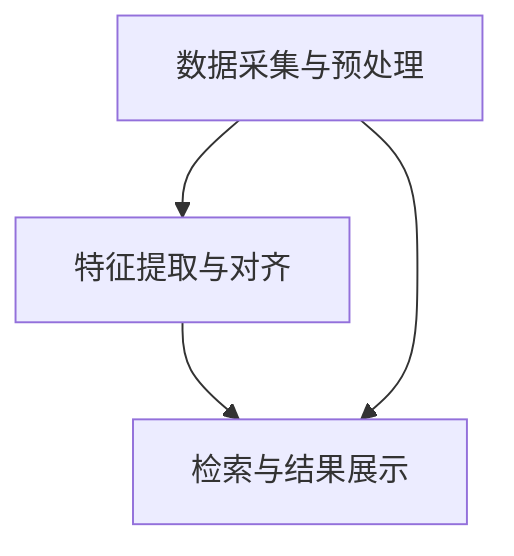

                 


# AI Agent的跨模态检索能力开发

> 关键词：AI Agent、跨模态检索、多模态数据、深度学习、信息检索

> 摘要：  
AI Agent的跨模态检索能力是指在不同数据模态（如文本、图像、语音等）之间进行信息检索的能力。本文将详细介绍AI Agent的跨模态检索能力的开发过程，包括核心概念、算法原理、系统架构设计、项目实战以及最佳实践。通过本文，读者可以全面理解跨模态检索的核心原理，并掌握实际开发中的关键技术和注意事项。

---

## 第1章：AI Agent与跨模态检索的背景

### 1.1 AI Agent的基本概念
AI Agent（人工智能代理）是指能够感知环境、执行任务并做出决策的智能实体。AI Agent可以通过传感器获取多模态数据（如图像、文本、语音等），并结合上下文信息完成复杂的检索任务。

#### 1.1.1 AI Agent的定义
AI Agent是一个能够自主执行任务的智能系统，具备以下核心特征：
- **自主性**：能够在没有外部干预的情况下完成任务。
- **反应性**：能够感知环境并实时调整行为。
- **目标导向性**：基于目标驱动决策和行动。

#### 1.1.2 跨模态检索的定义
跨模态检索是指在不同数据模态之间进行信息检索的过程。例如，在图像中检索与文本描述相关的图像，或者在视频中检索与语音内容相关的片段。

---

### 1.2 跨模态检索的背景与意义
随着AI技术的发展，跨模态检索在多个领域得到了广泛应用，例如图像检索、语音识别、自然语言处理等。跨模态检索的核心挑战在于如何在不同模态之间建立有效的关联。

#### 1.2.1 跨模态检索的发展历程
- **早期阶段**：基于关键词匹配的检索方法。
- **深度学习阶段**：利用深度学习模型（如CNN、Transformer）进行跨模态对齐。
- **当前阶段**：基于多模态大模型（如ViT、BERT）的跨模态检索。

#### 1.2.2 跨模态检索的应用场景
- **图像检索**：根据文本描述检索相关图像。
- **视频检索**：根据语音内容检索相关视频片段。
- **多模态问答**：结合文本和图像信息回答问题。

---

## 第2章：跨模态检索的核心概念

### 2.1 多模态数据的结构与特点
多模态数据是指包含多种数据类型的集合，例如图像、文本、语音等。不同模态的数据具有不同的特征和表示方式。

#### 2.1.1 文本、图像、语音的特征分析
- **文本**：通过词袋模型或词嵌入（如Word2Vec、BERT）表示。
- **图像**：通过卷积神经网络（CNN）提取图像特征。
- **语音**：通过语音识别和特征提取（如Mel频谱）表示。

#### 2.1.2 多模态数据的表示方法
- **模态对齐**：将不同模态的数据映射到相同的特征空间。
- **联合表示**：将多种模态的信息融合到一个统一的表示中。

---

### 2.2 跨模态检索的模型类型
跨模态检索模型可以根据检索任务的需求分为多种类型，常见的包括：

#### 2.2.1 基于单模态的检索模型
- **文本检索**：基于文本特征进行检索。
- **图像检索**：基于图像特征进行检索。

#### 2.2.2 跨模态对齐模型
- **跨模态对齐**：通过对比学习将不同模态的数据对齐到相同的特征空间。

#### 2.2.3 联合学习模型
- **多任务学习**：在同一模型中同时学习多种模态的信息。

---

## 第3章：跨模态检索的算法原理

### 3.1 检索模型的训练流程
跨模态检索模型的训练流程包括数据预处理、特征提取、模型训练和评估优化。

#### 3.1.1 数据预处理与特征提取
- **数据预处理**：对多模态数据进行清洗和格式转换。
- **特征提取**：使用深度学习模型提取多模态特征。

#### 3.1.2 对齐策略的选择与实现
- **对比学习**：通过对比损失函数对齐不同模态的特征。
- **多任务学习**：在同一模型中同时学习多种任务。

#### 3.1.3 损失函数的设计与优化
- **对比损失函数**：衡量不同模态特征的相似性。
- **优化目标**：最小化损失函数，优化模型参数。

#### 3.1.4 模型训练
- **训练数据**：使用多模态数据对模型进行训练。
- **训练策略**：采用分布式训练和数据增强技术。

#### 3.1.5 评估与优化
- **评估指标**：使用准确率、召回率、F1分数等指标评估模型性能。
- **超参数优化**：通过网格搜索或随机搜索优化模型参数。

---

### 3.2 基于深度学习的检索算法
深度学习模型在跨模态检索中表现出色，常用的算法包括基于Transformer的跨模态对齐和对比学习。

#### 3.2.1 基于Transformer的跨模态对齐
- **Transformer模型**：通过自注意力机制对齐不同模态的特征。
- **跨模态对齐**：将文本和图像特征映射到相同的表示空间。

#### 3.2.2 对比学习在跨模态检索中的应用
- **对比损失函数**：衡量不同模态特征的相似性。
- **正样本对齐**：最大化正样本之间的相似性。
- **负样本对齐**：最小化负样本之间的相似性。

#### 3.2.3 多任务学习的实现方法
- **多任务模型**：在同一模型中同时学习多种任务（如图像分类和文本分类）。
- **任务权重调整**：通过任务权重优化模型性能。

---

## 第4章：跨模态检索系统的架构设计

### 4.1 系统功能模块划分
跨模态检索系统通常包括以下功能模块：

#### 4.1.1 数据采集与预处理模块
- **数据采集**：从多模态数据源中获取数据。
- **数据预处理**：对数据进行清洗、格式转换和特征提取。

#### 4.1.2 特征提取与对齐模块
- **特征提取**：使用深度学习模型提取多模态特征。
- **跨模态对齐**：将不同模态的特征对齐到相同的表示空间。

#### 4.1.3 检索与结果展示模块
- **检索算法**：基于对齐后的特征进行跨模态检索。
- **结果展示**：将检索结果以用户友好的形式展示。

---

### 4.2 系统架构图
以下是一个跨模态检索系统的架构图，展示了各模块之间的交互关系：



---

## 第5章：跨模态检索系统的实现

### 5.1 环境配置与工具安装
跨模态检索系统的开发需要以下环境和工具：

#### 5.1.1 安装Python与深度学习框架
- **Python**：3.8+
- **深度学习框架**：TensorFlow或PyTorch

#### 5.1.2 数据集的下载与准备
- **数据集**：公开多模态数据集（如ImageNet、COCO、MNIST等）。

---

### 5.2 核心代码实现
以下是跨模态检索系统的核心代码实现示例：

#### 5.2.1 数据预处理代码示例
```python
import numpy as np
from tensorflow.keras.preprocessing import image

def preprocess_image(img_path):
    img = image.load_img(img_path, target_size=(224, 224))
    img_array = image.img_to_array(img)
    img_array = np.expand_dims(img_array, axis=0)
    return img_array
```

#### 5.2.2 特征提取与对齐的代码实现
```python
import tensorflow as tf
from tensorflow.keras.applications import ResNet50

model = ResNet50(weights='imagenet', include_top=False)
def extract_features(img_array):
    features = model.predict(img_array)
    return features
```

#### 5.2.3 检索算法的实现与测试
```python
import numpy as np

def compute_similarity(feature1, feature2):
    return np.mean(feature1 == feature2)

# 示例检索
query_feature = extract_features(preprocess_image(query_image_path))
retrieved_features = [compute_similarity(query_feature, feature) for feature in feature_bank]
```

---

## 第6章：最佳实践与扩展

### 6.1 开发经验总结
在跨模态检索系统的开发中，以下经验值得总结：
- **数据预处理**：确保数据的多样性和质量。
- **模型选择**：根据任务需求选择合适的模型和算法。
- **性能优化**：通过并行计算和数据优化提升系统性能。

### 6.2 注意事项
- **数据隐私**：确保数据的安全性和隐私性。
- **模型泛化能力**：通过数据增强和模型优化提升模型的泛化能力。

### 6.3 未来展望
随着AI技术的不断发展，跨模态检索将在更多领域得到应用，例如元宇宙、智能客服、医疗健康等。

---

## 总结
本文详细介绍了AI Agent的跨模态检索能力的开发过程，包括核心概念、算法原理、系统架构设计、项目实战以及最佳实践。通过本文，读者可以全面理解跨模态检索的核心原理，并掌握实际开发中的关键技术和注意事项。

