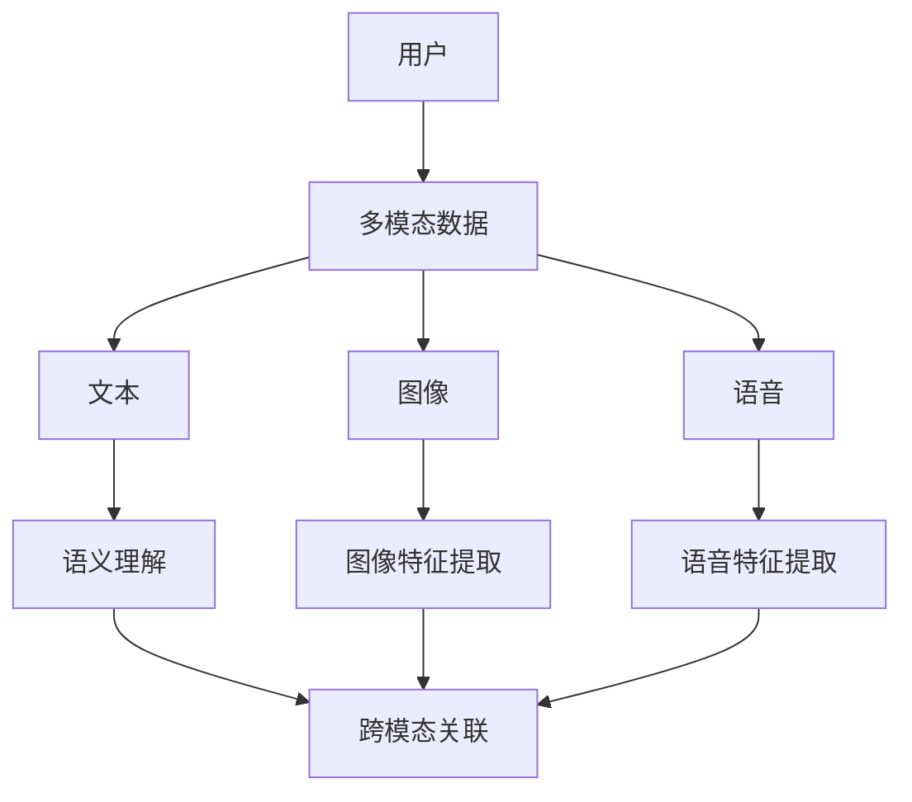
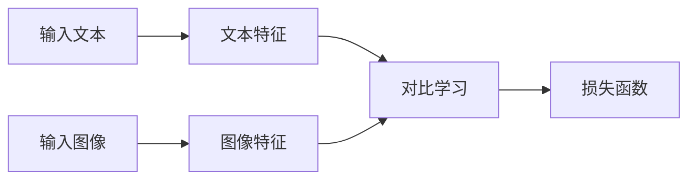
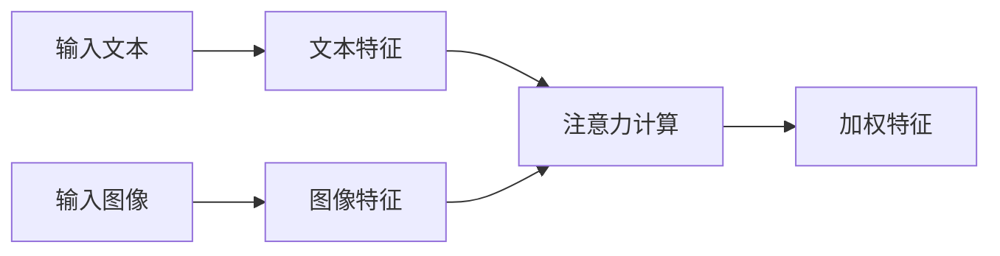
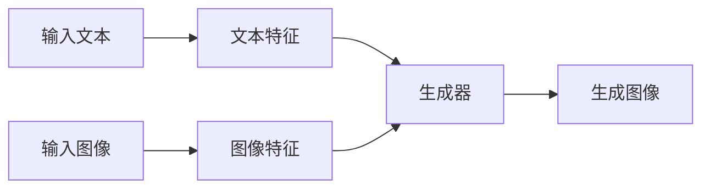
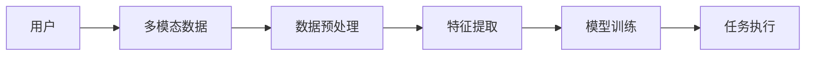

                 


# AI Agent的跨模态理解与生成

> 关键词：AI Agent，跨模态理解，多模态数据，生成式AI，深度学习

> 摘要：本文深入探讨了AI Agent在跨模态理解与生成领域的核心技术与应用。从跨模态数据的整合与特征提取，到多模态模型的设计与优化，再到实际应用场景的分析，本文系统性地阐述了AI Agent如何通过跨模态技术实现更高效、更智能的任务处理。通过详细分析跨模态对比学习、注意力机制和生成模型等核心算法，本文为读者提供了从理论到实践的全面指南，帮助理解AI Agent在跨模态领域的创新与应用。

---

## 第1章: AI Agent与跨模态理解概述

### 1.1 AI Agent的基本概念
AI Agent（人工智能代理）是指能够感知环境、自主决策并执行任务的智能实体。它可以是一个软件程序、一个机器人，或者任何能够与环境交互的智能系统。AI Agent的核心目标是通过感知和行动来优化任务执行效率，提升用户体验。

#### 1.1.1 AI Agent的定义与特点
- **定义**：AI Agent是一个具备感知、推理、决策和行动能力的智能系统。
- **特点**：
  - 感知能力：能够从多模态数据中获取信息。
  - 决策能力：基于感知信息做出最优决策。
  - 自适应能力：能够根据环境变化调整行为。

#### 1.1.2 跨模态理解的核心概念
跨模态理解是指AI Agent能够同时处理多种类型的数据（如文本、图像、语音等），并理解它们之间的关联关系。例如，AI Agent可以通过文本描述和图像内容的关联，理解用户的需求。

#### 1.1.3 跨模态理解的应用场景
- **智能客服**：结合文本和语音数据，提供更精准的服务。
- **自动驾驶**：融合视觉、雷达和 GPS 数据，提升驾驶安全。
- **智能家居**：通过语音和传感器数据，实现更智能的家居控制。

### 1.2 跨模态理解的背景与挑战
随着AI技术的快速发展，跨模态理解成为研究热点。然而，跨模态数据的异构性和复杂性也带来了诸多挑战。

#### 1.2.1 跨模态数据的特点
- **异构性**：不同模态的数据具有不同的特征和表达方式。
- **多样性**：数据可能来自多种传感器或输入源。
- **关联性**：不同模态的数据之间可能存在隐含的关联关系。

#### 1.2.2 跨模态理解的主要挑战
- **数据对齐**：不同模态的数据如何有效对齐？
- **特征融合**：如何提取和融合多模态特征？
- **模型泛化**：跨模态模型的泛化能力如何保证？

#### 1.2.3 跨模态理解的边界与外延
- **边界**：跨模态理解仅关注数据的关联性，不涉及具体任务的执行。
- **外延**：跨模态技术可以应用于多种领域，如计算机视觉、自然语言处理等。

### 1.3 跨模态理解的核心要素
跨模态理解的核心在于如何有效地整合多模态数据，并提取有用的特征。

#### 1.3.1 多模态数据的整合
- **数据预处理**：对不同模态的数据进行标准化处理。
- **数据对齐**：将不同模态的数据对齐到统一的语义空间。

#### 1.3.2 跨模态特征的提取
- **模态独立特征**：提取每个模态的独立特征。
- **跨模态关联特征**：提取模态间的关联特征。

#### 1.3.3 跨模态模型的设计
- **多任务学习**：同时优化多个模态的任务。
- **联合学习**：利用多个模态的数据共同训练模型。

---

## 第2章: 跨模态理解的核心概念与联系

### 2.1 跨模态理解的核心原理
跨模态理解的核心在于通过关联不同模态的数据，提升模型的语义理解能力。

#### 2.1.1 跨模态数据的关联性分析
- **语义对齐**：通过对比学习，将不同模态的数据对齐到相同的语义空间。
- **特征共享**：在模型中共享特征，减少模态间的差异。

#### 2.1.2 跨模态特征的对齐与融合
- **对齐方法**：使用对比学习、注意力机制等方法对齐特征。
- **融合方法**：通过加权融合、交叉注意力等方式整合多模态特征。

#### 2.1.3 跨模态模型的训练方法
- **多任务学习**：同时优化多个模态的任务。
- **联合优化**：利用多个模态的数据共同优化模型。

### 2.2 跨模态理解的核心要素对比
通过对比分析，理解不同模态数据的特点和处理方式。

#### 2.2.1 多模态数据的特征对比
| 模态类型 | 特征维度 | 示例数据 |
|----------|----------|----------|
| 文本 | 词汇、句法、语义 | "猫在沙发上睡觉" |
| 图像 | 像素、颜色、形状 | 图像数据 |
| 语音 | 频率、振幅 | 音频数据 |

#### 2.2.2 不同模态数据的处理方式
- **文本处理**：词嵌入、句嵌入。
- **图像处理**：卷积神经网络（CNN）、区域建议网络（RPN）。
- **语音处理**：梅尔频率倒谱系数（MFCC）、波形神经网络（Wavenet）。

#### 2.2.3 跨模态模型的性能对比
- **文本-图像模型**：在图像描述生成中表现较好。
- **文本-语音模型**：在语音识别和合成中表现较好。

### 2.3 跨模态理解的ER实体关系图


---

## 第3章: 跨模态理解的算法原理

### 3.1 跨模态对比学习算法
对比学习是一种有效的跨模态学习方法。

#### 3.1.1 对比学习的基本原理
对比学习通过最大化相似模态的相似性，最小化不相似模态的相似性，实现模态间的对齐。

$$ L = \frac{1}{N} \sum_{i=1}^N \text{Contrastive Loss}(x_i, y_i) $$

#### 3.1.2 跨模态对比学习的实现


#### 3.1.3 跨模态对比学习的优缺点
- **优点**：能够有效对齐模态特征。
- **缺点**：需要大量标注数据。

### 3.2 跨模态注意力机制
注意力机制可以增强模态间的关联性。

#### 3.2.1 注意力机制的基本原理
注意力机制通过计算模态间的注意力权重，增强重要特征的表达。

$$ \alpha_i = \text{softmax}(\frac{q_i^T k_i}{\|q_i\| \|k_i\|}) $$

#### 3.2.2 跨模态注意力机制的实现


#### 3.2.3 跨模态注意力机制的应用
- **文本-图像检索**：通过注意力机制实现图像和文本的关联。
- **语音-文本对齐**：通过注意力机制实现语音和文本的对齐。

### 3.3 跨模态生成模型
生成模型可以生成跨模态数据。

#### 3.3.1 生成模型的基本原理
生成模型通过学习数据的分布，生成新的数据。

$$ p(x) = \frac{1}{Z} \exp(E(x)) $$

#### 3.3.2 跨模态生成模型的实现


#### 3.3.3 跨模态生成模型的性能评估
- **生成质量**：生成数据的质量。
- **跨模态一致性**：生成数据与输入数据的关联性。

---

## 第4章: 跨模态理解的数学模型与公式

### 4.1 跨模态对比学习的数学模型
对比学习通过计算相似性和不相似性，优化模态间的对齐。

#### 4.1.1 对比学习的损失函数
$$ L = \frac{1}{N} \sum_{i=1}^N \text{Contrastive Loss}(x_i, y_i) $$

其中，$x_i$ 和 $y_i$ 分别是两个模态的特征。

#### 4.1.2 跨模态对比学习的实现
$$ \text{Contrastive Loss} = -\log \frac{\exp(s_i)}{1 + \exp(s_i)} $$

其中，$s_i$ 是相似性得分。

### 4.2 跨模态注意力机制的数学模型
注意力机制通过计算权重，实现模态间的关联。

#### 4.2.1 注意力权重的计算
$$ \alpha_i = \text{softmax}(\frac{q_i^T k_i}{\|q_i\| \|k_i\|}) $$

其中，$q_i$ 和 $k_i$ 分别是查询和键。

#### 4.2.2 加权特征的计算
$$ f_i = \sum_{j=1}^n \alpha_{ij} g_j $$

其中，$g_j$ 是生成的特征。

### 4.3 跨模态生成模型的数学模型
生成模型通过学习数据分布，生成新的数据。

#### 4.3.1 生成模型的损失函数
$$ L = \mathbb{E}_{x \sim \text{真实数据}}[\log p(x)] - \mathbb{E}_{z \sim \text{先验}}[\log p(z)] $$

其中，$p(x)$ 是生成模型的分布。

#### 4.3.2 跨模态生成模型的实现
$$ p(x) = \frac{1}{Z} \exp(E(x)) $$

其中，$E(x)$ 是生成模型的能量函数。

---

## 第5章: 跨模态理解的系统架构与实现

### 5.1 系统功能设计
跨模态理解系统需要具备以下功能：
- **数据输入**：接收多模态数据。
- **特征提取**：提取多模态特征。
- **模型训练**：训练跨模态模型。
- **任务执行**：根据任务需求，执行相关操作。

#### 5.1.1 系统功能模块
- **数据预处理模块**：对输入数据进行标准化处理。
- **特征提取模块**：提取多模态特征。
- **模型训练模块**：训练跨模态模型。
- **任务执行模块**：根据任务需求，执行相关操作。

### 5.2 系统架构设计
跨模态理解系统的架构需要模块化设计。

#### 5.2.1 系统架构图


#### 5.2.2 系统交互流程
- **用户输入**：用户输入多模态数据。
- **数据预处理**：对输入数据进行标准化处理。
- **特征提取**：提取多模态特征。
- **模型训练**：训练跨模态模型。
- **任务执行**：根据任务需求，执行相关操作。

### 5.3 系统接口设计
系统需要提供以下接口：
- **数据输入接口**：接收多模态数据。
- **模型训练接口**：训练跨模态模型。
- **任务执行接口**：执行相关任务。

---

## 第6章: 跨模态理解的项目实战

### 6.1 项目背景与目标
#### 6.1.1 项目背景
跨模态理解在实际应用中具有广泛的应用场景，如智能客服、自动驾驶等。

#### 6.1.2 项目目标
通过实际案例，展示跨模态理解的核心技术。

### 6.2 项目实现
#### 6.2.1 环境配置
- **Python 3.8+**
- **深度学习框架（如TensorFlow、PyTorch）**
- **相关库（如OpenCV、 libros）**

#### 6.2.2 核心代码实现
```python
import tensorflow as tf
from tensorflow.keras import layers

# 定义跨模态对比学习模型
class CrossModalContrastive(tf.keras.Model):
    def __init__(self):
        super(CrossModalContrastive, self).__init__()
        self.encoder_text = layers.Dense(128, activation='relu')
        self.encoder_image = layers.Dense(128, activation='relu')
        self.temperature = tf.Variable(1.0, trainable=False)

    def call(self, text_input, image_input):
        text_fea = self.encoder_text(text_input)
        image_fea = self.encoder_image(image_input)
        similarity = tf.matmul(text_fea, image_fea, transpose_b=True) / self.temperature
        return similarity
```

#### 6.2.3 代码解读与分析
- **模型定义**：定义了一个跨模态对比学习模型。
- **编码器**：文本编码器和图像编码器分别提取特征。
- **相似性计算**：通过点积计算相似性。

### 6.3 案例分析
#### 6.3.1 案例背景
以电商客服场景为例，展示跨模态理解的应用。

#### 6.3.2 数据准备
- **文本数据**：用户的问题描述。
- **图像数据**：商品图片。

#### 6.3.3 模型训练
- **数据预处理**：文本数据进行分词处理，图像数据进行归一化处理。
- **模型训练**：使用跨模态对比学习模型进行训练。

#### 6.3.4 模型评估
- **准确率**：模型在测试集上的准确率。
- **召回率**：模型的召回率。

### 6.4 项目小结
跨模态理解在实际应用中具有广泛的应用场景，通过实际案例可以更好地理解其核心技术。

---

## 第7章: 跨模态理解的高级应用与未来展望

### 7.1 跨模态理解的高级应用
跨模态理解可以应用于以下领域：
- **多模态大模型**：构建支持多模态的大模型。
- **生成式AI**：利用跨模态生成技术，生成高质量的数据。

### 7.2 跨模态理解的未来展望
#### 7.2.1 多模态大模型的发展
随着大模型技术的不断发展，跨模态理解将更加智能化。

#### 7.2.2 生成式AI的结合
跨模态生成技术将与生成式AI结合，推动AI技术的发展。

### 7.3 跨模态理解的技术挑战
- **数据规模**：需要更大的数据集。
- **模型复杂性**：模型的复杂性需要进一步优化。

### 7.4 跨模态理解的最佳实践
- **数据质量**：确保数据质量。
- **模型优化**：优化模型结构。
- **应用场景**：根据应用场景选择合适的技术。

---

## 第8章: 小结与展望

### 8.1 小结
跨模态理解是AI Agent的核心技术之一，通过整合多模态数据，提升模型的语义理解能力。

### 8.2 展望
随着技术的不断发展，跨模态理解将在更多领域得到应用，推动AI技术的发展。

---

通过以上内容，我们系统地探讨了AI Agent的跨模态理解与生成的核心技术与应用。从理论到实践，从算法到系统，本文为读者提供了全面的指南。

