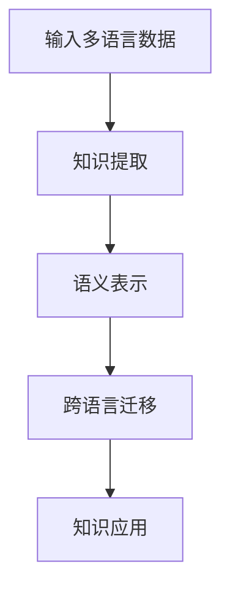
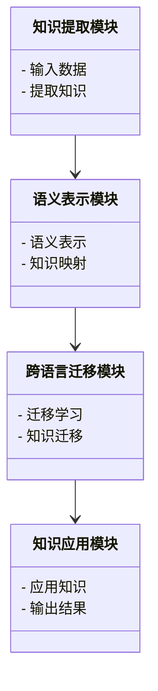
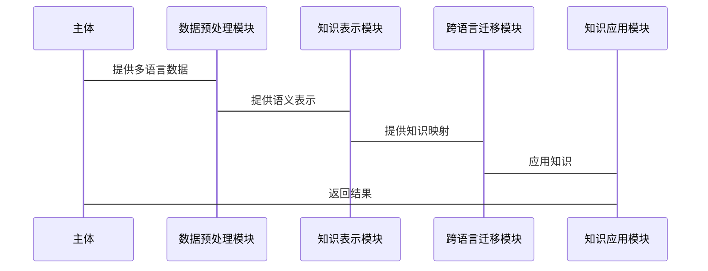

                 


# AI Agent的跨语言知识迁移技术

## 关键词：AI Agent, 跨语言知识迁移, 多语言处理, 人工智能, 机器学习, 知识表示

## 摘要：
AI Agent的跨语言知识迁移技术是当前人工智能领域的重要研究方向。随着全球化的发展，多语言环境下的知识共享和应用需求日益增长。本文将详细探讨AI Agent在跨语言知识迁移中的核心概念、算法原理、系统架构以及实际应用，帮助读者全面理解并掌握这一技术。

---

# 第1章: 背景介绍

## 1.1 问题背景
### 1.1.1 多语言知识处理的挑战
在多语言环境下，知识的表示和处理面临诸多挑战。不同语言的语法、词汇和语义差异使得直接迁移知识变得复杂。例如，中文和英语在语法结构上有很大差异，如何在两者之间建立有效的知识映射关系是一个难题。

### 1.1.2 知识迁移的重要性
知识迁移是实现AI Agent多语言能力的关键。通过跨语言知识迁移，AI Agent可以将一种语言的知识迁移到另一种语言，从而提高其在多语言环境下的智能水平。

### 1.1.3 AI Agent在跨语言场景中的角色
AI Agent在跨语言场景中扮演着知识处理器和协调者的角色。它需要能够理解多种语言的语义，并在不同语言之间进行知识的转换和应用。

## 1.2 问题描述
### 1.2.1 跨语言知识迁移的核心问题
核心问题是如何实现知识在不同语言之间的有效迁移。这需要解决知识表示、语义理解以及跨语言推理等多个技术难题。

### 1.2.2 知识表示与语义理解的难点
知识表示的多样性以及语义理解的复杂性是跨语言知识迁移的主要难点。如何在不同语言中建立一致的知识表示体系是关键。

### 1.2.3 AI Agent的多语言能力需求
AI Agent需要具备多语言处理能力，能够理解并处理多种语言的知识，并在跨语言场景中灵活应用这些知识。

## 1.3 问题解决思路
### 1.3.1 知识迁移的基本策略
通过构建跨语言知识图谱和使用多任务学习等方法，实现知识在不同语言之间的有效迁移。

### 1.3.2 AI Agent的多语言处理框架
设计一个多语言处理框架，包括知识提取、语义表示、跨语言迁移和知识应用等模块。

### 1.3.3 跨语言知识迁移的实现路径
通过预训练模型、对比学习和迁移学习等技术，逐步实现跨语言知识的迁移和应用。

## 1.4 边界与外延
### 1.4.1 跨语言知识迁移的边界条件
主要关注语言之间的知识迁移，不考虑文化、语境等因素的影响。

### 1.4.2 相关概念的外延分析
跨语言知识迁移与机器翻译、多语言NLP等技术密切相关，但其核心目标是实现知识的跨语言应用。

### 1.4.3 技术实现的局限性
当前技术在处理高度复杂和模糊的语言现象时仍存在局限性，需要进一步研究和优化。

## 1.5 概念结构与核心要素
### 1.5.1 跨语言知识迁移的核心要素
包括知识表示、语义理解、跨语言迁移和知识应用等核心要素。

### 1.5.2 AI Agent的多语言能力组成
多语言能力由知识提取、语义理解、跨语言推理和知识应用等部分组成。

### 1.5.3 知识迁移的实现机制
通过构建跨语言知识图谱、使用预训练模型和对比学习等方法实现知识的跨语言迁移。

## 1.6 本章小结
本章主要介绍了AI Agent跨语言知识迁移的背景、问题、解决思路以及相关概念。为后续章节的深入探讨奠定了基础。

---

# 第2章: 跨语言知识迁移的核心概念与联系

## 2.1 核心概念原理
### 2.1.1 知识表示与语义理解
知识表示是跨语言迁移的基础，语义理解是实现跨语言理解的关键。

### 2.1.2 跨语言迁移学习
通过学习不同语言之间的共性和差异，实现知识的跨语言迁移。

### 2.1.3 AI Agent的多语言处理能力
AI Agent需要具备多语言处理能力，能够理解并处理多种语言的知识。

## 2.2 核心概念对比表
| 概念         | 特征1        | 特征2        | 特征3        |
|--------------|--------------|--------------|--------------|
| 单语言处理   | 仅处理一种语言 | 知识表示单一  | 迁移能力有限 |
| 跨语言处理   | 处理多种语言  | 知识表示多样 | 迁移能力强大 |

## 2.3 实体关系图


## 2.4 本章小结
本章通过对比和图表的形式，详细阐述了跨语言知识迁移的核心概念及其之间的联系，为后续章节的深入分析提供了理论基础。

---

# 第3章: 跨语言知识迁移的算法原理

## 3.1 算法原理概述
### 3.1.1 多语言模型的基本原理
多语言模型通过共享不同语言的特征，实现跨语言知识的表示和处理。

### 3.1.2 跨语言迁移学习的核心算法
对比学习、多任务学习和自适应学习是跨语言迁移学习的主要算法。

### 3.1.3 AI Agent的知识表示与推理机制
通过构建知识图谱和使用符号逻辑推理，实现跨语言知识的表示和推理。

## 3.2 算法流程图


## 3.3 数学模型与公式
### 3.3.1 知识表示的数学模型
$$
E(x) = \sum_{i=1}^{n} w_i x_i
$$

### 3.3.2 跨语言迁移的损失函数
$$
L = \sum_{i=1}^{m} (y_i - \hat{y}_i)^2
$$

## 3.4 本章小结
本章详细介绍了跨语言知识迁移的主要算法及其原理，通过流程图和数学公式，帮助读者更好地理解技术细节。

---

# 第4章: 系统分析与架构设计

## 4.1 问题场景介绍
在多语言环境下，AI Agent需要具备跨语言知识迁移的能力，以支持多语言应用。

## 4.2 系统功能设计
### 4.2.1 领域模型


## 4.3 系统架构设计


## 4.4 系统接口设计
### 4.4.1 接口定义
- 输入接口：多语言数据输入
- 输出接口：知识应用结果输出

### 4.4.2 交互流程


## 4.5 本章小结
本章通过系统架构设计和接口设计，详细描述了跨语言知识迁移系统的实现方案。

---

# 第5章: 项目实战

## 5.1 环境安装
安装必要的库，如Python、TensorFlow、PyTorch等。

## 5.2 核心代码实现
### 5.2.1 知识提取模块
```python
def extractKnowledge(data):
    # 实现知识提取逻辑
    return extracted_data
```

### 5.2.2 语义表示模块
```python
def semanticRepresentation(extracted_data):
    # 实现语义表示逻辑
    return semantic_data
```

### 5.2.3 跨语言迁移模块
```python
def crossLanguageTransfer(semantic_data):
    # 实现跨语言迁移逻辑
    return transferred_data
```

### 5.2.4 知识应用模块
```python
def applyKnowledge(transferred_data):
    # 实现知识应用逻辑
    return result
```

## 5.3 代码应用解读
解释代码的功能和实现细节，展示如何通过代码实现跨语言知识迁移。

## 5.4 案例分析
### 5.4.1 案例一：跨语言文本分类
### 5.4.2 案例二：多语言问答系统

## 5.5 本章小结
本章通过项目实战，展示了跨语言知识迁移技术的具体实现和应用。

---

# 第6章: 最佳实践与小结

## 6.1 最佳实践
### 6.1.1 注意事项
- 确保数据质量
- 选择合适的算法
- 定期更新模型

### 6.1.2 实践技巧
- 使用预训练模型
- 进行充分的训练
- 优化模型参数

## 6.2 小结
总结全文，强调跨语言知识迁移技术的重要性和未来发展方向。

## 6.3 拓展阅读
推荐相关领域的书籍和论文，供读者进一步学习。

---

通过以上章节的详细分析，我们全面探讨了AI Agent的跨语言知识迁移技术，从理论到实践，为读者提供了系统的知识和实用的指导。

