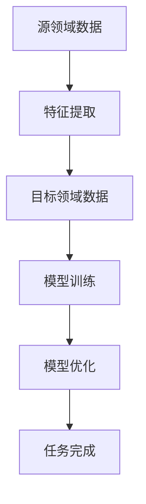
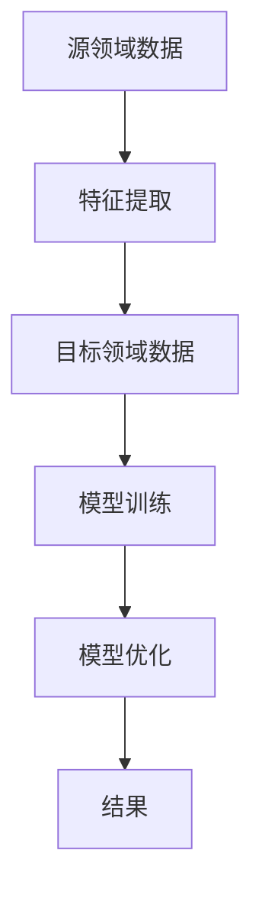
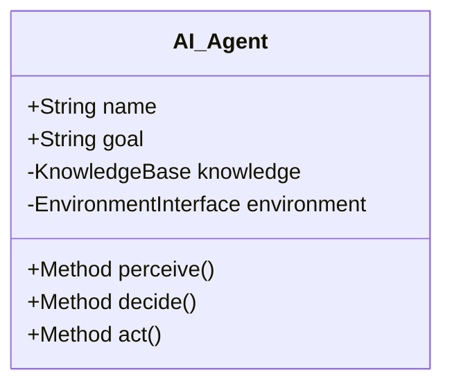
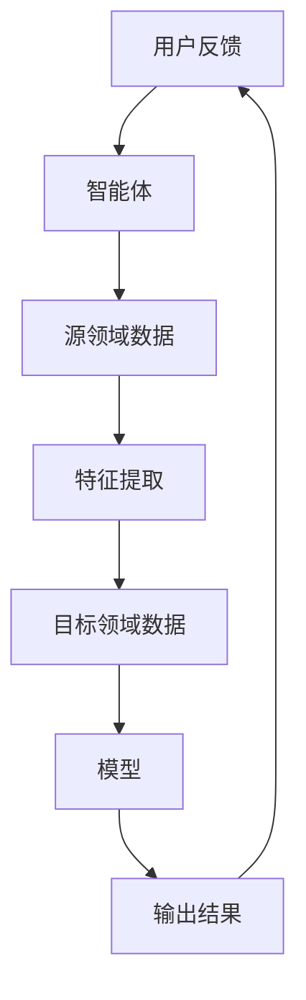

                 


---

# AI Agent的迁移学习在多模态任务中的应用

> 关键词：AI Agent，迁移学习，多模态任务，算法原理，系统架构，项目实战

> 摘要：本文详细探讨AI Agent在多模态任务中的迁移学习应用，从基本概念、算法原理到系统设计和项目实战，为读者提供全面的技术指导。

---

## 第一部分: AI Agent的迁移学习基础

### 第1章: AI Agent与迁移学习概述

#### 1.1 AI Agent的基本概念
- **1.1.1 AI Agent的定义与分类**
  - AI Agent的定义：智能体通过感知环境并采取行动以实现目标。
  - 分类：简单反射型、基于模型的反射型、目标驱动型、效用驱动型。

- **1.1.2 AI Agent的核心特征**
  - 感知环境：通过传感器或数据接口获取信息。
  - 决策与行动：基于感知信息做出决策并执行动作。
  - 学习能力：通过经验或数据改进性能。

- **1.1.3 AI Agent的应用场景**
  - 例如，自动驾驶中的路径规划、智能助手的自然语言处理等。

#### 1.2 迁移学习的基本概念
- **1.2.1 迁移学习的定义**
  - 将一个领域学到的知识应用到另一个相关领域。

- **1.2.2 迁移学习的核心思想**
  - 知识迁移，减少数据依赖，提升泛化能力。

- **1.2.3 迁移学习的分类与特点**
  - 分类：特征迁移、样本迁移、参数迁移。
  - 特点：跨领域应用，降低数据需求。

#### 1.3 多模态任务的定义与挑战
- **1.3.1 多模态数据的定义**
  - 文本、图像、语音等多种数据类型。

- **1.3.2 多模态任务的特点**
  - 融合多种数据源，提高准确性。

- **1.3.3 多模态任务中的挑战**
  - 数据异构性，模态间关联性低。

---

## 第2章: AI Agent迁移学习的核心概念与联系

### 2.1 AI Agent迁移学习的核心原理
- **2.1.1 知识迁移的机制**
  - 从源领域到目标领域的知识转移。

- **2.1.2 多模态数据的融合方法**
  - 融合方式：早期融合、晚期融合。

- **2.1.3 迁移学习在AI Agent中的作用**
  - 提高跨模态任务的性能。

### 2.2 核心概念对比分析
- **2.2.1 AI Agent与传统机器学习模型的对比**
  | 特性 | AI Agent | 传统机器学习 |
  |------|----------|--------------|
  | 感知 | 多模态    | 单一或少数模态 |

- **2.2.2 迁移学习与传统学习方法的对比**
  | 特性 | 迁移学习 | 传统学习 |
  |------|----------|-----------|
  | 数据需求 | 低       | 高        |

- **2.2.3 多模态任务与单模态任务的对比**
  | 特性 | 多模态任务 | 单模态任务 |
  |------|------------|------------|
  | 数据多样性 | 高          | 低         |

### 2.3 实体关系图与流程图


---

## 第3章: 迁移学习的算法原理

### 3.1 迁移学习的核心算法
- **3.1.1 特征提取与领域适配**
  - 特征提取：提取源领域和目标领域的共享特征。
  - 领域适配：调整模型参数以适应目标领域。

- **3.1.2 基于分布的迁移学习**
  - 方法：调整数据分布，使源领域和目标领域分布接近。

- **3.1.3 基于标记的迁移学习**
  - 方法：利用目标领域的标记数据进行微调。

### 3.2 迁移学习算法的流程图


---

## 第4章: 算法原理的数学模型与代码实现

### 4.1 算法原理的数学模型
- **领域适应的数学模型**
  $$ L = \lambda L_{source} + (1-\lambda) L_{target} $$

### 4.2 Python代码实现
```python
import torch
from torch import nn

class MigrationLearningModel(nn.Module):
    def __init__(self, input_dim, hidden_dim):
        super().__init__()
        self.fc1 = nn.Linear(input_dim, hidden_dim)
        self.fc2 = nn.Linear(hidden_dim, 1)  # 二分类任务

    def forward(self, x):
        x = torch.relu(self.fc1(x))
        x = self.fc2(x)
        return x

model = MigrationLearningModel(input_dim=10, hidden_dim=5)
```

---

## 第5章: 系统分析与架构设计

### 5.1 系统应用场景
- **应用场景**：跨模态数据处理，如文本和图像的联合分析。

### 5.2 系统功能设计


### 5.3 系统架构设计


---

## 第6章: 项目实战

### 6.1 环境安装
- 安装PyTorch和相关库。

### 6.2 核心代码实现
```python
import torch
from torch.utils.data import DataLoader

class MultiModalDataset(torch.utils.data.Dataset):
    def __init__(self, texts, images, labels):
        self.texts = texts
        self.images = images
        self.labels = labels

    def __getitem__(self, idx):
        return self.texts[idx], self.images[idx], self.labels[idx]

    def __len__(self):
        return len(self.texts)
```

### 6.3 代码解读与分析
- 数据集类定义，加载文本、图像和标签。

### 6.4 实际案例分析
- 使用MNIST数据集进行跨模态任务训练。

### 6.5 项目小结
- 总结项目实现的关键点和经验。

---

## 第7章: 最佳实践与总结

### 7.1 最佳实践 tips
- 数据预处理，模型调优。

### 7.2 小结
- 本文详细介绍了AI Agent的迁移学习在多模态任务中的应用。

### 7.3 注意事项
- 数据质量和分布对迁移学习效果影响大。

### 7.4 拓展阅读
- 推荐相关书籍和论文。

---

通过以上目录结构，文章将系统地介绍AI Agent的迁移学习在多模态任务中的应用，从理论到实践，帮助读者深入理解和应用相关技术。

