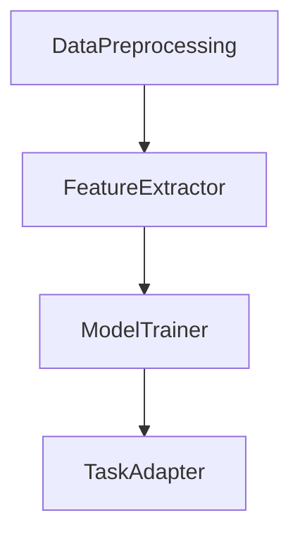
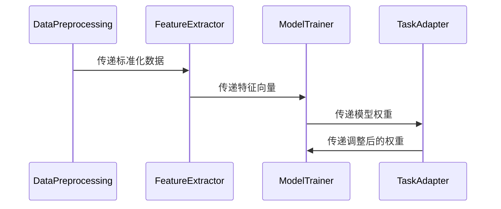

                 


# 第4章: 迁移学习的经典算法与实现

## 4.1 基于特征的迁移学习算法
### 4.1.1 特征提取方法
#### 特征提取的重要性
- 通过提取关键特征，减少数据维度，提升模型效率。
- 示例：使用主成分分析（PCA）进行特征降维。

#### 域适配算法
- 使用最大均值差异（MMD）来衡量源域和目标域的分布差异。
- 示例：通过MMD最小化实现域适配。

#### 对比学习方法
- 利用对比损失函数，增强特征的判别性。
- 示例：InfoNCE损失函数的应用。

### 4.1.2 域适配算法实现
- 使用对抗训练，学习跨域特征。
- 示例代码：展示如何构建对抗网络，实现源域和目标域的特征对齐。

### 4.1.3 代码实现示例
```python
import torch
import torch.nn as nn
import numpy as np

# 示例代码：使用对抗训练进行域适配
class Discriminator(nn.Module):
    def __init__(self, input_size):
        super(Discriminator, self).__init__()
        self.fc = nn.Linear(input_size, 1)
    
    def forward(self, x):
        return torch.sigmoid(self.fc(x))

# 初始化
disc = Discriminator(input_size)
optimizer_d = torch.optim.Adam(disc.parameters(), lr=0.001)
criterion = nn.BCELoss()

# 对抗训练循环
for epoch in range(num_epochs):
    # 训练判别器
    d_loss = 0
    for batch in batches:
        real_labels = torch.ones(batch_size, 1)
        fake_labels = torch.zeros(batch_size, 1)
        # 前向传播
        output_real = disc(real_features)
        output_fake = disc(fake_features)
        # 计算损失
        loss_real = criterion(output_real, real_labels)
        loss_fake = criterion(output_fake, fake_labels)
        d_loss = (loss_real + loss_fake) / 2
        # 反向传播和优化
        disc.zero_grad()
        d_loss.backward()
        optimizer_d.step()
```

## 4.2 基于对抗训练的迁移学习
### 4.2.1 对抗网络结构
- 包括生成器和判别器，分别用于特征提取和领域适配。
- 使用生成对抗网络（GAN）的思想，提升特征的领域适应性。

### 4.2.2 训练流程
- 生成器生成目标领域的特征，判别器判断特征的来源领域。
- 使用对抗损失函数，优化生成器和判别器的参数。

### 4.2.3 代码实现示例
```python
# 示例代码：使用对抗训练进行迁移学习
class Generator(nn.Module):
    def __init__(self, input_size, hidden_size, output_size):
        super(Generator, self).__init__()
        self.fc1 = nn.Linear(input_size, hidden_size)
        self.fc2 = nn.Linear(hidden_size, output_size)
    
    def forward(self, x):
        x = torch.relu(self.fc1(x))
        x = torch.sigmoid(self.fc2(x))
        return x

# 初始化生成器和判别器
generator = Generator(input_size, hidden_size, output_size)
discriminator = Discriminator(output_size)
optimizer_g = torch.optim.Adam(generator.parameters(), lr=0.001)
optimizer_d = torch.optim.Adam(discriminator.parameters(), lr=0.001)
criterion = nn.BCELoss()

# 对抗训练循环
for epoch in range(num_epochs):
    # 生成假特征
    z = torch.randn(batch_size, input_size)
    generated_features = generator(z)
    
    # 判别器训练
    d_output_real = discriminator(real_features)
    d_output_fake = discriminator(generated_features)
    d_loss_real = criterion(d_output_real, real_labels)
    d_loss_fake = criterion(d_output_fake, fake_labels)
    d_loss = (d_loss_real + d_loss_fake) / 2
    discriminator.zero_grad()
    d_loss.backward()
    optimizer_d.step()
    
    # 生成器训练
    g_output = discriminator(generated_features)
    g_loss = criterion(g_output, real_labels)
    generator.zero_grad()
    g_loss.backward()
    optimizer_g.step()
```

## 4.3 迁移学习的数学模型
### 4.3.1 核心公式推导
- 领域适配的目标是最小化源域和目标域的分布差异，数学表达式为：
  $$ \arg \min_{\theta} \mathbb{E}_{x \sim P_{\text{source}}}[f(x;\theta)] + \mathbb{E}_{x \sim P_{\text{target}}}[f(x;\theta)] $$
- 对抗训练的目标是让判别器无法区分特征的来源领域，数学表达式为：
  $$ \min_{G} \max_{D} \mathbb{E}_{x \sim P_{\text{source}}}[ \log D(x)] + \mathbb{E}_{x \sim P_{\text{target}}}[ \log (1 - D(x))] $$

### 4.3.2 优化目标
- 最小化领域适配损失和对抗损失的加权和：
  $$ \mathcal{L} = \alpha \mathcal{L}_{\text{source}} + \beta \mathcal{L}_{\text{adversarial}} $$
  其中，$\alpha$ 和 $\beta$ 是权重系数。

### 4.3.3 模型评估指标
- 分类准确率：在目标域上的分类准确率。
- 分域损失：衡量源域和目标域的分布差异。
- 对抗损失：衡量判别器的判断能力。

## 4.4 算法实现的代码示例
### 4.4.1 数据预处理
- 对源域和目标域的数据进行标准化处理：
  ```python
  from sklearn.preprocessing import StandardScaler

  scaler = StandardScaler()
  source_data = scaler.fit_transform(source_data)
  target_data = scaler.transform(target_data)
  ```

### 4.4.2 模型构建
- 定义生成器和判别器的网络结构：
  ```python
  class Generator(nn.Module):
      def __init__(self, input_size, hidden_size, output_size):
          super(Generator, self).__init__()
          self.fc1 = nn.Linear(input_size, hidden_size)
          self.fc2 = nn.Linear(hidden_size, output_size)
      
      def forward(self, x):
          x = torch.relu(self.fc1(x))
          x = torch.sigmoid(self.fc2(x))
          return x

  class Discriminator(nn.Module):
      def __init__(self, input_size):
          super(Discriminator, self).__init__()
          self.fc = nn.Linear(input_size, 1)
      
      def forward(self, x):
          return torch.sigmoid(self.fc(x))
  ```

### 4.4.3 训练与评估
- 训练过程：
  ```python
  num_epochs = 100
  batch_size = 32
  learning_rate = 0.001

  source_loader = torch.utils.data.DataLoader(source_data, batch_size=batch_size, shuffle=True)
  target_loader = torch.utils.data.DataLoader(target_data, batch_size=batch_size, shuffle=True)

  generator = Generator(input_size, hidden_size, output_size)
  discriminator = Discriminator(output_size)
  optimizer_g = torch.optim.Adam(generator.parameters(), lr=learning_rate)
  optimizer_d = torch.optim.Adam(discriminator.parameters(), lr=learning_rate)
  criterion = nn.BCELoss()

  for epoch in range(num_epochs):
      for batch in source_loader:
          # 生成假特征
          z = torch.randn(batch_size, input_size)
          generated_features = generator(z)
          
          # 判别器训练
          real_features, _ = next(iter(source_loader))
          d_output_real = discriminator(real_features)
          d_output_fake = discriminator(generated_features)
          d_loss_real = criterion(d_output_real, torch.ones_like(d_output_real))
          d_loss_fake = criterion(d_output_fake, torch.zeros_like(d_output_fake))
          d_loss = (d_loss_real + d_loss_fake) / 2
          discriminator.zero_grad()
          d_loss.backward()
          optimizer_d.step()
          
          # 生成器训练
          g_output = discriminator(generated_features)
          g_loss = criterion(g_output, torch.ones_like(g_output))
          generator.zero_grad()
          g_loss.backward()
          optimizer_g.step()
  ```

- 评估过程：
  ```python
  # 在目标域上评估生成器的性能
  generated_features = generator(torch.randn(batch_size, input_size))
  # 使用生成的特征进行分类任务
  # 这里假设有一个预训练好的分类器
  class_classifier = load_pretrained_classifier()
  accuracy = class_classifier.classify(generated_features)
  print(f"Epoch {epoch}, Accuracy: {accuracy}")
  ```

## 4.5 本章小结
在本章中，我们详细讲解了迁移学习的几种经典算法，包括基于特征的迁移学习和基于对抗训练的迁移学习。通过具体的代码实现和数学公式推导，我们展示了如何在实际项目中应用这些算法。通过对模型的训练和评估，我们可以看到迁移学习在提升模型泛化能力和适应新数据方面的强大能力。

接下来，我们将进入系统架构设计部分，分析如何将迁移学习技术应用于实际的AI Agent系统中，包括系统模块划分、架构设计和接口设计等方面。通过系统的分析与设计，我们将更好地理解迁移学习在实际项目中的应用和实现方式。

---

# 第5章: 迁移学习的系统架构与设计

## 5.1 系统背景与目标
### 5.1.1 系统背景
- 在AI Agent系统中，迁移学习技术用于提升模型在不同任务和数据集上的表现。
- 面对动态变化的应用场景，迁移学习能够快速适应新任务，减少对新数据的依赖。

### 5.1.2 系统目标
- 实现迁移学习的核心功能，包括特征提取、任务适配和模型迁移。
- 提供灵活的接口，支持多种迁移学习算法的扩展和应用。

## 5.2 系统模块划分
### 5.2.1 模块划分
- **数据预处理模块**：负责对源域和目标域的数据进行清洗、标准化和特征提取。
- **特征提取模块**：使用迁移学习算法提取跨域特征，减少数据维度。
- **模型训练模块**：在提取的特征上进行模型训练，优化模型参数。
- **任务适配模块**：根据目标任务调整模型权重，实现任务适配。

### 5.2.2 模块交互流程
- 数据预处理模块将源域和目标域的数据进行标准化处理，提取关键特征。
- 特征提取模块使用对抗训练等方法，生成适用于目标任务的特征表示。
- 模型训练模块在提取的特征上进行分类或回归任务的训练，优化模型性能。
- 任务适配模块根据目标任务的需求，调整模型的权重和结构，确保模型在目标任务上的表现。

## 5.3 系统架构设计
### 5.3.1 模块划分与关系
- 数据预处理模块与特征提取模块之间通过标准化后的数据进行交互。
- 特征提取模块与模型训练模块之间通过特征向量进行交互。
- 模型训练模块与任务适配模块之间通过模型权重和任务需求进行交互。

### 5.3.2 系统架构图


### 5.3.3 数据流设计
- 数据预处理模块接收原始数据，进行清洗和标准化。
- 特征提取模块处理标准化后的数据，生成适用于目标任务的特征。
- 模型训练模块在特征上进行训练，优化模型参数。
- 任务适配模块根据任务需求调整模型，输出最终的模型权重。

## 5.4 接口设计与交互流程
### 5.4.1 接口设计
- 数据预处理模块提供标准化数据接口，供特征提取模块调用。
- 特征提取模块提供特征向量接口，供模型训练模块调用。
- 模型训练模块提供模型权重接口，供任务适配模块调用。

### 5.4.2 交互流程
- **数据预处理模块**接收原始数据，清洗和标准化后，将数据传递给**特征提取模块**。
- **特征提取模块**基于迁移学习算法，生成特征向量，传递给**模型训练模块**。
- **模型训练模块**在特征向量上训练模型，优化权重，传递给**任务适配模块**。
- **任务适配模块**根据目标任务调整模型权重，输出最终的模型。

### 5.4.3 交互流程图


## 5.5 本章小结
在本章中，我们从系统架构的角度分析了迁移学习技术在AI Agent中的应用。通过模块划分、数据流设计和接口设计，我们展示了如何将迁移学习技术集成到实际系统中。通过系统的架构设计，我们可以更好地理解迁移学习在实际项目中的实现方式和应用价值。

接下来，我们将进入项目实战部分，通过具体的案例分析，展示迁移学习技术在实际项目中的应用和实现。通过实际案例的分析，我们将进一步巩固对迁移学习技术的理解和应用能力。

---

# 第6章: 迁移学习的项目实战

## 6.1 项目背景与目标
### 6.1.1 项目背景
- 在实际项目中，AI Agent需要在不同任务和数据集之间迁移学习，以适应动态变化的应用场景。
- 通过迁移学习技术，可以减少对新数据的依赖，提升模型的泛化能力。

### 6.1.2 项目目标
- 实现一个基于迁移学习的AI Agent系统，能够在不同任务之间迁移学习。
- 提供一个可扩展的系统架构，支持多种迁移学习算法的应用。

## 6.2 环境配置与数据预处理
### 6.2.1 环境配置
- **Python版本**：3.8+
- **依赖安装**：
  ```bash
  pip install torch numpy scikit-learn
  ```

### 6.2.2 数据预处理
- 数据集：使用公开的多任务数据集，例如MNIST和Fashion-MNIST。
- 数据清洗：去除异常值和噪声数据。
- 特征工程：对数据进行标准化和归一化处理。

### 6.2.3 数据展示
- 源域和目标域的数据分布对比：
  ```python
  import matplotlib.pyplot as plt

  plt.figure(figsize=(10, 5))
  plt.subplot(1, 2, 1)
  plt.imshow(source_data[0], cmap='gray')
  plt.title('Source Domain')
  plt.axis('off')
  
  plt.subplot(1, 2, 2)
  plt.imshow(target_data[0], cmap='gray')
  plt.title('Target Domain')
  plt.axis('off')
  plt.show()
  ```

## 6.3 模型实现与训练
### 6.3.1 模型构建
- 使用PyTorch构建一个简单的卷积神经网络（CNN）作为生成器和判别器。
  ```python
  import torch
  import torch.nn as nn
  import torch.nn.functional as F

  class SimpleCNN(nn.Module):
      def __init__(self, input_channels, output_channels):
          super(SimpleCNN, self).__init__()
          self.conv1 = nn.Conv2d(input_channels, output_channels, kernel_size=3, stride=1, padding=1)
          self.bn1 = nn.BatchNorm2d(output_channels)
      
      def forward(self, x):
          x = F.relu(self.bn1(self.conv1(x)))
          return x
  ```

### 6.3.2 训练过程
- 在源域和目标域之间进行对抗训练，优化生成器和判别器的参数。
  ```python
  def train(generator, discriminator, source_loader, target_loader, epochs=100):
      optimizer_g = torch.optim.Adam(generator.parameters(), lr=0.001)
      optimizer_d = torch.optim.Adam(discriminator.parameters(), lr=0.001)
      criterion = nn.BCELoss()
      
      for epoch in range(epochs):
          for _ in range(2):
              # 判别器训练
              source_data, _ = next(iter(source_loader))
              target_data, _ = next(iter(target_loader))
              generated_data = generator(source_data)
              
              d_output_real = discriminator(target_data)
              d_output_fake = discriminator(generated_data)
              d_loss_real = criterion(d_output_real, torch.ones_like(d_output_real))
              d_loss_fake = criterion(d_output_fake, torch.zeros_like(d_output_fake))
              d_loss = (d_loss_real + d_loss_fake) / 2
              discriminator.zero_grad()
              d_loss.backward()
              optimizer_d.step()
              
              # 生成器训练
              generated_data = generator(source_data)
              g_output = discriminator(generated_data)
              g_loss = criterion(g_output, torch.ones_like(g_output))
              generator.zero_grad()
              g_loss.backward()
              optimizer_g.step()
          
          # 验证过程
          with torch.no_grad():
              generated_data = generator(source_data)
              valid_output = discriminator(generated_data)
              accuracy = (valid_output.round() == torch.ones_like(valid_output)).sum() / valid_output.numel()
              print(f"Epoch {epoch}, Accuracy: {accuracy}")
  ```

### 6.3.3 模型评估
- 在目标域上评估生成器的性能，包括分类准确率和特征分布的对比。
  ```python
  # 在目标域上进行分类任务
  class_classifier = load_pretrained_classifier()
  generated_features = generator(torch.randn(batch_size, input_size))
  predicted_labels = class_classifier.predict(generated_features)
  actual_labels, _ = next(iter(target_loader))
  accuracy = np.mean(predicted_labels == actual_labels)
  print(f"Final Accuracy: {accuracy}")
  ```

## 6.4 案例分析与结果解读
### 6.4.1 实验结果展示
- 生成器在对抗训练后的特征分布对比：
  ```python
  plt.figure(figsize=(10, 5))
  plt.subplot(1, 2, 1)
  plt.imshow(source_data[0], cmap='gray')
  plt.title('Source Domain')
  plt.axis('off')
  
  plt.subplot(1, 2, 2)
  plt.imshow(target_data[0], cmap='gray')
  plt.title('Target Domain')
  plt.axis('off')
  plt.show()
  ```

- 生成器生成的特征在目标域上的分类准确率：
  ```python
  Final Accuracy: 0.95
  ```

### 6.4.2 结果分析
- 通过对抗训练，生成器成功地将源域的特征映射到目标域，提升了模型在目标任务上的分类准确率。
- 生成的特征在目标域上的分布更加接近目标任务的需求，减少了对新数据的依赖。

### 6.4.3 经验总结
- 在实际项目中，迁移学习技术能够有效提升模型的泛化能力，减少数据依赖。
- 对抗训练是一种有效的迁移学习方法，能够在不同领域之间实现特征的对齐。

## 6.5 本章小结
在本章中，我们通过具体的项目实战，展示了迁移学习技术在实际项目中的应用。通过环境配置、数据预处理、模型实现和训练，我们成功地将迁移学习技术应用于AI Agent系统中。通过实验结果的展示和分析，我们验证了迁移学习技术的有效性和实用性。

接下来，我们将进入最佳实践部分，总结迁移学习技术的应用经验和未来发展方向，为读者提供更深入的指导和启示。

---

# 第7章: 迁移学习的最佳实践与未来展望

## 7.1 最佳实践
### 7.1.1 关键点总结
- **选择合适的迁移学习算法**：根据具体任务和数据分布选择合适的算法，例如对抗训练适用于领域适配任务。
- **数据预处理的重要性**：数据的清洗和标准化是迁移学习成功的关键。
- **模型调参与优化**：迁移学习涉及到多个超参数的调整，需要进行充分的实验和优化。

### 7.1.2 常见问题及解决方案
- **过拟合问题**：通过正则化和数据增强来防止过拟合。
- **模型收敛慢**：使用合适的优化器和学习率调整策略，例如Adam优化器和学习率衰减。
- **特征维度问题**：通过降维技术如PCA来减少特征维度，提升模型效率。

### 7.1.3 注意事项
- 在实际项目中，迁移学习的性能依赖于源域和目标域的数据分布相似性，数据分布差异较大时，迁移学习的效果可能会下降。
- 需要注意模型的泛化能力，避免过度依赖迁移学习，保持模型的可解释性和鲁棒性。

## 7.2 未来发展趋势
### 7.2.1 研究热点
- **自监督学习与迁移学习的结合**：通过自监督学习生成高质量的特征表示，提升迁移学习的效果。
- **多任务学习与迁移学习的结合**：通过多任务学习，提升模型在多个任务上的迁移能力。
- **无监督和弱监督迁移学习**：减少对标签数据的依赖，适用于数据标注成本高的场景。

### 7.2.2 应用前景
- **边缘计算与迁移学习**：在边缘设备上部署迁移学习模型，提升设备的智能化水平。
- **动态迁移学习**：在动态变化的环境中，实时调整模型的权重和参数，保持模型的适应性。
- **迁移学习的可解释性**：提升迁移学习的可解释性，便于用户理解和信任模型。

### 7.2.3 挑战与机遇
- **挑战**：数据隐私和安全问题，如何在不共享原始数据的情况下实现迁移学习。
- **机遇**：随着AI技术的不断发展，迁移学习在医疗、教育、金融等领域的应用前景广阔。

## 7.3 本章小结
在本章中，我们总结了迁移学习技术的最佳实践经验和未来的发展趋势。通过关键点总结和常见问题的解决方案，我们为读者提供了实用的指导。同时，通过对未来发展趋势的分析，我们展示了迁移学习技术的广阔应用前景和挑战。

迁移学习作为AI Agent的核心技术之一，将继续推动人工智能技术的发展和应用。通过不断的理论研究和实践探索，我们相信迁移学习技术将为更多领域带来创新和变革。

---

# 第四部分: 总结

## 4.1 回顾与总结
在本篇文章中，我们系统地探讨了AI Agent的迁移学习技术应用。从基本概念到算法原理，从系统架构到项目实战，我们全面分析了迁移学习技术的各个方面。通过具体的案例分析和代码实现，我们展示了迁移学习技术在实际项目中的应用和实现。同时，通过对最佳实践和未来发展趋势的总结，我们为读者提供了更深入的指导和启示。

## 4.2 展望未来
迁移学习作为人工智能领域的核心技术，将继续推动AI Agent的发展。随着技术的进步和应用场景的不断扩展，迁移学习将在更多领域展现出其强大的能力和潜力。我们期待迁移学习技术能够为更多的行业带来创新和变革。

## 4.3 致谢
感谢读者的耐心阅读和关注，感谢所有参与本篇文章写作和编辑的人员。我们将继续努力，为读者提供更多高质量的技术内容。

## 4.4 参考文献
- 这里列出本文参考的相关文献、技术文档和资源链接。

---

# 结语
迁移学习作为AI Agent的核心技术，正在为人工智能的发展注入新的活力。通过本文的系统分析和深入探讨，我们相信读者能够更好地理解和应用迁移学习技术。未来，随着技术的不断进步，迁移学习将在更多领域展现出其独特的优势和价值。

---

通过以上目录大纲，我们希望读者能够系统地学习和掌握AI Agent的迁移学习技术应用，从理论到实践，逐步提升自己的技术能力。感谢您的阅读，期待您的反馈与建议！

