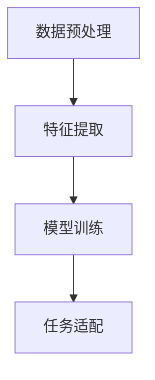

                 


# AI Agent的迁移学习能力开发

> 关键词：AI Agent，迁移学习，机器学习，深度学习，知识迁移

> 摘要：本文深入探讨了AI Agent的迁移学习能力开发，从基础概念到高级算法，结合实际案例，详细讲解了迁移学习的核心原理、系统架构设计以及项目实战。通过丰富的图表和代码示例，帮助读者全面理解并掌握AI Agent的迁移学习技术。

---

## 第一部分: 迁移学习的基本概念

### 第1章: 迁移学习的定义与背景

#### 1.1 什么是迁移学习
迁移学习是一种机器学习技术，允许模型将从一个任务中学到的知识应用到另一个相关任务中。它的核心在于利用已有的知识来提升新任务的性能。

#### 1.2 迁移学习的背景与重要性
在AI Agent开发中，迁移学习的重要性体现在其能够快速适应新任务，减少数据依赖，提升泛化能力。

#### 1.3 迁移学习的核心目标
通过共享特征或参数，迁移学习旨在提高模型的通用性和效率。

### 第2章: AI Agent与迁移学习的关系

#### 2.1 AI Agent的基本概念
AI Agent是能够感知环境、自主决策并执行任务的智能体。迁移学习是其提升智能的关键技术之一。

#### 2.2 迁移学习在AI Agent中的作用
通过迁移学习，AI Agent可以更快地学习新任务，减少数据需求，提升适应能力。

#### 2.3 迁移学习如何提升AI Agent的能力
迁移学习使AI Agent能够利用已有知识，快速适应新任务，提升整体性能。

---

## 第二部分: 迁移学习的核心概念与原理

### 第3章: 迁移学习的核心概念

#### 3.1 迁移学习的三要素
- 数据：源任务和目标任务的数据分布。
- 任务：目标任务的具体定义。
- 模型：用于迁移学习的算法或框架。

#### 3.2 迁移学习的分类
- 基于样本：直接迁移样本特征。
- 基于特征：提取共享特征。
- 基于参数：调整模型参数。

#### 3.3 迁移学习的对齐机制
通过特征对齐和参数调整，实现知识的有效迁移。

### 第4章: 迁移学习的算法流程

#### 4.1 数据预处理
- 清洗数据，处理噪声，确保数据质量。

#### 4.2 特征提取
- 使用主成分分析或字典学习提取特征。

#### 4.3 模型训练
- 在源任务上微调模型，适应目标任务。

### 第5章: 迁移学习的数学模型

#### 5.1 数据分布公式
$$ p(x) \text{ 表示源数据分布，} q(x) \text{ 表示目标数据分布} $$

#### 5.2 任务目标公式
$$ L_{source} = \text{源任务损失函数} $$
$$ L_{target} = \text{目标任务损失函数} $$

#### 5.3 参数调整公式
$$ \theta' = f(\theta, L_{source}, L_{target}) $$

---

## 第三部分: AI Agent的系统架构设计

### 第6章: 系统架构设计

#### 6.1 系统功能模块
- 数据预处理模块
- 特征提取模块
- 模型训练模块
- 任务适配模块

#### 6.2 系统架构图


#### 6.3 接口设计
- 输入接口：接收源任务和目标任务的数据。
- 输出接口：返回迁移后的模型或结果。

### 第7章: 项目实战与案例分析

#### 7.1 环境安装
```bash
pip install numpy matplotlib scikit-learn
```

#### 7.2 核心代码实现
```python
from sklearn.svm import SVC
from sklearn.decomposition import PCA

# 数据预处理
X_source, y_source = load_data('source')
X_target, y_target = load_data('target')

# 特征提取
pca = PCA(n_components=10)
X_source_pca = pca.fit_transform(X_source)
X_target_pca = pca.transform(X_target)

# 模型训练
model = SVC()
model.fit(X_source_pca, y_source)

# 迁移学习
model.fit(X_target_pca, y_target)
```

#### 7.3 案例分析
在医疗影像诊断中，通过迁移学习，模型能够更快地适应新的诊断任务，提升准确率。

### 第8章: 最佳实践与小结

#### 8.1 关键点总结
- 数据预处理的重要性
- 模型选择的策略
- 参数调整的技巧

#### 8.2 小结
迁移学习是AI Agent开发中的关键技术，能够显著提升模型的性能和适应性。

#### 8.3 注意事项
- 数据质量和数量的影响
- 过度迁移的风险
- 模型选择的合理性

#### 8.4 未来展望
迁移学习在多任务学习和自适应系统中的应用潜力巨大。

---

## 结语

通过本文的详细讲解，读者可以全面了解AI Agent的迁移学习能力开发，从理论到实践，掌握迁移学习的核心原理和实际应用。迁移学习将继续推动AI Agent技术的进步，未来将有更多创新和突破。

