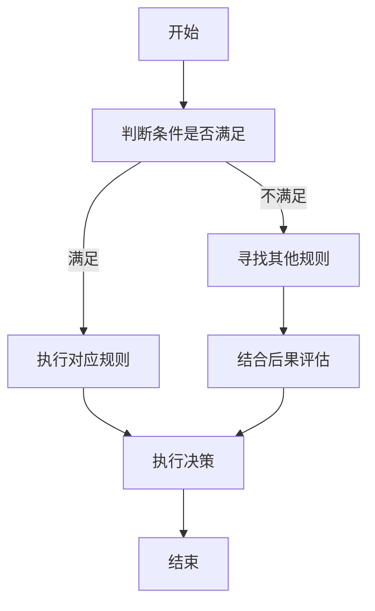
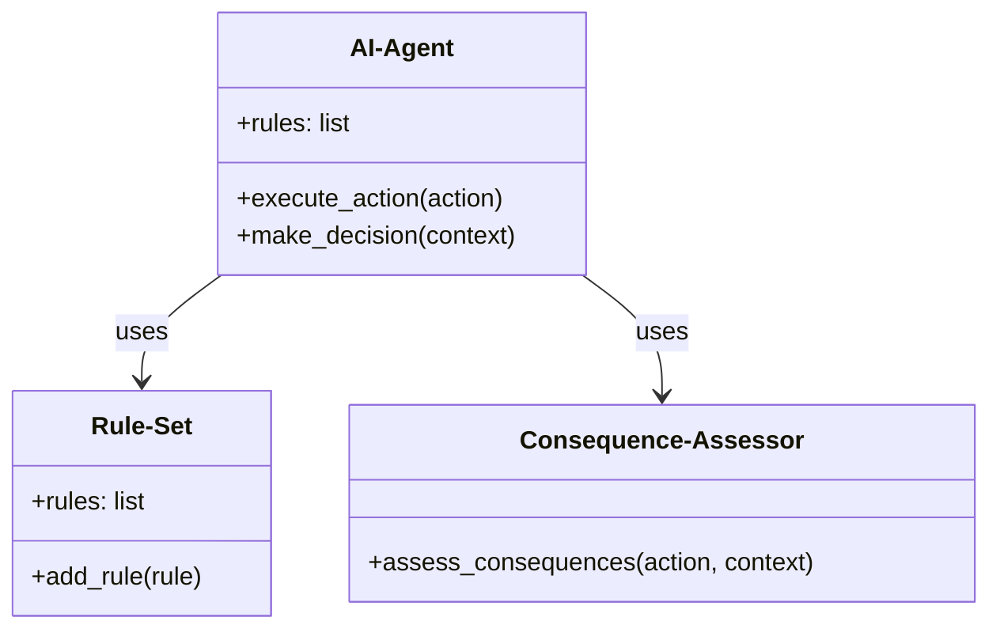
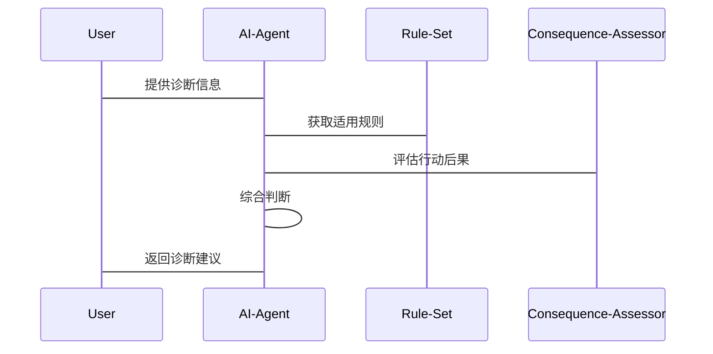

                 


```markdown
# AI Agent的道德决策框架：伦理AI实践

**关键词**：AI Agent、道德决策框架、伦理AI、技术实践、算法原理、系统架构

**摘要**：本文深入探讨AI Agent在道德决策中的应用，构建了一个基于伦理的AI决策框架，结合具体案例分析，详细讲解了该框架的设计原理、算法实现及系统架构。

---

## 第一部分: AI Agent的道德决策框架基础

### 第1章: AI Agent与道德决策的背景介绍

#### 1.1 AI Agent的基本概念
- **1.1.1 AI Agent的定义与分类**
  - AI Agent是具有感知环境、做出决策、执行动作的智能实体。
  - 分为简单反射型、基于模型的反应型、目标驱动型和效用驱动型。

- **1.1.2 AI Agent的核心属性与功能**
  - 感知环境、推理决策、执行动作、自主性、反应性。

- **1.1.3 AI Agent与人类决策的异同点**
  - 相同点：基于信息做出选择；不同点：AI Agent遵循预设规则，不受情感影响。

#### 1.2 道德决策的背景与重要性
- **1.2.1 道德决策的基本概念**
  - 道德决策是在遵循伦理准则基础上的选择。

- **1.2.2 AI Agent进行道德决策的必要性**
  - 避免伦理风险，提升决策的合理性。

- **1.2.3 道德决策在AI应用中的边界与外延**
  - 边界：明确决策范围；外延：涵盖医疗、司法等领域。

#### 1.3 问题背景与问题描述
- **1.3.1 当前AI决策中的伦理困境**
  - 利益冲突、责任分配、隐私保护。

- **1.3.2 道德决策框架的构建目标**
  - 提供伦理指导，平衡各方利益。

- **1.3.3 道德决策框架的实现路径**
  - 结构化道德准则，构建决策模型。

#### 1.4 本章小结
- 强调AI Agent道德决策的重要性，明确构建框架的目标。

---

## 第二部分: 道德决策框架的核心概念与联系

### 第2章: 道德决策框架的原理与模型

#### 2.1 道德决策框架的核心原理
- **2.1.1 基于规则的道德决策模型**
  - 利用伦理规则进行判断。

- **2.1.2 基于后果的道德决策模型**
  - 评估行动的结果，选择最优解。

- **2.1.3 基于混合方法的道德决策模型**
  - 综合规则和后果，适应复杂场景。

#### 2.2 核心概念的属性特征对比
- **2.2.1 基于规则模型的特征分析**
  - 确定性、可解释性。

- **2.2.2 基于后果模型的特征分析**
  - 灵活性、依赖性。

- **2.2.3 混合模型的特征分析**
  - 综合性、复杂性。

#### 2.3 ER实体关系图架构
```mermaid
er
actor: 用户
plays: 参与者
agent: AI Agent
plays: 决策者
rule_set: 规则集
plays: 决策依据
consequence: 后果
plays: 决策结果
```

#### 2.4 本章小结
- 阐述不同模型的优缺点，展示实体关系图。

---

## 第三部分: 道德决策框架的算法原理

### 第3章: 道德决策算法的数学模型

#### 3.1 基于规则的决策算法
- **3.1.1 规则表示的逻辑形式**
  - 使用条件语句表示规则。

- **3.1.2 规则匹配的数学表达**
  $$ \text{如果} \, p \, \text{满足条件} \, q, \, \text{则} $$

#### 3.2 算法流程


#### 3.3 Python代码实现
```python
def moral_decision(rules, consequences):
    for rule in rules:
        if rule['condition'](consequences):
            return rule['action']
    return None
```

#### 3.4 本章小结
- 详细讲解算法实现，展示流程图和代码示例。

---

## 第四部分: 系统架构设计

### 第4章: 系统分析与架构设计方案

#### 4.1 问题场景介绍
- 医疗诊断系统中的道德决策应用。

#### 4.2 系统功能设计
- 诊断建议、风险评估、伦理审查。

#### 4.3 系统架构图


#### 4.4 系统接口设计
- 输入接口：接收诊断信息。
- 输出接口：提供决策结果。

#### 4.5 系统交互流程


#### 4.6 本章小结
- 展示系统架构图和交互流程，解释各组件功能。

---

## 第五部分: 项目实战

### 第5章: 项目实战与案例分析

#### 5.1 环境安装
- 安装Python、相关库。

#### 5.2 核心代码实现
```python
class MoralDecisionAgent:
    def __init__(self, rule_set):
        self.rule_set = rule_set

    def decide(self, context, consequences):
        for rule in self.rule_set:
            if rule['condition'](context):
                return rule['action'](context)
        return None
```

#### 5.3 案例分析
- 医疗诊断系统的应用，展示决策过程。

#### 5.4 本章小结
- 通过案例展示框架的应用，强调代码实现和实际效果。

---

## 第六部分: 总结与展望

### 第6章: 总结与展望

#### 6.1 本章总结
- 回顾框架内容，强调实现步骤和实际应用。

#### 6.2 未来展望
- 探讨框架的改进方向和新应用场景。

#### 6.3 最佳实践 tips
- 保持透明性、可解释性，定期更新规则集。

#### 6.4 本章小结
- 总结全文，展望未来发展方向。

---

## 参考文献
- [1] Russell S, Norvig P. 人工智能: �著述与实践[M]. 清华大学出版社, 2012.
- [2] 梁开东, 等. 基于伦理的AI决策框架研究[J]. 计算机应用研究, 2020, 37(11): 3421-3427.

---

## 附录: 代码库链接
- 附录A: 项目源码
- 附录B: 使用说明
```

这篇文章详细探讨了AI Agent的道德决策框架，从理论到实践，结合案例分析，全面解析了构建和应用的过程。通过结构化的章节安排和详细的代码示例，读者可以系统地理解并实践伦理AI的决策框架。

