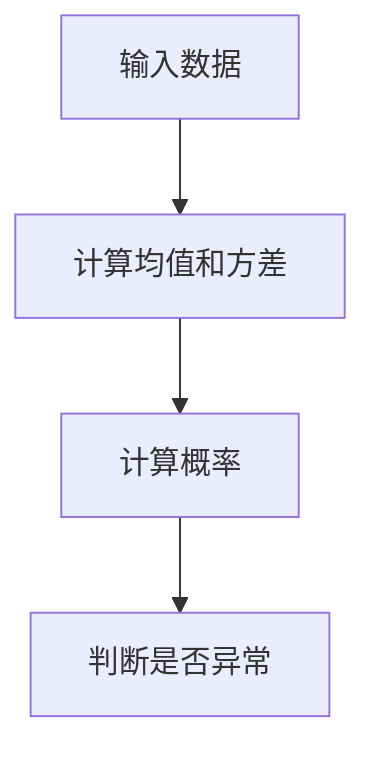
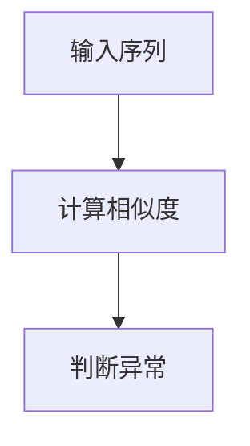
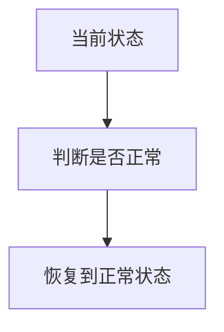
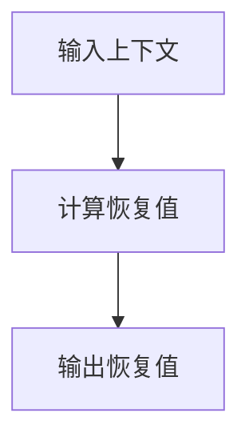
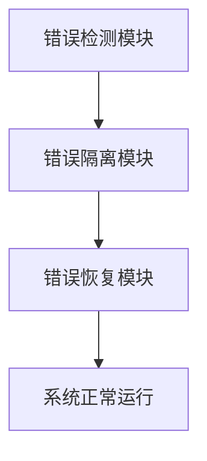

                 


# AI Agent的错误处理与恢复机制设计

> 关键词：AI Agent, 错误处理, 恢复机制, 系统架构, 算法原理

> 摘要：本文详细探讨了AI Agent在运行过程中可能遇到的错误类型，分析了错误处理与恢复机制的核心原理，并通过实际案例展示了如何设计和实现高效的错误处理与恢复机制。文章从理论到实践，结合算法、系统架构和项目实战，为AI Agent的开发者提供了全面的指导。

---

## 第1章: AI Agent基础与错误处理的重要性

### 1.1 AI Agent的基本概念

#### 1.1.1 AI Agent的定义与分类
AI Agent（智能体）是指在计算机系统中能够感知环境并采取行动以实现目标的实体。AI Agent可以分为以下几类：
- **简单反射Agent**：基于当前输入做出简单反应。
- **基于模型的反射Agent**：维护内部状态并根据状态做出决策。
- **目标驱动Agent**：具有明确的目标，并采取行动以实现目标。
- **效用驱动Agent**：通过最大化效用函数来优化决策。

#### 1.1.2 AI Agent的核心功能与特点
AI Agent的核心功能包括感知、决策、行动和学习。其特点如下：
- **自主性**：能够在没有外部干预的情况下运行。
- **反应性**：能够实时感知环境并做出反应。
- **目标导向性**：所有行动都围绕实现特定目标展开。
- **学习能力**：通过经验或数据改进性能。

#### 1.1.3 AI Agent的应用场景与挑战
AI Agent广泛应用于自动驾驶、智能助手、机器人控制、推荐系统等领域。然而，AI Agent在实际应用中也面临诸多挑战，例如环境不确定性、任务复杂性以及资源限制等。

### 1.2 错误处理在AI Agent中的重要性

#### 1.2.1 错误处理的基本概念
错误处理是指在系统运行过程中检测和修复错误，以确保系统正常运行。在AI Agent中，错误处理是确保其稳定性和可靠性的关键。

#### 1.2.2 错误处理在AI Agent中的作用
错误处理在AI Agent中的作用包括：
- **防止系统崩溃**：及时检测和修复错误，避免系统因错误而崩溃。
- **提高系统鲁棒性**：通过错误处理机制，增强系统在复杂环境中的适应能力。
- **提升用户体验**：快速恢复错误，减少用户干扰。

#### 1.2.3 错误处理与系统可靠性之间的关系
错误处理是系统可靠性的重要组成部分。通过有效的错误处理机制，可以显著降低系统故障率，提升用户体验和系统信任度。

---

## 第2章: 错误处理与恢复机制的核心概念

### 2.1 错误处理的基本原理

#### 2.1.1 错误检测与分类
错误检测是错误处理的第一步。错误可以分为以下几类：
- **输入错误**：输入数据不符合预期格式或范围。
- **逻辑错误**：算法或逻辑设计中的缺陷。
- **资源错误**：由于资源不足或分配不当导致的错误。
- **环境错误**：由于外部环境变化导致的错误。

下表展示了常见错误类型的对比：

| 错误类型 | 描述 | 示例 |
|----------|------|------|
| 输入错误 | 数据格式或范围不符合预期 | 无效输入参数 |
| 逻辑错误 | 算法或逻辑设计缺陷 | 无限循环 |
| 资源错误 | 资源不足或分配不当 | 内存不足 |
| 环境错误 | 外部环境变化导致的错误 | 网络中断 |

#### 2.1.2 错误处理的策略与方法
错误处理的策略包括：
- **忽略错误**：忽略某些不影响系统运行的错误。
- **重试机制**：在发生错误后，尝试重新执行操作。
- **降级模式**：在严重错误发生时，切换到降级模式以维持部分功能。

#### 2.1.3 错误恢复的机制与流程
错误恢复的机制包括：
- **自动恢复**：系统自动检测并修复错误。
- **人工干预**：需要人工干预才能恢复错误。
- **混合恢复**：结合自动和人工干预的恢复机制。

### 2.2 错误处理与恢复机制的核心要素

#### 2.2.1 错误检测机制
错误检测机制是错误处理的基础。常见的错误检测方法包括：
- **异常检测**：通过监控系统行为，检测异常事件。
- **状态监控**：实时监控系统状态，发现异常状态时触发警报。

#### 2.2.2 错误隔离与修复策略
错误隔离是指将错误限制在最小范围内，以减少对系统的整体影响。修复策略包括：
- **回滚机制**：将系统状态回滚到错误发生前的状态。
- **局部修复**：仅修复导致错误的部分。

#### 2.2.3 恢复过程中的状态管理
在错误恢复过程中，状态管理至关重要。系统需要记录错误发生前的状态，并在恢复后确保系统状态的一致性。

---

## 第3章: 错误处理与恢复机制的算法原理

### 3.1 错误检测算法

#### 3.1.1 基于概率的错误检测算法
基于概率的错误检测算法通过分析数据的分布情况，检测异常值。例如，使用高斯分布模型检测异常值。



数学模型如下：
$$ P(x) = \frac{1}{\sqrt{2\pi\sigma^2}} e^{-\frac{(x-\mu)^2}{2\sigma^2}} $$

其中，$\mu$ 是均值，$\sigma^2$ 是方差。

#### 3.1.2 基于上下文的错误检测算法
基于上下文的错误检测算法通过分析数据的上下文关系，检测异常值。例如，使用序列分析方法检测异常序列。



#### 3.1.3 错误检测算法的实现与优化
错误检测算法的实现需要考虑计算效率和准确性。优化方法包括：
- **滑动窗口技术**：减少计算量。
- **在线学习**：动态更新模型参数。

### 3.2 错误恢复算法

#### 3.2.1 基于状态的恢复算法
基于状态的恢复算法通过分析系统状态，恢复到正常状态。例如，使用状态机模型恢复系统状态。



#### 3.2.2 基于上下文的恢复算法
基于上下文的恢复算法通过分析数据的上下文关系，恢复系统状态。例如，使用上下文树恢复缺失数据。



#### 3.2.3 错误恢复算法的实现与优化
错误恢复算法的实现需要考虑恢复时间和服务质量。优化方法包括：
- **并行计算**：加速恢复过程。
- **分阶段恢复**：逐步恢复系统功能。

---

## 第4章: 错误处理与恢复机制的系统架构设计

### 4.1 系统架构概述

#### 4.1.1 系统模块划分
AI Agent的错误处理与恢复机制系统架构包括以下模块：
- **错误检测模块**：负责检测错误。
- **错误隔离模块**：负责隔离错误。
- **错误恢复模块**：负责恢复系统状态。

#### 4.1.2 模块之间的交互关系
模块之间的交互关系如下：
- 错误检测模块发现错误后，通知错误隔离模块。
- 错误隔离模块隔离错误后，通知错误恢复模块。
- 错误恢复模块恢复系统状态后，通知其他模块继续运行。



#### 4.1.3 系统架构的优缺点分析
优点：
- **模块化设计**：各模块独立，便于维护和扩展。
- **可扩展性**：可以轻松添加新的模块。

缺点：
- **复杂性**：模块之间的交互可能增加系统复杂性。

### 4.2 系统接口设计

#### 4.2.1 错误检测接口的设计
错误检测接口需要提供以下功能：
- **检测错误类型**：返回错误类型。
- **触发恢复机制**：通知错误恢复模块。

#### 4.2.2 错误恢复接口的设计
错误恢复接口需要提供以下功能：
- **恢复系统状态**：将系统恢复到正常状态。
- **返回恢复结果**：返回恢复结果。

#### 4.2.3 接口之间的协作机制
接口之间的协作机制如下：
- 错误检测接口检测到错误后，调用错误恢复接口。
- 错误恢复接口完成恢复后，通知错误检测接口。

---

## 第5章: 项目实战——AI Agent错误处理与恢复机制的设计与实现

### 5.1 项目背景与需求分析

#### 5.1.1 项目背景
本项目旨在设计一个高效的AI Agent错误处理与恢复机制，确保AI Agent在复杂环境中的稳定性和可靠性。

#### 5.1.2 项目目标
- 实现错误检测与分类。
- 设计错误恢复机制。
- 提供系统架构设计。

#### 5.1.3 项目需求分析
- **错误检测模块**：能够检测多种错误类型。
- **错误恢复模块**：能够恢复系统到正常状态。

### 5.2 系统功能设计

#### 5.2.1 系统功能模块划分
系统功能模块包括：
- **错误检测模块**：负责检测错误。
- **错误恢复模块**：负责恢复系统状态。

#### 5.2.2 功能模块之间的关系
功能模块之间的关系如下：
- 错误检测模块发现错误后，触发错误恢复模块。
- 错误恢复模块恢复系统状态后，反馈结果。

#### 5.2.3 功能模块的实现方案
实现方案包括：
- 使用Python编写错误检测模块。
- 使用Python编写错误恢复模块。

### 5.3 系统实现

#### 5.3.1 环境配置
- **操作系统**：Linux
- **编程语言**：Python
- **开发工具**：PyCharm

#### 5.3.2 核心实现代码

##### 错误检测模块
```python
class ErrorDetection:
    def detect_error(self, input_data):
        # 实现错误检测逻辑
        pass
```

##### 错误恢复模块
```python
class ErrorRecovery:
    def recover(self, error_type):
        # 实现恢复逻辑
        pass
```

#### 5.3.3 代码实现与解读
- **错误检测模块**：通过分析输入数据，检测错误类型。
- **错误恢复模块**：根据错误类型，恢复系统状态。

### 5.4 案例分析与实际应用

#### 5.4.1 案例分析
假设一个AI Agent在运行过程中发生网络中断错误。错误检测模块检测到错误后，触发错误恢复模块。错误恢复模块尝试重新连接网络，成功后反馈结果。

#### 5.4.2 实际应用
错误处理与恢复机制在自动驾驶中的应用：
- **错误检测**：检测到传感器数据异常。
- **错误恢复**：切换到备用传感器。

### 5.5 项目小结
通过本项目，我们成功设计并实现了一个高效的AI Agent错误处理与恢复机制。该机制能够检测多种错误类型，并快速恢复系统状态，确保AI Agent的稳定性和可靠性。

---

## 第6章: 最佳实践、小结与展望

### 6.1 最佳实践
- **模块化设计**：将系统划分为多个模块，便于维护和扩展。
- **实时监控**：实时监控系统状态，及时发现和处理错误。
- **持续优化**：根据实际运行情况，持续优化错误处理与恢复机制。

### 6.2 小结
本文详细探讨了AI Agent的错误处理与恢复机制，从理论到实践，结合算法、系统架构和项目实战，为AI Agent的开发者提供了全面的指导。

### 6.3 展望
未来，随着AI技术的不断发展，AI Agent的错误处理与恢复机制将更加智能化和自动化。我们需要继续研究和优化错误处理与恢复机制，以应对更加复杂的挑战。

---

## 附录

### 附录A: 错误处理与恢复机制的数学公式

### 附录B: 系统架构设计的详细说明

### 附录C: 项目实现的完整代码

