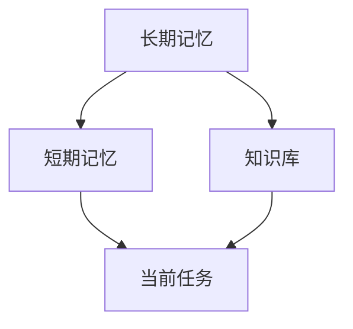
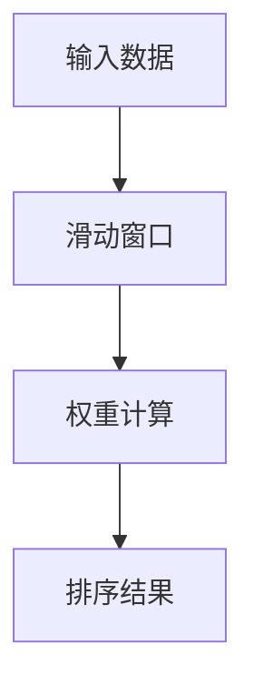
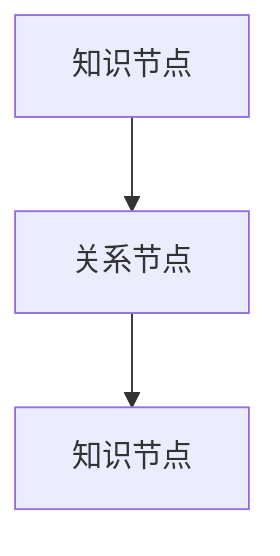
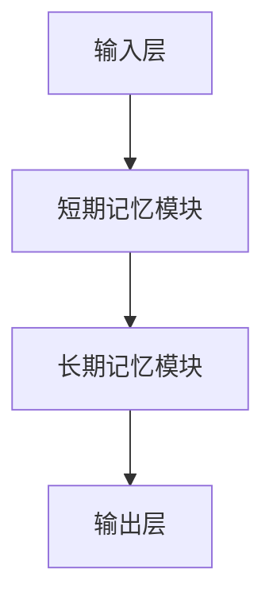
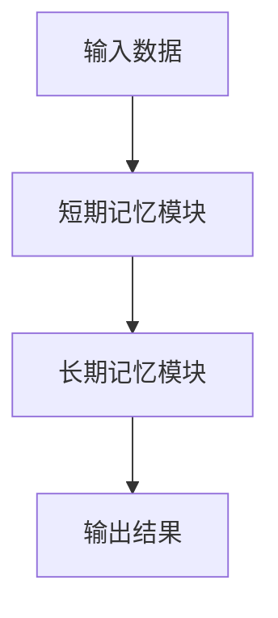

                 


# AI Agent的长短期记忆管理

> 关键词：AI Agent，长短期记忆，记忆管理，滑动窗口，知识图谱，记忆模块，系统架构

> 摘要：AI Agent作为人工智能领域的核心组件，其长短期记忆管理是实现智能决策和任务处理的关键技术。本文从背景、原理、算法、系统架构等多维度深入分析了AI Agent的长短期记忆管理，结合实际案例，详细阐述了记忆管理的核心算法、系统设计与实现方案，为AI Agent的记忆管理提供了全面的技术参考。

---

# 第一部分: AI Agent与长短期记忆管理概述

## 第1章: AI Agent与长短期记忆管理概述

### 1.1 长短期记忆管理的背景与问题背景

#### 1.1.1 从传统AI到AI Agent的演进
人工智能（AI）技术的发展经历了多个阶段，从最初的符号逻辑推理到基于规则的专家系统，再到近年来以深度学习为代表的大模型技术。AI Agent（智能体）作为一种能够感知环境、自主决策并执行任务的智能实体，逐渐成为人工智能领域的核心研究方向。AI Agent不仅需要具备强大的计算能力，还需要能够处理和管理复杂的信息流，尤其是在长短期记忆的结合上，AI Agent展现了其独特的优势。

#### 1.1.2 长短期记忆管理的核心问题
AI Agent的核心能力之一是理解和处理复杂信息的能力。在实际应用中，AI Agent需要处理大量动态变化的信息，这些信息既包括当前任务相关的短期信息，也包括历史知识库中的长期信息。如何有效地管理长短期记忆，使得AI Agent能够快速切换任务、保持上下文连贯性，同时避免信息过载或遗漏，是长短期记忆管理的核心问题。

#### 1.1.3 AI Agent的记忆管理的重要性
AI Agent的记忆管理是其实现智能决策的关键技术。通过长短期记忆的结合，AI Agent能够更好地理解任务背景、保持知识的连贯性，并在不同任务之间切换时保持一致性。记忆管理的好坏直接影响到AI Agent的性能和用户体验。

### 1.2 长短期记忆管理的定义与特点

#### 1.2.1 长期记忆与短期记忆的定义
- **长期记忆**：存储AI Agent的历史知识、通用常识和长期任务相关的数据。长期记忆通常是持久的，不会因为任务的切换而被清除。
- **短期记忆**：存储与当前任务直接相关的临时数据和上下文信息。短期记忆通常具有时间限制，信息会在任务完成或超时后被清理。

#### 1.2.2 长短期记忆的核心特点对比
| 特性 | 长期记忆 | 短期记忆 |
|------|----------|----------|
| 存储时间 | 长期、持久 | 短期、临时 |
| 记忆内容 | 历史知识、通用常识 | 当前任务相关数据 |
| 访问频率 | 低频 | 高频 |
| 管理方式 | 知识库管理 | 滑动窗口、优先级队列 |

#### 1.2.3 长短期记忆管理的边界与外延
长短期记忆管理的边界主要集中在AI Agent内部的数据存储和信息处理模块，其外延则涉及自然语言处理、知识图谱构建、分布式存储等技术领域。

### 1.3 长短期记忆管理的核心概念与联系

#### 1.3.1 长短期记忆管理的原理
长短期记忆管理通过将信息分为长期和短期两部分，并通过记忆模块的交互实现信息的高效管理和利用。长期记忆通常以知识图谱或数据库的形式存储，而短期记忆则以滑动窗口或队列的形式进行管理。

#### 1.3.2 长短期记忆的属性特征对比表
（如前所述）

#### 1.3.3 长短期记忆管理的系统架构


---

## 第2章: 长短期记忆管理的核心算法原理

### 2.1 短期记忆管理的算法原理

#### 2.1.1 基于滑动窗口的短期记忆管理
滑动窗口算法是一种常用的技术，用于管理短期记忆中的信息。该算法通过维护一个窗口，动态地添加新信息并移除超出窗口范围的旧信息。



#### 2.1.2 基于权重的短期记忆排序算法
为了更好地管理短期记忆，可以采用基于权重的排序算法，根据信息的重要性对短期记忆进行排序。

```python
def sliding_window_memory(input_data, window_size):
    memory = []
    for data in input_data:
        memory.append(data)
        if len(memory) > window_size:
            memory.pop(0)
    return memory
```

---

### 2.2 长期记忆管理的算法原理

#### 2.2.1 基于知识图谱的长期记忆构建
长期记忆通常以知识图谱的形式存储，通过语义网络或图数据库实现知识的关联存储和快速检索。



#### 2.2.2 长期记忆的知识存储与检索算法
知识图谱的构建和检索算法是长期记忆管理的核心技术。通过基于图的最短路径算法，可以实现知识的高效检索。

---

## 第3章: AI Agent长短期记忆管理的系统架构设计

### 3.1 问题场景介绍
AI Agent需要在复杂环境中处理多种任务，因此需要一个高效的记忆管理模块来协调长短期记忆的使用。

### 3.2 系统功能设计

#### 3.2.1 系统功能模块划分
- **输入层**：接收外部输入数据
- **短期记忆模块**：处理当前任务相关的短期信息
- **长期记忆模块**：存储和管理历史知识
- **输出层**：生成最终的决策输出

#### 3.2.2 系统功能流程


### 3.3 系统架构设计

#### 3.3.1 系统架构设计


#### 3.3.2 系统接口设计
- **短期记忆模块接口**：提供滑动窗口管理和权重计算功能
- **长期记忆模块接口**：提供知识图谱的构建和检索功能

#### 3.3.3 系统交互序列图


---

## 第4章: 项目实战与应用案例

### 4.1 项目实战

#### 4.1.1 环境安装与配置
```bash
pip install python-mermaid
```

#### 4.1.2 核心代码实现
```python
def sliding_window_memory(input_data, window_size):
    memory = []
    for data in input_data:
        memory.append(data)
        if len(memory) > window_size:
            memory.pop(0)
    return memory
```

#### 4.1.3 代码应用解读与分析
通过上述代码，可以实现短期记忆的滑动窗口管理。输入数据会不断被添加到记忆中，当记忆长度超过窗口大小时，最早的元素会被移除。

### 4.2 实际案例分析

#### 4.2.1 案例背景
以一个智能客服系统为例，AI Agent需要同时处理多个客户的咨询，需要在切换客户时保持上下文连贯性。

#### 4.2.2 系统实现
通过长短期记忆管理，AI Agent能够快速切换客户，并根据长期记忆中的历史咨询记录提供个性化的服务。

#### 4.2.3 案例总结
通过长短期记忆管理，AI Agent能够实现高效的客户服务，提升用户体验。

---

## 第5章: 最佳实践与总结

### 5.1 小结
AI Agent的长短期记忆管理是实现智能决策的关键技术。通过合理的记忆管理，AI Agent能够更好地处理复杂任务，提升性能和用户体验。

### 5.2 注意事项
- 短期记忆的窗口大小需要根据具体任务进行调整
- 长期记忆的知识图谱需要定期更新和维护
- 记忆管理模块的设计需要结合具体应用场景

### 5.3 拓展阅读
- 《知识图谱构建与应用》
- 《分布式存储技术入门与实践》

---

以上是《AI Agent的长短期记忆管理》的技术博客文章的详细目录和内容概要。

