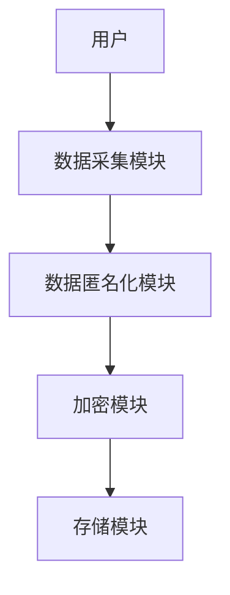

                 


# AI Agent的隐私保护：数据匿名化与加密

> **关键词**：AI Agent, 数据隐私, 数据匿名化, 数据加密, 隐私保护

> **摘要**：  
AI Agent作为人工智能领域的重要组成部分，正在被广泛应用于各种场景。然而，随着AI Agent的普及，数据隐私问题也日益突出。为了保护用户隐私，数据匿名化和加密技术成为关键手段。本文将深入探讨AI Agent中的隐私保护问题，分析数据匿名化与加密技术的核心概念、实现原理及其在AI Agent系统中的应用，通过实际案例展示如何在项目中实现这些技术。

---

## 第一部分：AI Agent的隐私保护背景与核心概念

### 第1章：AI Agent与隐私保护概述

#### 1.1 AI Agent的基本概念

##### 1.1.1 AI Agent的定义与特点
- **定义**：AI Agent（智能体）是能够感知环境并采取行动以实现目标的实体，通常通过传感器接收数据，并通过执行器与环境交互。
- **特点**：智能性、自主性、反应性、社会性。
- **应用场景**：智能家居、自动驾驶、智能客服、机器人助手等。

##### 1.1.2 AI Agent的应用场景
- 智能家居：控制家庭设备，优化能源使用。
- 自动驾驶：处理环境数据，做出驾驶决策。
- 智能客服：提供个性化服务，解决用户问题。

##### 1.1.3 AI Agent与隐私保护的关系
- AI Agent需要处理大量敏感数据（如位置、行为模式）。
- 隐私泄露风险：数据可能被滥用或未经授权访问。
- 隐私保护是AI Agent信任的核心，直接影响用户接受度。

#### 1.2 隐私保护的重要性

##### 1.2.1 数据泄露的现状与挑战
- 数据泄露事件频发，造成经济损失和信任危机。
- 数据匿名化和加密是保护隐私的主要手段。

##### 1.2.2 隐私保护的法律与伦理要求
- 法律法规：GDPR（通用数据保护条例）、CCPA（加州消费者隐私法案）。
- 伦理要求：尊重用户隐私，避免数据滥用。

##### 1.2.3 AI Agent中的隐私风险
- 数据收集：未经授权收集用户数据。
- 数据处理：在处理过程中泄露用户隐私。
- 数据存储：存储不安全导致数据泄露。

---

### 第2章：数据匿名化与加密的核心概念

#### 2.1 数据匿名化的定义与目标

##### 2.1.1 数据匿名化的定义
- 数据匿名化是指通过技术手段将数据中的敏感信息脱敏，使得无法唯一识别个体。

##### 2.1.2 数据匿名化的目标与原则
- **目标**：保护个人隐私，确保数据在共享和分析时不可关联到具体个人。
- **原则**：可重复性、可验证性、不可逆性。

##### 2.1.3 数据匿名化的实现方法
- 数据泛化：将数据分组，如将年龄精确到“20-25岁”。
- 数据扰乱：添加随机噪声，如在数值数据中加入小随机数。
- 数据替换：用虚拟值替换敏感信息，如用“X”代替真实姓名。

#### 2.2 加密技术的基本原理

##### 2.2.1 加密技术的分类与特点
- **对称加密**：速度快，适合大量数据加密，如AES算法。
- **非对称加密**：安全性高，适合公钥加密，如RSA算法。
- **哈希函数**：用于数据完整性验证，如MD5、SHA-256。

##### 2.2.2 对称加密与非对称加密的对比

| 特性            | 对称加密          | 非对称加密        |
|-----------------|------------------|------------------|
| 密钥管理        | 需保密密钥        | 公钥可公开，私钥保密 |
| 加密速度        | 快               | 较慢             |
| 适用场景        | 大数据加密        | 数字签名、安全通信 |

##### 2.2.3 加密算法的数学基础
- 对称加密：基于置换和替换的数学变换，如AES的多项式运算。
- 非对称加密：基于数论，如RSA的模运算。

---

## 第二部分：数据匿名化与加密的核心概念与联系

### 第3章：数据匿名化与加密的核心原理

#### 3.1 数据匿名化的实现原理

##### 3.1.1 数据匿名化的数学模型
$$匿名化过程：f(x) = y，其中x为原始数据，y为匿名化数据$$

##### 3.1.2 数据匿名化的属性特征对比表

| 属性          | 可逆性 | 安全性 | 成本 | 可用性 |
|---------------|--------|--------|------|--------|
| 数据泛化       | 可逆   | 中等    | 低   | 低     |
| 数据扰乱       | 不可逆 | 高     | 中   | 高     |

##### 3.1.3 数据匿名化的ER实体关系图
```mermaid
er
    entity(用户) {
        用户ID
        姓名
        性别
    }
    entity(匿名化数据) {
        用户ID*
        性别*
    }
    relationship(匿名化处理) {
        用户 --> 匿名化数据
    }
```

#### 3.2 加密技术的原理

##### 3.2.1 对称加密的工作流程
1. **密钥生成**：生成一对密钥（加密密钥和解密密钥）。
2. **加密过程**：使用加密密钥将明文转换为密文。
3. **解密过程**：使用解密密钥将密文还原为明文。

##### 3.2.2 非对称加密的工作流程
1. **密钥生成**：生成一对公钥和私钥。
2. **加密过程**：使用公钥加密明文。
3. **解密过程**：使用私钥解密密文。

---

## 第三部分：数据匿名化与加密的算法原理

### 第4章：数据匿名化算法

#### 4.1 k-anonymity算法

##### 4.1.1 算法原理
- **定义**：确保在匿名化数据中，每个记录无法被唯一识别。
- **实现**：对数据进行泛化处理，使每个记录至少与其他k-1个记录相同。

##### 4.1.2 代码实现
```python
import pandas as pd

def anonymize_data(df, k=3):
    df_anonymized = df.groupby(df.columns.tolist()).size().reset_index()
    df_anonymized['count'] = df.groupby(df.columns.tolist())['count'].transform('count')
    return df_anonymized[df_anonymized['count'] >= k]
```

#### 4.2 differential privacy算法

##### 4.2.1 算法原理
- **定义**：通过添加噪声，确保数据在统计上无法推断出具体个体。
- **实现**：在数据发布前，对每个数据点添加随机噪声。

##### 4.2.2 代码实现
```python
import numpy as np

def add_noise(data, epsilon=1):
    noise = np.random.laplace(0, 1/epsilon, len(data))
    return data + noise
```

---

## 第四部分：系统分析与架构设计

### 第5章：AI Agent隐私保护系统架构

#### 5.1 系统功能设计

##### 5.1.1 功能模块
- 数据采集模块：收集用户数据。
- 数据匿名化模块：对数据进行脱敏处理。
- 加密模块：对敏感数据进行加密。

##### 5.1.2 功能流程


#### 5.2 系统架构设计

##### 5.2.1 系统架构
- **分层架构**：数据采集层、数据处理层、存储层。
- **组件交互**：用户数据通过数据采集层进入处理层，匿名化和加密后存储。

##### 5.2.2 系统架构图


---

## 第五部分：项目实战

### 第6章：AI Agent隐私保护项目实现

#### 6.1 环境安装

##### 6.1.1 安装Python和依赖库
```bash
pip install pandas numpy matplotlib
```

#### 6.2 核心功能实现

##### 6.2.1 数据匿名化实现
```python
import pandas as pd

def anonymize_data(df, k=3):
    df_anonymized = df.groupby(df.columns.tolist()).size().reset_index()
    df_anonymized['count'] = df.groupby(df.columns.tolist())['count'].transform('count')
    return df_anonymized[df_anonymized['count'] >= k]
```

##### 6.2.2 数据加密实现
```python
import cryptography
from cryptography.fernet import Fernet

def encrypt_data(data, key):
    cipher = Fernet(key)
    encrypted_data = cipher.encrypt(data.encode())
    return encrypted_data

def decrypt_data(encrypted_data, key):
    cipher = Fernet(key)
    decrypted_data = cipher.decrypt(encrypted_data).decode()
    return decrypted_data
```

#### 6.3 实际案例分析

##### 6.3.1 案例背景
- 项目：医疗数据共享平台。
- 需求：保护患者隐私，同时允许研究人员进行数据分析。

##### 6.3.2 实施步骤
1. 数据匿名化：对患者ID和诊断结果进行脱敏处理。
2. 数据加密：对敏感数据进行加密存储。
3. 数据共享：研究人员使用解密密钥获取数据。

---

## 第六部分：最佳实践与总结

### 第7章：最佳实践与总结

#### 7.1 最佳实践

##### 7.1.1 数据匿名化的边界
- 确保匿名化不会影响数据的可用性。
- 平衡匿名化程度与数据实用性。

##### 7.1.2 加密技术的选择
- 根据数据敏感性选择加密算法。
- 定期更新密钥，确保安全性。

#### 7.2 小结
AI Agent的隐私保护是一个复杂的系统工程，数据匿名化和加密技术是核心手段。通过合理的匿名化和加密策略，可以在保护用户隐私的同时，支持AI Agent的正常运行。

#### 7.3 注意事项
- 避免过度匿名化，影响数据价值。
- 定期进行安全测试，发现潜在漏洞。

#### 7.4 拓展阅读
- 《Data Privacy: From Theory to Practice》
- 《Applied Cryptography: Protocols, Algorithms, and Source Code in C》

---

通过以上步骤，文章详细探讨了AI Agent的隐私保护问题，结合理论与实践，提供了具体的技术实现方案和最佳实践建议，帮助读者全面理解并应用于实际项目中。

