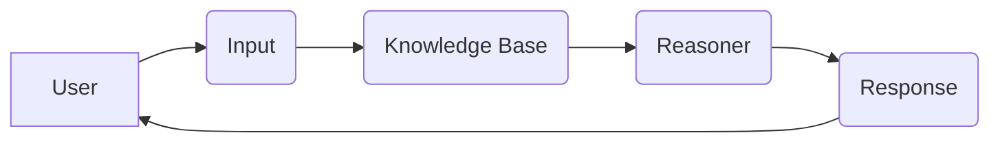

                 


# AI Agent的零样本学习能力开发

> 关键词：AI Agent，零样本学习，知识图谱，自然语言处理，机器学习，算法原理

> 摘要：本文详细探讨了AI Agent的零样本学习能力开发，从背景介绍、核心概念、算法原理到系统架构设计，再到项目实战和总结，全面解析零样本学习在AI Agent中的应用。

---

## 第一部分：AI Agent的零样本学习能力开发背景

### 第1章：AI Agent的基本概念与零样本学习背景

#### 1.1 AI Agent的基本概念

AI Agent（人工智能代理）是一种能够感知环境、自主决策并执行任务的智能体。它具备以下核心能力：
- **感知能力**：通过传感器或接口获取环境信息。
- **推理能力**：基于知识和逻辑进行推理。
- **规划能力**：制定行动方案以实现目标。
- **学习能力**：通过经验或数据优化自身行为。

AI Agent的应用场景广泛，如智能助手、自动驾驶、智能客服等。

#### 1.2 零样本学习的背景与意义

零样本学习（Zero-shot Learning）是指模型在没有任何训练数据的情况下，能够识别或处理新任务的能力。其意义在于：
- **减少数据依赖**：无需大量标注数据，适用于小样本或新任务。
- **提升泛化能力**：模型能推广到未见过的领域。

#### 1.3 零样本学习能力开发的背景

随着AI Agent的需求增加，零样本学习能力开发变得至关重要。当前，AI Agent在复杂场景中面临数据不足、任务多样化的挑战，零样本学习为其提供了解决方案。

---

### 第2章：零样本学习能力的核心概念

#### 2.1 零样本学习能力的结构

零样本学习能力由以下部分组成：
- **知识图谱**：构建领域知识，为推理提供基础。
- **特征提取**：从输入中提取关键特征。
- **推理机制**：基于知识和特征进行推理。

#### 2.2 零样本学习的核心概念

- **知识图谱**：通过构建领域知识图谱，AI Agent能够理解实体之间的关系。
- **特征提取**：使用深度学习模型提取输入的语义特征。
- **推理机制**：结合知识图谱和特征，通过逻辑推理生成输出。

#### 2.3 零样本学习与其他学习范式的联系

- **监督学习**：需要大量标注数据，零样本学习则减少数据依赖。
- **无监督学习**：依赖数据分布，零样本学习更注重知识表示。
- **强化学习**：通过奖励机制优化行为，零样本学习则注重推理能力。

---

## 第三部分：零样本学习能力开发的算法原理

### 第3章：零样本学习算法原理

#### 3.1 基于知识图谱的推理方法

**步骤**：
1. **知识图谱构建**：通过数据构建领域知识图谱。
2. **语义解析**：解析输入并提取实体和关系。
3. **推理**：基于知识图谱进行推理，生成输出。

**代码示例**：
```python
from kg.constructor import build_kg
from kg.inferencer import infer

kg = build_kg(data)
result = infer(kg, input)
```

#### 3.2 零样本学习的数学模型

**公式**：
- **向量表示**：$x_i = f(x)$，将输入映射到特征空间。
- **相似度计算**：$sim(x_i, x_j) = x_i^T x_j$。
- **分类决策**：$\hat{y} = \arg\max sim(x_i, y_j)$。

---

## 第四部分：系统分析与架构设计

### 第4章：AI Agent零样本学习能力开发的系统架构

#### 4.1 系统应用场景

AI Agent在智能客服、智能助手等领域广泛应用，零样本学习能力使其能够处理未见过的问题。

#### 4.2 系统功能设计

- **知识图谱构建**：构建和更新知识图谱。
- **意图识别**：识别用户意图并生成响应。
- **对话生成**：根据上下文生成自然语言回复。

#### 4.3 系统架构设计



---

## 第五部分：项目实战

### 第5章：AI Agent零样本学习能力开发的项目实战

#### 5.1 环境搭建与安装

安装必要的库：
```bash
pip install numpy spacy transformers
```

#### 5.2 知识图谱构建实现

```python
import spacy

nlp = spacy.load("en_core_web_sm")
doc = nlp("John went to the store.")
ents = [(ent.text, ent.label_) for ent in doc.ents]
```

#### 5.3 意图识别与对话生成

```python
from transformers import pipeline

classifier = pipeline("zero-shot-classification", model="facebook/bart-large")
result = classifier("What's the weather?", labels=["weather", "sports"])
```

---

## 第六部分：总结与展望

### 第6章：总结与展望

#### 6.1 小结

零样本学习能力是AI Agent的核心，通过知识图谱和推理机制实现。本文详细讲解了其开发背景、算法原理和系统架构。

#### 6.2 注意事项

- 数据质量影响性能。
- 知识图谱构建需领域专家参与。
- 需结合具体场景进行优化。

#### 6.3 拓展阅读

推荐阅读《零样本学习：理论与应用》和《知识图谱构建与应用》。

---

通过以上步骤，我们详细解析了AI Agent的零样本学习能力开发，从理论到实践，帮助读者全面掌握相关知识。

