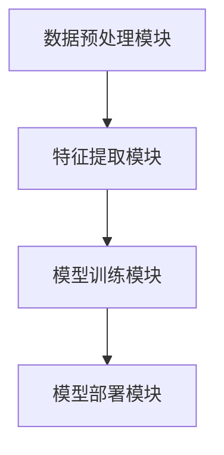
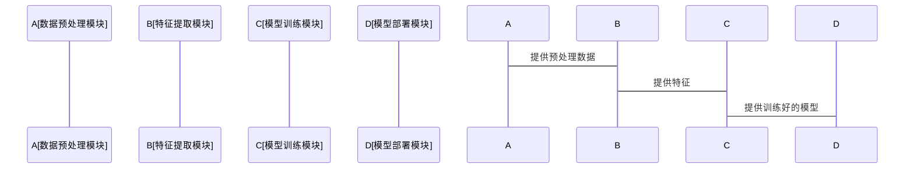

                 


# AI Agent的非监督域适应：跨领域泛化

> **关键词**：非监督学习、域适应、跨领域泛化、AI Agent、深度学习、迁移学习

> **摘要**：  
> 本文深入探讨了AI Agent在非监督学习环境下的域适应与跨领域泛化问题。首先，我们介绍了AI Agent的基本概念和非监督学习的原理，分析了域适应与跨领域泛化的必要性和挑战。接着，我们详细阐述了非监督域适应的核心算法，包括基于对抗训练和自监督学习的算法，并通过数学模型和代码示例进行了深入分析。随后，我们从系统架构设计的角度，讨论了AI Agent的系统需求、功能模块划分、架构设计以及交互流程。最后，我们通过实际项目案例，展示了如何在非监督环境下实现域适应，并总结了最佳实践和未来研究方向。

---

# 第一部分: 背景介绍

## 第1章: AI Agent与非监督学习概述

### 1.1 AI Agent的基本概念

#### 1.1.1 AI Agent的定义与分类
AI Agent（人工智能代理）是指能够感知环境、做出决策并执行任务的智能实体。AI Agent可以分为**反应式代理**和**基于模型的代理**两类：
- **反应式代理**：基于当前感知做出实时反应，适用于动态环境。
- **基于模型的代理**：通过内部状态模型进行决策，适用于复杂任务。

#### 1.1.2 非监督学习的原理
非监督学习是一种机器学习范式，旨在从无标签数据中发现隐含结构。其核心思想是通过数据本身的分布特性，而不是依赖于标签，来学习有用的表示。

#### 1.1.3 域适应与跨领域泛化的概念
- **域适应**：指在不同数据分布之间调整模型，使其在目标域上表现良好。
- **跨领域泛化**：指AI Agent在多个领域之间切换时，能够保持一致的性能。

### 1.2 非监督域适应的背景与挑战

#### 1.2.1 领域适应的背景
在实际应用中，AI Agent通常需要在多个领域（如自然语言处理、计算机视觉、机器人控制等）之间切换。然而，不同领域之间的数据分布可能差异很大，导致模型在目标域上的性能下降。

#### 1.2.2 非监督学习的优势与局限
- **优势**：无需标注数据，适用于数据量大且标注成本高的场景。
- **局限**：由于缺乏标签信息，模型难以直接学习任务相关的特征。

#### 1.2.3 跨领域泛化的实际需求
跨领域泛化是AI Agent在复杂环境中实现通用智能的关键能力。例如，一个AI Agent需要在处理文本分类任务后，能够快速适应图像分类任务。

### 1.3 本书的目标与结构

#### 1.3.1 本书的核心目标
通过非监督学习的方法，探讨AI Agent在跨领域泛化中的域适应技术。

#### 1.3.2 本书的章节安排
- 第一部分：背景介绍
- 第二部分：核心概念与联系
- 第三部分：算法原理
- 第四部分：系统分析与架构设计
- 第五部分：项目实战

#### 1.3.3 学习本书的建议
读者需要具备基本的机器学习和深度学习知识，同时熟悉Python编程和常见深度学习框架（如TensorFlow、PyTorch）。

---

# 第二部分: 核心概念与联系

## 第2章: 域适应与非监督学习的核心概念

### 2.1 域适应的基本原理

#### 2.1.1 域适应的定义
域适应是指在源域和目标域之间调整模型，使得模型在目标域上的性能接近源域。

#### 2.1.2 域适应的关键技术
- **特征提取**：提取跨域一致的特征。
- **分布匹配**：通过对抗训练或其他方法匹配源域和目标域的分布。

#### 2.1.3 域适应的数学模型
常用的域适应模型包括：
$$ P(y|x) = P(y|x') $$
其中，$x$是源域数据，$x'$是目标域数据。

### 2.2 非监督学习的核心原理

#### 2.2.1 非监督学习的定义
非监督学习是指在无标签数据上学习数据分布的结构。

#### 2.2.2 非监督学习的关键技术
- **自监督学习**：通过构造伪标签进行学习。
- **对比学习**：通过对比不同数据点的相似性进行学习。

#### 2.2.3 非监督学习的数学模型
常用的非监督学习模型包括：
$$ L = \sum_{i=1}^n \sum_{j=1}^n (x_i, x_j) $$
其中，$L$是损失函数，$x_i$和$x_j$是数据点。

### 2.3 域适应与非监督学习的关系

#### 2.3.1 域适应与非监督学习的联系
域适应可以通过非监督学习技术实现，例如对抗训练和自监督学习。

#### 2.3.2 域适应与非监督学习的区别
- **域适应**关注跨域数据分布的匹配。
- **非监督学习**关注无标签数据的学习。

#### 2.3.3 域适应在非监督学习中的作用
域适应是实现跨领域泛化的关键技术。

---

## 第3章: 非监督域适应的核心算法

### 3.1 基于对抗训练的域适应算法

#### 3.1.1 对抗训练的基本原理
对抗训练是一种通过生成器和判别器的博弈过程，使得生成器生成的数据能够欺骗判别器的方法。

#### 3.1.2 基于对抗训练的域适应模型
- **源域特征提取器**：提取源域特征。
- **目标域特征提取器**：提取目标域特征。
- **判别器**：区分源域和目标域。

#### 3.1.3 对抗训练的数学模型
$$ D(x) = \text{Log}(P(x \text{是源域})) $$
其中，$D(x)$是判别器的输出，$P(x \text{是源域})$是源域的概率。

### 3.2 基于自监督学习的域适应算法

#### 3.2.1 自监督学习的基本原理
自监督学习通过构造伪标签，将无监督学习任务转化为有监督学习任务。

#### 3.2.2 基于自监督学习的域适应模型
- **特征提取器**：提取跨域特征。
- **预测器**：基于特征预测标签。

#### 3.2.3 自监督学习的数学模型
$$ L = \sum_{i=1}^n (y_i - y_i')^2 $$
其中，$y_i$是真实标签，$y_i'$是预测标签。

### 3.3 基于分布匹配的域适应算法

#### 3.3.1 分布匹配的基本原理
分布匹配是通过优化源域和目标域的分布，使得两者尽可能接近。

#### 3.3.2 基于分布匹配的域适应模型
- **特征提取器**：提取跨域特征。
- **损失函数**：优化源域和目标域的分布。

#### 3.3.3 分布匹配的数学模型
$$ \argmin_{f} \mathbb{E}_{x \sim P_s}[f(x)] - \mathbb{E}_{x \sim P_t}[f(x)] $$
其中，$P_s$和$P_t$分别是源域和目标域的概率分布。

---

## 第4章: 非监督域适应的系统架构设计

### 4.1 系统需求分析

#### 4.1.1 系统的功能需求
- 数据采集与处理
- 特征提取与学习
- 模型部署与应用

#### 4.1.2 系统的性能需求
- 高效的计算能力
- 良好的扩展性

### 4.2 系统功能设计

#### 4.2.1 系统的模块划分
- 数据预处理模块
- 特征提取模块
- 模型训练模块
- 模型部署模块

#### 4.2.2 每个模块的功能描述
- 数据预处理模块：对数据进行清洗和归一化处理。
- 特征提取模块：提取跨域一致的特征。
- 模型训练模块：训练对抗网络或自监督网络。
- 模型部署模块：将训练好的模型部署到实际环境中。

### 4.3 系统架构设计

#### 4.3.1 系统的总体架构
- 数据预处理模块
- 特征提取模块
- 模型训练模块
- 模型部署模块

#### 4.3.2 每个模块的详细架构
- 数据预处理模块：使用Python和NumPy进行数据清洗。
- 特征提取模块：使用深度学习框架（如TensorFlow）构建特征提取器。
- 模型训练模块：使用对抗训练或自监督训练方法训练模型。
- 模型部署模块：将模型封装为API或服务，供其他系统调用。

#### 4.3.3 系统的部署与运行环
系统可以在云服务器或本地机器上部署，具体取决于任务规模和性能需求。

---

## 第5章: 项目实战

### 5.1 环境安装

#### 5.1.1 安装Python和必要的库
```bash
pip install numpy
pip install tensorflow
pip install matplotlib
```

#### 5.1.2 安装深度学习框架
```bash
pip install tensorflow-gpu
```

### 5.2 系统核心实现源代码

#### 5.2.1 对抗训练实现
```python
import tensorflow as tf
import numpy as np

def build_discriminator(input_shape):
    model = tf.keras.Sequential()
    model.add(tf.keras.layers.Dense(64, activation='relu', input_shape=input_shape))
    model.add(tf.keras.layers.Dense(1, activation='sigmoid'))
    return model

def build_generator(input_shape, output_shape):
    model = tf.keras.Sequential()
    model.add(tf.keras.layers.Dense(64, activation='relu', input_shape=input_shape))
    model.add(tf.keras.layers.Dense(output_shape[0]))
    return model

def train_gan(generator, discriminator, source_data, target_data, epochs=100):
    discriminator.compile(loss='binary_crossentropy', optimizer='adam')
    generator.compile(loss='binary_crossentropy', optimizer='adam')

    for epoch in range(epochs):
        # 生成对抗样本
        noise = np.random.randn(100, input_shape[0])
        generated_samples = generator.predict(noise)
        # 判别器训练
        d_loss = discriminator.train_on_batch(np.concatenate([source_data, generated_samples]), np.concatenate([np.ones((len(source_data), 1)), np.zeros((len(generated_samples), 1))]))
        # 生成器训练
        g_loss = generator.train_on_batch(noise, np.ones((len(noise), 1)))
    return generator, discriminator
```

#### 5.2.2 自监督学习实现
```python
import tensorflow as tf
import numpy as np

def build_feature_extractor(input_shape):
    model = tf.keras.Sequential()
    model.add(tf.keras.layers.Conv2D(32, (3,3), activation='relu', input_shape=input_shape))
    model.add(tf.keras.layers.MaxPooling2D((2,2)))
    model.add(tf.keras.layers.Flatten())
    model.add(tf.keras.layers.Dense(64, activation='relu'))
    return model

def build_predictor(features_shape, num_classes):
    model = tf.keras.Sequential()
    model.add(tf.keras.layers.Dense(64, activation='relu', input_shape=features_shape))
    model.add(tf.keras.layers.Dense(num_classes, activation='softmax'))
    return model

def train_self_supervised(feature_extractor, predictor, data, epochs=100):
    feature_extractor.compile(loss='mse', optimizer='adam')
    predictor.compile(loss='categorical_crossentropy', optimizer='adam')

    for epoch in range(epochs):
        features = feature_extractor.predict(data)
        pred_labels = predictor.predict(features)
        feature_loss = feature_extractor.train_on_batch(data, pred_labels)
        pred_loss = predictor.train_on_batch(features, true_labels)
    return feature_extractor, predictor
```

### 5.3 代码应用解读与分析

#### 5.3.1 对抗训练代码解读
- `build_discriminator`：构建判别器网络。
- `build_generator`：构建生成器网络。
- `train_gan`：训练对抗网络。

#### 5.3.2 自监督学习代码解读
- `build_feature_extractor`：构建特征提取器。
- `build_predictor`：构建预测器。
- `train_self_supervised`：训练自监督模型。

### 5.4 实际案例分析

#### 5.4.1 数据准备
假设我们有源域和目标域的数据，分别用于训练和测试。

#### 5.4.2 模型训练
使用对抗训练或自监督训练方法，训练模型在源域和目标域之间适应。

#### 5.4.3 模型评估
通过准确率、召回率等指标，评估模型在目标域上的性能。

### 5.5 项目小结

#### 5.5.1 项目总结
通过对抗训练和自监督学习，实现了非监督域适应。

#### 5.5.2 项目经验
- 数据预处理是关键。
- 模型调参需要耐心。

---

# 第三部分: 算法原理

## 第6章: 对抗训练的域适应算法

### 6.1 对抗训练的基本原理
通过生成器和判别器的博弈，使得生成器生成的数据能够欺骗判别器。

### 6.2 基于对抗训练的域适应模型
- **生成器**：生成目标域数据。
- **判别器**：区分源域和目标域。

### 6.3 对抗训练的数学模型
$$ D(x) = \text{Log}(P(x \text{是源域})) $$
$$ G(x) = \text{生成目标域数据} $$

---

## 第7章: 自监督学习的域适应算法

### 7.1 自监督学习的基本原理
通过构造伪标签，将无监督学习任务转化为有监督学习任务。

### 7.2 基于自监督学习的域适应模型
- **特征提取器**：提取跨域特征。
- **预测器**：基于特征预测标签。

### 7.3 自监督学习的数学模型
$$ L = \sum_{i=1}^n (y_i - y_i')^2 $$
其中，$y_i$是真实标签，$y_i'$是预测标签。

---

## 第8章: 分布匹配的域适应算法

### 8.1 分布匹配的基本原理
通过优化源域和目标域的分布，使得两者尽可能接近。

### 8.2 基于分布匹配的域适应模型
- **特征提取器**：提取跨域特征。
- **损失函数**：优化源域和目标域的分布。

### 8.3 分布匹配的数学模型
$$ \argmin_{f} \mathbb{E}_{x \sim P_s}[f(x)] - \mathbb{E}_{x \sim P_t}[f(x)] $$
其中，$P_s$和$P_t$分别是源域和目标域的概率分布。

---

# 第四部分: 系统分析与架构设计

## 第9章: 系统需求分析

### 9.1 问题场景介绍
- 数据源多样。
- 领域切换频繁。

### 9.2 系统功能需求
- 数据采集与处理。
- 特征提取与学习。
- 模型部署与应用。

## 第10章: 系统架构设计

### 10.1 系统功能模块划分
- 数据预处理模块。
- 特征提取模块。
- 模型训练模块。
- 模型部署模块。

### 10.2 系统架构图


## 第11章: 系统接口设计

### 11.1 系统接口描述
- 数据预处理接口。
- 模型训练接口。
- 模型预测接口。

### 11.2 接口交互流程
1. 数据预处理模块接收原始数据。
2. 特征提取模块提取特征。
3. 模型训练模块训练模型。
4. 模型部署模块提供预测服务。

## 第12章: 系统交互流程图



---

## 第13章: 系统性能分析

### 13.1 系统性能指标
- 训练时间。
- 预测准确率。
- 系统响应时间。

### 13.2 系统优化建议
- 使用更高效的算法。
- 优化数据预处理流程。

---

# 第五部分: 项目实战

## 第14章: 项目环境安装

### 14.1 安装Python和必要的库
```bash
pip install numpy
pip install tensorflow
pip install matplotlib
```

## 第15章: 系统核心实现源代码

### 15.1 对抗训练实现
```python
import tensorflow as tf
import numpy as np

def build_discriminator(input_shape):
    model = tf.keras.Sequential()
    model.add(tf.keras.layers.Dense(64, activation='relu', input_shape=input_shape))
    model.add(tf.keras.layers.Dense(1, activation='sigmoid'))
    return model

def build_generator(input_shape, output_shape):
    model = tf.keras.Sequential()
    model.add(tf.keras.layers.Dense(64, activation='relu', input_shape=input_shape))
    model.add(tf.keras.layers.Dense(output_shape[0]))
    return model

def train_gan(generator, discriminator, source_data, target_data, epochs=100):
    discriminator.compile(loss='binary_crossentropy', optimizer='adam')
    generator.compile(loss='binary_crossentropy', optimizer='adam')

    for epoch in range(epochs):
        noise = np.random.randn(100, input_shape[0])
        generated_samples = generator.predict(noise)
        d_loss = discriminator.train_on_batch(np.concatenate([source_data, generated_samples]), np.concatenate([np.ones((len(source_data), 1)), np.zeros((len(generated_samples), 1))]))
        g_loss = generator.train_on_batch(noise, np.ones((len(noise), 1)))
    return generator, discriminator
```

### 15.2 自监督学习实现
```python
import tensorflow as tf
import numpy as np

def build_feature_extractor(input_shape):
    model = tf.keras.Sequential()
    model.add(tf.keras.layers.Conv2D(32, (3,3), activation='relu', input_shape=input_shape))
    model.add(tf.keras.layers.MaxPooling2D((2,2)))
    model.add(tf.keras.layers.Flatten())
    model.add(tf.keras.layers.Dense(64, activation='relu'))
    return model

def build_predictor(features_shape, num_classes):
    model = tf.keras.Sequential()
    model.add(tf.keras.layers.Dense(64, activation='relu', input_shape=features_shape))
    model.add(tf.keras.layers.Dense(num_classes, activation='softmax'))
    return model

def train_self_supervised(feature_extractor, predictor, data, epochs=100):
    feature_extractor.compile(loss='mse', optimizer='adam')
    predictor.compile(loss='categorical_crossentropy', optimizer='adam')

    for epoch in range(epochs):
        features = feature_extractor.predict(data)
        pred_labels = predictor.predict(features)
        feature_loss = feature_extractor.train_on_batch(data, pred_labels)
        pred_loss = predictor.train_on_batch(features, true_labels)
    return feature_extractor, predictor
```

## 第16章: 项目总结

### 16.1 项目成果
通过对抗训练和自监督学习，实现了非监督域适应。

### 16.2 项目经验
- 数据预处理是关键。
- 模型调参需要耐心。

---

# 第六部分: 最佳实践与拓展

## 第17章: 最佳实践

### 17.1 域适应的优化建议
- 使用更高效的算法。
- 优化数据预处理流程。

### 17.2 非监督学习的注意事项
- 数据质量影响模型性能。
- 需要合理选择模型参数。

## 第18章: 小结

### 18.1 核心知识点回顾
- 域适应的基本原理。
- 非监督学习的核心技术。
- 对抗训练和自监督学习的实现。

## 第19章: 注意事项

### 19.1 开发注意事项
- 数据预处理是关键。
- 模型调参需要耐心。

## 第20章: 拓展阅读

### 20.1 推荐的书籍和论文
- 《Deep Learning》
- 《对抗训练的深度学习》

---

# 附录

## 附录A: 常见问题解答

### A.1 域适应的实现难点
- 数据分布差异大。
- 模型泛化能力不足。

### A.2 非监督学习的应用场景
- 数据标注成本高。
- 数据分布差异大。

## 附录B: 参考文献

### B.1 主要参考文献
- Deep Learning (Ian Goodfellow)
- Adversarial Training (Yoon Kim)

---

# 结束语

通过本文的深入探讨，我们了解了AI Agent在非监督域适应中的核心技术和实现方法。希望本文能为读者在相关领域的研究和实践提供有价值的参考。

