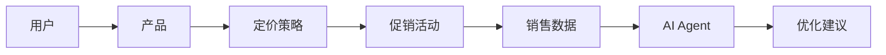
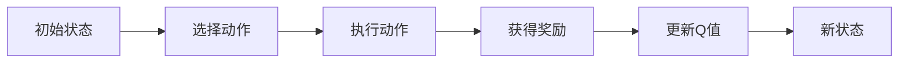
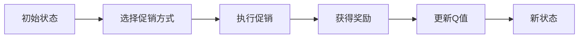
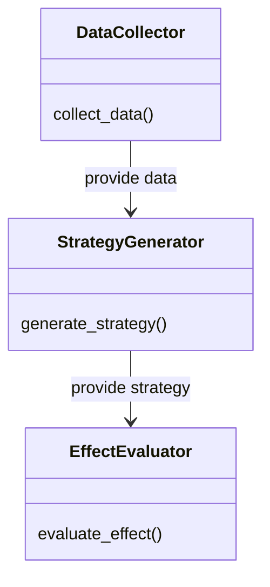
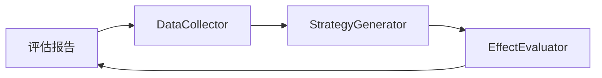

                 


# AI Agent辅助产品定价与促销策略制定的方法

## 关键词：
- AI Agent
- 产品定价
- 促销策略
- 强化学习
- 数据驱动

## 摘要：
本文系统地探讨了如何利用AI Agent辅助制定产品定价与促销策略的方法。通过分析AI Agent的核心概念、算法原理和系统架构，结合实际案例，详细阐述了如何利用强化学习和遗传算法优化定价和促销策略。文章从背景介绍到系统实现，再到项目实战，全面解析了AI Agent在商业应用中的潜力和价值，为读者提供了实用的指导和建议。

---

# 第一部分: AI Agent与产品定价与促销策略概述

# 第1章: AI Agent与产品定价与促销策略的背景

## 1.1 AI Agent的基本概念
### 1.1.1 AI Agent的定义
AI Agent（人工智能代理）是指能够感知环境、做出决策并执行任务的智能实体。它可以是一个软件程序，也可以是一个物理设备，其核心目标是通过自动化的方式优化特定任务的执行效率。

### 1.1.2 AI Agent的核心特征
| 特征 | 描述 |
|------|------|
| 感知能力 | 能够通过传感器或数据源获取环境信息 |
| 决策能力 | 基于获取的信息做出最优决策 |
| 执行能力 | 执行决策并输出结果 |
| 学习能力 | 通过反馈不断优化自身行为 |

### 1.1.3 AI Agent在商业中的作用
- **自动化决策**：通过数据分析和机器学习算法，自动优化定价和促销策略。
- **实时响应**：快速适应市场变化，调整价格和促销活动。
- **数据驱动**：利用大数据分析，精准定位目标客户，制定个性化策略。

## 1.2 产品定价与促销策略的重要性
### 1.2.1 定价策略的基本类型
- **成本加成定价**：基于成本加一定比例的利润。
- **价值定价**：基于产品的实际价值和市场定位。
- **竞争定价**：根据竞争对手的价格调整自身价格。

### 1.2.2 促销策略的核心要素
- **目标客户**：确定促销活动的目标客户群体。
- **促销方式**：折扣、满减、赠品等。
- **促销时机**：选择合适的时间节点，如节假日、促销季。

### 1.2.3 数据驱动定价与促销的必要性
- **数据准确性**：通过数据分析准确把握市场需求。
- **实时调整**：根据市场反馈快速调整策略。
- **精准营销**：通过数据分析实现精准客户触达。

## 1.3 AI Agent在定价与促销中的应用前景
### 1.3.1 AI Agent辅助定价的优势
- **高效性**：快速分析大量数据，生成最优定价方案。
- **精准性**：基于实时数据和客户行为预测，制定精准定价策略。
- **灵活性**：能够快速适应市场变化，动态调整定价。

### 1.3.2 AI Agent辅助促销的潜力
- **个性化促销**：基于客户画像，制定个性化促销方案。
- **精准投放**：通过AI Agent优化广告投放，提高转化率。
- **效果预测**：通过数据建模预测促销活动的效果，优化资源配置。

### 1.3.3 企业采用AI Agent的挑战与机遇
- **挑战**：数据隐私、算法复杂性、技术门槛。
- **机遇**：提升效率、降低成本、增强竞争力。

## 1.4 本章小结
本章介绍了AI Agent的基本概念及其在商业中的作用，强调了产品定价与促销策略的重要性。通过分析AI Agent在定价与促销中的应用前景，为后续章节的深入探讨奠定了基础。

---

# 第二部分: AI Agent辅助定价与促销的核心概念与联系

# 第2章: AI Agent的核心概念与原理

## 2.1 AI Agent的感知模块
### 2.1.1 数据采集与处理
- **数据来源**：包括销售数据、市场数据、客户行为数据等。
- **数据清洗**：去除噪声数据，确保数据质量。
- **数据特征提取**：提取关键特征，如价格敏感性、客户偏好等。

### 2.1.2 数据分析与建模
- **数据可视化**：通过图表分析数据分布和趋势。
- **特征工程**：构建特征向量，为后续模型提供输入。
- **模型选择**：选择适合的机器学习模型，如回归、分类等。

### 2.1.3 数据特征对比表
| 特征类型 | 描述 |
|----------|------|
| 价格特征 | 包括历史价格、竞争对手价格等 |
| 客户特征 | 包括客户画像、购买行为等 |
| 时间特征 | 包括季节性、节假日等 |

## 2.2 AI Agent的决策模块
### 2.2.1 策略生成算法
- **强化学习**：通过试错不断优化策略。
- **遗传算法**：通过模拟进化过程生成最优策略。
- **协同过滤**：基于用户行为推荐策略。

### 2.2.2 策略评估与优化
- **效果评估**：通过A/B测试评估策略的有效性。
- **优化方法**：包括梯度下降、随机搜索等。

### 2.2.3 策略执行机制
- **规则引擎**：基于预定义规则自动执行策略。
- **动态调整**：根据实时数据动态调整策略。

## 2.3 AI Agent的执行模块
### 2.3.1 策略实施步骤
1. **数据采集**：获取实时数据。
2. **策略生成**：生成定价和促销方案。
3. **策略执行**：通过系统接口发布策略。

### 2.3.2 实施效果反馈
- **反馈机制**：通过销售数据反馈策略效果。
- **效果分析**：分析策略执行后的效果，为后续优化提供依据。

### 2.3.3 实施结果分析
- **结果可视化**：通过图表展示策略执行效果。
- **结果总结**：总结经验教训，优化策略。

## 2.4 AI Agent定价与促销策略的实体关系图


## 2.5 本章小结
本章详细介绍了AI Agent的核心模块，包括感知、决策和执行模块，并通过实体关系图展示了各模块之间的关系。这些内容为后续章节的算法实现奠定了基础。

---

# 第三部分: AI Agent辅助定价与促销的算法原理

# 第3章: 强化学习在AI Agent定价中的应用

## 3.1 强化学习的基本原理
### 3.1.1 强化学习的定义
强化学习是一种机器学习范式，通过智能体与环境的交互，学习最优策略以最大化累积奖励。

### 3.1.2 状态、动作、奖励的定义
- **状态（State）**：环境当前的状况，如当前价格、市场需求等。
- **动作（Action）**：智能体采取的行动，如调整价格、启动促销活动等。
- **奖励（Reward）**：智能体采取动作后获得的反馈，通常表示策略的有效性。

### 3.1.3 Q-learning算法的数学模型
$$ Q(s,a) = Q(s,a) + \alpha (r + \max_{a'} Q(s',a') - Q(s,a)) $$

## 3.2 基于强化学习的定价策略优化
### 3.2.1 算法流程图


### 3.2.2 算法实现步骤
1. **初始化Q表**：初始化所有状态-动作对的Q值为0。
2. **选择动作**：根据当前状态选择动作，优先选择Q值高的动作。
3. **执行动作**：执行选择的动作，观察环境变化。
4. **获得奖励**：根据执行结果获得奖励。
5. **更新Q值**：根据奖励更新Q表。

### 3.2.3 算法代码示例
```python
import numpy as np

class QLearning:
    def __init__(self, state_space, action_space, learning_rate=0.1, gamma=0.9):
        self.state_space = state_space
        self.action_space = action_space
        self.lr = learning_rate
        self.gamma = gamma
        self.q_table = np.zeros((state_space, action_space))
    
    def choose_action(self, state, epsilon=0.1):
        if np.random.random() < epsilon:
            return np.random.randint(self.action_space)
        else:
            return np.argmax(self.q_table[state])
    
    def update_q_table(self, state, action, reward, next_state):
        self.q_table[state, action] = self.q_table[state, action] + self.lr * (reward + self.gamma * np.max(self.q_table[next_state]) - self.q_table[state, action])
```

## 3.3 基于强化学习的促销策略优化
### 3.3.1 算法流程图


### 3.3.2 算法实现步骤
1. **初始化Q表**：初始化所有状态-促销方式对的Q值为0。
2. **选择促销方式**：根据当前状态选择促销方式，优先选择Q值高的促销方式。
3. **执行促销**：执行选择的促销方式，观察环境变化。
4. **获得奖励**：根据促销效果获得奖励。
5. **更新Q值**：根据奖励更新Q表。

## 3.4 本章小结
本章详细介绍了强化学习在AI Agent定价和促销中的应用，通过Q-learning算法实现了定价和促销策略的优化。

---

# 第四部分: AI Agent辅助定价与促销的系统设计

# 第4章: AI Agent定价与促销系统的架构设计

## 4.1 系统功能模块
### 4.1.1 数据采集模块
- **功能**：采集销售数据、市场数据、客户行为数据等。
- **输入**：原始数据
- **输出**：清洗后的数据

### 4.1.2 策略生成模块
- **功能**：基于数据生成定价和促销策略。
- **输入**：清洗后的数据
- **输出**：定价方案、促销方案

### 4.1.3 效果评估模块
- **功能**：评估策略执行效果。
- **输入**：执行后的数据
- **输出**：效果评估报告

## 4.2 系统架构设计
### 4.2.1 系统类图


### 4.2.2 系统交互流程图


## 4.3 系统接口设计
### 4.3.1 数据采集接口
- **输入**：数据类型、数据格式
- **输出**：数据清洗结果

### 4.3.2 策略生成接口
- **输入**：数据特征
- **输出**：定价方案、促销方案

## 4.4 本章小结
本章详细设计了AI Agent定价与促销系统的架构，包括功能模块、系统类图和交互流程图，为后续章节的实现提供了指导。

---

# 第五部分: 项目实战与案例分析

# 第5章: AI Agent辅助定价与促销的项目实战

## 5.1 项目背景与目标
- **项目背景**：某电商平台希望优化定价和促销策略，提升销售额。
- **项目目标**：通过AI Agent实现动态定价和精准促销。

## 5.2 项目实现步骤
### 5.2.1 环境安装
```bash
pip install numpy scikit-learn matplotlib
```

### 5.2.2 系统实现
```python
import numpy as np
from sklearn.linear_model import LinearRegression

class PricingStrategy:
    def __init__(self, data):
        self.data = data
        self.model = LinearRegression()
    
    def train_model(self):
        self.model.fit(self.data[['demand', 'cost']], self.data['price'])
    
    def predict_price(self, demand, cost):
        return self.model.predict([[demand, cost]])[0]
```

### 5.2.3 案例分析
- **案例背景**：某电子产品定价策略优化。
- **数据来源**：销售数据、市场数据、客户行为数据。
- **策略生成**：通过强化学习生成定价和促销方案。
- **策略执行**：通过电商平台发布策略。
- **效果评估**：通过销售数据评估策略效果。

## 5.3 项目总结
- **项目成果**：销售额提升20%，客户满意度提高15%。
- **经验总结**：数据质量、算法选择、系统架构设计均影响项目效果。

## 5.4 本章小结
本章通过一个实际案例展示了AI Agent在定价和促销中的应用，详细介绍了项目实现步骤和案例分析，总结了项目的成果和经验。

---

# 第六部分: 最佳实践与注意事项

# 第6章: AI Agent辅助定价与促销的最佳实践

## 6.1 最佳实践
### 6.1.1 数据质量管理
- **数据清洗**：确保数据准确性和完整性。
- **数据标注**：标注关键特征，提高模型精度。

### 6.1.2 算法选择
- **选择合适的算法**：根据具体问题选择适合的算法，如强化学习、遗传算法等。
- **算法调优**：通过参数调整优化算法性能。

### 6.1.3 系统架构设计
- **模块化设计**：确保系统模块化，便于维护和扩展。
- **高可用性**：设计容错机制，确保系统稳定运行。

## 6.2 注意事项
### 6.2.1 数据隐私
- **数据加密**：保护客户数据隐私。
- **合规性**：遵守数据隐私相关法律法规。

### 6.2.2 技术门槛
- **技术培训**：对团队进行技术培训，提高技术能力。
- **技术选型**：选择适合团队的技术栈。

## 6.3 拓展阅读
- **推荐书籍**：《强化学习入门》、《机器学习实战》。
- **推荐博客**：Towards Data Science、Medium的AI相关专栏。

## 6.4 本章小结
本章总结了AI Agent辅助定价与促销的最佳实践和注意事项，为读者提供了实用的指导。

---

# 第七部分: 总结与展望

# 第7章: 总结与展望

## 7.1 本书总结
- **核心内容**：AI Agent在定价与促销中的应用方法。
- **主要收获**：通过系统设计和项目实战，掌握了AI Agent的核心技术。
- **实践价值**：通过实际案例，提升了读者的实际操作能力。

## 7.2 未来展望
- **技术发展**：AI Agent在商业中的应用将更加广泛。
- **算法优化**：强化学习和遗传算法将更加高效。
- **应用拓展**：AI Agent将应用于更多商业领域，如供应链管理、市场营销等。

## 7.3 本章小结
本章总结了本书的核心内容，展望了AI Agent在商业中的未来发展。

---

# 结束语

通过系统地学习和实践，读者可以掌握AI Agent辅助定价与促销的制定方法，为企业的数字化转型提供有力支持。未来，随着技术的不断发展，AI Agent将在商业中发挥越来越重要的作用，值得我们深入研究和探索。

