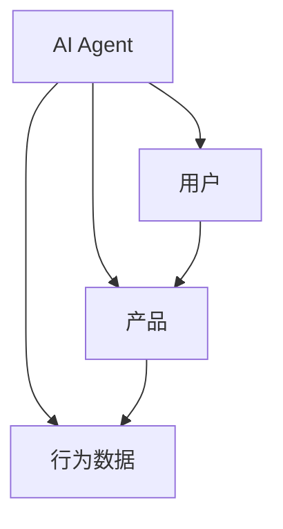
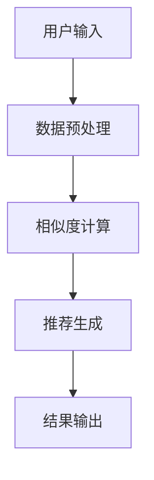
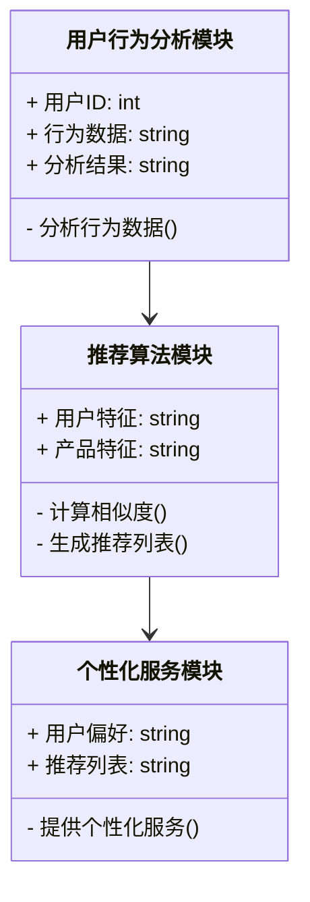
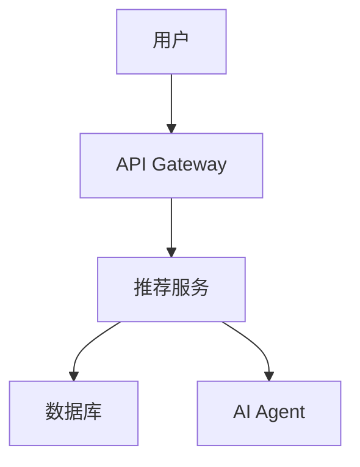
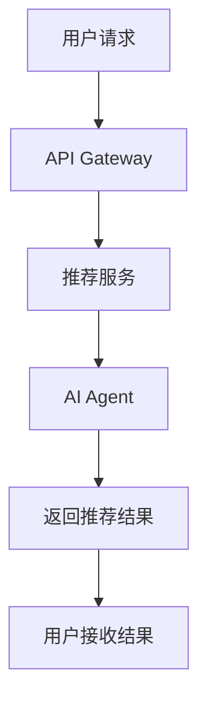

                 


# AI Agent辅助企业产品推荐与个性化服务

> 关键词：AI Agent，推荐系统，个性化服务，协同过滤，系统架构，项目实战

> 摘要：随着人工智能技术的快速发展，AI Agent在企业产品推荐与个性化服务中的应用越来越广泛。本文详细探讨了AI Agent的核心概念、算法原理、系统架构设计以及实际项目中的应用，结合具体案例分析和代码实现，帮助读者全面理解如何利用AI Agent提升企业推荐系统的效率和个性化服务水平。

---

# 第一部分：引言

## 第1章：AI Agent与企业产品推荐概述

### 1.1 问题背景与描述
#### 1.1.1 传统企业推荐系统的局限性
传统推荐系统在处理大规模数据和个性化需求时存在效率低下、准确性不足的问题。

#### 1.1.2 AI Agent在推荐系统中的作用
AI Agent能够实时分析用户行为和偏好，动态调整推荐策略，提供更精准的个性化服务。

#### 1.1.3 个性化服务的市场需求
随着消费者对个性化体验的需求增加，企业亟需借助AI Agent提升推荐系统的智能化水平。

### 1.2 AI Agent的核心概念与特点
#### 1.2.1 AI Agent的基本定义
AI Agent是一种能够感知环境、自主决策并执行任务的智能体。

#### 1.2.2 AI Agent的核心特征
| 特性 | 描述 |
|------|------|
| 智能性 | 能够理解和推理复杂数据 |
| 自主性 | 能够自主决策和执行任务 |
| 反应性 | 能够实时响应环境变化 |

#### 1.2.3 AI Agent与传统推荐算法的区别
AI Agent不仅仅是推荐算法的执行者，还能通过上下文理解和动态决策提供更智能的服务。

### 1.3 本章小结
本章介绍了AI Agent的基本概念、特点及其在推荐系统中的独特优势，为后续内容奠定了基础。

---

# 第二部分：AI Agent的核心概念与原理

## 第2章：AI Agent与推荐系统的关联

### 2.1 AI Agent在推荐系统中的角色
#### 2.1.1 AI Agent作为推荐主体
AI Agent负责接收用户输入、分析数据并生成推荐结果。

#### 2.1.2 AI Agent作为推荐客体
AI Agent可以作为推荐的对象，帮助用户更好地理解和管理推荐结果。

#### 2.1.3 AI Agent与其他推荐算法的协同
AI Agent能够与其他推荐算法协同工作，提升推荐系统的整体性能。

### 2.2 AI Agent的核心原理
#### 2.2.1 知识表示与推理
AI Agent通过知识图谱和逻辑推理来理解用户需求和产品属性。

#### 2.2.2 动态决策机制
AI Agent能够根据实时数据动态调整推荐策略。

#### 2.2.3 自适应学习能力
AI Agent通过机器学习不断优化推荐模型。

### 2.3 AI Agent与推荐系统的实体关系图


### 2.4 本章小结
本章详细分析了AI Agent在推荐系统中的角色和核心原理，并通过实体关系图展示了系统间的关联。

---

# 第三部分：AI Agent推荐算法原理

## 第3章：基于协同过滤的AI Agent推荐算法

### 3.1 协同过滤算法概述
#### 3.1.1 基于用户的协同过滤
基于用户相似性进行推荐。

#### 3.1.2 基于物品的协同过滤
基于产品相似性进行推荐。

### 3.2 AI Agent协同过滤的数学模型
#### 相似度计算公式
$$sim(i,j) = \frac{\sum_{k} (r_{ik} - \bar{r}_i)(r_{jk} - \bar{r}_j)}{\sqrt{\sum_{k} (r_{ik} - \bar{r}_i)^2} \cdot \sqrt{\sum_{k} (r_{jk} - \bar{r}_j)^2}}$$

### 3.3 AI Agent协同过滤的实现流程


### 3.4 本章小结
本章详细介绍了基于协同过滤的AI Agent推荐算法，包括数学模型和实现流程。

---

# 第四部分：系统分析与架构设计

## 第4章：AI Agent推荐系统的架构设计

### 4.1 系统功能模块
#### 4.1.1 用户行为分析模块
负责收集和分析用户行为数据。

#### 4.1.2 推荐算法模块
实现协同过滤、深度学习等推荐算法。

#### 4.1.3 个性化服务模块
根据用户偏好生成个性化推荐结果。

### 4.2 系统功能设计
#### 领域模型类图


### 4.3 系统架构设计
#### 系统架构图


### 4.4 接口设计与交互流程图
#### 交互流程图


### 4.5 本章小结
本章通过类图和架构图详细设计了AI Agent推荐系统的功能模块和交互流程。

---

## 第5章：AI Agent推荐系统的项目实战

### 5.1 项目介绍
#### 项目背景
一个基于AI Agent的企业产品推荐系统。

### 5.2 环境安装与配置
#### 安装依赖
```bash
pip install numpy scikit-learn
```

### 5.3 核心代码实现
#### 协同过滤算法实现
```python
import numpy as np
from sklearn.metrics.pairwise import cosine_similarity

# 示例数据集
user_item_matrix = np.array([[1, 2, 3],
                              [2, 3, 4],
                              [3, 4, 5]])

# 计算相似度
similarity = cosine_similarity(user_item_matrix)
print(similarity)
```

### 5.4 代码解读与分析
#### 代码功能分析
上述代码通过`cosine_similarity`计算用户相似度矩阵，为推荐系统提供基础数据。

### 5.5 实际案例分析
#### 案例分析
以某电商平台为例，分析AI Agent如何通过协同过滤算法为用户推荐商品。

### 5.6 项目小结
本章通过实际项目展示了AI Agent推荐系统的实现过程，包括环境配置、代码实现和案例分析。

---

## 第6章：最佳实践与注意事项

### 6.1 最佳实践
#### 数据预处理
确保数据质量和完整性。

#### 模型优化
通过网格搜索优化推荐算法参数。

#### 系统调优
优化系统性能和响应速度。

### 6.2 小结
本章总结了AI Agent推荐系统开发中的最佳实践和注意事项。

---

## 第7章：拓展阅读与未来展望

### 7.1 拓展阅读
推荐阅读相关领域的书籍和论文。

### 7.2 未来展望
AI Agent在推荐系统中的应用前景广阔，未来将更加智能化和个性化。

### 7.3 本章小结
本章为读者提供了进一步学习的方向和对未来发展的思考。

---

## 第8章：总结

### 8.1 全文总结
总结全文内容，强调AI Agent在企业推荐系统中的重要性。

### 8.2 致谢
感谢读者的支持和关注。

---

# 附录

## 附录A：数学公式汇总

## 附录B：推荐算法代码示例

## 附录C：系统架构图

---

# 参考文献

---

以上是《AI Agent辅助企业产品推荐与个性化服务》的技术博客文章目录大纲。文章从基础概念到实际应用，层层深入，结合理论与实践，为读者提供全面的知识体系。

