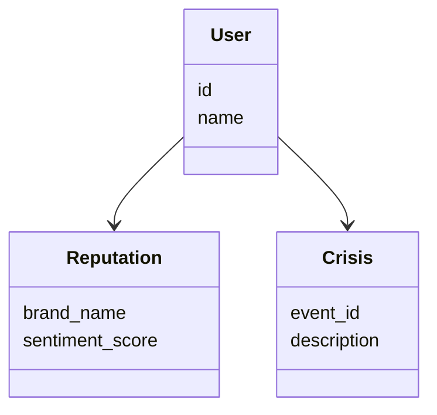
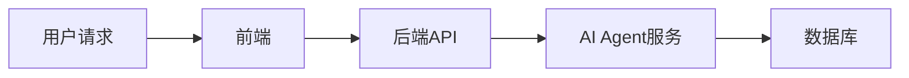

                 


# AI Agent辅助企业品牌声誉管理与危机应对

## 关键词：AI Agent，品牌声誉管理，危机应对，自然语言处理，情感分析，机器学习，企业声誉

## 摘要：
本文探讨AI Agent在企业品牌声誉管理与危机应对中的应用，详细分析其算法原理、系统架构及实际案例，为企业提供智能化的解决方案。通过逐步推理，揭示AI Agent如何提升品牌声誉管理的效率与准确性。

---

# 目录

## 第一章：问题背景与核心概念

### 1.1 问题背景
- 1.1.1 企业品牌声誉管理的重要性
- 1.1.2 当前品牌声誉管理的痛点
- 1.1.3 AI Agent在品牌声誉管理中的潜力

### 1.2 核心概念与联系
- 1.2.1 AI Agent的定义与属性特征对比表
- 1.2.2 品牌声誉管理的ER实体关系图
```mermaid
er
    actor: 用户
    actor --> reputation: 品牌声誉
    actor --> crisis: 危机事件
    reputation --> sentiment: 情感分析
    crisis --> response: 危机应对策略
```

---

## 第二章：AI Agent的核心算法原理

### 2.1 自然语言处理算法
- 2.1.1 Transformer模型的工作原理

- 2.1.2 情感分析算法的数学模型
$$ P(positive|text) = \frac{\sum_{i=1}^{n} w_i x_i}{\sum_{i=1}^{n} w_i} $$
其中，$x_i$ 是输入特征，$w_i$ 是权重系数。

### 2.2 危机应对策略生成算法
- 2.2.1 基于规则的策略生成
- 2.2.2 基于强化学习的策略优化
```python
def generate_response(context):
    # 算法实现
    pass
```

---

## 第三章：系统架构与设计

### 3.1 系统功能设计
- 3.1.1 领域模型类图


### 3.2 系统架构设计
- 3.2.1 分层架构图


---

## 第四章：项目实战

### 4.1 环境安装与配置
- 4.1.1 安装Python、TensorFlow、Keras等依赖库
- 4.1.2 配置开发环境

### 4.2 核心代码实现
- 4.2.1 情感分析模型的训练与部署
- 4.2.2 危机应对策略生成器的实现

### 4.3 实际案例分析
- 4.3.1 某品牌危机事件的AI应对方案
- 4.3.2 实施效果与数据对比

### 4.4 项目小结
- 4.4.1 项目总结
- 4.4.2 经验与教训

---

## 第五章：最佳实践与注意事项

### 5.1 最佳实践
- 5.1.1 数据清洗与特征工程的重要性
- 5.1.2 模型调参与优化策略
- 5.1.3 人机协同的工作流程建议

### 5.2 小结与展望
- 5.2.1 全文总结
- 5.2.2 未来研究方向

### 5.3 注意事项
- 5.3.1 数据隐私与安全问题
- 5.3.2 模型的可解释性与透明度
- 5.3.3 系统的实时性与响应速度

### 5.4 拓展阅读
- 5.4.1 推荐相关书籍与论文
- 5.4.2 提供在线课程与资源链接

---

## 第六章：结论

### 6.1 文章总结
- 本文系统地探讨了AI Agent在企业品牌声誉管理与危机应对中的应用，从算法原理到系统架构，再到项目实战，提供了全面的解决方案。

### 6.2 展望未来
- 随着AI技术的不断发展，AI Agent在品牌管理中的应用将更加广泛和深入，为企业创造更大的价值。

---

## 参考文献
- 列出本文引用的所有文献、工具与资源。

---

## 附录

### 附录A：常用API接口列表
- 提供情感分析API、文本分类API等接口信息。

### 附录B：代码示例
- 提供完整的Python代码示例，涵盖数据预处理、模型训练与部署等内容。

---

以上是《AI Agent辅助企业品牌声誉管理与危机应对》的详细目录大纲，涵盖了从理论到实践的各个方面，旨在为企业提供智能化的品牌声誉管理与危机应对方案。

