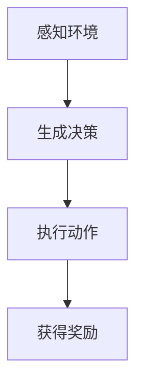
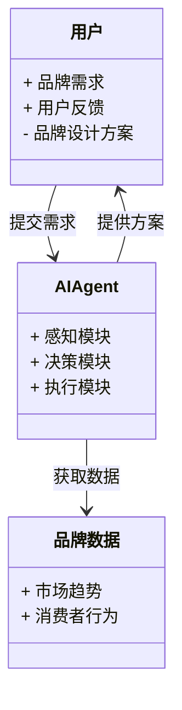
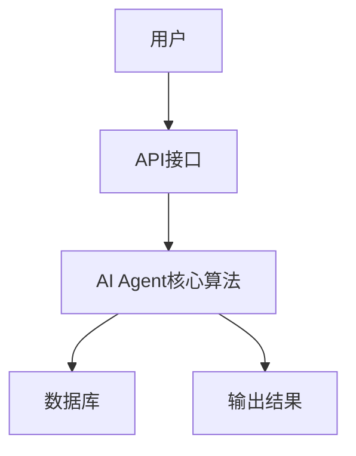

                 


# AI Agent辅助企业品牌形象设计与管理

## 关键词：
AI Agent, 企业品牌形象, 设计与管理, 人工智能, 算法原理

## 摘要：
本文探讨AI Agent在企业品牌形象设计与管理中的应用，通过分析其核心概念、算法原理、系统架构以及实际案例，详细阐述AI Agent如何通过智能化手段优化品牌形象设计与管理过程，提升企业品牌价值。

---

## 第一部分：背景介绍

### 第1章：AI Agent与企业品牌管理概述

#### 1.1 AI Agent的基本概念
- **1.1.1 AI Agent的定义**  
  AI Agent（人工智能代理）是一种能够感知环境、自主决策并执行任务的智能系统。它通过传感器获取信息，利用算法进行分析，并通过执行器完成目标。
  
- **1.1.2 AI Agent的核心特点**  
  - **自主性**：能够自主决策，无需人工干预。  
  - **反应性**：能够实时感知环境变化并做出反应。  
  - **目标导向性**：所有行为都围绕实现特定目标展开。  

- **1.1.3 AI Agent与传统AI的区别**  
  AI Agent不仅具备数据处理能力，还能主动执行任务，与传统AI的被动计算不同。

#### 1.2 企业品牌形象管理的背景与挑战
- **1.2.1 企业品牌形象的重要性**  
  品牌形象是企业在市场中的核心竞争力，直接影响消费者的认知和购买决策。  

- **1.2.2 品牌形象管理的传统方法及其局限性**  
  - 传统方法依赖人工设计和市场调研，效率低、成本高。  
  - 数据分析能力有限，难以快速响应市场变化。  

- **1.2.3 AI Agent在品牌形象管理中的优势**  
  - 提高设计效率，缩短设计周期。  
  - 通过实时数据分析优化品牌形象。  
  - 能够快速响应市场变化，提供个性化解决方案。

#### 1.3 AI Agent辅助企业品牌形象管理的应用前景
- **1.3.1 AI Agent在品牌设计中的潜在应用领域**  
  - 品牌标志设计  
  - 品牌色彩搭配  
  - 品牌语生成  

- **1.3.2 企业采用AI Agent的优势**  
  - 提高设计效率，降低成本。  
  - 基于大数据分析，提供更精准的设计建议。  

- **1.3.3 应用中的挑战与机遇**  
  - 技术门槛高，需要专业团队支持。  
  - 数据隐私问题，需确保数据安全。  

---

## 第二部分：核心概念与联系

### 第2章：AI Agent的核心概念与原理

#### 2.1 AI Agent的原理
- **2.1.1 AI Agent的感知模块**  
  - 通过传感器或API接口获取环境数据，如市场趋势、消费者行为等。  

- **2.1.2 AI Agent的决策模块**  
  - 基于感知数据，利用算法生成决策方案，如品牌设计建议。  

- **2.1.3 AI Agent的执行模块**  
  - 根据决策结果，通过执行器完成任务，如自动生成设计草图。  

#### 2.2 AI Agent的属性对比
- **2.2.1 表格：不同AI Agent的属性对比**

| 属性         | 基于规则的AI Agent | 基于机器学习的AI Agent | 基于深度学习的AI Agent |
|--------------|---------------------|-------------------------|-------------------------|
| 感知能力     | 有限               | 较强                   | 强大                   |
| 决策能力     | 简单               | 复杂                   | 更复杂                 |
| 自适应能力   | 低                 | 中                   | 高                     |

#### 2.3 ER实体关系图
- **2.3.1 使用Mermaid绘制的ER图**

```mermaid
er
actor: 用户
agent: AI Agent
brand: 企业品牌
data: 数据

actor --> agent: 发起请求
agent --> data: 获取数据
agent --> brand: 提供设计建议
```

---

## 第三部分：算法原理讲解

### 第3章：AI Agent的算法原理

#### 3.1 算法原理概述
- **3.1.1 状态空间、动作空间和奖励函数的数学模型**

  - **状态空间**：表示AI Agent所处的环境状态，记为$$S$$。  
  - **动作空间**：表示AI Agent可以执行的动作，记为$$A$$。  
  - **奖励函数**：表示AI Agent执行动作后所获得的奖励，记为$$R(s, a)$$，其中$$s \in S$$，$$a \in A$$。

- **3.1.2 使用Mermaid绘制的算法流程图**



#### 3.2 数学模型与公式
- **3.2.1 状态空间表示**  
  $$S = \{s_1, s_2, \dots, s_n\}$$  
  其中，$$s_i$$表示第$$i$$种状态。

- **3.2.2 动作空间表示**  
  $$A = \{a_1, a_2, \dots, a_m\}$$  
  其中，$$a_j$$表示第$$j$$种动作。

- **3.2.3 奖励函数表示**  
  $$R(s, a) = r_{ij}$$  
  其中，$$r_{ij}$$表示在状态$$s_i$$下执行动作$$a_j$$所获得的奖励值。

#### 3.3 代码实现与解释
- **3.3.1 Python代码示例**

```python
class AI-Agent:
    def __init__(self, state_space, action_space):
        self.state_space = state_space
        self.action_space = action_space
        self.reward = {}

    def perceive(self, current_state):
        # 获取当前状态
        return current_state

    def decide(self, current_state):
        # 根据当前状态选择最佳动作
        max_reward = -float('inf')
        best_action = None
        for action in self.action_space:
            reward = self.reward.get((current_state, action), 0)
            if reward > max_reward:
                max_reward = reward
                best_action = action
        return best_action

    def execute(self, action):
        # 执行动作并返回结果
        return f"Action {action} executed."
```

- **3.3.2 代码解释**  
  该代码定义了一个AI Agent类，包含状态空间、动作空间和奖励函数。`perceive`方法用于感知环境，`decide`方法用于根据当前状态选择最佳动作，`execute`方法用于执行动作并返回结果。

---

## 第四部分：系统分析与架构设计

### 第4章：系统分析与架构设计

#### 4.1 系统功能设计
- **4.1.1 领域模型**



#### 4.2 系统架构设计
- **4.2.1 系统架构图**



#### 4.3 系统接口设计
- **4.3.1 API接口说明**  
  - 输入：品牌需求描述、市场数据。  
  - 输出：品牌设计方案、设计建议。  

- **4.3.2 交互流程图**

```mermaid
sequenceDiagram
actor 用户
agent AI Agent

用户->>API接口: 提交品牌需求
API接口->>AI Agent: 分析数据
AI Agent->>数据库: 查询市场趋势
AI Agent->>用户: 返回设计建议
```

---

## 第五部分：项目实战

### 第5章：项目实战

#### 5.1 环境安装
- **5.1.1 安装Python与必要的库**  
  ```bash
  pip install numpy matplotlib scikit-learn
  ```

#### 5.2 核心代码实现
- **5.2.1 品牌设计算法实现**

```python
import numpy as np
from sklearn.cluster import KMeans

def brand_design_algorithm(data):
    # 数据预处理
    data = np.array(data)
    # 聚类分析
    kmeans = KMeans(n_clusters=3).fit(data)
    clusters = kmeans.predict(data)
    return clusters
```

#### 5.3 案例分析
- **5.3.1 案例背景**  
  某企业希望设计新的品牌标志，使用AI Agent进行辅助设计。  

- **5.3.2 分析过程**  
  AI Agent通过分析市场数据，生成多个设计草图，并提供优化建议。  

- **5.3.3 结果展示**  
  最终设计方案得到了市场认可，提升了品牌形象。

#### 5.4 项目小结
- **5.4.1 成果总结**  
  AI Agent显著提高了品牌形象设计的效率和质量。  

- **5.4.2 经验总结**  
  数据质量直接影响设计结果，需确保数据来源可靠。

---

## 第六部分：总结与展望

### 第6章：总结与展望

#### 6.1 最佳实践
- **数据准备**  
  确保数据的完整性和准确性，避免偏差。  

- **模型优化**  
  定期更新模型，提升预测精度。  

- **用户反馈**  
  建立反馈机制，及时调整设计方案。  

#### 6.2 小结
AI Agent通过智能化手段，显著提升了企业品牌形象设计与管理的效率和精准度，为企业带来了更大的竞争优势。

#### 6.3 注意事项
- 数据隐私保护，防止信息泄露。  
- 模型的可解释性，便于用户理解。  

#### 6.4 拓展阅读
- 《机器学习实战》  
- 《深度学习导论》  

---

以上是《AI Agent辅助企业品牌形象设计与管理》的完整目录大纲和内容概览。

