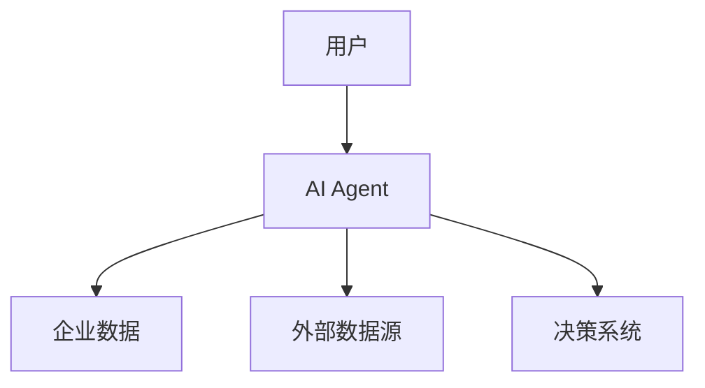
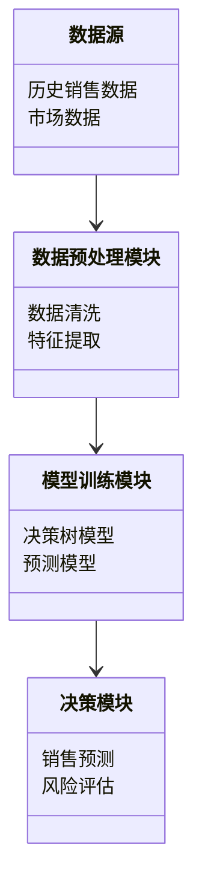
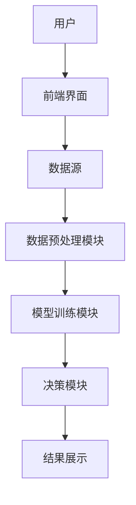
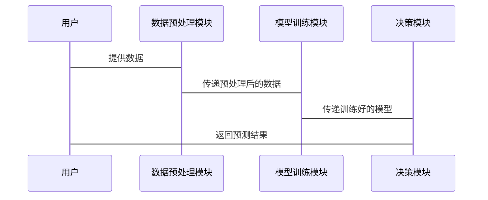

                 


# AI Agent辅助企业商业智能与数据驱动决策

## 关键词：AI Agent，商业智能，数据驱动决策，机器学习，企业架构

## 摘要：本文详细探讨AI Agent如何辅助企业进行商业智能分析和数据驱动决策。从AI Agent的核心概念到算法原理，从系统架构设计到项目实战，结合实际案例，深入分析AI Agent在企业中的应用价值和实现方法，为读者提供系统化的知识体系和实践指导。

---

# 第一部分: AI Agent与商业智能概述

# 第1章: AI Agent辅助企业商业智能概述

## 1.1 AI Agent的基本概念

### 1.1.1 AI Agent的定义与类型

AI Agent（人工智能代理）是指能够感知环境、自主决策并执行任务的智能体。根据功能和应用场景的不同，AI Agent可以分为以下几种类型：

- **基于规则的AI Agent**：通过预定义的规则进行决策，适用于简单的场景。
- **基于模型的AI Agent**：利用数学模型和知识库进行推理和决策，适用于复杂场景。
- **基于机器学习的AI Agent**：通过机器学习算法从数据中学习模式，实现自适应决策。
- **混合型AI Agent**：结合多种方法和技术的综合型AI Agent。

### 1.1.2 AI Agent的核心优势

AI Agent能够显著提升企业的商业智能和数据驱动决策能力，其优势体现在以下几个方面：

- **自动化决策**：AI Agent能够快速处理大量数据，提供实时决策支持。
- **自适应能力**：基于机器学习算法，AI Agent能够不断优化自身的决策模型。
- **高效性**：通过自动化处理和学习，AI Agent能够在短时间内完成复杂的决策任务。

### 1.1.3 AI Agent在企业中的应用领域

AI Agent在企业中的应用领域广泛，主要包括：

- **销售预测**：通过历史销售数据和市场趋势，预测未来销售情况。
- **库存管理**：优化库存水平，减少浪费，降低成本。
- **客户细分**：基于客户行为数据，进行客户细分，制定精准的营销策略。
- **风险评估**：评估潜在风险，帮助企业在复杂环境中做出决策。

## 1.2 商业智能的基础知识

### 1.2.1 商业智能的定义与特点

商业智能（Business Intelligence，BI）是指通过收集、整合、分析企业内外部数据，为企业决策提供支持的一种技术方法。其特点包括：

- **数据驱动**：基于数据的分析和洞察进行决策。
- **实时性**：能够实时获取和分析数据，提供及时的决策支持。
- **可视化**：通过图表和仪表盘等形式，直观展示数据和分析结果。

### 1.2.2 数据驱动决策的重要性

在当今数据驱动的时代，数据驱动决策已成为企业成功的关键因素。通过数据驱动决策，企业能够：

- **提高决策的准确性**：基于大量数据和分析结果，避免主观判断的偏差。
- **优化运营效率**：通过数据分析发现瓶颈，优化流程和资源分配。
- **增强竞争力**：快速响应市场变化，制定灵活的策略。

### 1.2.3 AI Agent与商业智能的结合

AI Agent与商业智能的结合，为企业提供了更加强大和智能的决策支持。AI Agent能够：

- **自动化数据处理**：快速处理大量数据，生成有用的信息。
- **智能分析与预测**：利用机器学习算法，进行预测和趋势分析。
- **实时监控与反馈**：实时监控企业运营状况，提供及时的反馈和调整建议。

## 1.3 本章小结

本章介绍了AI Agent的基本概念、核心优势及其在企业中的应用领域，同时详细讲解了商业智能的定义、特点及其重要性。通过本章的学习，读者可以理解AI Agent与商业智能的结合如何为企业提供更高效的决策支持。

---

# 第二部分: AI Agent的核心概念与原理

# 第2章: AI Agent的核心概念与联系

## 2.1 AI Agent的核心概念

### 2.1.1 感知、决策、执行的三阶段模型

AI Agent的工作过程可以分为三个主要阶段：感知、决策和执行。

- **感知阶段**：AI Agent通过传感器、数据源等获取环境中的信息。
- **决策阶段**：基于感知到的信息，AI Agent利用算法和模型进行分析和推理，生成决策。
- **执行阶段**：根据决策结果，AI Agent采取相应的行动或输出结果。

### 2.1.2 AI Agent的核心概念属性对比表

以下是AI Agent核心概念的属性对比表：

| 属性       | 描述                                                                 |
|------------|----------------------------------------------------------------------|
| 感知能力   | 数据采集与分析能力                                                 |
| 决策能力   | 基于数据的决策算法                                                 |
| 执行能力   | 行动或输出结果                                                     |

### 2.1.3 AI Agent的实体关系架构

以下是AI Agent的实体关系架构图：



---

# 第三部分: AI Agent的算法原理

# 第3章: AI Agent的算法原理与实现

## 3.1 基于决策树的AI Agent算法

### 3.1.1 决策树算法的原理

决策树是一种常用的机器学习算法，通过构建树状结构对数据进行分类或回归。其原理如下：

- 数据输入：将数据输入决策树模型。
- 特征选择：选择最能区分不同类别的特征作为分裂节点。
- 决策节点：根据选择的特征进行数据分裂，生成新的决策节点。
- 叶子节点：当数据无法再分裂时，生成叶子节点，作为最终的分类结果。

### 3.1.2 决策树算法的Python实现

以下是决策树算法的Python实现代码示例：

```python
from sklearn.tree import DecisionTreeClassifier
model = DecisionTreeClassifier()
model.fit(X_train, y_train)
```

### 3.1.3 决策树的数学模型

决策树的数学模型可以通过信息增益或基尼指数来衡量特征的选择。以下是信息增益的公式：

$$
\text{信息增益} = \text{熵}(D) - \sum_{v} \text{熵}(D_v)
$$

其中，$D$是数据集，$D_v$是根据特征$v$划分后的子数据集。

---

# 第四部分: AI Agent的系统架构设计

# 第4章: AI Agent的系统架构设计

## 4.1 问题场景介绍

为了展示AI Agent的系统架构设计，我们以一个简单的销售预测场景为例。企业希望通过AI Agent分析历史销售数据，预测未来的销售趋势。

## 4.2 系统功能设计

### 4.2.1 领域模型设计

以下是领域模型的Mermaid类图：



### 4.2.2 系统架构设计

以下是系统架构的Mermaid架构图：



### 4.2.3 系统接口设计

以下是系统接口的Mermaid序列图：



---

# 第五部分: AI Agent的项目实战

# 第5章: AI Agent的项目实战

## 5.1 环境安装与配置

以下是项目所需的环境安装步骤：

1. 安装Python和pip。
2. 安装必要的库：`scikit-learn`、`mermaid`、`matplotlib`。

## 5.2 核心实现代码

以下是AI Agent的核心实现代码：

```python
from sklearn.tree import DecisionTreeClassifier
import pandas as pd
import matplotlib.pyplot as plt

# 数据加载
data = pd.read_csv('销售数据.csv')

# 数据预处理
X = data[['价格', '广告投入', '销售渠道']]
y = data['销量']

# 模型训练
model = DecisionTreeClassifier()
model.fit(X, y)

# 预测
预测销量 = model.predict([[100, 50, '线上']])
print('预测销量：', 预测销量)
```

## 5.3 代码解读与分析

1. 数据加载：从CSV文件中读取销售数据。
2. 数据预处理：提取特征变量和目标变量。
3. 模型训练：使用决策树算法训练模型。
4. 预测：利用训练好的模型进行销量预测。

## 5.4 实际案例分析

以实际销售数据为例，通过代码实现销量预测，并分析预测结果的准确性。

## 5.5 项目小结

通过本章的项目实战，读者可以掌握AI Agent的基本实现方法，并能够将其应用于实际的企业场景中。

---

# 第六部分: 最佳实践与总结

# 第6章: 最佳实践与总结

## 6.1 最佳实践

- **数据质量**：确保数据的准确性和完整性，避免噪声数据的干扰。
- **模型选择**：根据具体场景选择合适的算法，避免盲目追求复杂模型。
- **持续优化**：定期更新模型和数据，保持AI Agent的决策能力。

## 6.2 小结

通过本文的详细讲解，读者可以全面了解AI Agent在企业商业智能与数据驱动决策中的应用价值和实现方法。从核心概念到算法原理，从系统架构设计到项目实战，本文为读者提供了一个完整的知识体系和实践指南。

## 6.3 注意事项

- **数据隐私**：在处理企业数据时，需注意数据隐私和合规性。
- **模型解释性**：复杂的模型可能难以解释，需注重模型的可解释性。
- **性能优化**：在实际应用中，需关注模型的性能和运行效率。

## 6.4 拓展阅读

- 《机器学习实战》：深入讲解机器学习算法的实现与应用。
- 《企业架构的艺术》：探讨企业架构设计的原则和实践。
- 《数据驱动的决策革命》：分析数据驱动决策在企业中的应用案例。

---

通过本文的系统学习，读者可以掌握AI Agent在企业中的应用，并能够将其应用于实际的商业智能与数据驱动决策中，为企业创造更大的价值。

