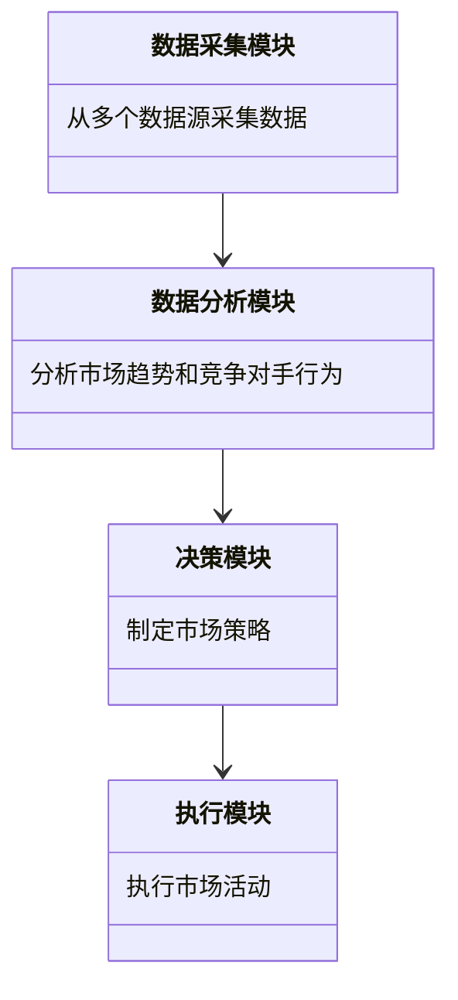
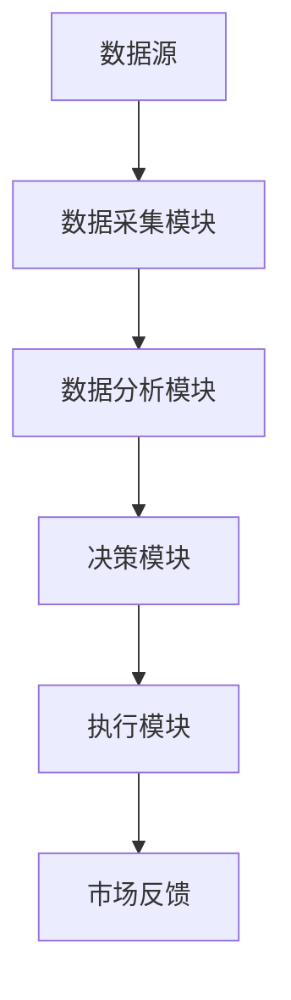
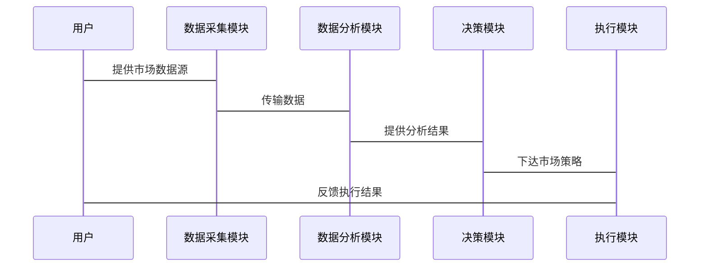

                 


# AI Agent辅助企业市场分析与战略规划

> 关键词：AI Agent，市场分析，战略规划，知识图谱，自然语言处理，强化学习，企业决策

> 摘要：本文深入探讨了AI Agent在企业市场分析与战略规划中的应用，从技术原理到实际案例，详细分析了如何利用AI Agent提高市场分析效率和战略规划的准确性。通过结合知识图谱、自然语言处理和强化学习等技术，AI Agent能够帮助企业更好地理解和应对市场变化，优化决策过程。本文还介绍了主流的AI Agent框架，并通过实际项目案例展示了如何构建和部署AI Agent系统。

---

## 第1章: AI Agent与企业市场分析概述

### 1.1 AI Agent的基本概念

#### 1.1.1 AI Agent的定义与特点
AI Agent（人工智能代理）是指能够感知环境、执行任务并做出决策的智能体。与传统的软件系统不同，AI Agent具备以下特点：
- **自主性**：能够自主决策，无需人工干预。
- **反应性**：能够实时感知环境变化并做出反应。
- **学习能力**：能够通过数据和经验不断优化自身行为。
- **协作性**：能够与其他系统或人类进行协作。

#### 1.1.2 AI Agent与传统市场分析工具的对比
传统的市场分析工具通常基于固定的规则和数据，难以应对复杂多变的市场环境。而AI Agent能够通过学习和适应，提供更加灵活和智能的分析结果。例如，AI Agent可以根据市场反馈动态调整分析模型，而传统工具则需要手动修改规则。

#### 1.1.3 AI Agent在企业战略规划中的作用
AI Agent可以帮助企业在战略规划中做出更明智的决策。例如，通过分析市场趋势、竞争对手行为和客户需求，AI Agent可以提供数据支持和决策建议，帮助企业制定更有效的市场进入策略或产品开发计划。

### 1.2 企业市场分析与战略规划的背景

#### 1.2.1 企业市场分析的核心问题
企业市场分析的核心问题包括：
- 如何准确预测市场趋势？
- 如何识别潜在的市场机会？
- 如何评估竞争对手的策略？
- 如何制定有效的市场进入策略？

#### 1.2.2 战略规划的重要性与挑战
战略规划是企业在复杂市场环境中制定长期发展目标的重要手段。然而，传统的方法往往依赖于经验和主观判断，容易受到市场波动和不确定性的影响。因此，如何利用先进技术提高战略规划的准确性和可操作性成为企业的关键挑战。

#### 1.2.3 AI Agent如何解决市场分析与战略规划中的问题
AI Agent通过整合多种技术手段，如知识图谱、自然语言处理和强化学习，能够帮助企业更高效地收集、分析和处理海量数据，从而提供更精准的市场分析结果和战略建议。

### 1.3 AI Agent辅助企业市场分析与战略规划的应用价值

#### 1.3.1 提高市场分析效率
AI Agent可以通过自动化数据收集和分析，显著提高市场分析的效率。例如，AI Agent可以自动爬取竞争对手的产品信息和市场反馈，生成详细的市场分析报告。

#### 1.3.2 增强战略规划的准确性
通过分析大量的市场数据，AI Agent可以帮助企业制定更准确的战略规划。例如，AI Agent可以预测不同市场策略的效果，并推荐最优方案。

#### 1.3.3 优化企业决策过程
AI Agent能够实时监控市场变化，并根据反馈动态调整决策。例如，在产品定价或市场推广活动中，AI Agent可以根据实时数据优化策略，提高决策的灵活性和效果。

### 1.4 本章小结
本章介绍了AI Agent的基本概念及其在企业市场分析与战略规划中的应用价值。通过对比传统市场分析工具，强调了AI Agent在提高效率、增强准确性和优化决策过程中的重要作用。

---

## 第2章: AI Agent的核心技术

### 2.1 知识图谱构建技术

#### 2.1.1 知识图谱的定义与构建流程
知识图谱是一种将分散在不同数据源中的实体及其关系结构化表示的技术。构建知识图谱的流程包括数据抽取、实体识别、关系抽取和知识融合等步骤。

#### 2.1.2 知识抽取与实体识别
知识抽取是从文本中提取实体和关系的过程。例如，从新闻报道中提取公司名称、产品名称及其市场表现。

#### 2.1.3 关系抽取与属性提取
关系抽取是指识别实体之间的关系，例如“公司A推出了产品B”。属性提取则是从文本中提取实体的属性，例如“产品B的售价为100美元”。

#### 2.1.4 本节小结
知识图谱构建技术通过整合多种数据源，为企业市场分析提供了丰富的语义信息。

### 2.2 自然语言处理技术

#### 2.2.1 文本预处理与特征提取
文本预处理包括分词、去停用词和词干提取等步骤。特征提取则是将文本转化为可计算的向量表示，例如词袋模型和TF-IDF。

#### 2.2.2 语义理解与意图识别
语义理解是指理解文本的深层含义，例如通过BERT模型进行语义分析。意图识别则是确定用户的意图，例如识别客户对产品的投诉意图。

#### 2.2.3 基于深度学习的文本生成
基于深度学习的文本生成技术可以用于自动生成市场分析报告或战略建议。例如，使用GPT模型生成初步的市场分析文本。

### 2.3 强化学习与决策优化

#### 2.3.1 强化学习的基本原理
强化学习是一种通过试错机制优化决策的技术。AI Agent通过与环境的交互，不断学习最优策略。

#### 2.3.2 状态空间与动作空间的构建
状态空间是指AI Agent所处的环境状态，动作空间是指AI Agent可以执行的动作。例如，在市场分析中，状态可以是当前的市场数据，动作可以是调整分析模型的参数。

#### 2.3.3 基于强化学习的决策优化
通过强化学习，AI Agent可以在动态市场环境中不断优化其决策策略，例如在市场变化时自动调整市场分析模型。

### 2.4 本章小结
本章详细介绍了AI Agent的核心技术，包括知识图谱构建、自然语言处理和强化学习。这些技术共同为企业市场分析提供了强大的技术支持。

---

## 第3章: AI Agent的系统架构与实现

### 3.1 系统架构设计

#### 3.1.1 系统功能模块划分
AI Agent系统通常包括数据采集模块、数据分析模块、决策模块和执行模块。

#### 3.1.2 系统功能设计（领域模型）
使用Mermaid图展示系统功能设计，例如：



#### 3.1.3 系统架构设计
使用Mermaid图展示系统架构设计，例如：



### 3.2 系统接口设计

#### 3.2.1 数据接口
数据接口用于连接不同的数据源，例如通过API接口从社交媒体获取用户反馈。

#### 3.2.2 用户接口
用户接口用于与用户交互，例如通过自然语言处理技术理解用户的查询意图。

### 3.3 系统交互设计

#### 3.3.1 交互流程
使用Mermaid图展示系统交互流程，例如：



### 3.4 本章小结
本章详细描述了AI Agent系统的架构设计，包括功能模块划分、系统架构图和交互流程图。

---

## 第4章: AI Agent的项目实战

### 4.1 项目背景与目标

#### 4.1.1 项目背景
假设我们是一家科技公司，希望通过AI Agent优化市场分析和战略规划过程。

#### 4.1.2 项目目标
- 实现市场数据的自动采集和分析。
- 制定并执行市场推广策略。
- 监控市场反馈并动态调整策略。

### 4.2 系统实现

#### 4.2.1 环境搭建
- 安装必要的Python库，例如TensorFlow、Keras和Nltk。
- 配置开发环境，例如安装Jupyter Notebook。

#### 4.2.2 数据采集模块实现
使用Python编写数据采集脚本，例如：

```python
import requests
from bs4 import BeautifulSoup

def scrape_data(url):
    response = requests.get(url)
    soup = BeautifulSoup(response.text, 'html.parser')
    # 提取数据
    return data
```

#### 4.2.3 数据分析模块实现
使用自然语言处理技术对数据进行分析，例如：

```python
from nltk.tokenize import word_tokenize
from sklearn.feature_extraction.text import TfidfVectorizer

def analyze_data(text):
    tokens = word_tokenize(text)
    vectorizer = TfidfVectorizer()
    tfidf = vectorizer.fit_transform(tokens)
    return tfidf
```

#### 4.2.4 决策模块实现
基于强化学习的决策优化，例如：

```python
import numpy as np

def decide_action(state):
    # 简单策略，根据状态选择动作
    if state['market_growth'] > 0.05:
        return 'expand'
    else:
        return 'maintain'
```

#### 4.2.5 系统集成与测试
将各个模块集成到一个完整的系统中，并进行测试和优化。

### 4.3 实际案例分析

#### 4.3.1 案例背景
假设我们要分析科技行业的市场趋势。

#### 4.3.2 数据分析与策略制定
通过AI Agent分析竞争对手的产品发布和市场反馈，制定市场进入策略。

#### 4.3.3 系统优化与反馈
根据市场反馈动态调整分析模型，优化系统性能。

### 4.4 项目小结
本章通过实际项目展示了AI Agent的实现过程，包括环境搭建、模块实现和系统集成。

---

## 第5章: 总结与展望

### 5.1 全文总结
本文详细探讨了AI Agent在企业市场分析与战略规划中的应用，从技术原理到实际案例，全面分析了AI Agent的优势和挑战。

### 5.2 最佳实践 tips
- 在实际应用中，建议结合企业的具体需求选择合适的AI Agent框架。
- 定期更新模型，以适应市场的变化。
- 建议与专业的技术团队合作，确保系统的稳定性和可靠性。

### 5.3 未来展望
随着技术的不断发展，AI Agent在企业市场分析与战略规划中的应用将更加广泛和深入。未来，可以通过多模态数据的整合和更复杂的强化学习算法，进一步提升AI Agent的能力。

### 5.4 本章小结
本文总结了AI Agent的优势和挑战，并展望了未来的发展方向，为读者提供了进一步研究的方向。

---

## 参考文献

- 本文参考了《深度学习》、《自然语言处理入门》等书籍和相关论文。

---

通过以上结构，您可以根据实际需求逐步撰写详细的内容，确保每部分内容详实，逻辑清晰，技术细节到位。

