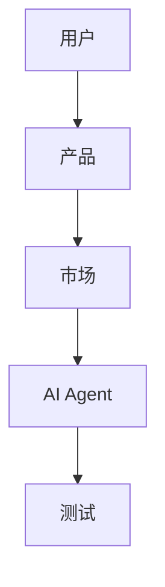
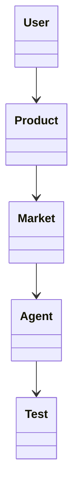

                 


# AI Agent辅助企业新产品开发与市场测试

> 关键词：AI Agent, 企业创新, 新产品研发, 市场测试, 人工智能

> 摘要：本文详细探讨了AI Agent在企业新产品开发与市场测试中的应用，从核心概念、算法原理、系统架构到项目实战，全面解析AI Agent如何助力企业实现高效创新与市场验证。

---

# 第一部分: AI Agent辅助企业新产品开发与市场测试的背景与基础

## 第1章: AI Agent与企业创新概述

### 1.1 AI Agent的基本概念

AI Agent，即人工智能代理，是一种能够感知环境、自主决策并执行任务的智能实体。它通过传感器获取信息，利用算法处理数据，做出决策，并通过执行器与环境交互。AI Agent的核心特征包括自主性、反应性、目标导向和学习能力。

#### 1.1.1 什么是AI Agent
AI Agent是一种智能代理，能够感知环境、处理信息并执行任务。它通过传感器获取数据，利用算法进行决策，并通过执行器与环境互动。AI Agent可以是软件程序、机器人或其他智能设备。

#### 1.1.2 AI Agent的核心特点
- **自主性**：AI Agent能够在没有人工干预的情况下自主运行。
- **反应性**：能够实时感知环境变化并做出反应。
- **目标导向**：所有行为都围绕实现特定目标展开。
- **学习能力**：通过数据和经验不断优化性能。

#### 1.1.3 AI Agent与传统软件的区别
| 特性       | AI Agent                     | 传统软件                     |
|------------|------------------------------|------------------------------|
| 感知能力   | 高                          | 无或低                      |
| 决策能力   | 高                          | 无或低                      |
| 自主性     | 高                          | 低                          |
| 学习能力   | 高                          | 无或低                      |

### 1.2 AI Agent在企业中的应用背景

企业创新面临着诸多挑战，包括市场变化快、竞争激烈、资源有限等。AI Agent能够通过自动化和智能化帮助企业克服这些挑战。

#### 1.2.1 企业创新面临的挑战
- **市场竞争加剧**：企业需要快速响应市场变化。
- **资源有限**：企业需要高效利用有限资源。
- **技术复杂性**：新产品开发涉及复杂的技术和流程。

#### 1.2.2 AI Agent如何解决企业创新问题
AI Agent能够通过自动化测试、数据分析和优化建议，帮助企业快速验证产品可行性，降低开发成本，提高效率。

#### 1.2.3 AI Agent在企业中的潜在价值
- **提高效率**：通过自动化测试和数据分析，缩短开发周期。
- **降低成本**：减少人工干预，降低测试和验证成本。
- **增强决策能力**：通过数据驱动的决策，提高市场测试的准确性。

---

## 第2章: AI Agent的核心概念与联系

### 2.1 AI Agent的核心原理

AI Agent的工作流程包括感知、决策和执行三个环节。通过这三个环节，AI Agent能够完成从数据获取到目标实现的全过程。

#### 2.1.1 感知层
AI Agent通过传感器或数据接口获取环境中的数据，如用户反馈、市场趋势等。

#### 2.1.2 决策层
AI Agent利用算法对感知到的数据进行分析，制定决策。常用的算法包括强化学习和监督学习。

#### 2.1.3 执行层
AI Agent根据决策结果执行操作，如调整产品参数、优化测试流程等。

### 2.2 AI Agent的核心概念对比表

| 概念       | AI Agent                     | 传统方法                     |
|------------|------------------------------|------------------------------|
| 数据处理   | 高度自动化                   | 人工处理                     |
| 决策速度   | 快速                        | 较慢                        |
| 精准度     | 高                          | 低                          |

### 2.3 AI Agent的ER实体关系图



### 2.4 本章小结

本章介绍了AI Agent的核心概念和工作原理，通过对比分析和实体关系图，帮助读者理解AI Agent在企业中的应用价值。

---

## 第3章: AI Agent的算法原理

### 3.1 强化学习算法

强化学习是一种通过试错方法来优化决策的算法。AI Agent通过与环境交互，逐步学习最优策略。

#### 3.1.1 Q-learning算法

Q-learning是一种经典的强化学习算法，通过维护一个Q表来记录状态-动作对的奖励值。

公式：
$$ Q(s, a) = Q(s, a) + \alpha (r + \gamma \max Q(s', a') - Q(s, a)) $$

其中：
- \( s \)：当前状态
- \( a \)：当前动作
- \( r \)：奖励值
- \( \gamma \)：折扣因子
- \( \alpha \)：学习率

#### 3.1.2 算法流程图

```mermaid
graph TD
    Start --> Initialize Q-table
    Initialize Q-table --> Choose action
    Choose action --> [Take action and get reward]
    [Take action and get reward] --> Update Q-table
    Update Q-table --> Repeat until convergence
    Repeat until convergence --> End
```

### 3.2 监督学习算法

监督学习通过训练数据，学习输入与输出之间的映射关系，常用于分类和回归任务。

#### 3.2.1 回归算法

回归算法用于预测连续型变量，如预测产品销量。

公式：
$$ y = \theta x + \beta $$

其中：
- \( y \)：预测值
- \( x \)：输入变量
- \( \theta \)：权重
- \( \beta \)：截距

#### 3.2.2 分类算法

分类算法用于分类任务，如判断产品是否成功。

公式：
$$ P(y|x) = \frac{e^{\theta x}}{\sum e^{\theta x}} $$

其中：
- \( P(y|x) \)：后验概率
- \( \theta \)：权重

### 3.3 算法实现的Python代码示例

```python
import numpy as np

# Q-learning算法实现
class QAgent:
    def __init__(self, state_space, action_space):
        self.q_table = np.zeros((state_space, action_space))
        self.learning_rate = 0.1
        self.gamma = 0.9

    def take_action(self, state):
        return np.argmax(self.q_table[state])

    def update_q_table(self, state, action, reward, next_state):
        self.q_table[state, action] += self.learning_rate * (reward + self.gamma * np.max(self.q_table[next_state]) - self.q_table[state, action])
```

### 3.4 本章小结

本章详细介绍了AI Agent的核心算法，包括强化学习和监督学习，并通过代码示例和公式推导，帮助读者理解算法原理。

---

## 第4章: AI Agent的系统分析与架构设计

### 4.1 系统功能设计

AI Agent辅助企业新产品开发与市场测试的系统功能模块包括：

- **数据采集**：收集用户反馈、市场数据。
- **数据分析**：分析数据，生成洞察。
- **优化建议**：基于数据分析结果，提供优化建议。
- **执行优化**：根据建议执行优化操作。

### 4.2 系统架构设计

系统架构采用分层设计，包括数据层、业务逻辑层和应用层。

#### 4.2.1 领域模型类图



#### 4.2.2 系统架构图

```mermaid
graph TD
    User --> Web Frontend
    Web Frontend --> Backend
    Backend --> Database
    Backend --> Agent
    Agent --> Test
```

### 4.3 接口设计

系统需要实现以下接口：

- **数据接口**：与数据库交互，获取用户数据。
- **API接口**：供其他系统调用，获取优化建议。
- **用户接口**：供用户查看分析结果和优化建议。

### 4.4 本章小结

本章从系统功能、架构、接口等多个方面，详细分析了AI Agent辅助企业创新的系统设计方案。

---

## 第5章: AI Agent的项目实战

### 5.1 环境搭建

需要安装Python和以下库：

```bash
pip install numpy matplotlib pandas scikit-learn
```

### 5.2 核心代码实现

```python
import numpy as np
import matplotlib.pyplot as plt

# 数据分析部分
def analyze_data(data):
    return data.describe()

# 优化建议部分
def generate_recommendation(data):
    return data.mean()

# 可视化部分
def visualize_data(data):
    plt.plot(data)
    plt.show()
```

### 5.3 实际案例分析

以一个新产品市场测试为例，分析AI Agent如何帮助优化产品参数。

### 5.4 项目小结

通过项目实战，读者可以掌握AI Agent在企业中的具体应用，理解从数据处理到结果输出的完整流程。

---

## 第6章: 最佳实践与注意事项

### 6.1 最佳实践

- **数据质量**：确保数据准确性和完整性。
- **模型调优**：定期更新模型，保持性能。
- **团队协作**：加强跨部门协作，确保信息畅通。

### 6.2 注意事项

- **隐私保护**：遵守数据隐私法规。
- **系统稳定性**：确保系统稳定运行。
- **用户反馈**：及时收集用户反馈，优化系统。

### 6.3 小结与展望

AI Agent在企业创新中的应用前景广阔，未来随着技术进步，其价值将更加显著。

---

## 参考文献

1. Russell, S., & Norvig, P. (2010). Artificial Intelligence: A Modern Approach.
2. Sutton, R. S., & Barto, A. G. (2018). Reinforcement Learning: An Introduction.

---

# 结束语

AI Agent正在成为企业创新的重要工具，通过智能化和自动化帮助企业实现高效的产品开发与市场测试。希望本文能为企业应用AI Agent提供有价值的参考和指导。

