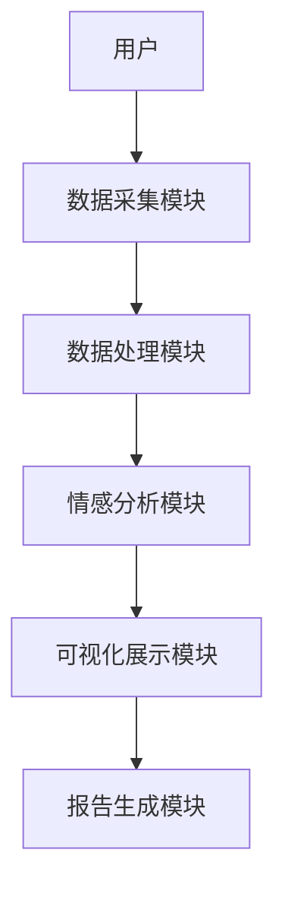
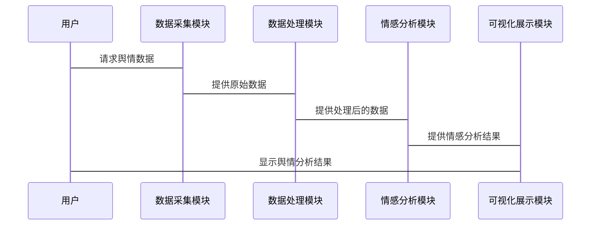

                 


# 第4章: 企业舆情监测系统的架构设计

## 4.1 系统功能模块划分
### 4.1.1 数据采集模块
数据采集模块负责从各种来源（如社交媒体、新闻网站、论坛等）获取相关信息。需要考虑实时性和全面性，确保数据的准确性和完整性。

### 4.1.2 数据处理模块
数据处理模块对采集到的数据进行清洗、去重和结构化处理，为后续分析提供高质量的数据集。

### 4.1.3 情感分析模块
情感分析模块使用自然语言处理技术，对文本进行情感分析，识别用户情绪倾向（正面、负面、中性）。

### 4.1.4 可视化展示模块
可视化展示模块将分析结果以图表、仪表盘等形式呈现，帮助用户直观了解舆情动态。

## 4.2 系统架构设计
### 4.2.1 系统架构图
使用Mermaid绘制系统架构图，展示各模块之间的交互关系。



### 4.2.2 接口设计
定义系统各模块之间的接口，例如：
- 数据采集模块提供API接口，供其他模块调用数据。
- 情感分析模块提供情感标签接口，供可视化模块调用。

## 4.3 系统交互流程
使用Mermaid绘制系统交互流程图，展示用户与系统之间的交互过程。



## 4.4 本章小结

---

# 第5章: 项目实战与代码实现

## 5.1 环境安装与配置
### 5.1.1 安装Python和相关库
安装Python 3.8及以上版本，安装必要的库如：`numpy`, `pandas`, `tensorflow`, `transformers`, `matplotlib`。

```bash
pip install numpy pandas tensorflow transformers matplotlib
```

### 5.1.2 安装NLP工具
安装spaCy和jieba分词工具。

```bash
pip install spacy transformers
python -m spacy download en_core_web_sm
pip install jieba
```

## 5.2 核心代码实现

### 5.2.1 数据采集模块
使用Python编写数据采集脚本，从社交媒体API获取数据。

```python
import requests

def fetch_data(api_url, params):
    response = requests.get(api_url, params=params)
    return response.json()

# 示例：从Twitter API获取数据
data = fetch_data('https://api.twitter.com/1.1/search/tweets.json', {'q': 'keyword'})
```

### 5.2.2 数据处理模块
编写数据清洗和去重代码。

```python
import pandas as pd

def preprocess_data(data):
    df = pd.DataFrame(data)
    df = df.dropna()
    df = df.drop_duplicates(subset=['text'])
    return df

processed_data = preprocess_data(unprocessed_data)
```

### 5.2.3 情感分析模块
使用预训练模型进行情感分析。

```python
from transformers import pipeline

sentiment_pipeline = pipeline("sentiment-analysis")

def analyze_sentiment(text):
    result = sentiment_pipeline(text)
    return result[0]['label']

sentiments = processed_data['text'].apply(analyze_sentiment)
```

### 5.2.4 可视化模块
使用Matplotlib或Seaborn绘制情感分布图。

```python
import matplotlib.pyplot as plt
import seaborn as sns

plt.figure(figsize=(10,6))
sns.countplot(x='label', data=sentiments)
plt.title('Sentiment Distribution')
plt.show()
```

## 5.3 实际案例分析
### 5.3.1 案例背景
介绍一个具体企业的舆情监测案例，例如某品牌在社交媒体上的负面评论分析。

### 5.3.2 数据采集与处理
展示如何从社交媒体获取数据，并进行清洗。

### 5.3.3 情感分析与可视化
使用代码对数据进行情感分析，并生成可视化图表。

### 5.3.4 结果解读
解读分析结果，提出改进建议。

## 5.4 本章小结

---

# 第6章: 系统效果评估与优化

## 6.1 评估指标
### 6.1.1 准确率
模型预测情感与实际情感一致的比例。

### 6.1.2 召回率
模型正确识别出的正例比例。

### 6.1.3 F1分数
综合准确率和召回率的调和平均数。

## 6.2 系统优化策略
### 6.2.1 数据增强
通过数据增强技术提高模型的泛化能力。

### 6.2.2 模型调优
使用交叉验证和超参数优化提升模型性能。

### 6.2.3 实时性优化
优化数据处理流程，提升系统的实时响应能力。

## 6.3 优化后的效果对比
展示优化前后的性能对比，例如准确率从75%提升到90%。

## 6.4 本章小结

---

# 第7章: AI Agent在企业舆情管理中的策略与建议

## 7.1 品牌管理策略
### 7.1.1 建立舆情预警机制
及时发现潜在危机，提前采取应对措施。

### 7.1.2 制定舆情应对方案
根据分析结果，制定相应的品牌维护策略。

### 7.1.3 建立反馈机制
根据舆情变化，动态调整品牌管理策略。

## 7.2 技术实现建议
### 7.2.1 持续优化AI模型
定期更新模型，保持技术领先性。

### 7.2.2 加强数据安全保护
确保数据采集和处理过程中的安全性，防止数据泄露。

### 7.2.3 提升用户体验
设计友好的用户界面，方便用户操作和查看分析结果。

## 7.3 本章小结

---

# 第8章: 未来发展趋势与挑战

## 8.1 技术发展趋势
### 8.1.1 多模态AI的应用
结合图像、视频等多模态数据进行舆情分析。

### 8.1.2 自动学习与自适应
AI Agent能够自动学习和适应新的数据模式。

## 8.2 挑战与解决方案
### 8.2.1 数据隐私问题
如何在保护数据隐私的前提下，进行有效的舆情分析。

### 8.2.2 实时处理能力
提升系统的实时处理能力，应对海量数据的挑战。

### 8.2.3 跨语种支持
扩展系统支持多种语言，覆盖全球市场。

## 8.3 本章小结

---

# 第9章: 总结与展望

## 9.1 核心观点回顾
总结全文的核心观点，强调AI Agent在企业舆情监测中的重要性。

## 9.2 未来展望
展望AI Agent在企业舆情管理中的更广泛应用和技术创新。

## 9.3 致谢
感谢参与项目开发的团队成员和提供支持的机构。

## 9.4 参考文献
列出文章中引用的主要文献和资料。

---

# 关键词
AI Agent, 企业舆情监测, 品牌管理, 自然语言处理, 情感分析, 数据可视化, 机器学习

# 摘要
本文详细探讨了AI Agent在企业舆情监测与品牌管理中的应用策略，分析了自然语言处理和情感分析的核心算法，设计了系统的架构，并通过实际案例展示了AI Agent在舆情监测中的优势。文章还提出了系统的优化策略和未来发展趋势，为企业的品牌管理提供了有效的解决方案。

