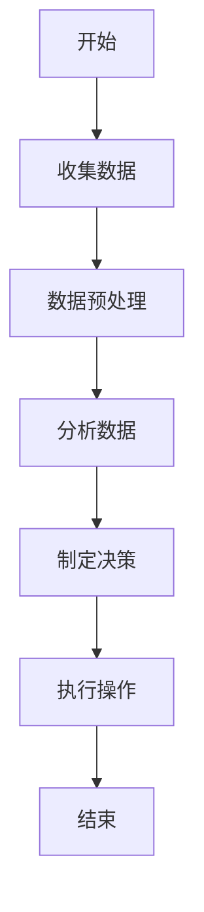
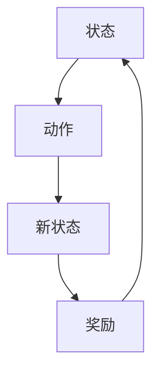
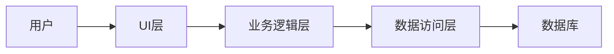

                 


# AI Agent辅助科学实验：自动化与数据分析

## 关键词：AI Agent，科学实验，自动化，数据分析，算法，系统架构，项目实战

## 摘要：本文深入探讨了AI Agent在科学实验中的应用，涵盖其核心概念、算法原理、系统架构设计以及实际项目案例。通过这些内容，读者可以全面了解AI Agent如何提升科学实验的效率和数据分析能力。

---

## 第一部分: AI Agent与科学实验的结合

### 第1章: AI Agent的基本概念

#### 1.1 AI Agent的定义
AI Agent（人工智能代理）是指能够感知环境、自主决策并执行任务的智能实体。它能够根据输入的信息做出反应，执行预设或自适应的任务。

#### 1.2 AI Agent的核心特点
- **自主性**：能够在没有外部干预的情况下独立运行。
- **反应性**：能够实时感知环境变化并做出反应。
- **学习能力**：通过数据和经验不断优化自身的决策和执行能力。
- **协作性**：能够与其他系统或人类协同工作。

#### 1.3 AI Agent与传统自动化工具的区别
| 特性 | AI Agent | 传统自动化工具 |
|------|-----------|----------------|
| 智能性 | 高         | 低             |
| 决策能力 | 强         | 无             |
| 学习能力 | 有         | 无             |
| 灵活性 | 高         | 低             |

### 第2章: AI Agent在科学实验中的应用

#### 2.1 科学实验的复杂性与挑战
科学实验通常涉及复杂的步骤和多变量的交互，传统的手动操作或简单自动化工具难以满足高效性和精确性的要求。

#### 2.2 AI Agent的作用
AI Agent可以通过自动化实验流程、实时数据分析和智能决策，显著提高实验效率和结果的准确性。

#### 2.3 典型应用场景
- **实验设计与优化**：AI Agent可以根据历史数据和优化算法，自动生成最优的实验方案。
- **实时监控与调整**：在实验过程中，AI Agent可以实时监控实验数据，并根据反馈动态调整实验参数。
- **数据处理与分析**：AI Agent可以自动采集、整理和分析实验数据，生成有意义的结论。

---

## 第二部分: AI Agent的核心概念与原理

### 第3章: AI Agent的核心概念

#### 3.1 AI Agent的结构与功能
- **感知层**：负责收集环境中的数据，如传感器数据、实验记录等。
- **决策层**：基于感知的数据，利用算法进行分析和决策。
- **执行层**：根据决策结果执行具体的操作，如调整实验设备参数。

#### 3.2 AI Agent的工作流程


### 第4章: AI Agent与相关技术的对比

#### 4.1 与传统自动化工具的对比
- **智能性**：AI Agent具备学习和决策能力，而传统自动化工具仅能执行预设任务。
- **灵活性**：AI Agent可以根据环境变化调整行为，传统工具则无法做到。

#### 4.2 与机器学习模型的对比
- **目标**：AI Agent的目标是执行任务，而机器学习模型的目标是预测或分类。
- **交互性**：AI Agent通常需要与环境进行交互，而机器学习模型主要用于数据处理和分析。

---

## 第三部分: AI Agent的算法原理

### 第5章: 强化学习算法

#### 5.1 Q-learning算法


数学公式：
$$ Q(s, a) = Q(s, a) + \alpha (r + \max Q(s', a) - Q(s, a)) $$

### 第6章: 监督学习算法

#### 6.1 线性回归算法
数学公式：
$$ y = \theta_0 + \theta_1 x $$

#### 6.2 分类算法
- **逻辑回归**：用于分类问题，数学公式：
$$ P(y=1|x) = \frac{e^{\beta_0 + \beta_1 x}}{1 + e^{\beta_0 + \beta_1 x}} $$

---

## 第四部分: AI Agent的系统分析与架构设计

### 第7章: 系统分析与架构设计

#### 7.1 实验场景介绍
假设我们正在设计一个化学实验的自动化系统，AI Agent需要控制实验设备、实时监控实验数据并根据反馈调整实验参数。

#### 7.2 系统功能设计
- **数据采集**：通过传感器收集实验数据。
- **数据分析**：利用机器学习算法对数据进行分析和预测。
- **决策制定**：根据分析结果生成最优的实验方案。
- **执行操作**：通过控制设备执行具体的实验步骤。

#### 7.3 系统架构设计


---

## 第五部分: 项目实战

### 第8章: 项目实战

#### 8.1 环境安装
安装必要的库，如Python的`numpy`、`pandas`、`scikit-learn`等。

#### 8.2 核心代码实现
```python
import numpy as np
from sklearn import linear_model

# 创建数据集
X = np.array([0, 1, 2, 3, 4], dtype=np.float64)
y = np.array([1, 3, 5, 7, 9], dtype=np.float64)

# 创建线性回归模型
model = linear_model.LinearRegression()

# 训练模型
model.fit(X.reshape(-1, 1), y)

# 预测
print(model.predict(np.array([5]).reshape(-1, 1)))
```

#### 8.3 案例分析
通过上述代码，我们可以看到AI Agent如何利用线性回归算法进行数据分析和预测。

---

## 第六部分: 最佳实践与小结

### 第9章: 最佳实践

#### 9.1 注意事项
- 确保数据的准确性和完整性。
- 定期更新模型以适应环境的变化。
- 处理异常情况，确保系统的健壮性。

#### 9.2 拓展阅读
建议阅读关于强化学习和深度学习的书籍，以进一步提升AI Agent的能力。

### 第10章: 小结
本文详细介绍了AI Agent在科学实验中的应用，从基本概念到算法原理，再到系统架构设计和项目实战，为读者提供了一个全面的视角。通过实际案例分析，读者可以更好地理解和应用这些技术。

---

以上是文章的大纲和部分内容，涵盖了从基础到高级的各个方面。希望对您有所帮助！

