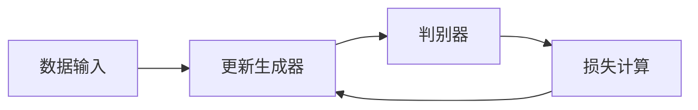
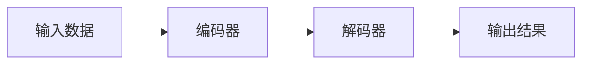
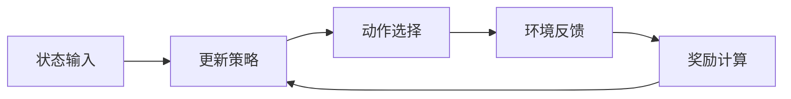
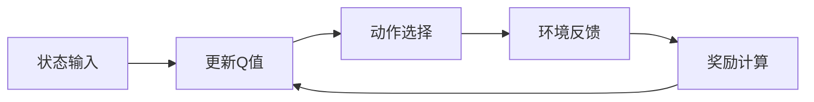
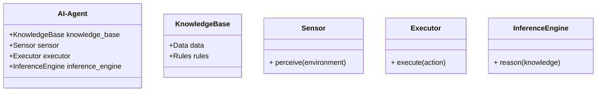
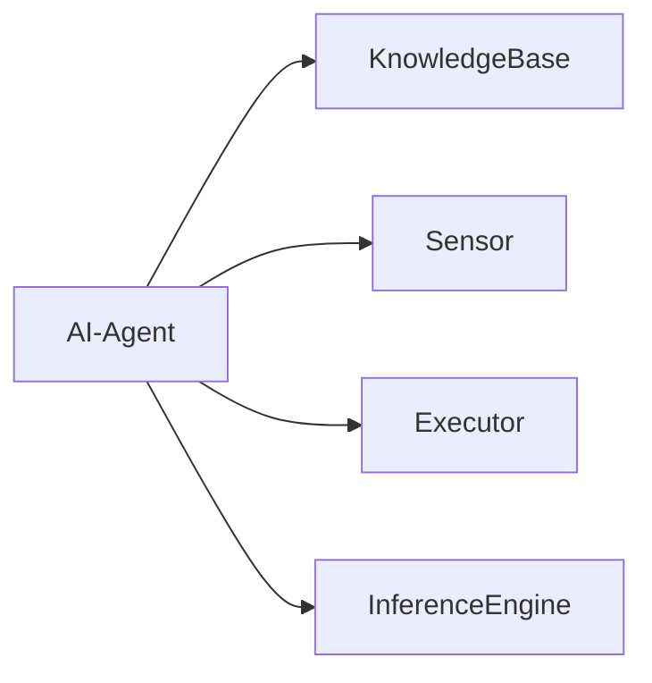
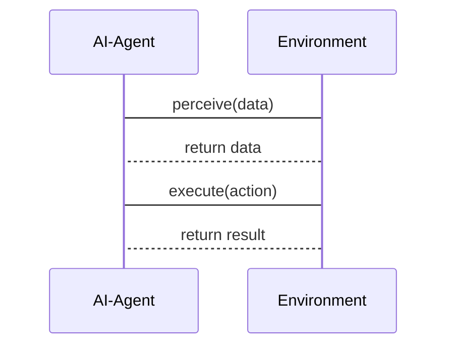

                 


# AI Agent辅助科学研究的方法

> 关键词：AI Agent，科学研究，算法原理，系统架构，项目实战

> 摘要：本文探讨AI Agent在科学研究中的应用，分析其核心概念、算法原理、系统架构，并通过实际案例展示其在数据处理、知识整合与发现中的作用，最后总结最佳实践和未来趋势。

---

# 第一部分: AI Agent辅助科学研究的背景与基础

## 第1章: AI Agent的基本概念与背景

### 1.1 AI Agent的定义与特点

#### 1.1.1 什么是AI Agent
AI Agent（人工智能代理）是一种能够感知环境、自主决策并执行任务的智能体。它通过传感器获取信息，利用推理能力解决问题，并通过执行器与环境交互。

#### 1.1.2 AI Agent的核心特点
- **自主性**：能够在没有外部干预的情况下运行。
- **反应性**：能够实时感知环境变化并做出反应。
- **目标导向**：根据设定的目标进行决策和行动。
- **学习能力**：能够通过经验改进性能。

#### 1.1.3 AI Agent与传统AI的区别
| 特性         | 传统AI                | AI Agent             |
|--------------|----------------------|----------------------|
| 智能水平     | 基于规则或预训练模型 | 具备自主学习能力     |
| 适应性       | 较低                 | 较高                 |
| 交互能力     | 有限                 | 强大                 |

### 1.2 AI Agent在科学研究中的应用背景

#### 1.2.1 科学研究中的数据处理挑战
现代科学研究面临数据量大、类型多样、复杂性高等问题，传统方法难以高效处理。

#### 1.2.2 知识整合与发现的需求
科学研究需要整合多学科知识，发现新的规律和模式，AI Agent能够帮助实现知识的自动整合。

#### 1.2.3 AI Agent在科学发现中的作用
AI Agent能够处理海量数据，发现隐藏的模式，辅助科学家进行预测和决策。

### 1.3 本章小结
本章介绍了AI Agent的基本概念和特点，并探讨了其在科学研究中的重要性。

---

# 第二部分: AI Agent的核心概念与体系结构

## 第2章: AI Agent的核心概念与体系结构

### 2.1 AI Agent的体系结构

#### 2.1.1 分层结构
AI Agent通常采用分层架构，包括感知层、决策层和执行层。

#### 2.1.2 组件化设计
AI Agent由多个功能模块组成，如感知模块、推理模块和执行模块。

#### 2.1.3 模块化实现
通过模块化设计，AI Agent能够灵活组合，适应不同的应用场景。

### 2.2 AI Agent的功能特性

#### 2.2.1 数据处理能力
AI Agent能够处理结构化、半结构化和非结构化数据。

#### 2.2.2 知识表示与推理能力
通过知识图谱和逻辑推理，AI Agent能够进行复杂问题的推理。

#### 2.2.3 自适应学习能力
基于机器学习算法，AI Agent能够从数据中学习并自适应调整。

### 2.3 AI Agent与其他技术的对比

#### 2.3.1 与传统数据处理工具的对比
| 技术         | 传统数据处理工具 | AI Agent          |
|--------------|------------------|-------------------|
| 处理能力     | 基于规则         | 基于机器学习      |
| 适应性       | 较低             | 较高              |
| 可扩展性     | 有限             | 强大              |

#### 2.3.2 与机器学习模型的对比
AI Agent不仅能够进行数据处理，还能根据目标进行决策和行动。

#### 2.3.3 与知识图谱的对比
AI Agent能够动态更新知识图谱，实现知识的自动整合。

### 2.4 AI Agent的数学模型与核心算法

#### 2.4.1 知识表示的数学模型
知识表示通常采用图论模型，节点表示实体，边表示关系。

#### 2.4.2 推理算法的数学表达
基于逻辑推理的算法，如布尔逻辑、概率推理等。

#### 2.4.3 学习算法的数学模型
生成式AI和强化学习的数学模型，如生成对抗网络（GAN）和策略梯度算法（PG）。

---

# 第三部分: AI Agent的算法原理与实现

## 第3章: AI Agent的算法原理

### 3.1 生成式AI的算法流程

#### 3.1.1 基于生成对抗网络（GAN）的实现


#### 3.1.2 基于Transformer的实现


### 3.2 强化学习的算法流程

#### 3.2.1 基于策略梯度的实现


#### 3.2.2 基于Q-learning的实现


### 3.3 Python核心实现代码

#### 3.3.1 生成式AI的实现
```python
import torch
import torch.nn as nn

class Generator(nn.Module):
    def __init__(self):
        super(Generator, self).__init__()
        self.fc1 = nn.Linear(100, 256)
        self.fc2 = nn.Linear(256, 512)
        self.fc3 = nn.Linear(512, 1024)

    def forward(self, x):
        x = torch.relu(self.fc1(x))
        x = torch.relu(self.fc2(x))
        x = torch.relu(self.fc3(x))
        return x

class Discriminator(nn.Module):
    def __init__(self):
        super(Discriminator, self).__init__()
        self.fc1 = nn.Linear(1024, 512)
        self.fc2 = nn.Linear(512, 256)
        self.fc3 = nn.Linear(256, 1)

    def forward(self, x):
        x = torch.relu(self.fc1(x))
        x = torch.relu(self.fc2(x))
        x = torch.sigmoid(self.fc3(x))
        return x
```

#### 3.3.2 强化学习的实现
```python
import torch
import torch.nn as nn
import torch.optim as optim

class PolicyNetwork(nn.Module):
    def __init__(self, state_dim, action_dim):
        super(PolicyNetwork, self).__init__()
        self.fc1 = nn.Linear(state_dim, 128)
        self.fc2 = nn.Linear(128, action_dim)

    def forward(self, x):
        x = torch.relu(self.fc1(x))
        x = torch.sigmoid(self.fc2(x))
        return x

optimizer = optim.Adam(policy_network.parameters(), lr=0.001)

def update_policy(rewards):
    loss = -torch.mean(torch.log(policy_network_outputs) * rewards)
    optimizer.zero_grad()
    loss.backward()
    optimizer.step()
```

---

# 第四部分: AI Agent的系统架构与设计

## 第4章: AI Agent的系统架构设计

### 4.1 问题场景介绍

#### 4.1.1 科学研究中的数据处理场景
AI Agent需要处理复杂的数据，包括文本、图像和数值数据。

#### 4.1.2 知识整合与发现的场景
AI Agent需要整合多学科的知识，发现新的科学规律。

### 4.2 系统功能设计

#### 4.2.1 领域模型类图


#### 4.2.2 系统架构图


### 4.3 系统接口设计

#### 4.3.1 接口描述
- **感知接口**：接收环境数据
- **推理接口**：进行逻辑推理
- **执行接口**：执行具体动作

### 4.4 系统交互设计

#### 4.4.1 交互流程


---

# 第五部分: AI Agent的项目实战

## 第5章: AI Agent的项目实战

### 5.1 环境安装与配置

#### 5.1.1 安装依赖
```bash
pip install torch matplotlib numpy
```

### 5.2 系统核心实现

#### 5.2.1 生成式AI的实现
```python
import torch
import torch.nn as nn

class Generator(nn.Module):
    def __init__(self):
        super(Generator, self).__init__()
        self.fc1 = nn.Linear(100, 256)
        self.fc2 = nn.Linear(256, 512)
        self.fc3 = nn.Linear(512, 1024)

    def forward(self, x):
        x = torch.relu(self.fc1(x))
        x = torch.relu(self.fc2(x))
        x = torch.relu(self.fc3(x))
        return x
```

#### 5.2.2 强化学习的实现
```python
import torch
import torch.nn as nn
import torch.optim as optim

class PolicyNetwork(nn.Module):
    def __init__(self, state_dim, action_dim):
        super(PolicyNetwork, self).__init__()
        self.fc1 = nn.Linear(state_dim, 128)
        self.fc2 = nn.Linear(128, action_dim)

    def forward(self, x):
        x = torch.relu(self.fc1(x))
        x = torch.sigmoid(self.fc2(x))
        return x

optimizer = optim.Adam(policy_network.parameters(), lr=0.001)
```

### 5.3 案例分析

#### 5.3.1 生物医学领域的应用
AI Agent在生物医学中可以辅助发现新的药物，通过分析文献和实验数据，预测药物的潜在效果。

#### 5.3.2 天文学领域的应用
AI Agent可以处理海量天文数据，发现新的天体和星系结构。

### 5.4 项目总结

#### 5.4.1 项目成果
通过实际案例展示了AI Agent在科学研究中的强大能力。

#### 5.4.2 经验总结
AI Agent的应用需要结合具体领域知识，选择合适的算法和架构。

---

# 第六部分: AI Agent的案例分析与未来展望

## 第6章: AI Agent的案例分析

### 6.1 生物医学领域的应用
AI Agent通过分析基因数据，辅助发现新的疾病治疗方法。

### 6.2 天文学领域的应用
AI Agent通过分析天文数据，发现新的天体和星系结构。

### 6.3 环境科学领域的应用
AI Agent通过分析环境数据，预测气候变化趋势。

## 第7章: AI Agent的未来展望

### 7.1 未来发展趋势
- 更强的自主学习能力
- 更广泛的应用领域
- 更高效的计算能力

---

# 第七部分: AI Agent的最佳实践与注意事项

## 第7章: AI Agent的最佳实践

### 7.1 设计原则
- 简单性
- 可扩展性
- 可维护性

### 7.2 使用建议
- 结合具体领域知识
- 定期更新模型
- 保证数据质量

### 7.3 注意事项
- 避免过度依赖AI Agent
- 注意数据隐私和安全
- 定期进行系统维护

---

# 第八部分: 结语

## 8.1 本文总结
AI Agent在科学研究中的应用前景广阔，能够显著提高科研效率和质量。

## 8.2 未来展望
随着技术的进步，AI Agent将在更多领域发挥重要作用。

---

# 参考文献
（此处列出相关参考文献）

---

# 附录

## A. AI Agent相关工具列表
- GAN
- Transformer
- RL

## B. 术语表
- AI Agent：人工智能代理
- GAN：生成对抗网络
- RL：强化学习

---

通过以上详细的目录和内容设计，读者可以系统地了解AI Agent在科学研究中的应用方法和实现细节，掌握AI Agent的核心概念和实际应用技巧。

