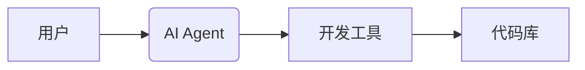
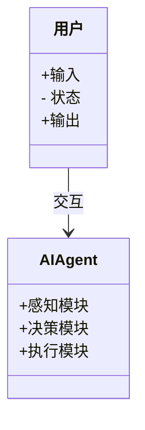
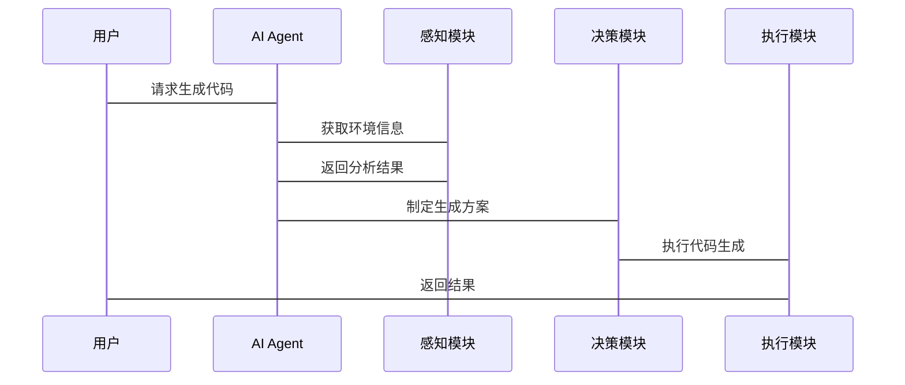

                 


# AI Agent辅助软件开发的方法

> 关键词：AI Agent、软件开发、人工智能、自动化、智能辅助

> 摘要：本文探讨AI Agent在软件开发中的应用，分析其核心概念、算法原理、系统架构，并通过项目实战和最佳实践，展示如何利用AI Agent提升开发效率和代码质量。

---

## 第一部分: AI Agent辅助软件开发的背景与概念

### 第1章: AI Agent概述

#### 1.1 AI Agent的基本概念

##### 1.1.1 什么是AI Agent
AI Agent（智能体）是一种能够感知环境、自主决策并采取行动以实现特定目标的智能系统。它可以理解为一个智能“代理”，通过与环境交互，完成复杂的任务。

##### 1.1.2 AI Agent的特点与优势
- **自主性**：AI Agent能够自主决策，无需人工干预。
- **反应性**：能够实时感知环境变化并做出反应。
- **目标导向**：以实现特定目标为导向，优化行动策略。
- **学习能力**：通过机器学习算法不断优化自身行为。

##### 1.1.3 AI Agent与其他技术的对比
| 技术 | 描述 | 优势 |
|------|------|------|
| 传统自动化工具 | 执行预定义任务，无智能性 | 简单易用，但缺乏灵活性 |
| AI Agent | 感知环境，自主决策 | 高度灵活，适应复杂场景 |
| 传统AI系统 | 基于规则的决策 | 需要大量人工干预，适应性差 |

#### 1.2 AI Agent在软件开发中的应用背景

##### 1.2.1 软件开发中的主要问题
- 开发效率低：代码编写、调试耗时长。
- 代码质量参差不齐：人工难以完全保证代码正确性。
- 复杂性高：复杂系统需要处理多方面问题。
- 人工成本高：人才短缺，开发成本高。

##### 1.2.2 AI Agent如何解决这些问题
AI Agent能够：
- 自动化代码生成，提高开发效率。
- 检测潜在错误，提升代码质量。
- 优化代码结构，降低系统复杂性。
- 减少对高级人才的依赖，降低开发成本。

##### 1.2.3 AI Agent的应用场景与边界
- **应用场景**：代码生成、错误检测、性能优化、自动化测试。
- **边界**：AI Agent无法完全替代人类，特别是在创新性和复杂决策方面。

---

## 第二部分: AI Agent的核心概念与技术原理

### 第2章: AI Agent的核心概念与联系

#### 2.1 AI Agent的核心概念

##### 2.1.1 感知模块
AI Agent通过传感器或数据源获取环境信息，如代码上下文、用户输入等。

##### 2.1.2 决策模块
基于感知信息，利用算法生成最优行动方案。

##### 2.1.3 执行模块
将决策转化为具体行动，如生成代码、触发测试等。

#### 2.2 AI Agent的核心概念对比表
| 模块 | 描述 | 示例 |
|------|------|------|
| 感知模块 | 获取环境信息 | 读取代码文件内容 |
| 决策模块 | 制定行动方案 | 生成代码片段 |
| 执行模块 | 执行决策 | 调用代码生成工具 |

#### 2.3 AI Agent的实体关系图


---

## 第三部分: AI Agent的算法原理

### 第3章: AI Agent的算法原理

#### 3.1 感知算法

##### 3.1.1 感知算法概述
感知算法负责从环境中提取有用信息，通常包括文本分析、模式识别等技术。

##### 3.1.2 示例代码
```python
def感知算法(输入):
    # 输入处理
    return 分析结果
```

##### 3.1.3 数学模型
$$ P(输入) = 分析结果 $$

#### 3.2 决策算法

##### 3.2.1 决策算法概述
决策算法基于感知结果，生成最优行动方案，通常涉及强化学习、遗传算法等。

##### 3.2.2 示例代码
```python
def决策算法(感知结果):
    # 决策逻辑
    return 行动方案
```

##### 3.2.3 数学模型
$$ Q(状态, 行动) = 奖励 $$

#### 3.3 执行算法

##### 3.3.1 执行算法概述
执行算法将决策转化为具体行动，通常涉及自动化工具调用。

##### 3.3.2 示例代码
```python
def执行算法(决策):
    # 调用工具
    return 执行结果
```

---

## 第四部分: AI Agent的系统架构与设计

### 第4章: AI Agent的系统架构设计

#### 4.1 问题场景介绍
AI Agent在软件开发中的应用场景，如代码生成、错误检测。

#### 4.2 系统功能设计

##### 4.2.1 领域模型


#### 4.3 系统架构设计

##### 4.3.1 系统架构图


#### 4.4 系统接口设计

##### 4.4.1 系统交互序列图


---

## 第五部分: AI Agent的项目实战

### 第5章: AI Agent的项目实战

#### 5.1 环境安装

##### 5.1.1 安装Python
```bash
# 安装Python
python --version
```

##### 5.1.2 安装相关库
```bash
pip install numpy
pip install scikit-learn
pip install matplotlib
```

#### 5.2 核心代码实现

##### 5.2.1 感知模块
```python
def感知算法(输入):
    return 分析结果
```

##### 5.2.2 决策模块
```python
def决策算法(感知结果):
    return 行动方案
```

##### 5.2.3 执行模块
```python
def执行算法(决策):
    return 执行结果
```

#### 5.3 代码解读与分析
详细解读上述代码，说明每个模块的功能和协作关系。

#### 5.4 实际案例分析
以代码生成为例，展示AI Agent如何自动生成代码片段。

---

## 第六部分: AI Agent的最佳实践与总结

### 第6章: AI Agent的最佳实践

#### 6.1 最佳实践 tips
- 定期更新模型，保持AI Agent的准确性。
- 结合人工审核，避免过度依赖AI。
- 选择合适的工具链，确保兼容性。

#### 6.2 小结
AI Agent通过自动化和智能化手段，显著提升了软件开发的效率和质量。然而，它并非万能工具，需要与人工协作，才能发挥最大价值。

#### 6.3 注意事项
- 数据隐私问题需重视。
- 确保AI Agent的可解释性。
- 定期维护和更新AI模型。

#### 6.4 拓展阅读
推荐相关书籍、论文和在线资源，供读者深入学习。

---

## 附录

### 附录A: 扩展阅读

#### 1. 推荐书籍
- 《人工智能：一种现代方法》
- 《机器学习实战》

#### 2. 推荐论文
- “强化学习在软件开发中的应用”
- “基于AI的代码生成技术研究”

#### 3. 推荐在线资源
- [AI Agent开源项目](https://github.com/...)
- [机器学习教程](https://www.coursera.org/...)

---

通过本文的详细讲解，读者可以全面了解AI Agent在软件开发中的应用，掌握其核心概念、算法原理和系统架构，并通过项目实战和最佳实践，提升自身的开发效率和代码质量。

