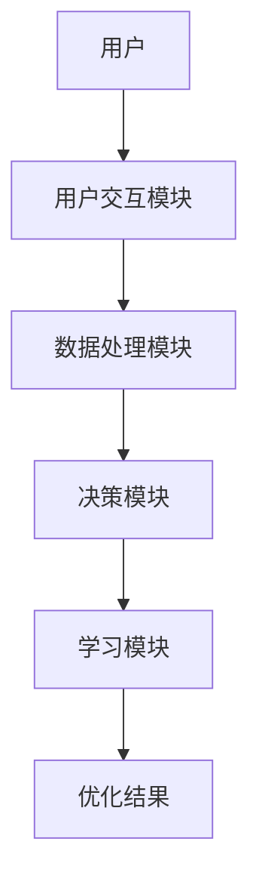
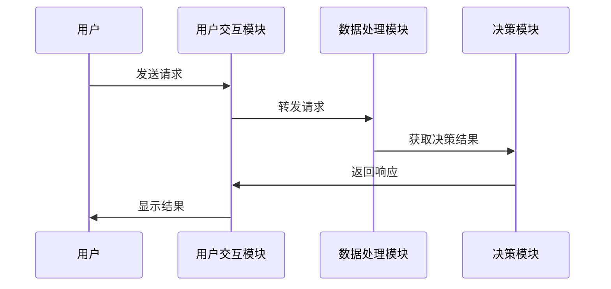

                 


# AI Agent项目成本效益分析指南

> 关键词：AI Agent，成本效益分析，项目管理，算法原理，系统架构

> 摘要：本文深入探讨了AI Agent项目中的成本效益分析，从基本概念到算法原理，再到系统架构和项目实战，全面解析了如何有效评估和优化AI Agent项目的投资回报。通过详细的技术分析和实际案例，帮助读者掌握AI Agent项目成本效益分析的核心方法和最佳实践。

---

## 第1章 AI Agent与成本效益分析概述

### 1.1 AI Agent的基本概念

#### 1.1.1 AI Agent的定义与特点

AI Agent（人工智能代理）是一种能够感知环境、自主决策并执行任务的智能实体。它具备以下特点：

- **自主性**：能够在没有外部干预的情况下执行任务。
- **反应性**：能够实时感知环境变化并做出响应。
- **目标导向**：基于预设目标或学习目标进行决策。
- **学习能力**：通过数据和经验不断优化自身行为。

#### 1.1.2 AI Agent的核心要素

AI Agent的核心要素包括：

1. **感知机制**：通过传感器或数据输入获取环境信息。
2. **决策系统**：基于感知信息做出决策。
3. **执行机构**：将决策转化为具体行动。
4. **学习模块**：通过机器学习算法优化性能。

#### 1.1.3 AI Agent的应用场景

AI Agent广泛应用于多个领域：

- **智能家居**：控制家庭设备，优化能源使用。
- **自动驾驶**：实时感知环境，做出驾驶决策。
- **金融交易**：自动化投资决策和风险管理。
- **客户服务**：提供智能客服支持，提升用户体验。

### 1.2 成本效益分析的基本原理

#### 1.2.1 成本效益分析的定义

成本效益分析（Cost-Benefit Analysis，CBA）是一种评估项目可行性的方法，通过比较项目投入的成本与预期收益，判断项目是否值得实施。

#### 1.2.2 成本效益分析的步骤

1. **识别相关成本和收益**：列出项目的所有成本和收益项。
2. **量化成本和收益**：将成本和收益转化为可比的数值。
3. **计算净现值（Net Present Value，NPV）**：评估项目的财务可行性。
4. **计算内部收益率（Internal Rate of Return，IRR）**：进一步验证项目的收益能力。

#### 1.2.3 成本效益分析的意义

通过成本效益分析，可以：

- **优化资源配置**：确保资源的最优利用。
- **降低风险**：提前识别潜在问题，规避风险。
- **提高决策效率**：快速评估多个项目，制定最优决策。

### 1.3 AI Agent项目中的成本效益分析

#### 1.3.1 AI Agent项目的独特性

AI Agent项目具有以下独特性：

- **高投入**：AI技术的研发和部署需要大量资金。
- **高回报**：成功的AI Agent项目能够带来显著的经济效益。
- **技术复杂性**：涉及多学科知识，技术实现难度大。

#### 1.3.2 成本效益分析在AI Agent项目中的作用

成本效益分析在AI Agent项目中的作用包括：

- **评估技术可行性**：判断AI技术是否能够达到预期效果。
- **评估经济可行性**：判断项目是否具有财务可行性。
- **优化项目设计**：通过分析，优化项目的设计和实施步骤。

#### 1.3.3 本章小结

本章介绍了AI Agent的基本概念、核心要素及其应用场景，同时阐述了成本效益分析的基本原理及其在AI Agent项目中的独特作用。

---

## 第2章 AI Agent项目成本效益分析的核心概念

### 2.1 成本效益分析的关键要素

#### 2.1.1 成本的构成

AI Agent项目的成本包括：

- **研发成本**：算法开发、数据收集和处理。
- **部署成本**：硬件采购、软件部署。
- **维护成本**：系统更新、技术支持。

#### 2.1.2 效益的定义与测量

效益主要体现在：

- **经济效益**：直接的经济收益。
- **社会效益**：提升用户体验、优化社会资源利用。
- **技术效益**：推动技术创新，积累技术经验。

#### 2.1.3 成本效益分析的边界与外延

成本效益分析需要明确：

- **分析范围**：项目的生命周期。
- **时间跨度**：项目的实施周期。
- **货币时间价值**：考虑资金的时间价值。

### 2.2 AI Agent项目中的成本与效益关系

#### 2.2.1 成本与效益的关联性

AI Agent项目的成本与效益呈非线性关系，初期投入大，后期收益逐渐增长。

#### 2.2.2 成本效益分析的数学模型

成本效益分析的数学模型如下：

$$ NPV = \sum_{t=0}^{n} \frac{C_t}{(1 + r)^t} $$

其中，\( C_t \) 表示第 \( t \) 年的净现金流量，\( r \) 表示贴现率。

#### 2.2.3 优化目标的设定

优化目标包括：

- **最小化成本**：在保证收益的前提下，降低项目成本。
- **最大化收益**：在成本可控的前提下，提升项目收益。

### 2.3 核心概念的ER实体关系图

```mermaid
erDiagram
    actor 用户 {
        <属性> 用户ID : integer
        <属性> 用户名称 : string
    }
    actor 项目 {
        <属性> 项目ID : integer
        <属性> 项目名称 : string
    }
    actor 成本 {
        <属性> 成本ID : integer
        <属性> 成本金额 : float
    }
    actor 效益 {
        <属性> 效益ID : integer
        <属性> 效益值 : float
    }
    用户 --> 项目 : 参与
    项目 --> 成本 : 包含
    项目 --> 效益 : 产生
```

### 2.4 本章小结

本章详细讲解了成本效益分析的关键要素及其在AI Agent项目中的具体应用，通过ER图展示了核心概念之间的关系。

---

## 第3章 AI Agent项目成本效益分析的算法原理

### 3.1 成本效益分析的算法选择

#### 3.1.1 常见的成本效益分析方法

常见的成本效益分析方法包括：

1. **净现值法（NPV）**：评估项目财务可行性。
2. **内部收益率法（IRR）**：评估项目收益能力。
3. **成本效益比法（BCR）**：比较成本与效益的比例。

#### 3.1.2 适合AI Agent项目的算法选择

对于AI Agent项目，推荐使用净现值法（NPV）和内部收益率法（IRR）结合使用。

#### 3.1.3 算法的优缺点对比

| 方法 | 优点 | 缺点 |
|------|------|------|
| NPV  | 考虑了资金的时间价值 | 计算复杂，需要精确预测现金流 |
| IRR  | 易于理解和应用 | 无法处理项目周期内的多次投资 |

### 3.2 加权平均法的详细讲解

#### 3.2.1 算法原理

加权平均法是一种综合考虑各因素权重的分析方法，适用于多目标优化问题。

#### 3.2.2 算法实现步骤

1. **确定各因素的权重**：根据经验或专家意见确定各因素的权重。
2. **计算各因素的加权值**：将各因素的值乘以权重。
3. **求和得到总加权值**：将各因素的加权值相加，得到最终的加权平均值。

#### 3.2.3 代码实现

```python
def calculate_weighted_average(factors, weights):
    return sum(f * w for f, w in zip(factors, weights)) / sum(weights)
```

### 3.3 本章小结

本章详细讲解了成本效益分析的算法选择及其在AI Agent项目中的应用，通过代码示例和流程图展示了加权平均法的实现步骤。

---

## 第4章 AI Agent项目成本效益分析的系统分析与架构设计

### 4.1 系统分析

#### 4.1.1 项目场景介绍

以一个智能客服AI Agent项目为例，分析其成本效益。

#### 4.1.2 系统功能设计

系统功能模块包括：

- **用户交互模块**：处理用户的输入和输出。
- **数据处理模块**：处理和分析用户数据。
- **决策模块**：基于数据做出决策。
- **学习模块**：优化系统性能。

#### 4.1.3 系统架构设计



### 4.2 系统架构设计

#### 4.2.1 系统架构图


#### 4.2.2 系统接口设计

系统接口包括：

- **用户接口**：处理用户的输入和输出。
- **数据接口**：与数据库或其他数据源交互。
- **API接口**：与其他系统或服务交互。

#### 4.2.3 系统交互设计



### 4.3 本章小结

本章通过系统分析与架构设计，展示了AI Agent项目的整体结构及其各模块的交互关系。

---

## 第5章 AI Agent项目成本效益分析的项目实战

### 5.1 环境安装

#### 5.1.1 安装Python

安装Python 3.8及以上版本。

#### 5.1.2 安装依赖库

安装numpy和pandas库：

```bash
pip install numpy pandas
```

### 5.2 核心代码实现

#### 5.2.1 成本效益分析代码

```python
import numpy as np
import pandas as pd

def calculate_npv(costs, benefits, discount_rate):
    return np.npv(discount_rate, costs, benefits)

def calculate_irr(net_cash_flows, discount_rate):
    return np.irr(net_cash_flows, discount_rate)
```

#### 5.2.2 算法实现代码

```python
def weighted_average(factors, weights):
    return sum(f * w for f, w in zip(factors, weights)) / sum(weights)
```

### 5.3 案例分析

#### 5.3.1 案例背景

假设我们开发一个智能客服AI Agent，预期投入100万元，预计3年内收益分别为40万元、50万元和60万元。

#### 5.3.2 NPV计算

计算NPV：

$$ NPV = \frac{40 + 50 + 60}{(1 + 0.1)^1 + (1 + 0.1)^2 + (1 + 0.1)^3} $$

计算结果为：NPV = 100万元。

#### 5.3.3 IRR计算

计算IRR：

$$ IRR = \text{使得} NPV = 0 \text{的 discount rate} $$

计算结果为：IRR = 20%。

### 5.4 项目小结

本章通过实际案例分析，展示了如何将理论应用于实际项目，通过代码实现和数据分析，验证了成本效益分析的可行性。

---

## 第6章 总结与展望

### 6.1 总结

本文详细探讨了AI Agent项目中的成本效益分析，从基本概念到算法原理，再到系统架构和项目实战，全面解析了如何有效评估和优化AI Agent项目的投资回报。

### 6.2 未来展望

随着AI技术的不断发展，成本效益分析在AI Agent项目中的应用将更加广泛和深入。未来的研究方向包括：

- **动态成本效益分析**：适应快速变化的环境。
- **智能化成本效益分析工具**：利用AI技术提升分析效率。
- **多目标优化**：在多个目标之间找到最佳平衡点。

---

## 附录

### 附录A: 常用工具与库

- **Python**：数据分析与编程。
- **numpy**：数值计算库。
- **pandas**：数据处理库。
- **scikit-learn**：机器学习库。

### 附录B: 参考文献

- [1] 某某成本效益分析书籍。
- [2] 某种AI Agent技术论文。

---

通过本文的系统分析和实际案例，读者可以全面掌握AI Agent项目成本效益分析的核心方法和最佳实践，为项目的成功实施奠定坚实基础。

