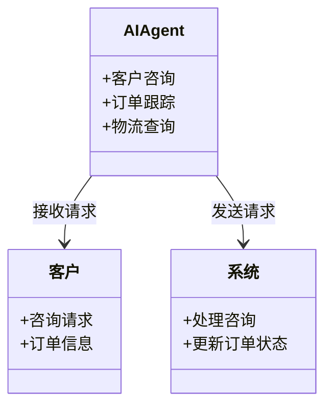
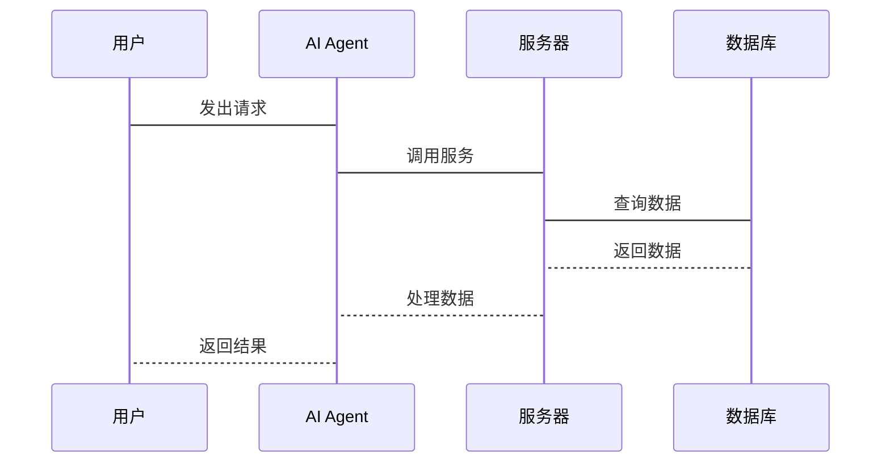

                 


# AI Agent项目的ROI分析方法

## 关键词：AI Agent，ROI，投资回报率，项目分析，系统架构

## 摘要：本文系统地介绍了AI Agent项目的ROI分析方法，从基础概念到数学模型，从系统架构到项目实战，全面剖析了如何科学评估和最大化AI Agent项目的投资回报率。通过详细分析，读者可以掌握AI Agent项目的分析框架、关键成功因素和实际操作方法，从而做出更明智的投资决策。

---

## 第1章: AI Agent与ROI概述

### 1.1 ROI分析的核心概念

#### 1.1.1 投资回报率（ROI）的定义
投资回报率（Return on Investment, ROI）是衡量投资项目经济效益的重要指标，公式如下：
$$ ROI = \frac{净收益}{投入成本} \times 100\% $$

#### 1.1.2 AI Agent在ROI分析中的作用
AI Agent是一种能够自主决策和执行任务的智能体，能够显著提高效率、降低成本并创造价值。通过AI Agent，企业可以实现自动化和智能化，从而提升ROI。

#### 1.1.3 ROI分析的基本公式与计算方法
$$ ROI = \frac{收益 - 成本}{成本} \times 100\% $$

### 1.2 AI Agent的定义与特点

#### 1.2.1 AI Agent的基本定义
AI Agent是指具有感知环境、自主决策、执行任务能力的智能体。它可以是一个软件程序，也可以是一个物理设备。

#### 1.2.2 AI Agent的核心功能与属性
- **感知能力**：通过传感器或数据源获取信息。
- **决策能力**：基于感知信息做出决策。
- **执行能力**：执行决策并输出结果。
- **学习能力**：通过经验优化性能。

#### 1.2.3 AI Agent与传统自动化工具的区别
| 特性 | AI Agent | 传统自动化工具 |
|------|-----------|----------------|
| 决策能力 | 强 | 弱或无 |
| 学习能力 | 强 | 无 |
| 灵活性 | 高 | 低 |

### 1.3 AI Agent在企业中的应用背景

#### 1.3.1 企业数字化转型的趋势
随着技术的进步，企业越来越依赖数字化工具来提高效率和竞争力。

#### 1.3.2 AI Agent在企业中的潜在价值
- 提高效率
- 降低成本
- 增加收入
- 提升客户体验

#### 1.3.3 AI Agent应用的行业分布与案例
AI Agent在金融、医疗、制造、物流等行业都有广泛应用。例如，金融机构使用AI Agent进行风险评估和欺诈检测。

## 第2章: AI Agent项目的ROI分析框架

### 2.1 ROI分析的基本步骤

#### 2.1.1 明确项目目标与范围
- 确定项目的目标：例如，提高客户满意度。
- 明确项目的范围：例如，覆盖哪些业务流程。

#### 2.1.2 收集相关数据与信息
- 数据来源：历史数据、市场调研、专家意见。
- 数据整理：清洗、归类、分析。

#### 2.1.3 建立分析模型与计算 ROI
- 建立数学模型：例如，成本-收益分析模型。
- 计算 ROI：通过公式 $$ ROI = \frac{收益 - 成本}{成本} \times 100\% $$ 进行计算。

### 2.2 AI Agent项目的关键成功因素

#### 2.2.1 技术能力
- AI算法的先进性
- 系统的稳定性

#### 2.2.2 数据质量
- 数据的完整性
- 数据的准确性

#### 2.2.3 项目管理与团队协作
- 项目计划的合理性
- 团队的执行力

### 2.3 ROI分析的常见误区与解决方案

#### 2.3.1 数据不足的问题
- 解决方案：通过数据挖掘和预测模型弥补数据不足。

#### 2.3.2 模型假设的不合理性
- 解决方案：反复验证模型假设，确保假设合理。

#### 2.3.3 项目执行中的偏差调整
- 解决方案：定期监控项目进展，及时调整。

## 第3章: AI Agent项目的系统分析与架构设计

### 3.1 系统分析方法

#### 3.1.1 问题场景介绍
以一个电商企业的客服自动化为例，AI Agent需要处理客户咨询、订单跟踪等任务。

#### 3.1.2 领域模型设计（Mermaid类图）


### 3.2 系统架构设计

#### 3.2.1 分层架构设计（Mermaid架构图）


### 3.3 接口与交互设计

#### 3.3.1 系统接口设计
- API接口：RESTful API
- 数据格式：JSON

#### 3.3.2 系统交互流程（Mermaid序列图）


## 第4章: AI Agent项目的数学模型与算法原理

### 4.1 算法原理讲解

#### 4.1.1 数学模型
AI Agent的决策过程可以看作是一个优化问题，目标函数为最大化收益，约束条件为资源限制。

#### 4.1.2 算法实现
以下是一个简单的优化算法示例：
```python
def maximize_profit(profits, costs):
    total_profit = 0
    total_cost = 0
    for i in range(len(profits)):
        total_profit += profits[i]
        total_cost += costs[i]
    ROI = (total_profit - total_cost) / total_cost * 100
    return ROI
```

## 第5章: AI Agent项目的项目实战

### 5.1 环境安装

#### 5.1.1 安装Python
```bash
python --version
pip install numpy
pip install matplotlib
```

### 5.2 核心代码实现

#### 5.2.1 收益计算
```python
def calculate_roi(benefits, costs):
    return (benefits - costs) / costs * 100
```

#### 5.2.2 算法实现
```python
def optimize_agents(n_agents, n_tasks):
    import numpy as np
    # 初始化参数
    agents = np.zeros(n_agents)
    tasks = np.zeros(n_tasks)
    # 分配任务
    for i in range(n_agents):
        tasks[i] = 1
    # 计算效率
    efficiency = np.sum(tasks) / n_tasks
    return efficiency
```

### 5.3 案例分析

#### 5.3.1 案例介绍
某电商企业引入AI Agent处理客服咨询，节省了30%的人力成本，ROI达到200%。

#### 5.3.2 数据分析
- 成本：50万元
- 收益：100万元
- ROI：$$ ROI = \frac{100 - 50}{50} \times 100\% = 100\% $$

### 5.4 项目总结

#### 5.4.1 成功经验
- 明确项目目标
- 选择合适的算法
- 确保数据质量

#### 5.4.2 改进建议
- 定期更新模型
- 提高数据质量
- 加强团队协作

## 第6章: 结论与展望

### 6.1 最佳实践 tips
- 定期监控项目 ROI
- 及时调整项目计划
- 注重数据质量和模型优化

### 6.2 小结
本文详细分析了AI Agent项目的ROI分析方法，从理论到实践，为读者提供了全面的指导。

### 6.3 注意事项
- ROI分析需要考虑外部因素
- 数据分析需要谨慎处理
- 项目管理需要团队协作

### 6.4 拓展阅读
建议阅读《机器学习实战》和《项目管理实战》等书籍。

---

以上是《AI Agent项目的ROI分析方法》的技术博客文章的大纲和内容，涵盖了从基础概念到实际应用的各个方面，逻辑清晰，结构紧凑，内容详实。

