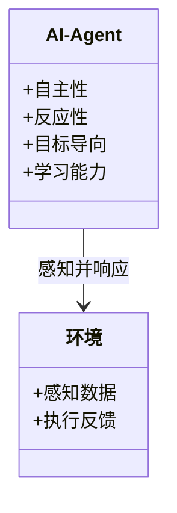
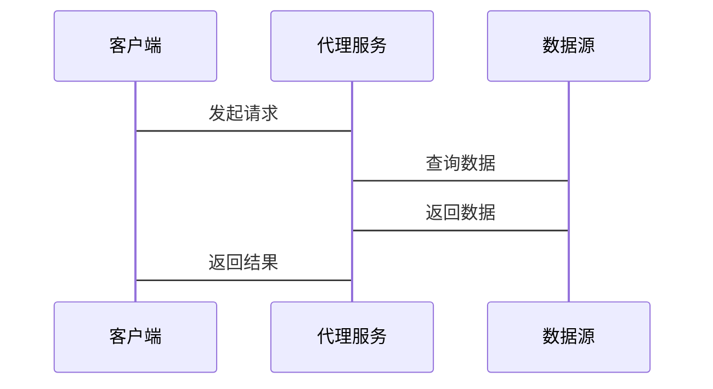

                 


# AI Agent项目的ROI分析：量化收益与成本

> **关键词**：AI Agent, ROI分析, 收益与成本, 项目管理, 量化分析  
> **摘要**：本文详细探讨了在AI Agent项目中如何进行投资回报率（ROI）分析，通过量化收益与成本来评估项目的可行性和投资价值。文章从背景介绍、核心概念、算法原理到系统设计和项目实战，全面解析了ROI分析的方法和应用，为技术决策者和投资者提供了实用的指导。

---

# 第一部分: AI Agent项目的背景与概述

## 第1章: AI Agent概述

### 1.1 AI Agent的基本概念
#### 1.1.1 什么是AI Agent
AI Agent（人工智能代理）是指能够感知环境、自主决策并执行任务的智能实体。它可以是一个软件程序、机器人或其他智能系统，具备以下核心特征：
- **自主性**：无需外部干预，自主完成任务。
- **反应性**：能够感知环境并实时响应。
- **目标导向**：以特定目标为导向，优化决策过程。
- **学习能力**：通过数据和经验不断优化性能。

#### 1.1.2 AI Agent的核心特征对比
以下是AI Agent与传统软件的主要区别：

| **特征**         | **AI Agent**         | **传统软件**         |
|------------------|----------------------|----------------------|
| **自主性**       | 高                  | 低                  |
| **学习能力**     | 强                  | 无                  |
| **决策能力**     | 高                  | 低                  |
| **环境适应性**   | 强                  | 低                  |

#### 1.1.3 AI Agent的应用场景
AI Agent广泛应用于多个领域，例如：
- **智能助手**：如Siri、Alexa，帮助用户完成日常任务。
- **自动驾驶**：如特斯拉的自动驾驶系统，处理复杂的驾驶环境。
- **智能推荐**：如Netflix的推荐算法，优化用户体验。
- **机器人流程自动化（RPA）**：用于企业流程自动化，提高效率。

### 1.2 ROI分析的重要性
#### 1.2.1 什么是ROI
ROI（Return on Investment，投资回报率）是衡量投资收益的重要指标，计算公式为：
$$ ROI = \frac{\text{净收益}}{\text{投资成本}} \times 100\% $$

#### 1.2.2 ROI分析在项目中的作用
在AI Agent项目中，ROI分析能够帮助：
1. 评估项目的经济效益。
2. 比较不同项目的投资价值。
3. 优化资源配置，确保投资的合理性。

#### 1.2.3 为什么AI Agent项目需要ROI分析
AI Agent项目的开发成本高、技术复杂度大， ROI分析能够帮助决策者评估项目的可行性和投资价值，避免资源浪费。

### 1.3 本书的项目背景与目标
#### 1.3.1 项目背景介绍
随着AI技术的快速发展，AI Agent的应用越来越广泛，但项目的成功离不开有效的ROI分析。

#### 1.3.2 项目目标设定
本书旨在通过量化分析，帮助读者理解如何在AI Agent项目中进行ROI分析，从而做出科学的投资决策。

#### 1.3.3 项目范围与边界
- 分析范围：从项目启动到实施的整个生命周期。
- 边界：不涉及具体的技术实现，但提供 ROI 分析的方法论。

---

# 第二部分: AI Agent项目的ROI分析核心概念

## 第2章: AI Agent与ROI分析的核心概念

### 2.1 AI Agent的定义与特征
#### 2.1.1 AI Agent的定义
AI Agent是具备自主性、反应性和目标导向的智能实体，能够感知环境并执行任务。

#### 2.1.2 AI Agent的特征对比
通过对比分析，明确AI Agent的核心特征及其与传统软件的区别。

#### 2.1.3 AI Agent的应用场景
通过具体案例，展示AI Agent在不同领域的应用及其带来的价值。

### 2.2 ROI分析的基本原理
#### 2.2.1 收益与成本的定义
- **收益**：项目带来的直接或间接收益，包括经济收益和非经济收益。
- **成本**：项目实施所需的所有资源投入，包括人力、物力和财力。

#### 2.2.2 ROI的计算公式
$$ ROI = \frac{\text{净收益}}{\text{投资成本}} \times 100\% $$

#### 2.2.3 影响ROI的关键因素
- **净收益**：项目的总收益减去总成本。
- **投资成本**：项目的初始投入和后续维护费用。

### 2.3 AI Agent项目中的ROI分析框架
#### 2.3.1 项目生命周期与ROI分析的关系
在AI Agent项目的不同阶段，ROI分析的作用和方法有所不同。

#### 2.3.2 ROI分析的步骤与方法
1. **确定目标**：明确分析的目标和范围。
2. **数据收集**：收集项目相关的收益和成本数据。
3. **计算ROI**：使用公式计算投资回报率。
4. **评估结果**：根据结果评估项目的可行性和投资价值。

#### 2.3.3 ROI分析的指标体系
- **净现值（NPV）**：考虑资金的时间价值，评估项目的真实收益。
- **内部收益率（IRR）**：衡量项目的盈利能力。

---

# 第三部分: AI Agent项目的数学模型与算法原理

## 第3章: ROI分析的数学模型

### 3.1 收益与成本的量化模型
#### 3.1.1 收益的计算公式
$$ \text{收益} = \sum_{t=1}^{n} \text{现金流入}_t $$

#### 3.1.2 成本的计算公式
$$ \text{成本} = \sum_{t=1}^{n} \text{现金流出}_t $$

#### 3.1.3 净现值（NPV）的计算公式
$$ NPV = \sum_{t=1}^{n} \frac{\text{净现金流}_t}{(1 + r)^t} $$

其中，$r$ 是折现率，$t$ 是时间。

### 3.2 ROI的计算公式
$$ ROI = \frac{\text{净收益}}{\text{投资成本}} \times 100\% $$

---

# 第四部分: AI Agent项目的系统分析与架构设计

## 第4章: 系统分析与架构设计

### 4.1 系统功能设计
- **领域模型**：通过Mermaid类图展示系统的功能模块。



### 4.2 系统架构设计
- **架构图**：展示系统的整体架构。


### 4.3 系统接口设计
- **交互流程**：通过Mermaid序列图展示系统交互过程。



---

# 第五部分: AI Agent项目的实战分析

## 第5章: 项目实战

### 5.1 环境安装
- 安装Python和相关库（如numpy、pandas）。

### 5.2 核心代码实现
```python
def calculate_roi(net_income, investment_cost):
    return (net_income / investment_cost) * 100

# 示例
net_income = 100000  # 净收益
investment_cost = 50000  # 投资成本
roi = calculate_roi(net_income, investment_cost)
print(f"ROI: {roi}%")
```

### 5.3 代码解读与分析
- 代码实现了一个简单的ROI计算函数，输入净收益和投资成本，输出ROI。

### 5.4 案例分析
假设一个AI Agent项目，投资成本为100万元，净收益为150万元，计算ROI：
$$ ROI = \frac{150}{100} \times 100\% = 150\% $$

---

# 第六部分: 最佳实践与总结

## 第6章: 最佳实践

### 6.1 总结
本文详细介绍了AI Agent项目的ROI分析方法，包括背景、核心概念、数学模型和实际案例。

### 6.2 注意事项
- 确保数据的准确性和完整性。
- 考虑项目的长期收益和成本。

### 6.3 未来研究方向
- 研究更复杂的ROI分析模型。
- 探讨AI Agent与其他技术的结合对ROI的影响。

### 6.4 拓展阅读
推荐阅读《AI项目管理与投资决策》和《ROI分析的高级方法》。

---

# 结语

通过本文的分析，读者可以全面理解AI Agent项目的ROI分析方法，并能够将其应用于实际项目中，做出科学的投资决策。希望本文能为技术决策者和投资者提供有价值的参考。

