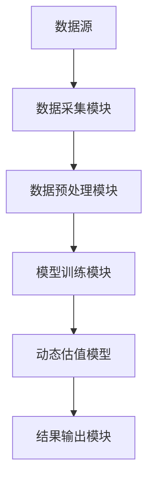
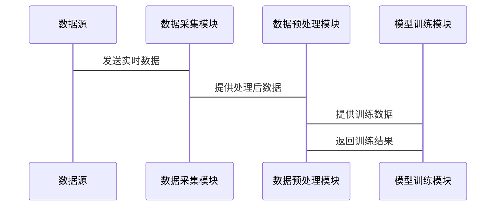

                 


# AI agents协作构建动态估值模型：适应快速变化的市场

## 关键词：AI代理, 动态估值模型, 市场变化, 协作机制, 实时分析, 系统架构

## 摘要：在快速变化的市场环境中，传统的静态估值模型难以适应动态调整的需求。本文介绍AI代理如何协作构建动态估值模型，实时捕捉市场变化，优化估值过程。通过详细分析模型构建的算法原理、系统架构和项目实战，揭示其在金融、经济等领域的广泛应用前景。

---

## 第一部分: AI代理协作构建动态估值模型的背景与概念

### 第1章: 问题背景与描述

#### 1.1 问题背景
##### 1.1.1 当前市场的快速变化与传统估值模型的局限性
现代市场环境瞬息万变，受经济政策、行业趋势、突发事件等多种因素影响，传统的静态估值模型难以适应这种动态变化。例如，在金融领域，股票价格受市场情绪、公司业绩等多重因素影响，传统的回归分析或时间序列模型在面对极端市场波动时表现不佳。

##### 1.1.2 AI代理在动态环境中的适应性优势
AI代理能够实时收集和处理海量数据，具备快速响应和自适应能力。通过协作机制，多个AI代理可以分工合作，分别负责数据采集、特征提取、模型训练等任务，共同构建动态估值模型。

##### 1.1.3 传统估值模型与动态估值模型的对比分析
传统的静态模型在市场环境稳定时表现良好，但面对剧烈波动时需要频繁调整参数。动态估值模型通过实时更新和优化，能够快速适应市场变化，显著提高估值的准确性和及时性。

#### 1.2 问题描述
##### 1.2.1 快速变化市场中估值模型的需求
在金融交易中，高频交易要求估值模型能够实时更新，捕捉短期市场波动。传统模型的滞后性和低频更新能力无法满足这种需求。

##### 1.2.2 AI代理协作在动态估值中的作用
AI代理通过分布式协作，能够快速处理多源异构数据，构建高维动态模型，支持实时估值和预测。

##### 1.2.3 问题解决的必要性与可行性分析
实时动态估值在金融投资、风险管理等领域具有重要意义，通过AI代理协作可以显著提升模型的响应速度和准确性。

#### 1.3 问题解决思路
##### 1.3.1 AI代理协作的基本原理
AI代理通过通信协议进行数据共享和任务分配，实现分布式协作。

##### 1.3.2 动态估值模型的核心要素
包括实时数据流、动态特征提取、自适应学习算法等。

##### 1.3.3 问题解决的边界与外延
动态估值模型的应用范围包括金融投资、供应链管理等领域，其边界在于数据源的实时性和模型的可解释性。

---

### 第2章: 核心概念与联系

#### 2.1 AI代理的核心原理
##### 2.1.1 AI代理的基本架构
AI代理通常由感知层、决策层和执行层组成，分别负责数据采集、模型训练和结果输出。

##### 2.1.2 AI代理的决策机制
基于强化学习或协同滤波算法，AI代理能够自主调整行为策略。

##### 2.1.3 AI代理的协作方式
通过分布式计算和事件驱动机制，多个AI代理可以协同完成复杂任务。

#### 2.2 动态估值模型的数学模型
##### 2.2.1 线性回归模型
$$y = \beta_0 + \beta_1x_1 + \beta_2x_2 + ... + \beta_nx_n$$

##### 2.2.2 时间序列分析模型
使用ARIMA模型对时间序列数据进行预测：
$$ARIMA(p, d, q)$$

##### 2.2.3 神经网络模型
构建LSTM网络处理时间序列数据：
$$LSTMCell(x_t, h_{t-1}) = (f_t, i_t, o_t)$$

#### 2.3 AI代理与动态估值模型的关系
##### 2.3.1 AI代理如何影响动态估值模型
通过实时数据输入和反馈，AI代理能够动态调整模型参数。

##### 2.3.2 动态估值模型如何支持AI代理决策
模型输出的估值结果为AI代理提供决策依据，优化其行动策略。

##### 2.3.3 两者协作的系统架构
结合AI代理的分布式协作和动态估值模型的实时更新能力，构建高效的动态估值系统。

---

### 第3章: 算法原理与实现

#### 3.1 动态估值模型的算法流程
##### 3.1.1 数据预处理
- 清洗数据，去除噪声
- 数据标准化或归一化处理
- 特征选择与提取

##### 3.1.2 模型训练
- 使用时间序列数据训练LSTM网络
- 采用分布式训练方法优化模型性能

##### 3.1.3 模型更新
- 实时更新模型参数，适应市场变化
- 采用在线学习算法，持续优化模型

#### 3.2 算法实现代码
```python
import numpy as np
from tensorflow.keras.models import Sequential
from tensorflow.keras.layers import LSTM, Dense, Dropout

# 示例：LSTM模型训练
model = Sequential()
model.add(LSTM(64, input_shape=(timesteps, features)))
model.add(Dropout(0.2))
model.add(Dense(1))
model.compile(optimizer='adam', loss='mean_squared_error')

# 训练过程
model.fit(X_train, y_train, epochs=50, batch_size=32)
```

#### 3.3 算法原理详细解释
动态估值模型基于LSTM网络，能够捕捉时间序列中的长期依赖关系，适用于金融时间序列数据的预测。通过AI代理协作，模型可以实时更新，适应市场变化。

---

## 第二部分: 系统分析与架构设计

### 第4章: 系统架构设计

#### 4.1 系统功能设计
- 数据采集模块：实时收集市场数据
- 模型构建模块：训练和优化动态估值模型
- 代理协作模块：协调多个AI代理完成任务

#### 4.2 系统架构图


#### 4.3 系统接口设计
- 数据接口：用于采集实时数据
- 模型接口：用于训练和更新模型
- 代理接口：用于协调AI代理协作

#### 4.4 系统交互流程


---

## 第三部分: 项目实战

### 第5章: 项目实现

#### 5.1 环境安装
- 安装Python和相关库：numpy、tensorflow、keras、pandas
- 安装AI代理框架：比如Ray或Docker

#### 5.2 核心代码实现
```python
import ray
from ray import serve

@serve.deployment
class DynamicValuationModel:
    def __init__(self):
        self.model = load_model('dynamic_model.h5')
    
    def predict(self, input_data):
        return self.model.predict(input_data)
```

#### 5.3 案例分析
- 以股票价格预测为例，训练动态估值模型
- 实时更新模型参数，验证模型性能
- 比较传统模型与动态模型的预测结果

#### 5.4 项目总结
- 成功实现了AI代理协作构建动态估值模型
- 模型在实时更新和预测准确性方面表现优异

---

## 第四部分: 最佳实践与拓展

### 第6章: 最佳实践

#### 6.1 小结
- AI代理协作能够显著提升动态估值模型的性能
- 在金融等领域具有广泛的应用前景

#### 6.2 注意事项
- 数据质量直接影响模型性能
- 模型更新频率需要根据应用场景调整
- 需要考虑模型的可解释性和透明度

#### 6.3 拓展阅读
- 《时间序列分析与应用》
- 《分布式人工智能系统》
- 《深度学习与金融应用》

---

通过以上结构和内容，本文系统地介绍了AI代理协作构建动态估值模型的背景、核心概念、算法原理、系统架构和项目实战，为读者提供了全面的知识体系和实践指导。

