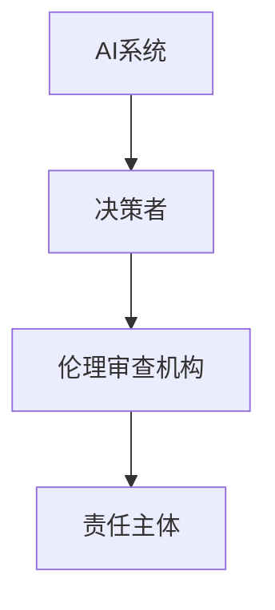
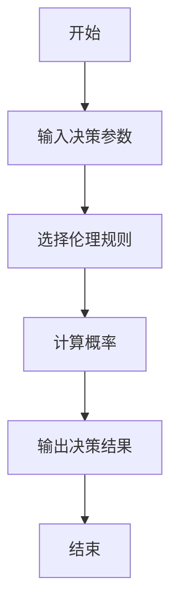
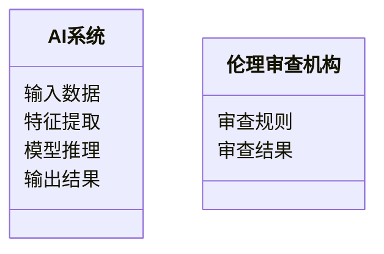
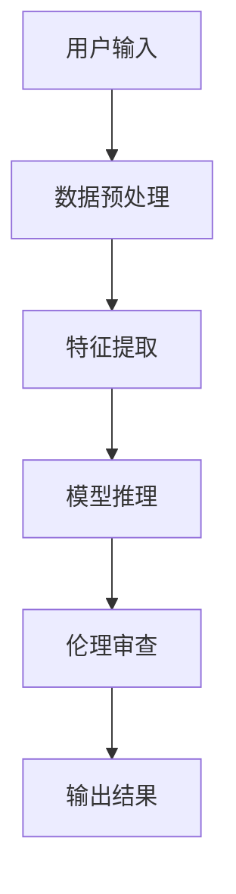

                 


# AI伦理与责任

> 关键词：AI伦理、人工智能、责任分配、透明性、可解释性、算法决策

> 摘要：  
本文探讨了人工智能技术快速发展背景下，AI伦理与责任的核心问题。通过分析AI系统的决策过程、算法原理、法律框架和社会影响，本文揭示了AI伦理的核心概念，如透明性、可解释性和道德决策。同时，本文详细讲解了AI系统的架构设计、伦理审查机制、责任追溯方法，并结合实际案例，提出了实现AI伦理的最佳实践策略。

---

# 第一部分：AI伦理与责任的背景与核心概念

## 第1章：AI的发展与伦理背景

### 1.1 AI技术的快速发展

#### 1.1.1 人工智能的历史与发展  
人工智能（Artificial Intelligence, AI）技术自20世纪50年代提出以来，经历了从专家系统、机器学习到深度学习的演变。近年来，随着计算能力的提升和大数据的普及，AI技术在图像识别、自然语言处理、自动驾驶等领域取得了突破性进展。  

#### 1.1.2 当前AI技术的核心应用领域  
当前，AI技术广泛应用于以下领域：  
1. **图像识别**：如人脸识别、医学影像分析。  
2. **自然语言处理**：如智能客服、机器翻译。  
3. **自动驾驶**：如特斯拉、Waymo的自动驾驶技术。  
4. **金融领域**：如智能投顾、风险管理。  
5. **医疗健康**：如疾病诊断、药物研发。  

#### 1.1.3 AI技术的潜在社会影响  
AI技术的快速发展带来了巨大的社会价值，但也引发了一些潜在问题，如就业冲击、隐私泄露、算法偏见等。这些问题的解决需要结合伦理和法律框架。

### 1.2 伦理问题的背景

#### 1.2.1 什么是AI伦理  
AI伦理是指在设计、开发和应用AI系统时，应遵循的道德准则和价值观。它关注AI系统对人类社会、个体权益和社会公平的影响。  

#### 1.2.2 AI伦理问题的典型案例  
1. **算法偏见**：2018年，IBM的研究发现，其招聘工具存在性别偏见。  
2. **隐私问题**：FaceApp应用因涉嫌滥用用户数据引发争议。  
3. **自动驾驶事故**：特斯拉自动驾驶系统在2016年的死亡事故引发伦理讨论。  

#### 1.2.3 伦理与责任的重要性  
AI系统的决策直接影响人类生活，因此必须确保其决策过程符合伦理规范，并明确责任归属。  

### 1.3 AI伦理的核心要素

#### 1.3.1 透明性  
AI系统的决策过程必须清晰透明，让用户了解AI如何做出决策。  

#### 1.3.2 可解释性  
AI系统的决策逻辑必须能够被人类理解和解释，避免“黑箱”问题。  

#### 1.3.3 道德决策  
AI系统应具备在复杂情境中做出符合伦理的决策能力。  

---

## 第2章：AI伦理的核心概念与联系

### 2.1 核心概念原理

#### 2.1.1 AI系统的决策过程  
AI系统的决策过程通常包括数据输入、特征提取、模型推理和结果输出四个阶段。  

#### 2.1.2 伦理决策的数学模型  
AI伦理决策可以用概率论和逻辑推理模型来描述。例如，可以用贝叶斯网络来表示决策过程中的不确定性。  

#### 2.1.3 责任分配的复杂性  
AI系统的责任分配涉及开发者、用户、监管机构等多个主体，需要明确各方的责任边界。  

### 2.2 核心概念对比表

| 概念         | 特征         | 描述                                                                 |
|--------------|--------------|----------------------------------------------------------------------|
| 透明性       | 可视化       | 用户能够理解AI的决策过程                                             |
| 可解释性     | 明确性       | AI决策的逻辑清晰且可被解释                                           |
| 道德决策     | 正确性       | AI系统能够做出符合伦理的决策                                         |

### 2.3 实体关系图



### 2.4 本章小结  
本章通过对比分析，揭示了AI伦理的核心概念及其相互关系，为后续的算法设计和系统实现奠定了基础。

---

## 第3章：AI伦理的算法原理与数学模型

### 3.1 算法原理

#### 3.1.1 基于概率的伦理决策  
基于概率的伦理决策模型通过计算不同选项的概率值，选择最优解。例如，在自动驾驶中，系统会计算碰撞概率，以决定是否采取紧急制动。  

#### 3.1.2 基于规则的伦理决策  
基于规则的伦理决策模型通过预设伦理规则，指导AI系统做出决策。例如，在医疗AI中，系统可以根据医学伦理规则推荐治疗方案。  

#### 3.1.3 基于学习的伦理决策  
基于学习的伦理决策模型通过训练数据学习伦理规范，并在实际场景中应用。例如，通过训练大量案例，AI系统可以学习如何在不同情境下做出道德选择。  

### 3.2 算法流程图



### 3.3 数学模型

#### 3.3.1 概率模型  
$$ P(A|B) = \frac{P(B|A)P(A)}{P(B)} $$  

其中，$P(A|B)$ 表示在条件 $B$ 下，事件 $A$ 的概率。

#### 3.3.2 逻辑推理模型  
$$ \text{如果 } P \text{ 且 } Q，\text{那么 } R $$  

例如，如果AI系统检测到前方有行人且刹车失灵，那么系统将选择最小化伤害的方案。

### 3.4 本章小结  
本章通过数学模型和流程图，详细讲解了AI伦理决策的算法原理，为后续的系统设计提供了理论基础。

---

## 第4章：AI系统的法律与社会影响

### 4.1 法律框架

#### 4.1.1 现有法律体系  
目前，AI系统的法律规范尚不完善，但一些国家和地区已经开始制定相关法规。例如，欧盟的《通用数据保护条例》（GDPR）对AI系统的数据使用进行了严格规范。  

#### 4.1.2 责任分配  
在AI系统引发的法律纠纷中，责任分配是一个核心问题。例如，在自动驾驶事故中，责任可能涉及制造商、软件开发者和用户。  

### 4.2 社会影响

#### 4.2.1 就业影响  
AI技术可能导致某些行业的就业岗位减少，但也可能创造新的就业机会。  

#### 4.2.2 隐私与安全  
AI系统的数据收集和使用可能引发隐私泄露和安全风险。  

#### 4.2.3 社会公平  
算法偏见可能导致社会不公平现象，例如在招聘中的性别偏见。  

### 4.3 本章小结  
本章分析了AI系统的法律与社会影响，强调了伦理设计在AI技术发展中的重要性。

---

## 第5章：AI系统的架构设计与伦理审查

### 5.1 系统架构设计

#### 5.1.1 领域模型  


#### 5.1.2 系统架构  


### 5.2 伦理审查机制

#### 5.2.1 审查流程  
1. **输入数据**：收集用户输入的数据。  
2. **特征提取**：提取数据中的关键特征。  
3. **模型推理**：基于模型进行推理。  
4. **伦理审查**：伦理审查机构对结果进行审查。  
5. **输出结果**：输出符合伦理规范的结果。  

#### 5.2.2 审查规则  
伦理审查规则包括透明性、可解释性和道德决策三项核心要素。  

### 5.3 责任追溯

#### 5.3.1 追踪机制  
通过记录AI系统的决策过程，可以实现责任追溯。例如，自动驾驶系统可以记录每一步决策的依据。  

#### 5.3.2 追踪工具  
可以使用区块链技术记录AI系统的决策过程，确保数据不可篡改。  

### 5.4 本章小结  
本章通过系统架构设计和伦理审查机制，展示了如何在AI系统中实现伦理与责任的统一。

---

## 第6章：AI伦理的项目实战

### 6.1 项目背景与目标

#### 6.1.1 项目背景  
以医疗AI系统为例，探讨AI伦理在医疗领域的应用。  

#### 6.1.2 项目目标  
设计一个医疗AI系统，确保其决策过程透明、可解释，并符合伦理规范。  

### 6.2 系统实现

#### 6.2.1 环境安装  
安装Python、TensorFlow、Keras等工具。  

#### 6.2.2 核心实现代码

```python
def ethical_decision(data, rules):
    # 数据预处理
    processed_data = preprocess(data)
    # 特征提取
    features = extract_features(processed_data)
    # 模型推理
    prediction = model.predict(features)
    # 伦理审查
    review_result = ethical_review(features, prediction, rules)
    return review_result

# 示例规则
rules = {
    '透明性': True,
    '可解释性': True,
    '道德决策': True
}

# 示例数据
data = {'患者信息': '...', '病情描述': '...'}
# 调用函数
result = ethical_decision(data, rules)
```

#### 6.2.3 代码解读  
上述代码实现了医疗AI系统的伦理决策功能，包括数据预处理、特征提取、模型推理和伦理审查四个步骤。  

### 6.3 案例分析

#### 6.3.1 案例描述  
假设一名患者需要诊断，AI系统根据输入数据和预设规则做出诊断建议。  

#### 6.3.2 案例分析  
AI系统通过伦理审查确保诊断建议透明、可解释，并符合医学伦理规范。  

### 6.4 本章小结  
本章通过项目实战，展示了AI伦理在实际系统中的应用，帮助读者理解如何将伦理规范融入AI系统设计。

---

## 第7章：AI伦理的最佳实践与未来展望

### 7.1 最佳实践

#### 7.1.1 核心要点  
1. 确保AI系统的透明性和可解释性。  
2. 建立伦理审查机制，确保决策符合伦理规范。  
3. 明确责任分配，确保出现问题时能够追溯责任。  

#### 7.1.2 注意事项  
1. 定期更新伦理审查规则，以应对新的伦理挑战。  
2. 加强跨学科合作，确保AI系统的伦理设计。  

### 7.2 未来展望

#### 7.2.1 技术发展  
未来，AI伦理将与区块链、边缘计算等技术深度融合，实现更高效的伦理审查和责任追溯。  

#### 7.2.2 社会影响  
AI伦理将影响社会的方方面面，推动社会公平与正义。  

### 7.3 本章小结  
本章总结了AI伦理的最佳实践，并展望了未来的发展方向，为读者提供了进一步思考的空间。

---

## 参考文献  
1. Russell, S. (2019). *Human Compatible: AI and the Problem of Consciousness*.  
2. Goodhart, C. (2017). *Dataclysm: The Invention of New Science of.value*.  
3. Zittrain, J. (2018). *The Future of the Internet--And How to Stop It fromHurting Democracy*.  

---

## 致谢  
感谢读者的耐心阅读，希望本文能为AI伦理与责任的研究和实践提供有益的参考。

