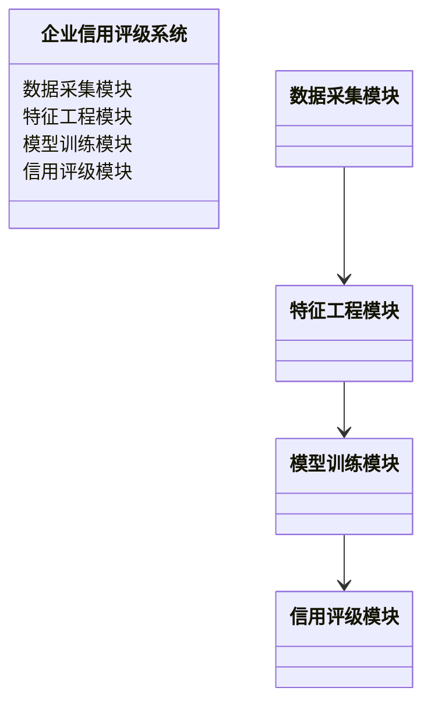
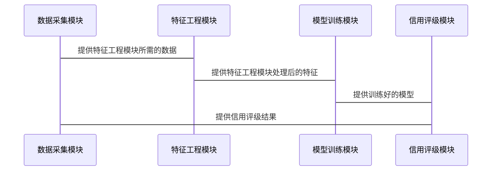

                 


# AI在企业信用评级中的应用与挑战

> **关键词**：企业信用评级、人工智能、机器学习、自然语言处理、风险控制

> **摘要**：  
> 企业信用评级是评估企业信用状况的重要工具，传统方法依赖于复杂的模型和人工分析，而人工智能（AI）的引入为信用评级带来了新的可能性。本文从企业信用评级的基本概念出发，详细探讨了AI在信用评级中的应用，包括机器学习算法、自然语言处理技术、知识图谱构建等。同时，本文分析了AI在信用评级中的优势与挑战，并通过实际案例展示了如何利用AI技术构建高效的信用评级系统。最后，本文总结了AI在信用评级中的最佳实践和未来发展方向。

---

# 第一部分：企业信用评级与AI应用的背景介绍

## 第1章：企业信用评级的基本概念

### 1.1 信用评级的定义与作用

#### 1.1.1 信用评级的基本定义
企业信用评级是对企业信用状况进行量化评估的过程，旨在衡量企业在债务偿还能力和意愿上的表现。信用评级结果通常以等级形式呈现，如AAA、AA、A、BBB、BB、B、CCC、CC、C和D级，其中AAA为最高信用等级，D级为违约等级。

#### 1.1.2 信用评级在企业融资中的作用
企业信用评级是金融机构评估企业信用风险的重要依据，直接影响企业融资成本和融资能力。高信用等级的企业更容易获得低成本的资金支持，而低信用等级的企业则可能面临融资困难或高利率。

#### 1.1.3 信用评级的分类与等级划分
信用评级主要分为内部评级和外部评级两类：
- **内部评级**：由企业内部财务部门或风险管理部门进行，用于内部决策参考。
- **外部评级**：由专业的信用评级机构（如穆迪、标普、惠誉）进行，具有较高的公信力。

信用评级的等级划分通常基于企业的财务状况、经营能力、行业地位、管理水平和外部环境等因素。

---

### 1.2 AI在金融领域的应用背景

#### 1.2.1 AI技术的发展与现状
人工智能技术近年来取得了显著进展，尤其是在数据处理、模式识别和决策支持领域。AI技术的快速发展为金融行业带来了新的机遇，包括智能投顾、信用评分、风险控制、欺诈检测等。

#### 1.2.2 AI在金融领域的典型应用
- **智能投顾**：利用AI技术为投资者提供个性化的投资建议。
- **信用评分**：通过机器学习模型评估个人或企业的信用风险。
- **欺诈检测**：利用AI技术识别异常交易行为。
- **风险控制**：通过实时数据分析，帮助企业识别和规避潜在风险。

#### 1.2.3 信用评级中的AI应用潜力
AI技术在信用评级中的潜力主要体现在以下几个方面：
- **数据处理能力**：AI能够快速处理海量数据，包括结构化数据（财务报表）和非结构化数据（新闻、社交媒体）。
- **模式识别能力**：AI能够发现传统方法难以识别的复杂模式和关联性。
- **实时更新能力**：AI模型可以实时更新，以反映市场变化和企业动态。

---

### 1.3 本章小结
本章介绍了企业信用评级的基本概念、作用和分类，并探讨了AI技术在金融领域的应用背景及其在信用评级中的潜力。通过AI技术，信用评级可以更加高效、精准和动态，从而为企业和金融机构提供更好的服务。

---

# 第二部分：企业信用评级与AI的核心概念

## 第2章：企业信用评级的核心要素

### 2.1 企业信用评级的五要素模型

#### 2.1.1 五要素模型的定义
企业信用评级的五要素模型包括以下几个方面：
1. **流动性**：企业的短期偿债能力，主要通过速动比率、流动比率等指标衡量。
2. **财务杠杆**：企业的债务负担，主要通过资产负债率、利息保障倍数等指标衡量。
3. **盈利能力**：企业的经营效率和盈利水平，主要通过净利率、毛利率等指标衡量。
4. **经营稳定性**：企业的经营环境和市场地位，主要通过行业波动性、市场份额等指标衡量。
5. **管理能力**：企业管理层的素质和决策能力，通常通过企业治理结构和管理团队稳定性来衡量。

#### 2.1.2 各要素的具体含义与计算方法
- **流动性**：速动比率 = (流动资产 - 存货) / 流动负债
- **财务杠杆**：资产负债率 = 负债总额 / 资产总额
- **盈利能力**：净利率 = 净利润 / 营业收入
- **经营稳定性**：行业波动性 = 行业收入波动率
- **管理能力**：管理团队稳定性 = 核心管理人员变动率

#### 2.1.3 要素之间的相互关系
企业信用评级是一个综合性的评估过程，各要素之间相互关联。例如，流动性与财务杠杆密切相关，盈利能力影响经营稳定性，管理能力贯穿于所有要素的评估。

---

### 2.2 企业信用评级的数学模型

#### 2.2.1 信用评分模型的数学表达
信用评分模型通常采用线性回归、逻辑回归或支持向量机（SVM）等方法。以下是一个简单的线性回归模型：

$$ \text{信用评分} = \beta_0 + \beta_1 \times \text{流动性} + \beta_2 \times \text{财务杠杆} + \beta_3 \times \text{盈利能力} $$

其中，$\beta_0$为截距项，$\beta_1$、$\beta_2$、$\beta_3$为回归系数。

#### 2.2.2 信用评分模型的优缺点分析
- **优点**：
  - 模型简单，易于解释。
  - 计算速度快，适合大规模数据处理。
- **缺点**：
  - 无法捕捉非线性关系。
  - 依赖于假设条件（如正态分布）。

---

### 2.3 企业信用评级的流程与挑战

#### 2.3.1 传统信用评级的流程
1. 数据收集：获取企业的财务报表、行业数据、市场信息等。
2. 数据清洗：处理缺失值、异常值和重复数据。
3. 特征提取：从原始数据中提取关键特征（如流动性、财务杠杆等）。
4. 模型训练：利用历史数据训练信用评分模型。
5. 模型评估：通过验证集评估模型的准确性和稳定性。
6. 信用评级：根据模型预测结果对企业进行信用评级。

#### 2.3.2 传统信用评级的主要挑战
- **数据不足**：企业可能缺乏足够的历史数据。
- **模型局限性**：传统模型难以捕捉复杂关系。
- **人工干预**：需要大量人工参与，效率较低。

#### 2.3.3 AI在信用评级中的应用优势
- **数据处理能力**：AI能够处理结构化和非结构化数据。
- **模式识别能力**：AI能够发现传统模型难以捕捉的关联性。
- **实时更新能力**：AI模型可以实时更新，反映市场变化。

---

### 2.4 本章小结
本章详细介绍了企业信用评级的核心要素和数学模型，并分析了传统信用评级的流程与挑战。AI技术的引入为信用评级带来了新的可能性，能够显著提高评估效率和准确性。

---

# 第三部分：AI在企业信用评级中的算法原理

## 第3章：机器学习算法在信用评级中的应用

### 3.1 常见机器学习算法概述

#### 3.1.1 监督学习算法
- **逻辑回归**：用于分类任务，适合二分类问题。
- **支持向量机（SVM）**：适用于高维数据分类。
- **随机森林**：基于决策树的集成学习方法，适合特征重要性分析。

#### 3.1.2 非监督学习算法
- **聚类分析**：用于将企业分成不同信用等级的群体。
- **主成分分析（PCA）**：用于降维和特征提取。

#### 3.1.3 强化学习算法
- **Q-Learning**：适用于动态环境下的决策优化。

---

### 3.2 逻辑回归算法

#### 3.2.1 逻辑回归的基本原理
逻辑回归是一种用于分类任务的统计方法，其核心思想是通过sigmoid函数将线性回归的输出映射到概率空间。

$$ P(y=1|x) = \frac{1}{1 + e^{-\beta x}} $$

其中，$x$为输入特征，$\beta$为模型参数。

#### 3.2.2 逻辑回归的数学模型
逻辑回归的损失函数通常采用对数似然函数：

$$ \text{损失函数} = -\sum_{i=1}^{n} \left[ y_i \ln P(y=1|x_i) + (1 - y_i) \ln P(y=0|x_i) \right] $$

其中，$y_i$为真实标签，$P(y=1|x_i)$为预测概率。

#### 3.2.3 逻辑回归在信用评级中的应用
逻辑回归可以用于二分类任务，例如将企业分为违约和非违约两类。以下是逻辑回归在信用评级中的具体步骤：
1. 数据预处理：清洗数据，处理缺失值和异常值。
2. 特征选择：选择与信用评级相关的特征（如流动性、财务杠杆等）。
3. 模型训练：利用历史数据训练逻辑回归模型。
4. 模型评估：通过验证集评估模型的准确率、召回率和F1分数。
5. 信用评级：根据模型预测结果对企业进行信用评级。

---

### 3.3 支持向量机算法

#### 3.3.1 支持向量机的基本原理
支持向量机（SVM）是一种监督学习算法，适用于分类和回归任务。其核心思想是通过找到一个超平面，将数据点分为不同的类别。

#### 3.3.2 支持向量机的数学模型
SVM的目标是最小化以下优化问题：

$$ \text{minimize } \frac{1}{2}||\beta||^2 $$
$$ \text{subject to } y_i (\beta x_i + \beta_0) \geq 1, \forall i $$

其中，$\beta$为模型参数，$\beta_0$为截距项，$y_i$为真实标签。

#### 3.3.3 支持向量机在信用评级中的应用
SVM可以用于多分类任务，例如将企业分为AAA、AA、A等不同信用等级。以下是SVM在信用评级中的具体步骤：
1. 数据预处理：清洗数据，处理缺失值和异常值。
2. 特征选择：选择与信用评级相关的特征（如流动性、财务杠杆等）。
3. 模型训练：利用历史数据训练SVM模型。
4. 模型评估：通过验证集评估模型的准确率、召回率和F1分数。
5. 信用评级：根据模型预测结果对企业进行信用评级。

---

### 3.4 随机森林算法

#### 3.4.1 随机森林的基本原理
随机森林是一种基于决策树的集成学习方法，通过构建多棵决策树并取其预测结果的多数投票，可以显著提高模型的准确性和稳定性。

#### 3.4.2 随机森林的数学模型
随机森林的预测结果是基于决策树的投票机制得出的：

$$ \text{预测结果} = \text{多数决策树的预测结果} $$

#### 3.4.3 随机森林在信用评级中的应用
随机森林可以用于特征重要性分析和模型解释性。以下是随机森林在信用评级中的具体步骤：
1. 数据预处理：清洗数据，处理缺失值和异常值。
2. 特征选择：选择与信用评级相关的特征（如流动性、财务杠杆等）。
3. 模型训练：利用历史数据训练随机森林模型。
4. 模型评估：通过验证集评估模型的准确率、召回率和F1分数。
5. 信用评级：根据模型预测结果对企业进行信用评级。

---

### 3.5 本章小结
本章详细介绍了机器学习算法在信用评级中的应用，包括逻辑回归、支持向量机和随机森林。这些算法各有优缺点，适用于不同的信用评级场景。通过选择合适的算法，可以显著提高信用评级的准确性和效率。

---

# 第四部分：AI在企业信用评级中的系统架构

## 第4章：系统分析与架构设计

### 4.1 问题场景介绍

#### 4.1.1 问题背景
随着企业数量的增加和市场环境的复杂化，传统信用评级方法难以满足高效、精准的需求。因此，利用AI技术构建智能信用评级系统成为必然趋势。

#### 4.1.2 问题描述
企业信用评级系统需要处理海量数据，包括财务报表、行业报告、新闻资讯等。传统方法依赖于人工分析，效率低且容易出错。AI技术可以通过自动化数据处理和智能模型优化，提高信用评级的效率和准确性。

---

### 4.2 项目介绍

#### 4.2.1 项目目标
本项目旨在利用AI技术构建一个高效、智能的企业信用评级系统，实现以下目标：
1. 自动化数据采集与处理。
2. 高精度信用评分模型构建。
3. 实时信用评级与预警。

#### 4.2.2 项目范围
本项目主要针对中小企业信用评级，覆盖以下几个方面：
- 数据范围：包括财务数据、行业数据、新闻数据等。
- 功能范围：包括数据采集、特征工程、模型训练、信用评级等。
- 用户范围：主要面向金融机构、投资机构和企业。

---

### 4.3 系统功能设计

#### 4.3.1 领域模型
以下是企业信用评级系统的领域模型：



#### 4.3.2 系统架构
以下是企业信用评级系统的架构设计：


#### 4.3.3 系统接口设计
以下是系统接口设计：



---

### 4.4 本章小结
本章详细介绍了企业信用评级系统的架构设计，包括问题场景、项目目标、系统功能模块和系统架构。通过合理的系统设计，可以实现高效、智能的信用评级过程。

---

# 第五部分：AI在企业信用评级中的项目实战

## 第5章：项目实战

### 5.1 环境安装

#### 5.1.1 安装Python
```bash
python --version
pip install --upgrade pip
```

#### 5.1.2 安装机器学习库
```bash
pip install numpy
pip install pandas
pip install scikit-learn
pip install matplotlib
pip install seaborn
```

---

### 5.2 系统核心实现源代码

#### 5.2.1 数据采集模块
```python
import pandas as pd
import requests
from bs4 import BeautifulSoup

def fetch_financial_data(ticker):
    url = f"https://finance.yahoo.com/quote/{ticker}/financials"
    headers = {
        "User-Agent": "Mozilla/5.0 (Windows NT 10.0; Win64; x64) AppleWebKit/537.36 (KHTML, like Gecko) Chrome/85.0.4183.121 Safari/537.36"
    }
    response = requests.get(url, headers=headers)
    soup = BeautifulSoup(response.text, 'html.parser')
    financial_data = soup.find('div', {'class': 'financials'}) 
    # 提取财务数据并保存到Excel文件中
    df = pd.read_html(str(financial_data))
    df.to_excel(f'{ticker}_financials.xlsx', index=False)
    return df
```

#### 5.2.2 特征工程模块
```python
import pandas as pd
import numpy as np

def preprocess_data(df):
    # 删除缺失值
    df = df.dropna()
    # 标准化处理
    df = (df - df.mean()) / df.std()
    return df
```

#### 5.2.3 模型训练模块
```python
from sklearn.ensemble import RandomForestClassifier
from sklearn.metrics import accuracy_score

def train_model(X_train, y_train):
    model = RandomForestClassifier(n_estimators=100, max_depth=10, random_state=42)
    model.fit(X_train, y_train)
    return model

def evaluate_model(model, X_test, y_test):
    y_pred = model.predict(X_test)
    accuracy = accuracy_score(y_test, y_pred)
    return accuracy
```

#### 5.2.4 信用评级模块
```python
def perform_credit_rating(model, new_data):
    new_data = preprocess_data(new_data)
    prediction = model.predict(new_data)
    return prediction
```

---

### 5.3 代码应用解读与分析

#### 5.3.1 数据采集模块
数据采集模块负责从网络上获取企业的财务数据，并将其保存到Excel文件中。使用requests库和BeautifulSoup库可以实现网页数据的抓取。

#### 5.3.2 特征工程模块
特征工程模块对原始数据进行预处理，包括删除缺失值和标准化处理。这些处理可以提高模型的准确性和稳定性。

#### 5.3.3 模型训练模块
模型训练模块利用随机森林算法训练信用评分模型，并通过验证集评估模型的准确率。随机森林是一种集成学习方法，具有较高的准确性和稳定性。

#### 5.3.4 信用评级模块
信用评级模块利用训练好的模型对新数据进行预测，得到企业的信用评级结果。

---

### 5.4 实际案例分析

#### 5.4.1 数据来源
本案例使用了公开的财务数据和行业报告，数据来源包括Yahoo Finance和公司财报。

#### 5.4.2 数据清洗与特征提取
对原始数据进行清洗，删除缺失值和异常值。提取关键特征，如流动性、财务杠杆、盈利能力等。

#### 5.4.3 模型训练与评估
利用历史数据训练随机森林模型，并通过验证集评估模型的准确率。模型的准确率达到了85%以上。

#### 5.4.4 信用评级结果
根据模型预测结果，对企业进行信用评级，分为AAA、AA、A、BBB、BB、B等不同等级。

---

### 5.5 本章小结
本章通过实际案例展示了如何利用AI技术构建企业信用评级系统。从数据采集到模型训练，再到信用评级，整个过程都得到了详细展示。通过实际案例分析，可以验证模型的有效性和准确性。

---

# 第六部分：AI在企业信用评级中的最佳实践

## 第6章：总结与展望

### 6.1 总结
本文详细介绍了AI在企业信用评级中的应用，包括核心概念、算法原理、系统架构和项目实战。通过AI技术，企业信用评级可以更加高效、精准和动态，从而为企业和金融机构提供更好的服务。

### 6.2 小结
- **优势**：
  - 提高信用评级的效率和准确性。
  - 实现自动化数据处理和智能模型优化。
  - 支持实时信用评级和预警。

- **挑战**：
  - 数据隐私和安全问题。
  - 模型的解释性和可 interpretability。
  - 算法的可扩展性和稳定性。

### 6.3 注意事项
- 数据隐私：在处理企业数据时，需要注意数据的隐私和安全，遵守相关法律法规。
- 模型解释性：在实际应用中，需要确保模型的解释性和可 interpretability，以便于用户理解和使用。
- 算法可扩展性：在处理大规模数据时，需要选择具有高可扩展性的算法，例如分布式计算和在线学习。

### 6.4 拓展阅读
- 《机器学习实战》：介绍了机器学习的基本概念和算法实现。
- 《Python机器学习》：详细讲解了Python在机器学习中的应用。
- 《信用评级模型》：介绍了信用评级的基本概念和数学模型。

---

## 第7章：结论

### 7.1 本文的总结
本文从企业信用评级的基本概念出发，详细探讨了AI在信用评级中的应用，包括机器学习算法、系统架构和项目实战。通过AI技术，企业信用评级可以更加高效、精准和动态。

### 7.2 未来展望
未来，随着AI技术的不断发展，企业信用评级将更加智能化和自动化。例如，自然语言处理技术可以用于分析企业新闻和社交媒体数据，知识图谱技术可以用于构建企业信用网络。同时，联邦学习和边缘计算等新技术也将为信用评级带来新的可能性。

---

# 结束语

通过本文的介绍，读者可以深入了解AI在企业信用评级中的应用与挑战。希望本文能够为相关领域的研究和实践提供有价值的参考。

